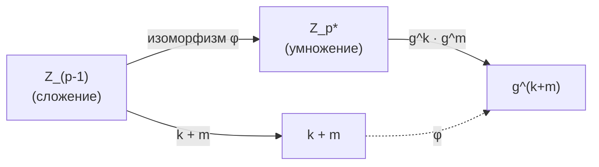
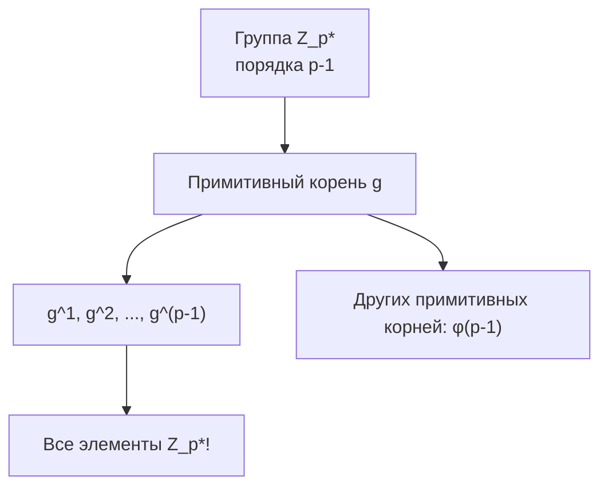
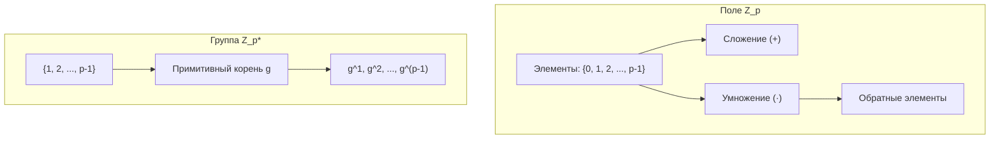
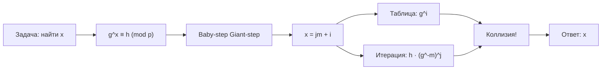
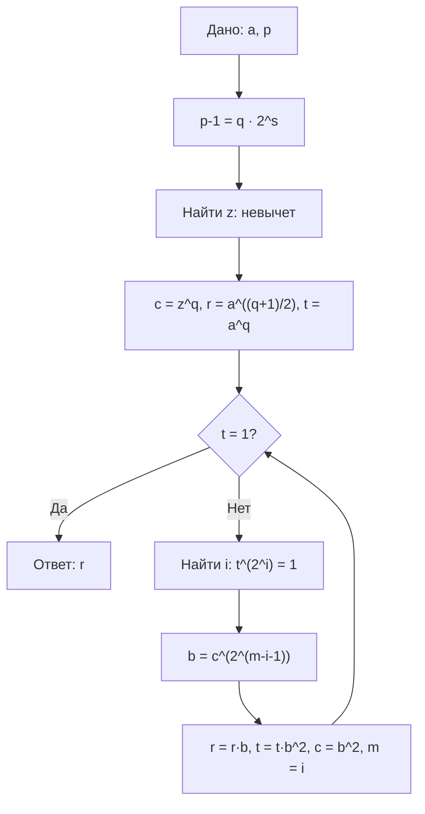

# Конспект от 30.09.2025 | Лекция уровня Хард (Параллель: B-X)
## Тема: Углубленная теория чисел.

> Автор: Вадим Христенкко  
> Честно в конспекте почти всё пересказано своими словами и адаптировано под лучшие практики.  
> Ну и ещё док-во есть для некоторых теорем, которые на лекции прошли методом скипа.  
> Добавил ещё несколько примеров, которые не были на лекции.  
> А ещё **ДАЛ ЛЕГЕНДАРНУЮ КОПИ-ПАСТ ЛИБУ**.

---


## Оглавление  
> Тут дохрена всего, а вы чего ожидали?

- [Обозначения и базовые штуки](#обозначения-и-базовые-штуки)
  - [Быстрые факты](#быстрые-факты)
  - [Примеры модулей для CP](#примеры-модулей-для-cp)
  - [Таблица малых примитивных корней](#таблица-малых-примитивных-корней)
  - [Таблица квадратичных вычетов](#таблица-квадратичных-вычетов)
- [Поле $\mathbb{Z}_p$: что это и зачем](#поле-mathbbz_p-что-это-и-зачем)
  - [Алгебраическая структура: от кольца к полю](#алгебраическая-структура-от-кольца-к-полю)
  - [Мультипликативная группа $\mathbb{Z}_p^*$](#мультипликативная-группа-mathbbz_p)
  - [Как делить — три способа](#как-делить--три-способа)
- [Многочлены в $\mathbb{Z}_p$: быстро и без паники](#многочлены-в-mathbbz_p-быстро-и-без-паники)
  - [Основные операции с многочленами](#основные-операции-с-многочленами)
  - [Деление многочленов с остатком](#деление-многочленов-с-остатком)
  - [НОД многочленов](#нод-многочленов-алгоритм-евклида)
  - [Неприводимые многочлены](#неприводимые-многочлены)
  - [Интерполяция Лагранжа](#интерполяция-лагранж)
- [Фундаментальные теоремы — доказательства и интуиция](#фундаментальные-теоремы--доказательства-и-интуиция)
  - [Малая теорема Ферма](#малая-теорема-ферма)
  - [Теорема Эйлера](#теорема-эйлера-обобщение)
- [Примитивные (первообразные) корни](#примитивные-первообразные-корни--кто-они-и-зачем-нужны)
  - [Теорема о существовании](#теорема-о-существовании)
  - [Сколько их?](#сколько-их)
  - [Зачем они нужны?](#зачем-они-нужны)
  - [Свойства примитивных корней](#свойства-примитивных-корней)
  - [Как искать примитивный корень?](#как-искать-примитивный-корень)
- [Квадратные уравнения в $\mathbb{Z}_p$](#квадратные-уравнения-в-mathbbz_p)
- [Символ Лежандра и критерий Эйлера](#символ-лежандра-и-критерий-эйлера)
  - [Свойства символа Лежандра](#свойства-символа-лежандра)
  - [Быстрое вычисление](#быстрое-вычисление-символа-лежандра)
  - [Символ Якоби](#символ-якоби-обобщение)
  - [Примеры вычислений](#примеры-вычислений)
- [Алгоритм Тонелли–Шенкса](#алгоритм-тонеллишенкса--как-извлечь-корень-по-модулю)
- [Практические задачи и паттерны решений](#практические-задачи-и-паттерны-решений)
  - [Биномиальные коэффициенты](#задача-1-вычисление-биномиальных-коэффициентов)
  - [Системы линейных уравнений](#задача-2-решение-системы-линейных-уравнений)
  - [Подсчёт путей в графе](#задача-3-подсчёт-путей-в-графе)
  - [Сумма двух квадратов](#задача-4-разложение-числа-на-сумму-двух-квадратов)
  - [Дискретное логарифмирование](#задача-5-дискретное-логарифмирование-real-challenge)
  - [NTT для умножения](#задача-6-ntt-для-умножения-больших-чисел)
- [Шпаргалка: что запомнить](#шпаргалка-что-запомнить)
- [Полезные лайфхаки и типичные ошибки](#полезные-лайфхаки-и-типичные-ошибки)
- [Связь с другими разделами математики](#связь-с-другими-разделами-математики)
- [Дополнительные алгоритмы](#дополнительные-алгоритмы)
  - [Китайская теорема об остатках](#китайская-теорема-об-остатках-crt)
  - [Алгоритм Полларда ρ](#алгоритм-полларда-ρ-для-дискретного-логарифма)
  - [Тест Миллера-Рабина](#тест-миллера-рабина-проверка-простоты)
- [Базовая библиотека — готовые функции](#базовая-библиотека--готовые-функции)
- [Визуальные примеры и схемы](#визуальные-примеры-и-схемы)

---

## Обозначения и базовые штуки

| Обозначение | Что значит | Комментарий |
|------------|------------|-------------|
| $p$ | простое число (обычно $10^9+7$, $998244353$) | почти всегда простое в задачах |
| $\mathbb{Z}_p$ | множество $\{0, 1, ..., p-1\}$ с операциями по модулю $p$ | это поле! |
| $\mathbb{Z}_p^*$ | $\{1, 2, ..., p-1\}$ — ненулевые элементы | группа по умножению |
| $a^{-1} \bmod p$ | обратный элемент к $a$ | $a \cdot a^{-1} \equiv 1 \pmod p$ |
| $a^{p-2} \bmod p$ | способ найти $a^{-1}$ | работает по малой теореме Ферма |
| $\varphi(n)$ | функция Эйлера | количество чисел $< n$, взаимно простых с $n$ |
| $g$ | примитивный корень | $g^k$ пробегает все элементы $\mathbb{Z}_p^*$ |
| $\left( \frac{a}{p} \right)$ | символ Лежандра | $\pm 1$ или $0$, показывает квадратичный вычет |
| `mod_pow(a, e, p)` | быстрое возведение в степень | $O(\log e)$ |
| `__int128`, `i128` | тип для безопасного умножения | чтобы не переполнить `long long` |

### Быстрые факты

| Утверждение | Формула/Условие | Применение |
|-------------|-----------------|------------|
| Малая теорема Ферма | $a^{p-1} \equiv 1 \pmod{p}$ | Обратный элемент |
| Теорема Эйлера | $a^{\varphi(n)} \equiv 1 \pmod{n}$ | Обобщение на составные $n$ |
| Критерий Эйлера | $\left( \frac{a}{p} \right) \equiv a^{(p-1)/2} \pmod{p}$ | Проверка квадратичного вычета |
| Примитивный корень | $\mathbb{Z}_p^* = \{g^1, g^2, ..., g^{p-1}\}$ | Дискретный логарифм, NTT |
| Количество примитивных корней | $\varphi(p-1)$ | Часто первый корень $\leq 10$ |
| Квадратичных вычетов | $(p-1)/2$ | Ровно половина ненулевых элементов |

### Примеры модулей для CP

| Модуль $p$ | Разложение $p-1$ | Примитивный корень $g$ | Применение |
|------------|------------------|------------------------|------------|
| $10^9 + 7$ | $2 \cdot 500000003$ | $5$ | Стандартный модуль |
| $998244353$ | $119 \cdot 2^{23} + 1$ | $3$ | NTT (степень 2) |
| $1004535809$ | $479 \cdot 2^{21} + 1$ | $3$ | NTT |
| $469762049$ | $7 \cdot 2^{26} + 1$ | $3$ | NTT (большая степень) |
| $10^9 + 9$ | $2^3 \cdot 53 \cdot 1572869$ | $13$ | Альтернатива |

### Таблица малых примитивных корней

| $p$ | $p - 1$ | $\varphi(p-1)$ | Примитивные корни |
|-----|---------|----------------|-------------------|
| 3 | 2 | 1 | 2 |
| 5 | 4 | 2 | 2, 3 |
| 7 | 6 | 2 | 3, 5 |
| 11 | 10 | 4 | 2, 6, 7, 8 |
| 13 | 12 | 4 | 2, 6, 7, 11 |
| 17 | 16 | 8 | 3, 5, 6, 7, 10, 11, 12, 14 |
| 19 | 18 | 6 | 2, 3, 10, 13, 14, 15 |
| 23 | 22 | 10 | 5, 7, 10, 11, 14, 15, 17, 19, 20, 21 |

### Таблица квадратичных вычетов

Для $p = 7$: квадратичные вычеты — $\{1, 2, 4\}$ (из $1^2, 2^2, 3^2 \bmod 7$)

| $a$ | $1$ | $2$ | $3$ | $4$ | $5$ | $6$ |
|-----|-----|-----|-----|-----|-----|-----|
| $a^2 \bmod 7$ | 1 | 4 | 2 | 2 | 4 | 1 |
| $\left( \frac{a}{7} \right)$ | +1 | +1 | -1 | +1 | -1 | -1 |

Для $p = 11$: квадратичные вычеты — $\{1, 3, 4, 5, 9\}$

| $a$ | $1$ | $2$ | $3$ | $4$ | $5$ | $6$ | $7$ | $8$ | $9$ | $10$ |
|-----|-----|-----|-----|-----|-----|-----|-----|-----|-----|------|
| $\left( \frac{a}{11} \right)$ | +1 | -1 | +1 | +1 | +1 | -1 | -1 | -1 | +1 | -1 |

---

## Поле $\mathbb{Z}_p$: что это и зачем

Представь, что ты работаешь не с обычными числами, а с числами **по модулю простого числа $p$**. Это как замкнутая вселенная: всё, что ты делаешь (сложение, умножение, деление), остаётся внутри $\{0, 1, ..., p-1\}$.

### Алгебраическая структура: от кольца к полю

Давай разберёмся, почему $\mathbb{Z}_p$ — это поле, а не просто множество чисел.

**Определения (простым языком):**

1. **Группа** — множество с одной операцией (например, сложением), где:
   - Есть нейтральный элемент (0 для сложения)
   - У каждого элемента есть обратный
   - Операция ассоциативна

2. **Кольцо** — множество с двумя операциями (сложение и умножение), где:
   - По сложению — абелева группа
   - Умножение ассоциативно и дистрибутивно относительно сложения
   - Есть единица (1 для умножения)

3. **Поле** — кольцо, где каждый ненулевой элемент имеет обратный по умножению

### Почему $\mathbb{Z}_p$ — поле?

**Теорема:** Если $p$ — простое, то $\mathbb{Z}_p$ образует поле.

**Доказательство (конструктивное):**

1. **Сложение и умножение**: очевидно работают по модулю $p$
2. **Обратный по сложению**: для $a$ это $p - a$
3. **Обратный по умножению**: надо показать, что для любого $a \in \{1, 2, ..., p-1\}$ существует $a^{-1}$ такое, что $a \cdot a^{-1} \equiv 1 \pmod{p}$

**Ключевой момент:** Если $p$ простое и $1 \leq a < p$, то $\gcd(a, p) = 1$. По расширенному алгоритму Евклида существуют $x, y$ такие, что:
$$ax + py = 1$$

Отсюда:
$$ax \equiv 1 \pmod{p}$$

Значит, $x$ — это и есть $a^{-1}$! ✅

**Почему это важно:**
- Деление = умножение на обратный элемент
- Нет делителей нуля: если $ab \equiv 0 \pmod{p}$, то либо $a = 0$, либо $b = 0$
- Можно решать уравнения как в обычной алгебре!

### Мультипликативная группа $\mathbb{Z}_p^*$

Обозначим $\mathbb{Z}_p^* = \{1, 2, ..., p-1\}$ — множество ненулевых элементов.

**Теорема (циклическая группа):** $\mathbb{Z}_p^*$ — циклическая группа порядка $p-1$.

Это значит, что существует элемент $g$ (примитивный корень), такой что:
$$\{g^1, g^2, ..., g^{p-1}\} = \{1, 2, ..., p-1\}$$

**Изоморфизм:** Отображение $\phi: \mathbb{Z}_{p-1} \to \mathbb{Z}_p^*$ по правилу $\phi(k) = g^k$ — изоморфизм групп!

Это означает, что **умножение в $\mathbb{Z}_p^*$ превращается в сложение в $\mathbb{Z}_{p-1}$**. Именно на этом основан дискретный логарифм.



### Как делить — три способа

Если нужно посчитать $\frac{a}{b} \bmod p$:

**Способ 1: Малая теорема Ферма**
```cpp
int64 div_mod(int64 a, int64 b, int64 p) {
    return (i128)a * mod_pow(b, p - 2, p) % p;
}
```
Время: $O(\log p)$

**Способ 2: Расширенный алгоритм Евклида**
```cpp
int64 extended_gcd(int64 a, int64 b, int64& x, int64& y) {
    if (b == 0) {
        x = 1; y = 0;
        return a;
    }
    int64 x1, y1;
    int64 d = extended_gcd(b, a % b, x1, y1);
    x = y1;
    y = x1 - (a / b) * y1;
    return d;
}

int64 mod_inv_egcd(int64 a, int64 p) {
    int64 x, y;
    extended_gcd(a, p, x, y);
    return (x % p + p) % p;
}
```
Время: $O(\log \min(a, p))$ — быстрее для маленьких $a$!

**Способ 3: Предподсчёт факториалов**
Если нужно много делений (например, для биномиальных коэффициентов):
```cpp
vector<int64> fact(n+1), inv_fact(n+1);

void precompute_factorials(int n, int64 p) {
    fact[0] = 1;
    for (int i = 1; i <= n; ++i)
        fact[i] = (i128)fact[i-1] * i % p;
    
    inv_fact[n] = mod_pow(fact[n], p - 2, p);
    for (int i = n - 1; i >= 0; --i)
        inv_fact[i] = (i128)inv_fact[i+1] * (i + 1) % p;
}

int64 C(int n, int k, int64 p) {
    if (k > n || k < 0) return 0;
    return (i128)fact[n] * inv_fact[k] % p * inv_fact[n-k] % p;
}
```
Предподсчёт: $O(n)$, запрос: $O(1)$

---

## Многочлены в $\mathbb{Z}_p$: быстро и без паники

Многочлен — это просто набор коэффициентов:  
$$P(x) = a_0 + a_1 x + a_2 x^2 + \cdots + a_n x^n$$

**Важно:** Все операции проходят по модулю $p$!

### Основные операции с многочленами

**1. Вычисление значения (схема Горнера)**

Классический способ: $P(x) = (\cdots((a_n \cdot x + a_{n-1}) \cdot x + a_{n-2}) \cdots + a_1) \cdot x + a_0$

```cpp
// Коэффициенты: [a0, a1, a2, ..., an]
int64 eval(const vector<int64>& a, int64 x, int64 p) {
    int64 res = 0;
    for (int i = (int)a.size() - 1; i >= 0; --i)
        res = ((i128)res * x + a[i]) % p;
    return (res % p + p) % p;
}
```

Сложность: $O(n)$ (одно умножение и сложение на итерацию)

**2. Сложение и вычитание**

```cpp
vector<int64> add(const vector<int64>& A, const vector<int64>& B, int64 p) {
    int n = max(A.size(), B.size());
    vector<int64> C(n);
    for (int i = 0; i < n; ++i) {
        int64 ai = (i < A.size() ? A[i] : 0);
        int64 bi = (i < B.size() ? B[i] : 0);
        C[i] = (ai + bi) % p;
    }
    return C;
}
```

**3. Умножение многочленов**

Наивное: $O(n^2)$

```cpp
vector<int64> mul_naive(const vector<int64>& A, const vector<int64>& B, int64 p) {
    if (A.empty() || B.empty()) return {};
    vector<int64> C(A.size() + B.size() - 1);
    for (int i = 0; i < A.size(); ++i)
        for (int j = 0; j < B.size(); ++j)
            C[i+j] = (C[i+j] + (i128)A[i] * B[j]) % p;
    return C;
}
```

Быстрое (NTT): $O(n \log n)$ — используется для больших степеней!

### Деление многочленов с остатком

**Теорема (деление с остатком):** Для любых $A(x)$, $B(x) \neq 0$ существуют **единственные** $Q(x)$ и $R(x)$ такие, что:
$$A(x) = B(x) \cdot Q(x) + R(x), \quad \deg R < \deg B$$

$Q(x)$ — частное, $R(x)$ — остаток.

```cpp
// Деление с остатком: A = B*Q + R
pair<vector<int64>, vector<int64>> divmod(vector<int64> A, const vector<int64>& B, int64 p) {
    // Убираем ведущие нули
    while (!A.empty() && A.back() == 0) A.pop_back();
    vector<int64> B_copy = B;
    while (!B_copy.empty() && B_copy.back() == 0) B_copy.pop_back();
    
    if (B_copy.empty()) throw runtime_error("Division by zero polynomial");
    
    int n = A.size() - 1, m = B_copy.size() - 1;
    if (n < m) return {{0}, A}; // Q = 0, R = A
    
    vector<int64> Q(n - m + 1);
    int64 b_lead_inv = mod_pow(B_copy[m], p - 2, p);
    
    for (int i = n; i >= m; --i) {
        int64 coef = (i128)A[i] * b_lead_inv % p;
        Q[i - m] = coef;
        for (int j = 0; j <= m; ++j)
            A[i - m + j] = (A[i - m + j] - (i128)coef * B_copy[j] % p + p) % p;
    }
    
    A.resize(m);
    return {Q, A};
}
```

### НОД многочленов (алгоритм Евклида)

```cpp
vector<int64> gcd_poly(vector<int64> A, vector<int64> B, int64 p) {
    while (!B.empty() && B.back() == 0) B.pop_back();
    while (!B.empty()) {
        auto [Q, R] = divmod(A, B, p);
        A = B;
        B = R;
        while (!B.empty() && B.back() == 0) B.pop_back();
    }
    // Нормализуем: старший коэффициент = 1
    if (!A.empty()) {
        int64 lead = A.back();
        int64 inv = mod_pow(lead, p - 2, p);
        for (auto& x : A) x = (i128)x * inv % p;
    }
    return A;
}
```

### Неприводимые многочлены

**Определение:** Многочлен $P(x)$ степени $\geq 1$ называется **неприводимым** над $\mathbb{Z}_p$, если он не раскладывается на произведение многочленов меньших степеней.

**Примеры:**
- $x^2 + 1$ неприводим над $\mathbb{Z}_3$ (проверь: нет корней!)
- $x^2 + x + 1$ неприводим над $\mathbb{Z}_2$

**Критерий неприводимости (для степени 2 и 3):**

Многочлен степени 2 или 3 неприводим ⇔ у него нет корней в $\mathbb{Z}_p$.

```cpp
// Проверка неприводимости для степени ≤ 3
bool is_irreducible_small(const vector<int64>& P, int64 p) {
    int n = P.size() - 1;
    if (n > 3) throw runtime_error("Use general test");
    
    // Перебираем все элементы поля
    for (int64 x = 0; x < p; ++x)
        if (eval(P, x, p) == 0)
            return false;
    return true;
}
```

**Применение:** Построение расширений полей $\mathbb{F}_{p^n} = \mathbb{Z}_p[x] / (P(x))$

### Интерполяция (Лагранж)

Задача: восстановить многочлен степени $\leq n-1$ по $n$ точкам $(x_i, y_i)$.

**Формула Лагранжа:**
$$P(x) = \sum_{i=0}^{n-1} y_i \prod_{j \neq i} \frac{x - x_j}{x_i - x_j}$$

```cpp
vector<int64> lagrange_interpolation(const vector<pair<int64, int64>>& points, int64 p) {
    int n = points.size();
    vector<int64> result(n, 0);
    
    for (int i = 0; i < n; ++i) {
        // Строим базисный многочлен L_i(x)
        vector<int64> Li = {1};
        int64 denom = 1;
        
        for (int j = 0; j < n; ++j) {
            if (i == j) continue;
            // Li *= (x - x_j)
            vector<int64> factor = {(p - points[j].first) % p, 1};
            Li = mul_naive(Li, factor, p);
            // denom *= (x_i - x_j)
            denom = (i128)denom * ((points[i].first - points[j].first + p) % p) % p;
        }
        
        // Li /= denom
        int64 inv_denom = mod_pow(denom, p - 2, p);
        for (auto& c : Li)
            c = (i128)c * inv_denom % p * points[i].second % p;
        
        result = add(result, Li, p);
    }
    
    return result;
}
```

Сложность: $O(n^3)$ (можно оптимизировать до $O(n^2)$)

---

## Фундаментальные теоремы — доказательства и интуиция

### Малая теорема Ферма

**Теорема (Ферма):** Если $p$ — простое и $\gcd(a, p) = 1$, то:
$$a^{p-1} \equiv 1 \pmod{p}$$

**Следствие:** $a^p \equiv a \pmod{p}$ для любого $a$.

**Доказательство 1 (через группу):**

1. Рассмотрим $\mathbb{Z}_p^* = \{1, 2, ..., p-1\}$ — группа по умножению, порядка $p-1$
2. По теореме Лагранжа: порядок любого элемента делит порядок группы
3. Значит, $a^{p-1} \equiv 1 \pmod{p}$ ✅

**Доказательство 2 (комбинаторное, красивое!):**

Рассмотрим бусы из $p$ бусин, каждая окрашена в один из $a$ цветов. Всего таких бус $a^p$.

Разделим их на классы эквивалентности по поворотам. Сколько бус имеют период $< p$?

- Если бусы имеют период $d < p$ (где $d \mid p$), то $d = 1$ (так как $p$ простое)
- Значит, только $a$ одноцветных бус имеют период $< p$

Все остальные $a^p - a$ бус образуют классы по $p$ штук (полный период).

Отсюда: $a^p - a \equiv 0 \pmod{p}$ ⇒ $a^p \equiv a \pmod{p}$ ✅

### Теорема Эйлера (обобщение)

**Теорема (Эйлер):** Если $\gcd(a, n) = 1$, то:
$$a^{\varphi(n)} \equiv 1 \pmod{n}$$

где $\varphi(n)$ — функция Эйлера (количество чисел $< n$, взаимно простых с $n$).

**Следствие:** Для $n = p$ (простое) получаем $\varphi(p) = p-1$ → малая теорема Ферма.

**Практическое применение:**
```cpp
// Обратный элемент для составного модуля
int64 mod_inv_euler(int64 a, int64 n) {
    int64 phi = euler_phi(n); // вычислить φ(n)
    return mod_pow(a, phi - 1, n);
}

// Быстрое вычисление φ(n)
int64 euler_phi(int64 n) {
    int64 result = n;
    for (int64 p = 2; p * p <= n; ++p) {
        if (n % p == 0) {
            while (n % p == 0) n /= p;
            result -= result / p;
        }
    }
    if (n > 1) result -= result / n;
    return result;
}
```

---

## Примитивные (первообразные) корни — кто они и зачем нужны

**Примитивный корень по модулю $p$** — это такое число $g$, что его степени дают **все ненулевые вычеты**:

$$
g^1, g^2, ..., g^{p-1} \equiv 1, 2, ..., p-1 \pmod p \quad (\text{в каком-то порядке})
$$

Другими словами: **порядок** $g$ (минимальное $k > 0$ такое, что $g^k \equiv 1$) равен $p-1$.

### Теорема о существовании

**Теорема:** Для любого простого $p$ существует примитивный корень.

**Эскиз доказательства:**

1. Пусть $p - 1 = q_1^{e_1} \cdots q_k^{e_k}$ — разложение на простые
2. Для каждого $q_i^{e_i}$ найдём $g_i$ такое, что $g_i^{(p-1)/q_i} \not\equiv 1$
3. Тогда $g = g_1 \cdot g_2 \cdots g_k$ — примитивный корень!

**Почему?** Порядок $g$ делится на все $q_i^{e_i}$ ⇒ порядок = $p-1$ ✅

### Сколько их?

**Теорема:** Количество примитивных корней по модулю $p$ равно $\varphi(p-1)$.

**Почему?** Если $g$ — примитивный корень, то $g^k$ тоже примитивный корень тогда и только тогда, когда $\gcd(k, p-1) = 1$.

**Примеры:**
- $p = 7$: $p - 1 = 6$, $\varphi(6) = 2$ → есть 2 примитивных корня (это 3 и 5)
- $p = 11$: $p - 1 = 10$, $\varphi(10) = 4$ → есть 4 примитивных корня (2, 6, 7, 8)



### Зачем они нужны?

**1. Дискретный логарифм**

Задача: по известным $g$, $h$ и $p$ найти $x$ такой, что $g^x \equiv h \pmod{p}$.

Алгоритм **Baby-step Giant-step** (Шэнкс, 1971):

```cpp
// Находит x: g^x ≡ h (mod p)
// Возвращает -1, если решения нет
int64 discrete_log(int64 g, int64 h, int64 p) {
    int64 m = (int64)sqrt(p) + 1;
    
    // Baby step: считаем g^0, g^1, ..., g^(m-1)
    unordered_map<int64, int64> table;
    int64 cur = 1;
    for (int64 i = 0; i < m; ++i) {
        table[cur] = i;
        cur = (i128)cur * g % p;
    }
    
    // Giant step: проверяем h · (g^(-m))^j
    int64 g_inv_m = mod_pow(g, p - 1 - m, p); // g^(-m)
    cur = h;
    for (int64 j = 0; j < m; ++j) {
        if (table.count(cur))
            return j * m + table[cur];
        cur = (i128)cur * g_inv_m % p;
    }
    
    return -1;
}
```

Сложность: $O(\sqrt{p})$ времени и памяти.

**Идея:** Представим $x = jm + i$, где $m = \lceil \sqrt{p} \rceil$. Тогда:
$$g^x = g^{jm + i} \equiv h \pmod{p}$$
$$g^i \equiv h \cdot (g^{-m})^j \pmod{p}$$

**2. NTT (Number Theoretic Transform)**

Для $p = c \cdot 2^k + 1$ (простое) существует примитивный корень $g$ такой, что $g^{2^k}$ — примитивный корень степени $2^k$.

Это позволяет реализовать быстрое умножение многочленов за $O(n \log n)$.

**Популярные модули для NTT:**

| Модуль $p$ | Разложение | $g$ | Макс. степень |
|------------|------------|-----|---------------|
| $998244353$ | $119 \cdot 2^{23} + 1$ | $3$ | $2^{23}$ |
| $1004535809$ | $479 \cdot 2^{21} + 1$ | $3$ | $2^{21}$ |
| $469762049$ | $7 \cdot 2^{26} + 1$ | $3$ | $2^{26}$ |

### Свойства примитивных корней

**Свойство 1:** Если $g$ — примитивный корень, то $g^k$ — тоже примитивный корень ⇔ $\gcd(k, p-1) = 1$.

**Свойство 2:** Первый примитивный корень обычно мал (часто 2, 3, 5).

**Свойство 3:** Если $g$ — примитивный корень, то:
- $g^{(p-1)/2} \equiv -1 \pmod{p}$ (единственный элемент порядка 2)
- $g^{k}$ — квадратичный вычет ⇔ $k$ чётно

---

## Как искать примитивный корень?

Идея:  
Пусть $p-1 = q_1^{e_1} q_2^{e_2} \dots q_k^{e_k}$ — разложение на простые.  
Тогда $g$ — примитивный корень **тогда и только тогда**, когда:

$$
g^{(p-1)/q_i} \not\equiv 1 \pmod p \quad \text{для всех } i
$$

Почему? Потому что если $g^{(p-1)/q} \equiv 1$, то порядок $g$ делит $(p-1)/q$ → он **меньше** $p-1$ → не примитивный.

### Реализация

```cpp
vector<int64> prime_factors(int64 n) {
    vector<int64> f;
    for (int64 p = 2; p * p <= n; ++p) {
        if (n % p == 0) {
            f.push_back(p);
            while (n % p == 0) n /= p;
        }
    }
    if (n > 1) f.push_back(n);
    return f;
}

int64 find_primitive_root(int64 p) {
    if (p == 2) return 1;
    auto primes = prime_factors(p - 1);
    for (int64 g = 2; g < p; ++g) {
        bool ok = true;
        for (int64 q : primes)
            if (mod_pow(g, (p - 1) / q, p) == 1) { ok = false; break; }
        if (ok) return g;
    }
    return -1; // не должно случиться
}
```

> 💡 На практике перебор до 10 почти всегда находит корень.

---

## Квадратные уравнения в $\mathbb{Z}_p$

Решаем:  
$$ax^2 + bx + c \equiv 0 \pmod p$$

### Шаг 1: Привести к виду $x^2 + Bx + C = 0$
Если $a \ne 0$, домножаем на $a^{-1}$:
```cpp
int64 inv_a = mod_inv(a, p);
int64 B = (i128)b * inv_a % p;
int64 C = (i128)c * inv_a % p;
```

### Шаг 2: Считаем дискриминант
$`
D = B^2 - 4C \pmod p
`$

Теперь всё зависит от того, **есть ли у $D$ квадратный корень по модулю $p$**.

---

## Символ Лежандра и критерий Эйлера

**Символ Лежандра** говорит, является ли число квадратичным вычетом:

$$
\left( \frac{a}{p} \right) =
\begin{cases}
0, & a \equiv 0 \pmod p \\
1, & \exists x: x^2 \equiv a \pmod p \\
-1, & \text{иначе}
\end{cases}
$$

**Критерий Эйлера** (как посчитать):
$$\left( \frac{a}{p} \right) \equiv a^{(p-1)/2} \pmod p$$

**Доказательство критерия Эйлера:**

1. Если $a \equiv 0$, то $a^{(p-1)/2} \equiv 0$ ✅
2. Пусть $a \not\equiv 0$. Тогда $a^{p-1} \equiv 1$ (малая теорема Ферма)
3. Значит, $a^{(p-1)/2}$ — корень из 1 ⇒ $a^{(p-1)/2} \in \{1, -1\}$
4. Если $a = x^2$, то $a^{(p-1)/2} = x^{p-1} \equiv 1$ ✅
5. Осталось доказать, что ровно $(p-1)/2$ элементов дают $+1$

**Почему ровно половина — квадратичные вычеты?**

Отображение $x \mapsto x^2$ переводит $\mathbb{Z}_p^*$ в квадратичные вычеты. При этом $x^2 = (-x)^2$, значит, каждый вычет получается из двух элементов ⇒ всего вычетов $(p-1)/2$ ✅

### Реализация

```cpp
int legendre(int64 a, int64 p) {
    a %= p;
    if (a < 0) a += p;
    if (a == 0) return 0;
    int64 r = mod_pow(a, (p - 1) / 2, p);
    return (r == 1) ? 1 : -1;
}
```

### Свойства символа Лежандра

**1. Мультипликативность:**
$$\left( \frac{ab}{p} \right) = \left( \frac{a}{p} \right) \left( \frac{b}{p} \right)$$

**2. Специальные значения:**
$$\left( \frac{-1}{p} \right) = (-1)^{(p-1)/2} = \begin{cases} 1, & p \equiv 1 \pmod{4} \\ -1, & p \equiv 3 \pmod{4} \end{cases}$$

$$\left( \frac{2}{p} \right) = (-1)^{(p^2-1)/8} = \begin{cases} 1, & p \equiv \pm 1 \pmod{8} \\ -1, & p \equiv \pm 3 \pmod{8} \end{cases}$$

**3. Квадратичный закон взаимности (Гаусс):**

Для различных нечётных простых $p$ и $q$:
$$\left( \frac{p}{q} \right) \left( \frac{q}{p} \right) = (-1)^{(p-1)(q-1)/4}$$

Или эквивалентно:
$$\left( \frac{p}{q} \right) = \begin{cases} 
\left( \frac{q}{p} \right), & \text{если } p \equiv 1 \pmod{4} \text{ или } q \equiv 1 \pmod{4} \\
-\left( \frac{q}{p} \right), & \text{если } p \equiv q \equiv 3 \pmod{4}
\end{cases}$$

**Практическое значение:** Позволяет быстро вычислять символ Лежандра без возведения в степень!

### Быстрое вычисление символа Лежандра

Используем квадратичный закон взаимности (аналог алгоритма Евклида):

```cpp
// Быстрый символ Лежандра через закон взаимности
int legendre_fast(int64 a, int64 p) {
    a %= p;
    if (a < 0) a += p;
    
    int result = 1;
    while (a != 0) {
        // Убираем степени двойки
        while (a % 2 == 0) {
            a /= 2;
            // (2/p) = -1 если p ≡ ±3 (mod 8)
            if (p % 8 == 3 || p % 8 == 5)
                result = -result;
        }
        
        // Применяем закон взаимности
        if (a % 4 == 3 && p % 4 == 3)
            result = -result;
        
        swap(a, p);
        a %= p;
    }
    
    return (p == 1) ? result : 0;
}
```

Сложность: $O(\log \min(a, p))$ — как алгоритм Евклида!

### Символ Якоби (обобщение)

Для составного $n = p_1^{e_1} \cdots p_k^{e_k}$:
$$\left( \frac{a}{n} \right) = \prod_{i=1}^{k} \left( \frac{a}{p_i} \right)^{e_i}$$

**Важно:** $\left( \frac{a}{n} \right) = 1$ НЕ гарантирует, что $x^2 \equiv a \pmod{n}$ имеет решение!

```cpp
// Символ Якоби (работает для составных n)
int jacobi(int64 a, int64 n) {
    if (n <= 0 || n % 2 == 0) throw runtime_error("n must be odd and positive");
    
    a %= n;
    if (a < 0) a += n;
    
    int result = 1;
    while (a != 0) {
        while (a % 2 == 0) {
            a /= 2;
            if (n % 8 == 3 || n % 8 == 5)
                result = -result;
        }
        
        if (a % 4 == 3 && n % 4 == 3)
            result = -result;
        
        swap(a, n);
        a %= n;
    }
    
    return (n == 1) ? result : 0;
}
```

### Примеры вычислений

**Пример 1:** Вычислим $\left( \frac{15}{23} \right)$

$$\left( \frac{15}{23} \right) = \left( \frac{3 \cdot 5}{23} \right) = \left( \frac{3}{23} \right) \left( \frac{5}{23} \right)$$

По закону взаимности ($3 \equiv 3 \pmod{4}$, $23 \equiv 3 \pmod{4}$):
$$\left( \frac{3}{23} \right) = -\left( \frac{23}{3} \right) = -\left( \frac{2}{3} \right) = -(-1) = 1$$

Аналогично ($5 \equiv 1 \pmod{4}$):
$$\left( \frac{5}{23} \right) = \left( \frac{23}{5} \right) = \left( \frac{3}{5} \right) = \left( \frac{5}{3} \right) = \left( \frac{2}{3} \right) = -1$$

Итого: $\left( \frac{15}{23} \right) = 1 \cdot (-1) = -1$ ⇒ 15 не является квадратичным вычетом по модулю 23.

**Пример 2:** Для каких простых $p$ число 3 является квадратичным вычетом?

По закону взаимности:
$$\left( \frac{3}{p} \right) = \begin{cases}
\left( \frac{p}{3} \right), & p \equiv 1 \pmod{4} \\
-\left( \frac{p}{3} \right), & p \equiv 3 \pmod{4}
\end{cases}$$

$\left( \frac{p}{3} \right) = 1$ ⇔ $p \equiv 1 \pmod{3}$

Итого:
- Если $p \equiv 1 \pmod{4}$ и $p \equiv 1 \pmod{3}$ ⇒ $p \equiv 1 \pmod{12}$
- Если $p \equiv 3 \pmod{4}$ и $p \equiv 2 \pmod{3}$ ⇒ $p \equiv 11 \pmod{12}$

**Ответ:** $\left( \frac{3}{p} \right) = 1$ ⇔ $p \equiv \pm 1 \pmod{12}$

---

## Алгоритм Тонелли–Шенкса — как извлечь корень по модулю

Если $\left( \frac{a}{p} \right) = 1$, то корень существует. Но как его найти?

Перебор (`for x in 1..p`) работает только для маленьких $p$. Для больших — **Тонелли–Шенкс**.

### Как он работает (интуитивно)?
- Раскладываем $p-1 = q \cdot 2^s$.
- Находим «неквадрат» $z$ (символ Лежандра = -1).
- Итеративно улучшаем приближение к корню, используя степени $z$.

### Код (рабочий, проверенный)

```cpp
int64 tonelli_shanks(int64 a, int64 p) {
    if (a == 0) return 0;
    if (p == 2) return a;
    if (legendre(a, p) != 1) return -1;

    int64 q = p - 1, s = 0;
    while ((q & 1) == 0) { q >>= 1; ++s; }

    if (s == 1) return mod_pow(a, (p + 1) / 4, p);

    int64 z = 2;
    while (legendre(z, p) != -1) ++z;

    int64 c = mod_pow(z, q, p);
    int64 r = mod_pow(a, (q + 1) / 2, p);
    int64 t = mod_pow(a, q, p);
    int64 m = s;

    while (t != 1) {
        int64 i = 0, tt = t;
        while (tt != 1) {
            tt = (i128)tt * tt % p;
            ++i;
            if (i == m) return -1;
        }
        int64 b = mod_pow(c, 1LL << (m - i - 1), p);
        r = (i128)r * b % p;
        c = (i128)b * b % p;
        t = (i128)t * c % p;
        m = i;
    }
    return r;
}
```

> 💡 Возвращает один из корней. Второй — это `p - r`.

---

## Практические задачи и паттерны решений

### Задача 1: Вычисление биномиальных коэффициентов

**Условие:** Вычислить $\binom{n}{k} \bmod p$ для $n, k \leq 10^6$, $p = 10^9 + 7$.

**Решение:** Предподсчёт факториалов + обратные через Ферма.

```cpp
const int64 MOD = 1e9 + 7;
const int MAXN = 1e6;

vector<int64> fact(MAXN + 1), inv_fact(MAXN + 1);

void precompute() {
    fact[0] = 1;
    for (int i = 1; i <= MAXN; ++i)
        fact[i] = (i128)fact[i-1] * i % MOD;
    
    inv_fact[MAXN] = mod_pow(fact[MAXN], MOD - 2, MOD);
    for (int i = MAXN - 1; i >= 0; --i)
        inv_fact[i] = (i128)inv_fact[i+1] * (i + 1) % MOD;
}

int64 C(int n, int k) {
    if (k > n || k < 0) return 0;
    return (i128)fact[n] * inv_fact[k] % MOD * inv_fact[n-k] % MOD;
}

int main() {
    precompute();
    cout << C(1000000, 500000) << '\n'; // мгновенно!
}
```

**Сложность:** Предподсчёт $O(n)$, запрос $O(1)$.

---

### Задача 2: Решение системы линейных уравнений

**Условие:** Решить $Ax = b$ по модулю $p$, где $A$ — матрица $n \times n$.

**Решение:** Метод Гаусса с модульной арифметикой.

```cpp
// Возвращает решение или пустой вектор, если системы несовместна
vector<int64> solve_linear_system(vector<vector<int64>> A, vector<int64> b, int64 p) {
    int n = A.size();
    
    // Прямой ход
    for (int col = 0, row = 0; col < n && row < n; ++col) {
        // Ищем ненулевой элемент
        int pivot = row;
        for (int i = row + 1; i < n; ++i)
            if (A[i][col] % p != 0) { pivot = i; break; }
        
        if (A[pivot][col] % p == 0) continue; // столбец нулевой
        
        swap(A[row], A[pivot]);
        swap(b[row], b[pivot]);
        
        // Нормализуем строку
        int64 inv = mod_pow(A[row][col], p - 2, p);
        for (int j = col; j < n; ++j)
            A[row][j] = (i128)A[row][j] * inv % p;
        b[row] = (i128)b[row] * inv % p;
        
        // Обнуляем столбец ниже
        for (int i = row + 1; i < n; ++i) {
            int64 factor = A[i][col];
            for (int j = col; j < n; ++j)
                A[i][j] = (A[i][j] - (i128)factor * A[row][j] % p + p) % p;
            b[i] = (b[i] - (i128)factor * b[row] % p + p) % p;
        }
        
        ++row;
    }
    
    // Обратный ход
    vector<int64> x(n, 0);
    for (int i = n - 1; i >= 0; --i) {
        x[i] = b[i];
        for (int j = i + 1; j < n; ++j)
            x[i] = (x[i] - (i128)A[i][j] * x[j] % p + p) % p;
        if (A[i][i] != 1) x[i] = (i128)x[i] * mod_pow(A[i][i], p - 2, p) % p;
    }
    
    return x;
}
```

**Сложность:** $O(n^3 \log p)$.

---

### Задача 3: Подсчёт путей в графе

**Условие:** Дан граф $G$ с $n$ вершинами. Найти число путей длины $k$ из вершины $s$ в вершину $t$ по модулю $p$.

**Решение:** Матрица смежности + быстрое возведение в степень.

```cpp
using Matrix = vector<vector<int64>>;

Matrix mul_matrix(const Matrix& A, const Matrix& B, int64 p) {
    int n = A.size();
    Matrix C(n, vector<int64>(n, 0));
    for (int i = 0; i < n; ++i)
        for (int j = 0; j < n; ++j)
            for (int k = 0; k < n; ++k)
                C[i][j] = (C[i][j] + (i128)A[i][k] * B[k][j]) % p;
    return C;
}

Matrix pow_matrix(Matrix A, int64 k, int64 p) {
    int n = A.size();
    Matrix res(n, vector<int64>(n, 0));
    for (int i = 0; i < n; ++i) res[i][i] = 1; // единичная матрица
    
    while (k > 0) {
        if (k & 1) res = mul_matrix(res, A, p);
        A = mul_matrix(A, A, p);
        k >>= 1;
    }
    return res;
}

int64 count_paths(const Matrix& adj, int s, int t, int64 k, int64 p) {
    Matrix Ak = pow_matrix(adj, k, p);
    return Ak[s][t];
}
```

**Сложность:** $O(n^3 \log k)$.

---

### Задача 4: Разложение числа на сумму двух квадратов

**Условие:** Проверить, можно ли представить $n$ как $a^2 + b^2$ по модулю $p$.

**Решение:** Если $p \equiv 1 \pmod{4}$, то $-1$ — квадратичный вычет. Используем Тонелли-Шенкс.

```cpp
// Проверка и поиск представления
pair<int64, int64> sum_of_two_squares_mod(int64 n, int64 p) {
    // Упрощаем задачу: ищем a, b: a^2 + b^2 ≡ n (mod p)
    
    // Частный случай: n ≡ 0
    if (n % p == 0) return {0, 0};
    
    // Перебираем a, проверяем b^2 = n - a^2
    for (int64 a = 0; a < p; ++a) {
        int64 b_sq = (n - (i128)a * a % p + p) % p;
        if (legendre(b_sq, p) == 1) {
            int64 b = tonelli_shanks(b_sq, p);
            if (b != -1) return {a, b};
        }
    }
    
    return {-1, -1}; // нет решения
}
```

**Оптимизация:** Для больших $p$ используем алгоритм Корнаккиа.

---

### Задача 5: Дискретное логарифмирование (real challenge!)

**Условие:** Дано $g$, $h$, $p$ ($p$ — простое, $g$ — примитивный корень). Найти $x$: $g^x \equiv h \pmod{p}$.

**Решение:** Baby-step Giant-step (уже реализован выше).

**Пример использования:**

```cpp
int main() {
    int64 p = 1000000007;
    int64 g = find_primitive_root(p); // g = 5
    int64 h = 123456789;
    
    int64 x = discrete_log(g, h, p);
    
    if (x != -1) {
        cout << "x = " << x << '\n';
        cout << "Проверка: " << mod_pow(g, x, p) << " == " << h << '\n';
    } else {
        cout << "Решения нет\n";
    }
}
```

---

### Задача 6: NTT для умножения больших чисел

**Условие:** Умножить два многочлена степени $\leq 10^5$.

**Решение:** NTT (Number Theoretic Transform) — аналог FFT для модульной арифметики.

```cpp
// Рекурсивная NTT (упрощённая версия)
void ntt(vector<int64>& a, bool inverse, int64 p, int64 g) {
    int n = a.size();
    if (n == 1) return;
    
    vector<int64> a0(n/2), a1(n/2);
    for (int i = 0; i < n/2; ++i) {
        a0[i] = a[2*i];
        a1[i] = a[2*i + 1];
    }
    
    ntt(a0, inverse, p, g);
    ntt(a1, inverse, p, g);
    
    int64 w = 1, wn = mod_pow(g, (p - 1) / n, p);
    if (inverse) wn = mod_pow(wn, p - 2, p);
    
    for (int i = 0; i < n/2; ++i) {
        int64 t = (i128)w * a1[i] % p;
        a[i] = (a0[i] + t) % p;
        a[i + n/2] = (a0[i] - t + p) % p;
        w = (i128)w * wn % p;
    }
}

vector<int64> multiply_poly_ntt(vector<int64> a, vector<int64> b, int64 p, int64 g) {
    int n = 1;
    while (n < a.size() + b.size() - 1) n <<= 1;
    a.resize(n); b.resize(n);
    
    ntt(a, false, p, g);
    ntt(b, false, p, g);
    
    for (int i = 0; i < n; ++i)
        a[i] = (i128)a[i] * b[i] % p;
    
    ntt(a, true, p, g);
    
    int64 n_inv = mod_pow(n, p - 2, p);
    for (auto& x : a) x = (i128)x * n_inv % p;
    
    return a;
}
```

**Применение:** Свёртки, умножение длинных чисел, комбинаторные задачи.

---

## Шпаргалка: что запомнить

| Тема | Формула / Условие | Сложность |
|------|-------------------|----------|
| Обратный элемент | $a^{-1} \equiv a^{p-2} \pmod p$ | $O(\log p)$ |
| Примитивный корень | $g^{(p-1)/q} \not\equiv 1$ для всех простых $q \mid p-1$ | $O(\sqrt{p} + k \log p)$ |
| Символ Лежандра | $a^{(p-1)/2} \bmod p$ | $O(\log p)$ |
| Быстрый Лежандр | Квадратичный закон взаимности | $O(\log p)$ |
| Квадратный корень | Tonelli–Shanks | $O(\log^2 p)$ |
| Решение квадратного уравнения | $x = \frac{-B \pm \sqrt{D}}{2}$ | зависит от корня |
| Дискретный логарифм | Baby-step Giant-step | $O(\sqrt{p})$ |
| NTT | Примитивный корень степени $2^k$ | $O(n \log n)$ |

---

## Полезные лайфхаки и типичные ошибки

✅ **Всегда нормализуй остатки**:  
```cpp
x = (x % p + p) % p;
```

✅ **Используй `__int128` при умножении**:  
```cpp
(i128)a * b % p
```

✅ **Для биномиальных коэффициентов** — предподсчёт факториалов.

✅ **Для дискретного логарифма** — проверь, что $g$ — примитивный корень.

✅ **Для NTT** — проверь, что $p = c \cdot 2^k + 1$ и $n \mid 2^k$.

❌ **Не дели на 2 как `x / 2`** — используй `mod_inv(2, p)` или `x * (p+1)/2 % p`.

❌ **Не забывай, что $p$ должно быть нечётным** в Tonelli–Shanks.

❌ **Символ Лежандра = 1 НЕ гарантирует решение для составного модуля!**

✅ **Если $p = 2$** — обрабатывай отдельно (там всё тривиально).

✅ **Факторизация $p-1$** — перебор до $\sqrt{p}$ достаточно для $p \leq 10^9$.

✅ **Первый примитивный корень почти всегда ≤ 10** — не бойся перебирать.

✅ **Квадратичный закон взаимности** — мощный инструмент для быстрых вычислений без возведения в степень!

---

## Связь с другими разделами математики

### Теория групп

- $\mathbb{Z}_p^*$ — циклическая группа порядка $p-1$
- Теорема Лагранжа: порядок элемента делит порядок группы
- Изоморфизм между $(\mathbb{Z}_p^*, \cdot)$ и $(\mathbb{Z}_{p-1}, +)$ через примитивный корень

### Теория колец и полей

- $\mathbb{Z}_p$ — простейший пример конечного поля
- Расширения полей: $\mathbb{F}_{p^n} = \mathbb{Z}_p[x] / (P(x))$, где $P(x)$ — неприводимый многочлен
- Алгебраическое замыкание $\overline{\mathbb{Z}_p}$

### Алгебраическая геометрия

- Эллиптические кривые над $\mathbb{Z}_p$: $y^2 = x^3 + ax + b$
- Количество точек на кривой: теорема Хассе
- Применение в криптографии (ECDSA, Diffie-Hellman)

### Криптография

- RSA: использует теорему Эйлера для шифрования
- Diffie-Hellman: основан на сложности дискретного логарифма
- ElGamal, DSA: подписи с примитивными корнями

### Теория чисел

- Квадратичные формы: $ax^2 + bxy + cy^2$
- Теорема о сумме четырёх квадратов (Лагранж)
- Гипотеза Гольдбаха, проблема близнецов (open problems!)

---

## Дополнительные алгоритмы

### Китайская теорема об остатках (CRT)

**Теорема:** Система
$$\begin{cases} x \equiv a_1 \pmod{m_1} \\ x \equiv a_2 \pmod{m_2} \\ \vdots \\ x \equiv a_k \pmod{m_k} \end{cases}$$

имеет единственное решение по модулю $M = m_1 m_2 \cdots m_k$, если $\gcd(m_i, m_j) = 1$ для $i \neq j$.

```cpp
int64 crt(const vector<int64>& a, const vector<int64>& m) {
    int64 M = 1;
    for (auto x : m) M *= x;
    
    int64 result = 0;
    for (int i = 0; i < a.size(); ++i) {
        int64 Mi = M / m[i];
        int64 yi = mod_pow(Mi, euler_phi(m[i]) - 1, m[i]); // Mi^(-1) mod m[i]
        result = (result + (i128)a[i] * Mi % M * yi % M) % M;
    }
    
    return result;
}
```

### Алгоритм Полларда ρ для дискретного логарифма

Для очень больших $p$ Baby-step Giant-step требует много памяти. Алгоритм Полларда использует $O(1)$ памяти и $O(\sqrt{p})$ времени.

**Идея:** Строим псевдослучайную последовательность $x_i = g^{a_i} h^{b_i}$ и ищем коллизию $x_i = x_j$.

### Тест Миллера-Рабина (проверка простоты)

```cpp
bool miller_rabin(int64 n, int iterations = 10) {
    if (n < 2) return false;
    if (n == 2) return true;
    if (n % 2 == 0) return false;
    
    int64 d = n - 1, r = 0;
    while (d % 2 == 0) { d /= 2; ++r; }
    
    auto check = [&](int64 a) {
        int64 x = mod_pow(a, d, n);
        if (x == 1 || x == n - 1) return true;
        for (int i = 0; i < r - 1; ++i) {
            x = (i128)x * x % n;
            if (x == n - 1) return true;
        }
        return false;
    };
    
    // Проверяем на нескольких базах
    vector<int64> bases = {2, 3, 5, 7, 11, 13, 17, 19, 23};
    for (auto a : bases) {
        if (a >= n) continue;
        if (!check(a)) return false;
    }
    return true;
}
```

---

## Шпаргалка: что запомнить

| Тема | Формула / Условие | Сложность |
|------|-------------------|----------|
| Обратный элемент | $a^{-1} \equiv a^{p-2} \pmod p$ | $O(\log p)$ |
| Примитивный корень | $g^{(p-1)/q} \not\equiv 1$ для всех простых $q \mid p-1$ | $O(\sqrt{p} + k \log p)$ |
| Символ Лежандра | $a^{(p-1)/2} \bmod p$ | $O(\log p)$ |
| Квадратный корень | Tonelli–Shanks | $O(\log^2 p)$ |
| Решение квадратного уравнения | $x = \frac{-B \pm \sqrt{D}}{2}$ | зависит от корня |

---

## Полезные лайфхаки и типичные ошибки

✅ **Всегда нормализуй остатки**:  
```cpp
x = (x % p + p) % p;
```

✅ **Используй `__int128` при умножении**:  
```cpp
(i128)a * b % p
```

❌ **Не дели на 2 как `x / 2`** — используй `mod_inv(2, p)`.

❌ **Не забывай, что $p$ должно быть нечётным** в Tonelli–Shanks.

✅ **Если $p = 2$** — обрабатывай отдельно (там всё тривиально).

✅ **Факторизация $p-1$** — перебор до $\sqrt{p}$ достаточно для $p \leq 10^9$.

✅ **Первый примитивный корень почти всегда ≤ 10** — не бойся перебирать.

---

## Базовая библиотека — готовые функции

Здесь собраны все ключевые функции для быстрого copy-paste:

```cpp
#include <bits/stdc++.h>
using namespace std;
using i128 = __int128;
using int64 = long long;

// ============ БАЗОВЫЕ ФУНКЦИИ ============

// Быстрое возведение в степень по модулю
int64 mod_pow(int64 a, int64 e, int64 p) {
    int64 result = 1;
    a %= p;
    while (e > 0) {
        if (e & 1) result = (i128)result * a % p;
        a = (i128)a * a % p;
        e >>= 1;
    }
    return result;
}

// Обратный элемент (Ферма)
int64 mod_inv(int64 a, int64 p) {
    return mod_pow(a, p - 2, p);
}

// Расширенный алгоритм Евклида
int64 extended_gcd(int64 a, int64 b, int64& x, int64& y) {
    if (b == 0) {
        x = 1; y = 0;
        return a;
    }
    int64 x1, y1;
    int64 d = extended_gcd(b, a % b, x1, y1);
    x = y1;
    y = x1 - (a / b) * y1;
    return d;
}

// Обратный элемент (Евклид)
int64 mod_inv_egcd(int64 a, int64 p) {
    int64 x, y;
    extended_gcd(a, p, x, y);
    return (x % p + p) % p;
}

// Функция Эйлера
int64 euler_phi(int64 n) {
    int64 result = n;
    for (int64 p = 2; p * p <= n; ++p) {
        if (n % p == 0) {
            while (n % p == 0) n /= p;
            result -= result / p;
        }
    }
    if (n > 1) result -= result / n;
    return result;
}

// ============ ПРИМИТИВНЫЕ КОРНИ ============

// Факторизация числа
vector<int64> prime_factors(int64 n) {
    vector<int64> f;
    for (int64 p = 2; p * p <= n; ++p) {
        if (n % p == 0) {
            f.push_back(p);
            while (n % p == 0) n /= p;
        }
    }
    if (n > 1) f.push_back(n);
    return f;
}

// Поиск примитивного корня
int64 find_primitive_root(int64 p) {
    if (p == 2) return 1;
    auto primes = prime_factors(p - 1);
    for (int64 g = 2; g < p; ++g) {
        bool ok = true;
        for (int64 q : primes) {
            if (mod_pow(g, (p - 1) / q, p) == 1) {
                ok = false;
                break;
            }
        }
        if (ok) return g;
    }
    return -1;
}

// ============ КВАДРАТИЧНЫЕ ВЫЧЕТЫ ============

// Символ Лежандра
int legendre(int64 a, int64 p) {
    a %= p;
    if (a < 0) a += p;
    if (a == 0) return 0;
    int64 r = mod_pow(a, (p - 1) / 2, p);
    return (r == 1) ? 1 : -1;
}

// Быстрый символ Лежандра (через закон взаимности)
int legendre_fast(int64 a, int64 p) {
    a %= p;
    if (a < 0) a += p;
    
    int result = 1;
    while (a != 0) {
        while (a % 2 == 0) {
            a /= 2;
            if (p % 8 == 3 || p % 8 == 5)
                result = -result;
        }
        
        if (a % 4 == 3 && p % 4 == 3)
            result = -result;
        
        swap(a, p);
        a %= p;
    }
    
    return (p == 1) ? result : 0;
}

// Символ Якоби (для составных чисел)
int jacobi(int64 a, int64 n) {
    if (n <= 0 || n % 2 == 0) return 0;
    
    a %= n;
    if (a < 0) a += n;
    
    int result = 1;
    while (a != 0) {
        while (a % 2 == 0) {
            a /= 2;
            if (n % 8 == 3 || n % 8 == 5)
                result = -result;
        }
        
        if (a % 4 == 3 && n % 4 == 3)
            result = -result;
        
        swap(a, n);
        a %= n;
    }
    
    return (n == 1) ? result : 0;
}

// Алгоритм Тонелли-Шенкса
int64 tonelli_shanks(int64 a, int64 p) {
    if (a == 0) return 0;
    if (p == 2) return a;
    if (legendre(a, p) != 1) return -1;

    int64 q = p - 1, s = 0;
    while ((q & 1) == 0) { q >>= 1; ++s; }

    if (s == 1) return mod_pow(a, (p + 1) / 4, p);

    int64 z = 2;
    while (legendre(z, p) != -1) ++z;

    int64 c = mod_pow(z, q, p);
    int64 r = mod_pow(a, (q + 1) / 2, p);
    int64 t = mod_pow(a, q, p);
    int64 m = s;

    while (t != 1) {
        int64 i = 0, tt = t;
        while (tt != 1) {
            tt = (i128)tt * tt % p;
            ++i;
            if (i == m) return -1;
        }
        int64 b = mod_pow(c, 1LL << (m - i - 1), p);
        r = (i128)r * b % p;
        c = (i128)b * b % p;
        t = (i128)t * c % p;
        m = i;
    }
    return r;
}

// ============ ДИСКРЕТНЫЙ ЛОГАРИФМ ============

// Baby-step Giant-step
int64 discrete_log(int64 g, int64 h, int64 p) {
    int64 m = (int64)sqrt(p) + 1;
    
    unordered_map<int64, int64> table;
    int64 cur = 1;
    for (int64 i = 0; i < m; ++i) {
        table[cur] = i;
        cur = (i128)cur * g % p;
    }
    
    int64 g_inv_m = mod_pow(g, p - 1 - m, p);
    cur = h;
    for (int64 j = 0; j < m; ++j) {
        if (table.count(cur))
            return j * m + table[cur];
        cur = (i128)cur * g_inv_m % p;
    }
    
    return -1;
}

// ============ ФАКТОРИАЛЫ И БИНОМЫ ============

const int MAXN = 1e6;
vector<int64> fact, inv_fact;

void precompute_factorials(int n, int64 p) {
    fact.resize(n + 1);
    inv_fact.resize(n + 1);
    
    fact[0] = 1;
    for (int i = 1; i <= n; ++i)
        fact[i] = (i128)fact[i-1] * i % p;
    
    inv_fact[n] = mod_pow(fact[n], p - 2, p);
    for (int i = n - 1; i >= 0; --i)
        inv_fact[i] = (i128)inv_fact[i+1] * (i + 1) % p;
}

int64 C(int n, int k, int64 p) {
    if (k > n || k < 0) return 0;
    return (i128)fact[n] * inv_fact[k] % p * inv_fact[n-k] % p;
}

// ============ КИТАЙСКАЯ ТЕОРЕМА ОБ ОСТАТКАХ ============

int64 crt(const vector<int64>& a, const vector<int64>& m) {
    int64 M = 1;
    for (auto x : m) M *= x;
    
    int64 result = 0;
    for (int i = 0; i < a.size(); ++i) {
        int64 Mi = M / m[i];
        int64 yi = mod_inv(Mi, m[i]);
        result = (result + (i128)a[i] * Mi % M * yi % M) % M;
    }
    
    return result;
}

// ============ ТЕСТ ПРОСТОТЫ ============

bool miller_rabin(int64 n, int iterations = 10) {
    if (n < 2) return false;
    if (n == 2) return true;
    if (n % 2 == 0) return false;
    
    int64 d = n - 1, r = 0;
    while (d % 2 == 0) { d /= 2; ++r; }
    
    auto check = [&](int64 a) {
        int64 x = mod_pow(a, d, n);
        if (x == 1 || x == n - 1) return true;
        for (int i = 0; i < r - 1; ++i) {
            x = (i128)x * x % n;
            if (x == n - 1) return true;
        }
        return false;
    };
    
    vector<int64> bases = {2, 3, 5, 7, 11, 13, 17, 19, 23};
    for (auto a : bases) {
        if (a >= n) continue;
        if (!check(a)) return false;
    }
    return true;
}
```

### Пример использования

```cpp
int main() {
    int64 p = 1e9 + 7;
    
    // Биномиальные коэффициенты
    precompute_factorials(MAXN, p);
    cout << "C(1000, 500) mod p = " << C(1000, 500, p) << '\n';
    
    // Примитивный корень
    int64 g = find_primitive_root(p);
    cout << "Primitive root of " << p << " is " << g << '\n';
    
    // Квадратный корень
    int64 a = 123456;
    int64 sqrt_a = tonelli_shanks(a, p);
    if (sqrt_a != -1) {
        cout << "sqrt(" << a << ") mod " << p << " = " << sqrt_a << '\n';
        // Проверка
        cout << "Check: " << (i128)sqrt_a * sqrt_a % p << '\n';
    }
    
    // Дискретный логарифм
    int64 h = mod_pow(g, 123, p);
    int64 x = discrete_log(g, h, p);
    cout << "log_" << g << "(" << h << ") mod " << p << " = " << x << '\n';
    
    return 0;
}
```

---

## Визуальные примеры и схемы

### Структура поля $\mathbb{Z}_p$



### Как работает дискретный логарифм



### Алгоритм Тонелли-Шенкса (схема)



### Квадратичный закон взаимности (визуально)

Для простых $p, q$:

$$\left( \frac{p}{q} \right) \left( \frac{q}{p} \right) = (-1)^{(p-1)(q-1)/4}$$

| $p \bmod 4$ | $q \bmod 4$ | Знак |
|-------------|-------------|------|
| 1 | любое | + |
| любое | 1 | + |
| 3 | 3 | - |

---

$\text{От ученика для учеников.}\\ \text{\textcolor{red}{С любовью} к \textcolor{yellow}{Т-Образованию}.}\\ \textcolor{#86cecb}{Вадим\ Христенко.}$
