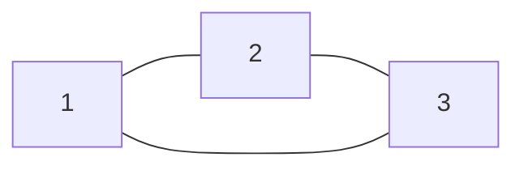

# Конспект от 04.10.2025 | Параллель B
## Тема: Древо отрезков и его применение

> Автор: Вадим Христенкко  
> Дружеский конспект — просто и понятно о сложных вещах.  
> Разбор задачек будет потом отдельно в другом файле заисключением последних двух задач.  
> Они будут разобраны здесь же.

# Разбор задач.
## Задача L. Петя и монеты

### Текст задачи
Дан неориентированный граф с n вершинами (монеты) и m рёбрами (парами монет, которые сделаны из различных материалов). Известно, что ровно одна монета сделана из меди; остальные — из двух других материалов (железо и бронза). Петя купит монету p тогда и только тогда, когда существует раскраска всех монет в три материала, где ровно p — медная, все остальные — либо железо, либо бронза, и каждая из m пар имеет различные материалы.

Надо перечислить все такие возможные p (в порядке возрастания). n, m ≤ 3·10^6.

---

### Задумка (коротко, для конспекта)
- Если зафиксировать кандидатную медную монету p, то все остальные вершины должны иметь только два материала (железо/бронза), и каждая пара между ними должна соединять разные материалы. Это просто требование двух-раскраски (бипартности) графа G \ {p}.
- Значит p допустима тогда и только тогда, когда граф без вершины p является двудольным (бипартитным).
- Соответственно нужно найти все вершины p, удаление которых делает граф бипартитным.
- Эквивалентное утверждение: p допустима ⇔ все нечетные циклы графа содержат вершину p (если в графе нет нечетных циклов — он уже бипартитный, тогда любой p подходит).
- Следовательно задача: найти множество вершин, лежащих во всех нечетных циклах (или — если нечетных циклов нет — вернуть все вершины).

Ключевая идея алгоритма:
1. Запустить DFS и ориентировать рёбра в дерево (получим DFS-лес). Для каждой вершины хранить глубину depth[v] (и её чётность).
2. Любое не-tree ребро (ребро между вершиной и её предком в DFS) образует цикл, длина которого равна длине пути в дереве между концами + 1. Такой цикл нечетный ⇔ концы ребра имеют одинаковую чётность глубины.
3. Для каждого нечетного back-edge (u, v) пометить все вершин на пути u↔v в дереве: они входят в этот конкретный нечетный цикл.
4. После обработки всех нечетных back-edges пересчитать для каждой вершины, в скольких из этих нечетных циклов она участвует. Если число таких циклов = total_odd (общее количество найденных нечетных back-edges), то вершина лежит во всех нечетных циклах и, следовательно, удаление её устраняет все нечетные циклы → она допустима.
5. Если total_odd == 0 (граф уже бипартитный), то все вершины допустимы.

---

### Формулы и наблюдения (LaTeX)
- Глубины и чётности:
  $$ parity(v) = depth(v) \bmod 2. $$
  Рёбра (u,v) с parity(u) = parity(v) соответствуют нечетному циклу через путь в DFS-дереве между u и v плюс это ребро.
- Дифференциальный подсчёт на дереве (маркировка путей): для каждого такого ребра делаем
  $$ add[u]++,\quad add[v]++,\quad add[\mathrm{lca}(u,v)]-=2. $$
  Затем обычным DFS суммируем add по поддеревьям; значение sum[x] — число нечетных back-edges, чьи путь (в дереве) проходит через x.
- Вершина x допустима ⇔ sum[x] = total\_odd (либо total_odd = 0, тогда все вершины допустимы).

---

### Примерный план / псевдокод (конспектный)
```
# Предполагается: построен список смежности adj для неориентированного графа.
# Будем делать DFS, строя дерево: parent[v], depth[v], tin[v], tout[v]
# и собирать не-tree ребра (u,v) с parity равной.

timer = 0
total_odd = 0
for v in 1..n:
    if not visited[v]:
        dfs_build(v, parent = 0)

function dfs_build(u, parent):
    visited[u] = true
    parent[u] = parent
    depth[u] = depth[parent] + 1
    tin[u] = ++timer
    for each (v) in adj[u]:
        if v == parent: continue   # корректно обрабатывать мульти-ребра через id ребра
        if not visited[v]:
            mark edge (u,v) as tree-edge
            dfs_build(v, u)
        else if tin[v] < tin[u]:    # ненаправленное ребро к предку (back-edge)
            if (depth[u] % 2) == (depth[v] % 2):
                # этот back-edge порождает нечетный цикл
                total_odd += 1
                add[u] += 1
                add[v] += 1
                w = lca(u, v)
                add[w] -= 2

# Теперь суммируем add по дереву (последний проход)
function dfs_acc(u):
    sum[u] = add[u]
    for each child c of u in DFS-дереве:
        dfs_acc(c)
        sum[u] += sum[c]

# Результат:
if total_odd == 0:
    answer = {1,2,...,n}
else:
    answer = { v | sum[v] == total_odd }
```

> Замечания по LCA: для больших n обычно используют бинлифтинг (parent[k][v]) или варианта с эвристикой. Требуется поддержать LCA в общей DFS-лесовой структуре.

---

### Иллюстрация (mermaid)
Простой пример: треугольник 1–2–3–1 (нечетный цикл).

- total_odd = 1, путь в дереве между 3 и 1 = {3,2,1}, после маркировки sum[1]=1,sum[2]=1,sum[3]=1 ⇒ все 1,2,3 лежат во всех нечетных циклах → удаление любой вершины разбивает треугольник, значит любой p допустим.

---

### Сложность и практические детали
- Время: O(n + m) (несколько обходов графа + LCA подготовка/запросы).
- Память: основной вклад — представление графа и таблицы для LCA (бинлифтинг: O(n log n)). При n, m ≤ 3·10^6 требуется экономная реализация:
  - Использовать массивы (vector с reserve, одномерные массивы) вместо map/set.
  - Хранить рёбра компактно (edges[] и head[]), избегать пар<int,int> на 2*m элементе.
  - parent[k][v] (бинлифтинг) занимает O(n log n) памяти; с n=3e6 и 22 уровнями это много — надо считать память и, при необходимости, применять альтернативы: LCA через RMQ по euler−tour (также требует память), либо использовать метод с подъёмом по родителям при обработке добавлений, если это допустимо по времени.
- Рекурсия: рекурсивный DFS может переполнить стек при глубине ~n. Для больших n реализуйте DFS итеративно (stack).

---

### Важные нюансы и частые ошибки
- Обработка мультиграфа: если между u и parent[u] есть несколько рёбер, простая проверка v==parent может неправильно классифицировать завершенные ребра как back-edge. Надёжно хранить id ребра и сравнивать по id родительского ребра.
- Когда фиксируем back-edge, нужно учитывать направление: в неориентированном графе каждое не-tree ребро будет встречено дважды; фильтруйте по tin (рассматривать только ребро к предку — tin[v] < tin[u]) чтобы не считать дважды.
- LCA: неправильно посчитанная lca приведёт к неверным диапазонным обновлениям.
- Если total_odd == 0 — вернуть все вершины.
- Корректно обрабатывать несвязный граф: DFS выполняется для всех не посещенных вершин.

---

### Короткое резюме
- Превратить условие в проверку: p допустима ⇔ G \ {p} бипартитен ⇔ все нечетные циклы графа проходят через p.
- Найти все нечетные циклы через DFS-парность: это не-tree ребра между вершинами одинаковой парности.
- Для каждого такого ребра добавить +1 на пути в DFS-дереве между концами (дифференциально с помощью LCA), затем аккумулировать.
- Ответ — вершины, в которых сумма равна общему числу нечетных back-edges (или все вершины, если таких back-edges нет).
