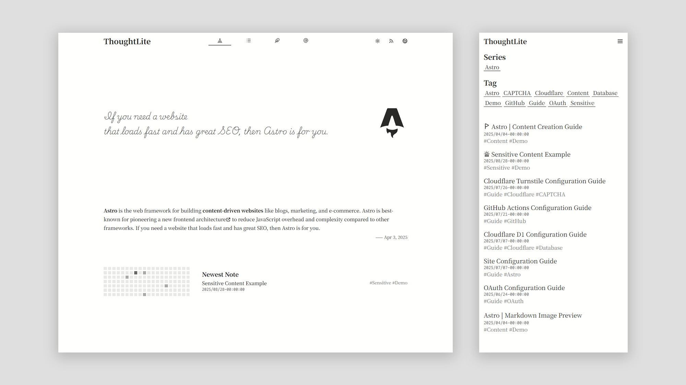
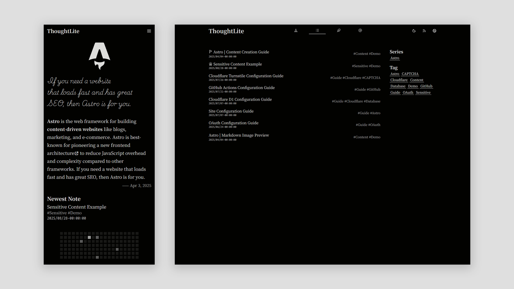

# 👋 Привет, друзья-кодеры! 🚀

<<<<<<< HEAD
Добро пожаловать в **мой цифровой чердак знаний** — место, где алгоритмы не пугают, а объясняются, где код становится ясным, а обучение — почти уютным.  
Здесь живут **конспекты**, написанные не для галочки, а потому что **кто-то однажды тоже искал простое объяснение сложного**.  
=======
<div align="center">
    
    
    <p></p>
    <p>A modern <a href="https://astro.build/">Astro</a> theme, focused on content creation 🌟</p>
    <small><ins>English</ins></small> <small><a href="README.zh-cn.md">简体中文</a></small> <small><a href="README.ja.md">日本語</a></small>
</div>
>>>>>>> 71ecc62b514811322f579d321afe4588662a2f99

И, возможно, этим «кем-то» был ты.  
Так что — проходи, читай, копируй, улучшай. Это твой уголок тоже. 💻✨

<<<<<<< HEAD
---
=======
> - `main` branch✅: Static build, can be deployed on any static hosting platform;
> - `cloudflare` branch: Enables built-in comment system, only deployable on Cloudflare.
>>>>>>> 71ecc62b514811322f579d321afe4588662a2f99

## 😎 А кто я, собственно?

Я — **Вадим Христенко**, школьник из Москвы, который вместо TikTok смотрит лекции по C++ и Rust, а вместо сна — дебажит бота.  
Да, я всё ещё учусь.  
Но уже успел понять: **лучший способ разобраться в чём-то — объяснить это другому**.  

Поэтому я пишу. Делюсь. Открываю репозитории.  
Моя «шиза»? Мой прогресс. Мои ошибки. Мои «ага!»-моменты.  
И если они помогут тебе — значит, всё не зря. 🔥

<<<<<<< HEAD
### 🛠️ Что я уже натворил?

- Написал **Telegram Local Bot API Server** — чтобы боты работали даже без облака. 🤖  
- Писал софт в одном «школьном учреждении» (читай: кодил там, где бюджеты — как алгоритмы: сложные, но решаемые). 💰  
- Пилю проекты на **C++**, **Python**, **Rust** — от скриптов-однодневок до штук, которые реально кто-то использует.  
- Да, я даже переписал **Kumir 3 на Rust**. Потому что… почему бы и нет? 🦀🐍  
=======
## ⚡️ Quick Start

### Using Astro Command

Run the following command:

```sh
npx create-astro@latest --template tuyuritio/astro-theme-thought-lite

# Follow the interactive prompts to create the project

cd <your-project-name>
npm run dev     # Will start the local development server at http://localhost:4321 by default
```

### Using Template

1. [Fork](https://github.com/tuyuritio/astro-theme-thought-lite/fork) this repository or use the template to [create a new repository](https://github.com/new?template_name=astro-theme-thought-lite&template_owner=tuyuritio).
2. Run the following commands:

```sh
git clone <your-repo-url>
cd <your-repo-name>
npm install
npm run dev     # Will start the local development server at http://localhost:4321 by default
```
>>>>>>> 71ecc62b514811322f579d321afe4588662a2f99

Код для меня — не просто инструмент. Это язык. И я стараюсь на нём говорить честно.

<<<<<<< HEAD
---

## 📞 Давай держать связь!

Хочешь обсудить идею, предложить коллаб или просто поболтать о том, как Rust сводит с ума?  
Пиши в Telegram:

- Для неформального общения: **[@VAI_Programmer](https://t.me/VAI_Programmer)** 👋  
- Для серьёзных проектов и open-source: **[@VAID_CEO](https://t.me/VAID_CEO)** 💼  

P.S. Мы активно развиваем **open-source проекты** — и всегда рады новым рукам (и мозгам!). 🌟

---
=======
Customize site configuration and internationalization (i18n) by modifying the following files:

- `.env`
- `astro.config.ts`
- `site.config.json`

For details, refer to the [Configuration Guide](src/content/note/en/configuration.md).

## 🚀 Deployment

The current branch can be fully static built and deployed on any static hosting platform.

For deployment methods on various platforms, refer to the [Astro Official Deployment Guide](https://docs.astro.build/en/guides/deploy/).
>>>>>>> 71ecc62b514811322f579d321afe4588662a2f99

## 📚 Что ты найдёшь здесь?

<<<<<<< HEAD
Сейчас — **конспекты с [algocourse.ru](https://algocourse.ru)**, аккуратно переложенные в Markdown.  
Но это только **фундамент**.  
=======
Run the following commands to sync upstream updates:

```sh
git remote add theme https://github.com/tuyuritio/astro-theme-thought-lite.git
git fetch theme
git merge theme/main    # Add `--allow-unrelated-histories` flag for first update
npm install
```
>>>>>>> 71ecc62b514811322f579d321afe4588662a2f99

В планах — заметки по:
- системному программированию,
- архитектуре ПО,
- математике для программистов,
- и даже «как не сгореть, учась по 10 часов в день».

Контент будет расти. Как и мы. 🌱

---

<<<<<<< HEAD
## 🔎 Умный поиск по знаниям
=======
All content sections support multiple languages. Create the corresponding language directory to start creating content. For details, refer to the [Content Creation Guide](src/content/note/en/content.md).
>>>>>>> 71ecc62b514811322f579d321afe4588662a2f99

Не нужно больше вспоминать, в каком разделе лежала нужная формула. Теперь в шапке сайта есть глобальный поиск: нажми **Ctrl + K** (или тапни по кнопке «Поиск») и моментально найди заметку или конспект по заголовку, тегу или содержимому. Результаты подсвечивают совпадения и работают на обеих локалях.

---

## 🤝 Хочешь внести вклад?

Отлично! Этот репозиторий — **не музей, а мастерская**.  
Вот как помочь:

1. Сделай **форк**.  
2. Внеси правки или напиши новый конспект.  
3. Отправь **pull request** — я с радостью его приму (и, скорее всего, напишу тебе «спасибо» в Telegram 😄).

📁 **Структура:**  
- Конспекты → `src/content/note/`  
- Короткие заметки, идеи, размышления → `src/content/jotting/`

<<<<<<< HEAD
Каждая запятая, каждая исправленная опечатка — это шаг к лучшему знанию для всех.

---

## 🔧 Анонс: новый движок AlgoCourse!

Мы не стоим на месте.  
Сейчас в разработке — **полностью переработанный движок для algocourse.ru**, написанный с нуля. Он будет:
- быстрее,  
- удобнее,  
- и, надеюсь, красивее.  

Пока проект приватный, но скоро станет публичным:  
👉 [github.com/Vadim-Khristenko/VAI_Algocourses](https://github.com/Vadim-Khristenko/VAI_Algocourses)  

Следи за обновлениями — будет интересно!

---

Спасибо, что заглянул.  
Если тебе понравилось — поставь ⭐ репозиторию. Это мотивирует больше, чем кажется.  
А теперь — возвращайся к коду.  
**Мир ждёт твои pull request’ы.** 🚀💻

— Вадим, 2025
=======
This project is licensed under [GPLv3](LICENSE), allowing free modification and distribution, but the original copyright notice must be retained.
>>>>>>> 71ecc62b514811322f579d321afe4588662a2f99
