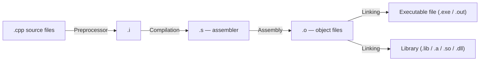

> **Main Author:** Vadim Khristenko  
> **Other Authors:** —  
> **Last Updated:** 2025-10-11  
> **Discussion Link:** [Telegram chat](https://t.me/ru_cpp_beginners)  
> _Comment:_ FAQ for C++ beginners.  
> _Tags:_ C++, basics, installation, first example, tips

# What is C++ — in Simple Terms {id: "what_is_cpp"}

C++ is a powerful and fast general-purpose language. It allows precise control over resources (memory, CPU time), so it's used where speed and efficiency are critical: game engines, graphics, operating systems, databases, drivers, high-load network services, embedded devices.

In short: C++ combines procedural style (like in C) and object-oriented programming, supports templates (generics), RAII (resource management through objects), and modern standards (C++11/14/17/20/23). To start, it's important to understand how code turns into a program and how to write, build, and debug that code.

## Who Needs It {id: "who_needs_cpp"}

- Game and graphics developers (engines, rendering).
- System software developers (operating systems, drivers).
- Embedded systems and IoT (when speed and limited resources matter).
- Projects requiring high performance (file systems, databases, networks).

> Modern C++ became much more convenient after C++11: auto type deduction (`auto`), smart pointers, range-for, lambdas, `std::thread`, `std::chrono`, and much more.

---

## How Code Turns into a Program {id: "how_build_works"}

Under the hood, your code goes through several steps. This is important to understand linking errors, what headers are, and why "symbol not found/not found".



- The preprocessor expands `#include`, macros, and conditional compilation.
- The compiler translates C++ into assembler.
- The assembler creates object files.
- The linker glues object files and libraries into the final binary.

From this, a practical tip: put function/class declarations in headers (`.h/.hpp`), implementation in `.cpp`. Multiple `.cpp` can be built into one `.exe`.

## Short on Syntax {id: "cpp_syntax"}

Basic building blocks of the language:

- Variables and types: `int x = 10;`, `double`, `bool`, `std::string`, etc.
- Control structures: `if/else`, `switch`, `for/while`, `range-for`.
- Functions: take values, references (`T&`), const references (`const T&`).
- Pointers (`T*`) and references (`T&`) — important to understand the difference.
- Classes and objects, constructors/destructors, encapsulation.
- Templates and the Standard Library (STL): containers and algorithms.
- RAII: resources under object control (close file, free memory, etc.).

## Basic Types {id: "basic_types"}

Below is a compact description of basic scalar types in C++. Note that sizes and ranges depend on the platform and compiler; the values given are typical for 64-bit systems (LP64).

| Type | Description | Typical Size |
|------|-------------|--------------|
| `bool` | Logical type (true/false) | 1 byte |
| `char` / `signed char` / `unsigned char` | Character/byte types | 1 byte |
| `short` / `short int` | Short integer | 2 bytes |
| `int` | Integer (regular) | 4 bytes |
| `long` / `long int` | Long integer | 8 bytes (on LP64) |
| `long long` | Very long integer | 8 bytes |
| `float` | 32-bit floating-point number | 4 bytes |
| `double` | 64-bit floating-point number | 8 bytes |
| `long double` | Extended precision (platform-dependent) | 8/16 bytes |
| `size_t` | Unsigned type for sizes/indexes | 8 bytes (on 64-bit) |
| `wchar_t` / `char16_t` / `char32_t` | Wide/Unicode characters | depends |
| `int8_t`/`uint64_t` (from `<cstdint>`) | Fixed-width | exactly N bits |

Range of signed integers for $N$ bits:

$$
\text{Range of signed } N\text{-bit integer} = -2^{N-1} \dots 2^{N-1}-1
$$

For example, for 32-bit `int` (N=32): $-2^{31} \dots 2^{31}-1$.

Examples of working with types and `sizeof`:

```cpp
#include <iostream>
#include <type_traits>

int main() {
    std::cout << "sizeof(bool) = " << sizeof(bool) << "\n";
    std::cout << "sizeof(int) = " << sizeof(int) << "\n";
    std::cout << "sizeof(long) = " << sizeof(long) << "\n";
    std::cout << "sizeof(void*) = " << sizeof(void*) << " (indicates platform bitness)\n";

    // Using unsigned for counters/indexes
    unsigned int u = 10u;
    std::cout << "u = " << u << "\n";
    return 0;
}
```

Pointers and references:

- A pointer `T*` stores the address of a `T` object. Its size equals the size of `void*` on the platform (usually 8 bytes on 64-bit).
- A reference `T&` is an alias for an existing object; references have no separate size in syntax and are used to safely pass an object by reference.

Example with pointers and references:

```cpp
#include <iostream>

int main() {
    int x = 42;
    int* p = &x;    // pointer
    int& r = x;     // reference

    std::cout << "x = " << x << ", *p = " << *p << ", r = " << r << "\n";
    *p = 100; // change value through pointer
    std::cout << "x after change through p = " << x << "\n";
}
```

Strings and text:

- In C++, there is `std::string` (a convenient class for strings) and C-strings (`char*`, `const char*`).

Example of `std::string`:

```cpp
#include <iostream>
#include <string>

int main() {
    std::string s = "Hello, C++";
    std::cout << s << "\n";
}
```

Note: modern guides recommend using types from `<cstdint>` where possible (e.g., `int32_t`, `uint64_t`) when exact width matters.

---

## What You Need to Get Started {id: "what_needed_to_start"}

1. Compiler: g++ (part of GCC), clang/clang++, or Microsoft Visual C++ (MSVC).
2. Text editor or IDE: VS Code, CLion, Visual Studio.
3. Terminal (command line) for compilation and running.

Below are quick instructions for Windows, macOS, and Linux.

---

## Installing the Compiler {id: "install_compiler"}

### Windows {id: "install_compiler_windows"}

- Recommended easy path: install MSYS2 (includes pacman and g++).
  1. Download MSYS2: [msys2.org](https://www.msys2.org/)  
  2. Follow installation instructions, then in the MSYS2 console run:

    - Update packages: `pacman -Syu` (may need to restart console and run `pacman -Syu` again)
    - Install tools: `pacman -S --needed base-devel mingw-w64-x86_64-toolchain`

  3. After that, g++ and make will be available in the `mingw64` console.

- Alternative: install Visual Studio (Community) with the "Desktop development with C++" component — then MSVC and Visual Studio IDE are available.

    Recommendations for VS Code on Windows:

    - Install extensions: "C/C++" (Microsoft), "CMake Tools" (Microsoft), optionally "clangd".
    - For MSYS2, you can use the MSYS2 MinGW 64-bit terminal, or configure `cmake -G "MinGW Makefiles"`.

### macOS {id: "install_compiler_macos"}

- Install Xcode Command Line Tools (includes clang):
- In terminal: xcode-select --install
- After that, `clang++` is available as the compiler.

### Linux (Ubuntu / Debian) {id: "install_compiler_linux"}

- Install g++: sudo apt update && sudo apt install build-essential
- The `build-essential` package contains g++, gcc, make, and necessary headers.

Other distributions: use the native package manager (dnf, pacman, zypper, etc.) and install gcc/g++.

---

## First Example: Hello, World! {id: "first_example"}

Create a file `hello.cpp` with this content:

```cpp
#include <iostream>

int main() {
    std::cout << "Hello, world!" << std::endl;
    return 0;
}
```

### Compile and Run: {id: "compile_and_run_example"}

#### g++ (Linux / macOS / MSYS2) {id: "g++_example"}

- Build: `g++ -std=c++17 hello.cpp -O2 -o hello`
- Run: `./hello`

#### clang++ (macOS or Linux) {id: "clang++_example"}

- Build: `clang++ -std=c++17 hello.cpp -O2 -o hello`
- Run: `./hello`

#### MSVC (Visual Studio Developer Command Prompt) {id: "msvc_example"}

- Build: `cl /EHsc hello.cpp`
- Run: `hello.exe`

### Tips: {id: "compilation_tips_for_example"}
- `-std=c++17` specifies the C++ standard (can be replaced with c++20, etc.).
- `-O2` enables optimizations; for debugging, use `-O0 -g`.

> On Windows, for MSYS2, commands are run in the MSYS2 MinGW 64-bit console, not PowerShell. For MSVC — in "x64 Native Tools Command Prompt for VS".

## How to Organize a Project {id: "project_structure"}
- For simple programs, one `.cpp` file is enough.
- For more complex projects, use build systems: CMake, Make, Meson.
- We recommend CMake — it's cross-platform and widely used. A simple CMakeLists.txt example can be found online.

## Basics: Variables, Branching, Loops {id: "basics_control_flow"}

Example of a mini-program with input/output, conditions, and loops:

```cpp
#include <iostream>
#include <vector>

int main() {
    std::cout << "How many numbers to sum? ";
    int n; std::cin >> n;
    if (n <= 0) {
        std::cout << "Nothing to sum\n";
        return 0;
    }

    std::vector<int> a(n);
    for (int i = 0; i < n; ++i) {
        std::cin >> a[i];
    }

    long long sum = 0;
    for (int x : a) sum += x; // range-for

    std::cout << "Sum = " << sum << "\n";
}
```

Key points:
- `std::cin`/`std::cout` — input/output.
- `std::vector<T>` — dynamic array.
- `range-for` iterates over elements: `for (auto x : vec)`.

## Functions and Parameters {id: "functions_and_params"}

Ways to pass arguments:

```cpp
#include <string>

// By value (copy)
int twice(int x) { return 2 * x; }

// By reference (can change the argument)
void push_back_exclaim(std::string& s) { s += "!"; }

// By const reference (no copy, but no changes)
int length(const std::string& s) { return (int)s.size(); }
```

Choice:
- Small types (like `int`, `double`) — usually by value.
- Large objects (`std::string`, vectors) — by `const&` for reading, by `&` for changing.

## Classes, RAII, and Smart Pointers {id: "classes_raii_smart_ptr"}

RAII (Resource Acquisition Is Initialization) — the resource belongs to the object, released automatically in the destructor.

```cpp
#include <fstream>
#include <string>

struct Writer {
    std::ofstream out;
    explicit Writer(const std::string& path) : out(path) {}
    ~Writer() { /* out.close() will be called automatically in destructor */ }
    void write_line(const std::string& s) { out << s << '\n'; }
};

int main() {
    Writer w("log.txt");
    w.write_line("Hello"); // file will close automatically when exiting main
}
```

For dynamic memory, use smart pointers:

```cpp
#include <memory>

struct X { int v = 0; };

int main() {
    auto p = std::make_unique<X>(); // unique ownership
    p->v = 42;

    std::shared_ptr<X> sp1 = std::make_shared<X>(); // shared ownership
    auto sp2 = sp1; // reference count increases
}
```

> Rule of zero: where possible, don't manage memory manually, use containers/smart pointers. Code is shorter and safer.

## Exceptions and Error Handling {id: "exceptions"}

```cpp
#include <stdexcept>

int safe_div(int a, int b) {
    if (b == 0) throw std::runtime_error("division by zero");
    return a / b;
}
```

Practice:
- Throw exceptions in truly exceptional situations.
- For frequent errors, consider `std::optional`, `expected` (C++23/libraries), return codes.

## Templates, Containers, and STL Algorithms {id: "templates_stl"}

```cpp
#include <algorithm>
#include <iostream>
#include <string>
#include <vector>

int main() {
    std::vector<std::string> names = {"Ann", "Bob", "Cathy"};
    std::sort(names.begin(), names.end());
    for (const auto& s : names) std::cout << s << '\n';
}
```

Useful containers: `std::vector`, `std::array`, `std::string`, `std::map`, `std::unordered_map`, `std::set`.
Useful algorithms: `std::sort`, `std::find`, `std::accumulate`, `std::transform`.

---

## Minimal CMake Project {id: "cmake_quickstart"}

Structure:

```
project-root/
  CMakeLists.txt
  src/
    main.cpp
```

`CMakeLists.txt`:

```cmake
cmake_minimum_required(VERSION 3.16)
project(hello_cpp LANGUAGES CXX)

set(CMAKE_CXX_STANDARD 17)
set(CMAKE_CXX_STANDARD_REQUIRED ON)

add_executable(hello src/main.cpp)
```

`src/main.cpp` — regular `main`.

Build:

- MSYS2/Unix-like:
  - `cmake -S . -B build -G "Unix Makefiles"`
  - `cmake --build build --config Release`
- MinGW on Windows:
  - `cmake -S . -B build -G "MinGW Makefiles"`
  - `cmake --build build --config Release`
- Visual Studio (MSVC):
  - `cmake -S . -B build -G "Visual Studio 17 2022" -A x64`
  - `cmake --build build --config Debug`

Run: `./build/hello` (or `build/Debug/hello.exe` for VS).

---

## Debugging and Tools {id: "tools"}

- Debuggers: gdb (Linux), lldb (macOS), built-in in Visual Studio (Windows), VS Code extensions.
- Sanitizers (GCC/Clang):
  - AddressSanitizer: `-fsanitize=address -fno-omit-frame-pointer`
  - UndefinedBehaviorSanitizer: `-fsanitize=undefined`
  - ThreadSanitizer: `-fsanitize=thread`
- Static analysis: `clang-tidy`, `cppcheck`.
- Formatting: `clang-format` (config `.clang-format`).

Example commands (GCC/Clang):

```
g++ -std=c++20 -O0 -g -fsanitize=address main.cpp -o app
./app
```

On Windows with MSVC, use the built-in Visual Studio debugger; for sanitizers — LLVM toolchain on Windows or MSYS2/MinGW.

---

## Common Errors and Pitfalls {id: "pitfalls"}

- Uninitialized variables: always initialize.
- Dangling references/pointers: don't return a reference to a local variable.
- Signed overflow: behavior is undefined for `signed`.
- Incorrect work with C-style strings (`char*`): prefer `std::string`.
- Manual memory without need: use containers/smart pointers.
- Violating ownership rules: one resource — one owner (`unique_ptr`).

Example of UB (don't do this):

```cpp
int& bad() {
    int x = 42;
    return x; // returning reference to destroyed object
}
```

---

## Mini-Exercises for Practice {id: "exercises"}

1) Read N, then N numbers and output the maximum.  
2) Function `is_prime(int)`: return `true`/`false`.  
3) Read words until EOF and output them alphabetically (use `std::vector<std::string>` and `std::sort`).  
4) Class `Timer` that prints in the destructor how many milliseconds it lived (use `std::chrono`).  
5) Rewrite code with raw pointers to `std::unique_ptr`.

Expected results: correct work on basic tests, no leaks, readable code.

---

## Small Glossary {id: "glossary"}

- Compiler — program translating sources into machine code.
- Linker — glues object files and libraries into a binary.
- Header — file with declarations (`.h/.hpp`).
- Object file (`.o/.obj`) — result of compiling one module.
- Library — set of object files: static (`.a/.lib`) or dynamic (`.so/.dll`).
- RAII — resource ownership by object; release in destructor.
- STL — Standard Template Library: containers, algorithms, etc.
- UB (Undefined Behavior) — undefined behavior, result not predicted by standard.

---

## Frequently Asked Questions (FAQ) {id: "faq"}

- Which standard to choose?  
  Start with C++17 or C++20. If C++23 is available — even better, but it's newer.

- GCC, Clang, or MSVC?  
  All are good. On Windows, it's easier to start with MSVC or MSYS2+GCC.

- Why "symbol not found" during linking?  
  Declaration exists, implementation doesn't, or forgot to add `.cpp` to build, or didn't link the necessary library.

- When to use exceptions?  
  For rare exceptional situations. For flow control — not worth it.

- Are smart pointers always needed?  
  Yes, when there's dynamic memory. But first think if you can do without it (containers).

- How to speed up build?  
  Precompiled headers, single-include headers, modular build (C++20 modules as available).

---

## Tips for Beginners {id: "tips_for_beginners"}
- Start with small programs and practice daily.
- Use documentation and proven books: "A Tour of C++" (B. Stroustrup), "Effective Modern C++" (S. Meyers).
- Set up auto-formatting with `clang-format`.
- Learn to debug: breakpoints, `step over/into`, variable inspection.
- Don't be afraid of compiler errors — read them from top to bottom and fix one by one.

---

## What's Next {id: "what_next"}

- Dive deeper into classes: rule of zero/five, move semantics.
- Immerse in standard algorithms: `std::ranges` (C++20).
- Master CMake and project structure, connecting libraries.
- Try sanitizers and static analysis.
- Write 2-3 small projects: console ToDo, CSV parser, mini-game.