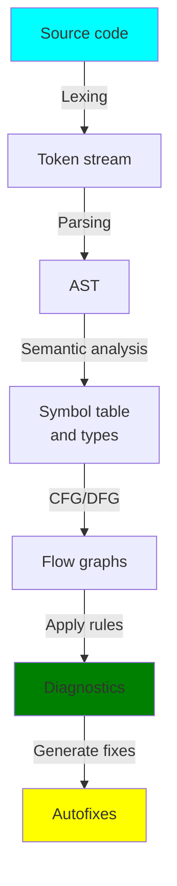
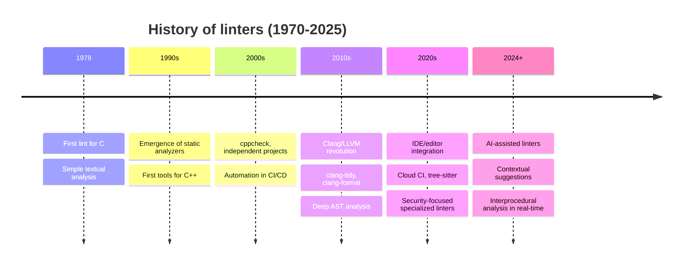
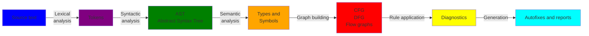
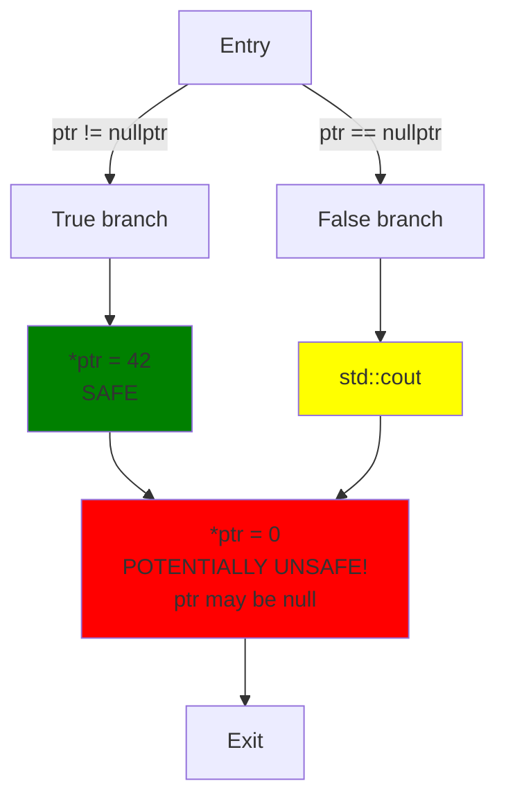
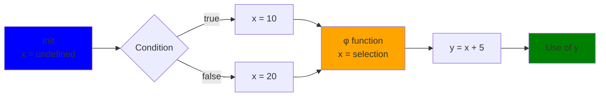
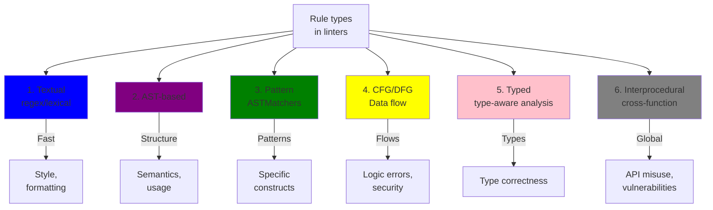
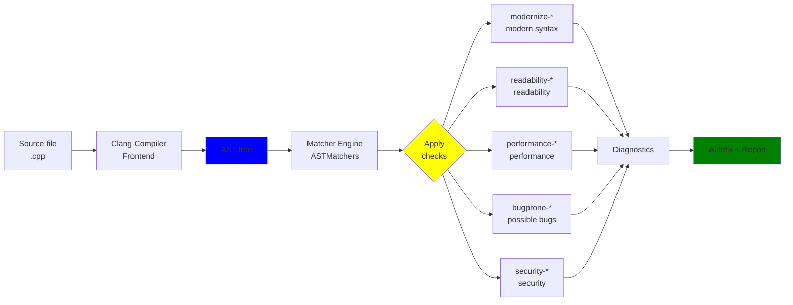
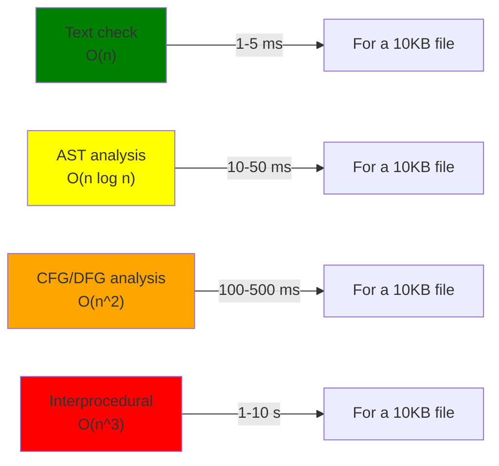
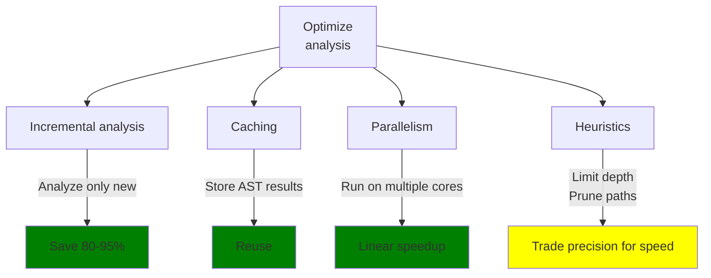
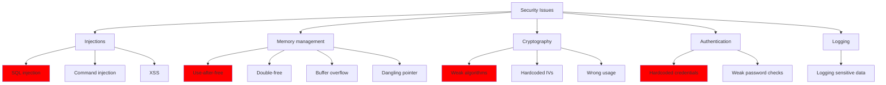

> **Lead author:** Vadim Khristenko  
> **Other authors:** —  
> **Last updated:** 2025-10-27  
> **Discussion link:** [Telegram chat](https://t.me/ru_cpp_beginners)  
> _Note:_ FAQs for C++ beginners.  
> _Tags:_ C++, basics, linters, code quality, coding style

# Introduction {id: "introduction"}

Linters are tools that analyze your code and help find potential errors, performance issues, and deviations from coding style. They can run in real time (for example, inside code editors) or as standalone utilities you run on your codebase.

The term "lint" comes from the name of the very first utility for C (1978, Bell Labs). Originally it was a simple text analyzer, but as tools evolved, linters turned into powerful analysis systems that use full abstract syntax trees (AST), control flow graphs (CFG), and data flow analysis (DFG).

Using linters enables:

- 🐛 **Reducing bugs and defects** — finding issues during development instead of in production
- 🎨 **Maintaining a consistent coding style** across the team and over time
- ⚡ **Speeding up code reviews** — automating repetitive checks
- 📚 **Improving code quality and readability** by teaching best practices
- 🔒 **Preventing vulnerabilities** — early detection of potentially dangerous constructs
- ⏱️ **Saving time** — quick feedback inside the editor instead of waiting for CI

In this guide we will dive into how linters are built, how to use them in C++ projects, and even how to write custom rules.

## What this guide contains

This is a comprehensive material about linters: from the basic idea to what happens "under the hood", which algorithms and code representations are used, how to write and test custom rules, how to integrate linters in editors and CI, and practical tips and references.

## Quick contract (what this guide provides)

- Input: source code of a project (C++, though most ideas are universal).
- Output: understanding of linter architecture, example rules, configurations, and a plan to build your own linter.
- Constraints: deep full-engine implementations are omitted; the guide gives practical recipes and pointers.

## Quick overview — types of tools {id: "overview"}

| Tool | Purpose | Example | Uses |
|:---|:---|:---|:---|
| **Formatter** | Bring code to a single style | clang-format, prettier | Syntax, not semantics |
| **Linter** | Rule-based checks | clang-tidy, cpplint | AST, tokens |
| **Static analyzer** | Find bugs and UB | cppcheck, Coverity | AST, CFG, DFG |
| **Compiler with warnings** | Built-in checks | GCC -Wall -Wextra | Compiler IR |
| **Specialized analyzer** | Narrow-focused checks | Clang Address Sanitizer | Instrumentation, runtime |

> **Note:** boundaries are blurred — clang-tidy is both a linter and a static analyzer, providing autofix and working with AST.



---


## 1. Core ideas and motivation {id: "main_ideas"}

Why linters matter beyond "code prettiness"—this question is often underestimated. Below is an expanded explanation with history and practical examples so even a beginner understands why linters are needed.

### Short history of linters {id: "history"}

The term "lint" originated from the name of the first utility for the C language — **lint**, created by **Stephen C. Johnson** at **Bell Labs in the late 1970s**. Early tools were simple: they searched for potential problems and suspicious constructs in source text.

Evolution of linters:



**Key milestones:**

- **1970s** — textual/lexical checks for C (original `lint`)
- **1990s** — more advanced static analyzers appear
- **2000s** — independent projects (`cppcheck`), widespread CI adoption
- **2010s** — Clang/LLVM made compiler AST accessible to tools
- **2020s** — IDE integration and specialized security linters
- **2024+** — AI-assisted tools with contextual analysis

From an architecture perspective, evolution went from **text checks** → **syntactic analysis** → **semantic analysis** → **graph-based representations** (CFG, DFG) → **ML and context**.


### Why it matters (deeper) {id: "why"}

- Fast feedback. Instead of waiting for CI or a manual review, you get hints in the editor — this saves hours of debugging.
- Less bugs. Simple mistakes (typos, missing returns, uninitialized variables) can be costly if found after release.
- Maintainability. A consistent style and rules make code easier to read for others and for your future self.
- Security. Many vulnerabilities can be detected statically (e.g., unsafe APIs, possible buffer overflows).
- Education. For newcomers, a linter acts like a coach — showing best practices and explaining why something is bad.

Key idea: code is text, but for most useful checks it must be represented structurally (AST, CFG, DFG). Linters perform that translation and then apply rules to the structure.

---


## 2. What happens "under the hood" — main stages {id: "pipeline"}

Below is a simplified but practical pipeline for how a linter processes code. It's important for beginners to know what data is produced at each stage and what checks can be done there.

### Overall analyzer architecture



**Complexity of analysis at different levels:**

$$
\text{Complexity} = \begin{cases}
O(n) & \text{for lexing} \\
O(n \log n) & \text{for parsing} \\
O(n^2) & \text{for semantic analysis} \\
O(n^3) & \text{for interprocedural analysis}
\end{cases}
$$

where $n$ is the number of elements (tokens, nodes, procedures).

### 1) Lexing (tokenization) {id: "lexing"}

**What it is:** converting text into a stream of tokens — minimal semantic units (identifiers, keywords, numbers, strings, brackets, etc.).

**Why:** if your check concerns plain text (spaces, tabs, line length, comments), lexing provides all needed info and is very fast.

**How it's implemented:** usually via regexes or a small finite automaton; many parsers do lexing first, then parsing.

**Example:** rule "no trailing whitespace" doesn't require full parsing — a lexical pass or simple text scan is enough.

Limitations: lexing doesn't give program structure — it won't tell you where a function starts or the type of a variable.

### 2) Parsing -> AST (Abstract Syntax Tree) {id: "ast"}

**What it is:** assembling tokens into a tree representing program structure — expressions, statements, declarations, blocks.

**Why:** AST allows understanding program semantics: what functions exist, expressions, call sites, etc. Most stylistic and semantic rules operate on AST.

**How it's implemented:** parser generators (ANTLR, Bison) or ready parsers (Clang for C/C++). The parser builds nodes like if-statement, function-decl, call-expr, etc.

**Example:** rule "calls to strcpy" is easier to find via AST (call-expression node with function name) than by simple text matching.

Limitations: building a correct AST sometimes requires full compilation context (includes, type definitions).

### 3) Semantic analysis and symbol table {id: "semantic"}

**What it is:** stage where the tool tries to resolve names and types — understands which function or variable is used.

**Why:** without name resolution you can get false positives — e.g., several functions named foo in different namespaces.

**How it's implemented:** symbol table is built, references are linked to declarations, types are checked.

**Example:** a rule that checks correct argument types requires semantic analysis.

Limitations: semantic analysis needs access to include files and compile flags (for C++), so some linters accept a compilation database (like -p for clang-tidy).

### 4) Building CFG (Control Flow Graph) {id: "cfg"}

**What it is:** representation of possible execution paths as a graph — nodes are basic blocks, edges are transitions.

**Why:** needed to analyze program behavior under different execution paths — e.g., whether a pointer may be null at a use site.

**How it's implemented:** constructed from AST/IR — each conditional, loop, and jump becomes edges in the graph.

**Example:** rule "possible null-dereference" inspects all paths leading to a pointer usage.

Limitations: CFGs are great for local analysis; interprocedural analysis requires expanding the graph across function calls.

**Example CFG for a conditional statement:**

```cpp
// Source code
if (ptr != nullptr) {
    *ptr = 42;      // Safe
} else {
    std::cout << "null ptr";
}
*ptr = 0;           // Potentially unsafe!
```



**Path explosion:**

When a CFG has loops and many conditions, the number of paths can grow exponentially:

$$\text{Max number of paths} = 2^{\text{number of conditions}}$$

For real programs that leads to "state explosion"; mitigations include:
- Heuristics to prune unlikely paths
- Abstract interpretation
- Limiting analysis depth

### 5) Data Flow Analysis (DFG) / SSA {id: "dataflow"}

**What it is:** analysis that tracks how data (variable values) flows through the program; **SSA** (Static Single Assignment) is a form where each variable is assigned exactly once, making analysis easier.

**Why:** to trace origins of values, detect use-before-init, resource leaks, etc.

**How it's implemented:** def-use chains are built, liveness of variables computed, and SSA is built when needed.

**Example:** detecting use of an uninitialized variable requires dataflow analysis.

Limitations: expensive in resources; heuristics often used to speed up large codebases.

**SSA example:**

```cpp
// Original code
int x;
if (cond) {
    x = 10;
} else {
    x = 20;
}
int y = x + 5;
```

```text
// SSA form
x0 = undefined
if (cond) {
    x1 = 10
} else {
    x2 = 20
}
x3 = φ(x1, x2)  // phi function chooses the right value
y = x3 + 5
```

**Data dependency graph:**



**Lattice-based analysis:**

$$\text{State} = \text{Domain} \rightarrow \text{Values}$$

Domain examples:
- Null/Non-null (for null deref checks)
- $[0, \infty)$ (for index ranges)
- Initialized/Uninitialized (for use-before-init)

### 6) Transformations and rules {id: "rules_stage"}

**What it is:** the stage where rule sets are applied — pattern matching, computing warnings, and preparing possible fixes.

**Why:** this is the heart of the linter — where concrete checks are defined: from simple style to deep semantic rules.

**How it's implemented:** a rule is expressed in terms of AST/CFG/DFG (or combinations) and applied to each relevant part of the tree/graph.

**Example:** a rule may find calls to a deprecated function and suggest a replacement; if a safe automated fix is possible, a patch is generated.

Limitations: rule quality and precision heavily affect practical usefulness of the linter.

### 7) Reporting / integration {id: "reporting"}

**What it is:** collecting and delivering results — warnings, errors, suggested autofixes, links to rule docs.

**Why:** developers need clear messages with file, line, problem description, and, when possible, solutions.

**How it's implemented:** generate output formats (plain text, JSON, SARIF), integrate with editors (LSP), CI, and other tools.

**Example:** clang-tidy outputs diagnostics in formats IDEs can consume and highlights problem locations.

Limitations: messages must be clear and severity classified (error/warning/info).

---

## 3. Rule types and techniques for implementation {id: "rules"}

This section explains each rule type — what it is, when to use it, examples, and common pitfalls/false positives.

### Rule type matrix



### 1) Text-based rules (regex/lexical) {id: "text_rules"}

**Description:** operations on lines/tokens without building full semantic context. Fast and cheap.

**When to use:** checks related to formatting and simple conventions — spaces, tabs, line length, comment format, TODO markers.

**Example implementation:** check line length by reading file line-by-line and issue a warning when len(line) > 120.

**Typical false positives:** code generators may produce long lines — such files are often excluded from linting.

**Tools:** simple scripts, grep, regex, formatters.

**C++ example:**

```cpp
// ❌ BAD - trailing whitespace
int x = 5;   

// ✓ GOOD
int x = 5;
```

**Regex for detection:**
```regex
^\s+$|[ \t]+$
```

---

### 2) AST-based rules {id: "ast_rules"}

**Description:** rules that use the syntax tree — understand structure of the program.

**When to use:** when you need to know where functions begin, where variables are declared, and how expressions are formed.

**Example:** detecting unused variables — AST can find a variable declaration and search for its uses.

**Typical difficulties:** C++ templates and macros complicate AST, requiring extra checks.

**Tools:** Clang AST, LibTooling, tree-sitter (with simpler trees), other parsers.

**Example check:**

```cpp
// ❌ BAD - unused variable
void foo() {
    int unused_var = 42;  // Warning: unused variable
    std::cout << "Hello";
}

// ✓ GOOD
void foo() {
    std::cout << "Hello";
}

// ✓ GOOD - used
void foo() {
    int used_var = 42;
    std::cout << used_var;
}
```

---

### 3) Pattern-based / ASTMatchers {id: "matchers"}

**Description:** a declarative way to describe AST patterns — e.g., "call to function X" or "assignment inside loop body".

**When to use:** convenient for defining code patterns that are considered bad.

**Example:** with Clang ASTMatchers you can write an expression that finds all calls to `strcpy` and suggests `strncpy` instead.

**Typical false positives:** if a function is overloaded or defined in another namespace, semantic checks may be required.

**Tools:** Clang ASTMatchers, libclang, tree-sitter + matchers.

**Example:**

```cpp
// ❌ DANGEROUS - buffer overflow
void unsafe_copy(const char* src) {
    char dest[10];
    strcpy(dest, src);  // WARNING: Use of unsafe strcpy
}

// ✓ SAFE - with size check
void safe_copy(const char* src) {
    char dest[10];
    strncpy(dest, src, sizeof(dest) - 1);
    dest[sizeof(dest) - 1] = '\0';
}

// ✓ BEST - use std::string
void best_copy(const char* src) {
    std::string dest = src;
}
```

**Clang ASTMatcher (pseudocode):**
```cpp
// Find calls to strcpy
auto Matcher = callExpr(
    callee(functionDecl(hasName("strcpy")))
).bind("call");
```

---

### 4) Dataflow/CFG-based rules {id: "dfg_rules"}

**Description:** rules that use control- and data-flow to infer program states (nullness, index ranges, etc.).

**When to use:** detecting issues that depend on execution order (null-deref, use-after-free, leaks).

**Example:** tracking where a resource is allocated and where it is freed — a path that misses a free yields a warning.

**Typical difficulties:** path explosion; heuristics are used.

**Tools:** custom dataflow implementations, LLVM IR analyses, specialized static analyzers.

**Example null-dereference check:**

```cpp
// ❌ DANGEROUS - possible nullptr dereference
void process(const char* ptr) {
    if (ptr == nullptr) {
        std::cout << "null pointer\n";
    }
    printf("%s\n", ptr);  // WARNING: possible null dereference
}

// ✓ GOOD - early return
void process(const char* ptr) {
    if (ptr == nullptr) {
        return;
    }
    printf("%s\n", ptr);
}

// ✓ BETTER - use optional
void process(std::optional<const char*> ptr) {
    if (!ptr) {
        return;
    }
    printf("%s\n", ptr.value());
}
```

---

### 5) Typed rules / type analysis {id: "typed"}

**Description:** rules that rely on type information (templates, inheritance, casts).

**When to use:** to ensure correctness of conversions, template constructs, overloads.

**Example:** detecting unsafe casts or operations that may cause UB for certain types.

**Typical complexities:** C++ has a complex type system (templates, SFINAE), so these rules require deep language understanding.

**Tools:** compiler ASTs (Clang), type checkers.

**Example:**

```cpp
// ❌ DANGEROUS - unsafe cast
void bad_cast(const Base* obj) {
    // static_cast may cause UB if obj is not actually a Derived
    Derived* d = static_cast<Derived*>(const_cast<Base*>(obj));
}

// ✓ SAFE - dynamic_cast
void good_cast(const Base* obj) {
    if (auto* d = dynamic_cast<Derived*>(const_cast<Base*>(obj))) {
        // safe to use d
    }
}

// ✓ DESIGN - template safety
template<typename T>
void template_safe(T value) {
    static_assert(std::is_integral_v<T>, "T must be integral");
}
```

---

### 6) Interprocedural analysis {id: "interprocedural"}

**Description:** analysis that considers calls across functions and modules — how data and state are propagated.

**When to use:** when an issue arises across call chains (e.g., wrong API call order).

**Example:** verifying that an object is created/initialized before use in another module.

**Typical problems:** needs more memory and time; dynamic calls and shared libraries complicate analysis.

**Tools:** interprocedural analyzers in Clang/LLVM or commercial SAST solutions.

**Example (API state machine):**

```cpp
// ❌ DANGEROUS - wrong call order
class Socket {
    FILE* file;
public:
    void open(const char* path);
    void write(const char* data);
    void close();
};

void bad_usage() {
    Socket s;
    s.write("data");  // WARNING: open() not called first
    s.close();
}

// ✓ GOOD - proper order
void good_usage() {
    Socket s;
    s.open("file.txt");
    s.write("data");
    s.close();
}

// ✓ BEST - RAII guarantees
class SafeSocket {
public:
    SafeSocket(const char* path) { /* open */ }
    ~SafeSocket() { /* close */ }
    void write(const char* data);
};

void best_usage() {
    SafeSocket s("file.txt");
    s.write("data");
    // automatic close in destructor
}
```


## 4. Real-world linters and their architectures {id: "real_linters"}

| Tool | Language | Focus | Based on | Autofix | Integration |
|:---|:---|:---|:---|:---:|:---|
| **clang-tidy** | C/C++ | Modernization, style, bugs | Clang AST | ✅ Yes | VS Code, CLion, CI |
| **clang-format** | C/C++ | Formatting | Clang parser | ✅ Yes | Everywhere |
| **cppcheck** | C/C++ | UB, bugs, performance | Own AST | ⚠️ Limited | IDE, CI |
| **cpplint** | C++ | Google C++ style | Regex-based | ❌ No | CI/scripts |
| **Infer** | Java, C, C++ | Nullness, leaks, races | LLVM + dataflow | ❌ No | CI |
| **Clang Static Analyzer** | C/C++ | UB, leaks, API misuse | LLVM, CFG/DFG | ❌ No | scan-build |

### clang-tidy — a detailed look

**clang-tidy** is a prominent example of a modern linter. Its architecture:



**Key features:**

1. **ASTMatchers API** — a convenient DSL to describe patterns
2. **Incremental analysis** — analyze only changed files
3. **Configuration** — flexible system to configure checks
4. **Compilation database support** (compile_commands.json)

---

## 5. Performance and scaling {id: "performance"}

### Analysis complexity



### Scaling problems

**When a linter runs over a large monorepo (1M+ lines):**

1. **Memory explosion** — full ASTs for all files need GBs of RAM
2. **CFG path explosion** — loops/conditions create exponentially many paths
3. **Interprocedural analysis** — requires info from other files and modules

### Optimization tactics



---

## 6. False positives {id: "false_positives"}

### Causes and mitigation

| Cause | Example | Fix |
|:---|:---|:---|
| Incomplete context | Missing include files | Provide compilation database |
| Macros | Macro-generated code | Expand macros before analysis |
| C++ templates | Instantiation at runtime | Analyze template instantiations |
| Dynamic calls | Virtual functions | Use type hierarchy info |
| External libraries | Third-party code | Trust library / provide stubs |

### Suppression mechanisms

```cpp
// In-code suppression
// NOLINTNEXTLINE(google-explicit-constructor)
MyClass(int x);

// Or via // clang-tidy: -checks=...
void legacy_code() {
    // clang-tidy: -checks=-performance-avoid-endl
    std::cout << "old code" << std::endl;
}
```

`.clang-tidy` example:
```yaml
Checks: |
  -*,
  clang-analyzer-*,
  modernize-*,
  performance-*,
  -performance-no-int-to-ptr
HeaderFilterRegex: 'src/.*'
```

---

## 7. Security and specialized security linters {id: "security"}

### Categories of vulnerabilities linters detect



### Security check examples

```cpp
// ❌ SQL Injection - dangerous!
void database_query(const std::string& user_input) {
    std::string query = "SELECT * FROM users WHERE id = " + user_input;
    db.execute(query);  // WARNING: potential SQL injection
}

// ✓ Use parameterized queries
void safe_query(const std::string& user_input) {
    db.execute("SELECT * FROM users WHERE id = ?", user_input);
}

// ❌ Hardcoded credentials
const char* PASSWORD = "secret123";  // WARNING: hardcoded secret

// ✓ Use environment variables
const char* password = std::getenv("DB_PASSWORD");

// ❌ Weak cryptography
openssl_encrypt_with_md5(...);  // WARNING: MD5 is deprecated

// ✓ Use SHA-256 or better
openssl_encrypt_with_sha256(...);
```


---

## 8. Practical guide: setting up clang-tidy in a project {id: "setup_guide"}

### Step 1: Install

```bash
# Ubuntu/Debian
sudo apt-get install clang-tidy

# macOS
brew install clang-tools

# Windows (LLVM)
choco install llvm
```

### Step 2: Create compilation database

Linters often need compilation info (flags, include paths):

```bash
# For CMake projects
cmake -B build -DCMAKE_EXPORT_COMPILE_COMMANDS=ON
# Creates build/compile_commands.json
```

### Step 3: Create `.clang-tidy` config

`.clang-tidy` in project root:

```yaml
---
Checks: |
  -*,
  clang-analyzer-*,
  cppcore-guidelines-*,
  modernize-*,
  performance-*,
  readability-avoid-const-params-in-decls,
  readability-identifier-naming,
  -modernize-use-trailing-return-type,
  -performance-inefficient-string-concatenation

WarningsAsErrors: |
  bugprone-*,
  clang-analyzer-security-*

HeaderFilterRegex: '^((?!/third_party|/generated).)*$'

FormatStyle: file

CheckOptions:
  - { key: readability-identifier-naming.VariableCase, value: lower_case }
  - { key: readability-identifier-naming.FunctionCase, value: lower_case }
  - { key: readability-identifier-naming.ClassCase, value: CamelCase }
```

### Step 4: Run

```bash
# On a single file
clang-tidy src/main.cpp -p build

# On all files
clang-tidy src/*.cpp -p build

# With autofixes (careful!)
clang-tidy src/main.cpp -p build --fix --fix-errors
```

### Step 5: CI integration

GitHub Actions example:

```yaml
name: Linting

on: [push, pull_request]

jobs:
  lint:
    runs-on: ubuntu-latest
    steps:
      - uses: actions/checkout@v3
      
      - name: Install dependencies
        run: |
          sudo apt-get update
          sudo apt-get install -y clang-tidy cmake
      
      - name: Build compilation database
        run: |
          cmake -B build -DCMAKE_EXPORT_COMPILE_COMMANDS=ON
          
      - name: Run clang-tidy
        run: |
          cd build
          clang-tidy -p . ../src/*.cpp
```

---

## 9. How to write your own clang-tidy checks {id: "custom_rules"}

### Example 1: Simple check (disallow printf)

```cpp
// my-printf-check.cpp
#include <clang-tools-extra/clang-tidy/ClangTidyCheck.h>
#include <clang/ASTMatchers/ASTMatchers.h>

using namespace clang;
using namespace clang::ast_matchers;

class MyPrintfCheck : public ClangTidyCheck {
public:
    MyPrintfCheck(StringRef Name, ClangTidyContext *Context)
        : ClangTidyCheck(Name, Context) {}
    
    void registerMatchers(MatchFinder *Finder) override {
        Finder->addMatcher(
            callExpr(callee(functionDecl(hasName("printf"))))
                .bind("printfCall"),
            this
        );
    }
    
    void check(const MatchFinder::MatchResult &Result) override {
        const auto *Call = Result.Nodes.getNodeAs<CallExpr>("printfCall");
        if (Call) {
            diag(Call->getBeginLoc(), 
                "Use fmt::print instead of printf");
        }
    }
};
```

### Example 2: More complex rule (null dereference check)

```cpp
class NullDereferenceCheck : public ClangTidyCheck {
    void registerMatchers(MatchFinder *Finder) override {
        // Find pointer dereference
        Finder->addMatcher(
            unaryOperator(
                hasOperatorName("*"),
                hasUnaryOperand(implicitCastExpr(
                    hasSourceExpression(declRefExpr(
                        to(varDecl().bind("var"))
                    ))
                ))
            ).bind("deref"),
            this
        );
    }
};
```


---

## 10. IDE integration {id: "ide_integration"}

### VS Code

Install the **clangd** extension:

```json
// .vscode/settings.json
{
    "clangd.arguments": [
        "--compile-flags-dir=build",
        "--header-insertion=iwyu"
    ],
    "clangd.onConfig": "prompt"
}
```

### CLion / IntelliJ IDEA

**Settings → Languages & Frameworks → C/C++ → Clang-Tidy:**

- ✅ Enable Clang-Tidy
- Path to Clang-Tidy: `/usr/bin/clang-tidy`
- Options: `-p build`

### Vim / Neovim

Using **vim-clang-format** and **ALE**:

```vim
let g:ale_linters = {'cpp': ['clang-tidy']}
let g:ale_cpp_clang_tidy_options = '-p build'
```

---

## 11. Best practices {id: "best_practices"}

### ✅ DO

- **Start with critical checks** — security, UB, performance
- **Document each disabled check** — explain WHY in a comment
- **Use autofix optionally** — review changes before commit
- **Categorize checks into must-fix vs nice-to-have**
- **Run in CI on every commit**
- **Enable new rules gradually** — don’t turn everything on at once

### ❌ DON'T

- Don’t disable all checks at once (`Checks: '*'`)
- Don’t ignore security warnings
- Don’t run autofix without review
- Don’t add suppressions without reason
- Don’t use outdated clang-tidy versions

---

## 12. Useful resources {id: "resources"}

### Official docs

- [Clang-Tidy Documentation](https://clang.llvm.org/extra/clang-tidy/)
- [Clang Static Analyzer](https://clang-analyzer.llvm.org/)
- [LLVM Documentation](https://llvm.org/docs/)

### Articles and guides

- [CppCoreGuidelines Rules](https://github.com/isocpp/CppCoreGuidelines)
- [MISRA C++ Rules](https://www.misra.org.uk/)
- [Google C++ Style Guide](https://google.github.io/styleguide/cppguide.html)

### Tools

- [Clang-Tools](https://clang.llvm.org/extra/index.html) — official collection
- [Infer](https://fbinfer.com/) — Facebook's static analyzer
- [PVS-Studio](https://pvs-studio.com/) — commercial static analyzer

---

## 13. Comparison table of checks by category {id: "checks_table"}

| Category | Type | Complexity | Tool | Examples |
|:---|:---|:---|:---|:---|
| **Style** | Text/Regex | ⭐ | clang-format | Line length, indentation |
| **Formatting** | Text/Regex | ⭐ | clang-format | Spaces, braces |
| **Conventions** | AST | ⭐⭐ | clang-tidy | Naming, const correctness |
| **Modernization** | AST/Types | ⭐⭐⭐ | clang-tidy | auto, smart pointers, C++17 features |
| **Performance** | AST/DFG | ⭐⭐⭐ | clang-tidy, cppcheck | string concatenation, inefficient loops |
| **Logic bugs** | CFG/DFG | ⭐⭐⭐⭐ | cppcheck, Clang SA | null-deref, use-after-free |
| **UB & Safety** | CFG/DFG/Types | ⭐⭐⭐⭐ | cppcheck, Infer | buffer overflow, signed overflow |
| **Security** | Interprocedural | ⭐⭐⭐⭐⭐ | Infer, Clang SA | SQL injection, race conditions |

---

## 14. Practical example: complete workflow {id: "complete_example"}

Imagine you are a C++ developer. A typical workflow:

### Day 1: Setup

```bash
# Step 1: Initialize project
mkdir my-project && cd my-project

# Step 2: Create .clang-tidy config
cat > .clang-tidy << 'EOF'
---
Checks: |
  -*,
  bugprone-*,
  clang-analyzer-*,
  performance-*,
  readability-identifier-naming

CheckOptions:
  - { key: readability-identifier-naming.VariableCase, value: lower_case }
EOF

# Step 3: Create compilation database
cmake -B build -DCMAKE_EXPORT_COMPILE_COMMANDS=ON

# Step 4: Run first lint
clang-tidy src/main.cpp -p build
```

### Day 2-N: Development

```cpp
// ❌ Problematic code
#include <stdio.h>
#include <string.h>

void process_string(const char* input) {
    char buffer[10];
    strcpy(buffer, input);  // 🚨 buffer overflow!
    
    printf("%s\n", buffer);
}

int main() {
    const char* test = "this is a very long string";
    process_string(test);
    return 0;
}
```

```bash
# Run lint
clang-tidy src/main.cpp -p build

# Warnings:
# warning: Use of unsafe strcpy [bugprone-unsafe-functions]
# warning: Use of printf instead of type-safe print [modernize-use-format]
```

### Fix:

```cpp
// ✅ Fixed code
#include <fmt/format.h>
#include <string>
#include <cstring>

void process_string(std::string_view input) {
    std::string buffer;
    if (input.size() < 10) {
        buffer = input;
    } else {
        buffer = input.substr(0, 9);
    }
    
    fmt::print("{}\n", buffer);
}

int main() {
    const char* test = "this is a very long string";
    process_string(test);
    return 0;
}
```

```bash
# Re-run lint — clean!
clang-tidy src/main.cpp -p build
# No warnings!
```

---

## 15. FAQ {id: "faq"}

**Q: Why does my linter report errors on valid code?**

A: False positive. Causes:
- Incomplete compilation database
- Macros generating complex code
- Wrong clang-tidy version

Fix: provide compilation database and check clang-tidy version.

---

**Q: How to disable a check for specific code?**

A: Use comments:
```cpp
// NOLINTNEXTLINE(bugprone-unsafe-functions)
strcpy(dest, src);

// Or for multiple lines:
// NOLINT(bugprone-*)
legacy_code_here();
```

---

**Q: Does linting slow my development?**

A: Initially yes, but overall it speeds things up:
- 🐢 First run: 10-30s (full analysis)
- ⚡ Subsequent runs: 1-2s (incremental)
- 💪 Saves hours per week on code review

---

**Q: Do I need all checks?**

A: No. Start with:
1. `bugprone-*` (potential bugs)
2. `clang-analyzer-*` (logic errors)
3. `modernize-*` (C++ best practices)

Then add `performance-*`, `readability-*` gradually.

---

## Conclusion

Linters are more than style rules. They're a way to formalize best practices, catch bugs early, and automate part of the review process.

**Key takeaways:**

1. 🔍 **Use linters** — they save debugging time
2. 📚 **Learn to read reports** — understand why the linter complains
3. 🎯 **Enable rules gradually** — don’t enable everything at once
4. 🔄 **Integrate in CI** — automate checks
5. 🚀 **Write custom rules** — when defaults aren’t enough

By understanding linter architecture and analysis techniques you can choose the right tool and write precise, useful checks for your code.
