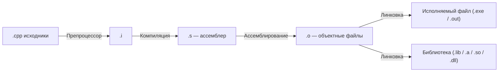

> **Главный автор:** Вадим Христенко  
> **Другие авторы:** —  
> **Последнее обновление:** 2025-10-11  
> **Ссылка на обсуждение:** [Чат в Telegram](https://t.me/ru_cpp_beginners)  
> _Комментарий:_ ЧаВо по C++ для новичков.  
> _Теги:_ C++, основы, установка, первый пример, советы

# Что такое C++ — простыми словами {id: "what_is_cpp"}

C++ — это мощный и быстрый язык общего назначения. Он позволяет очень точно управлять ресурсами (памятью, временем CPU), поэтому используется там, где критичны скорость и эффективность: игровые движки, графика, операционные системы, базы данных, драйверы, высоконагруженные сетевые сервисы, встраиваемые устройства.

Если коротко: C++ сочетает процедурный стиль (как в C) и объектно‑ориентированное программирование, поддерживает шаблоны (generics), RAII (управление ресурсами через объекты), а также современные стандарты (C++11/14/17/20/23). Для старта важно понять, как код превращается в программу и как этот код писать, собирать и отлаживать.

## Кому он нужен {id: "who_needs_cpp"}

- Разработчикам игр и графики (движки, рендеринг).
- Разработчикам системного софта (операционные системы, драйверы).
- Встраиваемым системам и IoT (когда важны скорость и ограниченные ресурсы).
- В проектах, где нужна высокая производительность (файловые системы, базы данных, сети).

> Современный C++ стал сильно удобнее после C++11: авто‑вывод типов (`auto`), умные указатели, range‑for, лямбды, `std::thread`, `std::chrono`, и многое другое.

---

## Как код превращается в программу {id: "how_build_works"}

Под капотом ваш код проходит несколько шагов. Это важно, чтобы понимать ошибки компоновки, что такое заголовки и почему «нашёлся символ/не нашёлся символ».



- Препроцессор разворачивает `#include`, макросы и условную компиляцию.
- Компилятор переводит C++ в ассемблер.
- Ассемблер создаёт объектные файлы.
- Линковщик склеивает объектные файлы и библиотеки в итоговый бинарник.

Отсюда практический совет: объявление функций/классов кладём в заголовки (`.h/.hpp`), реализацию — в `.cpp`. Несколько `.cpp` можно собрать в один `.exe`.

## Коротко о синтаксисе {id: "cpp_syntax"}

Базовые кирпичики языка:

- Переменные и типы: `int x = 10;`, `double`, `bool`, `std::string` и т.д.
- Управляющие конструкции: `if/else`, `switch`, `for/while`, `range-for`.
- Функции: принимают значения, ссылки (`T&`), константные ссылки (`const T&`).
- Указатели (`T*`) и ссылки (`T&`) — важно понять разницу.
- Классы и объекты, конструкторы/деструкторы, инкапсуляция.
- Шаблоны и стандартная библиотека (STL): контейнеры и алгоритмы.
- RAII: ресурсы под контролем объектов (закрыть файл, освободить память и т.д.).

## Базовые типы {id: "basic_types"}

Ниже — компактное описание базовых скалярных типов в C++. Заметьте, размеры и диапазоны зависят от платформы и компилятора; указанные значения — типичные для 64-битных систем (LP64).

| Тип | Описание | Типичный размер |
|-----|----------|-----------------|
| `bool` | Логический тип (true/false) | 1 байт |
| `char` / `signed char` / `unsigned char` | Символьные/байтовые типы | 1 байт |
| `short` / `short int` | Короткое целое | 2 байта |
| `int` | Целое (обычный) | 4 байта |
| `long` / `long int` | Длинное целое | 8 байт (на LP64) |
| `long long` | Очень длинное целое | 8 байт |
| `float` | 32‑битное число с плавающей точкой | 4 байта |
| `double` | 64‑битное число с плавающей точкой | 8 байт |
| `long double` | Расширенная точность (платформенно-зависимо) | 8/16 байт |
| `size_t` | Беззнаковый тип для размеров/индексов | 8 байт (на 64‑бит) |
| `wchar_t` / `char16_t` / `char32_t` | Широкие/Unicode символы | зависит |
| `int8_t`/`uint64_t` (из `<cstdint>`) | Фиксированной ширины | ровно N бит |

Диапазон знаковых целых для $N$ бит:

$$
\text{Диапазон знакового } N\text{-битного целого} = -2^{N-1}\dots 2^{N-1}-1
$$

Например, для 32-битного `int` (N=32): $-2^{31}\dots 2^{31}-1$.

Примеры работы с типами и `sizeof`:

```cpp
#include <iostream>
#include <type_traits>

int main() {
    std::cout << "sizeof(bool) = " << sizeof(bool) << "\n";
    std::cout << "sizeof(int) = " << sizeof(int) << "\n";
    std::cout << "sizeof(long) = " << sizeof(long) << "\n";
    std::cout << "sizeof(void*) = " << sizeof(void*) << " (указывает на разрядность платформы)\n";

    // Использование unsigned для счётчиков/индексов
    unsigned int u = 10u;
    std::cout << "u = " << u << "\n";
    return 0;
}
```

Указатели и ссылки:

- Указатель `T*` хранит адрес объекта типа `T`. Его размер равен размеру `void*` платформы (обычно 8 байт на 64‑бит).
- Ссылка `T&` — это псевдоним для существующего объекта; ссылки не имеют отдельного размера в синтаксисе и используются как безопасный способ передать объект по ссылке.

Пример с указателями и ссылками:

```cpp
#include <iostream>

int main() {
    int x = 42;
    int* p = &x;    // указатель
    int& r = x;     // ссылка

    std::cout << "x = " << x << ", *p = " << *p << ", r = " << r << "\n";
    *p = 100; // через указатель меняем значение
    std::cout << "x после изменения через p = " << x << "\n";
}
```

Строки и текст:

- В C++ есть `std::string` (удобный класс для работы со строками) и C-строки (`char*`, `const char*`).

Пример `std::string`:

```cpp
#include <iostream>
#include <string>

int main() {
    std::string s = "Привет, C++";
    std::cout << s << "\n";
}
```

Замечание: современные руководства рекомендуют по возможности использовать типы из `<cstdint>` (например, `int32_t`, `uint64_t`) когда важна точная ширина типов.

---

## Что нужно для начала {id: "what_needed_to_start"}

1. Компилятор: g++ (part of GCC), clang/clang++, или Microsoft Visual C++ (MSVC).
2. Текстовый редактор или IDE: VS Code, CLion, Visual Studio.
3. Терминал (командная строка) для компиляции и запуска.

Ниже — быстрые инструкции для Windows, macOS и Linux.

---

## Установка компилятора {id: "install_compiler"}

### Windows {id: "install_compiler_windows"}

- Рекомендуемый простой путь: установить MSYS2 (включает pacman и g++).
  1. Скачай MSYS2: [msys2.org](https://www.msys2.org/)  
  2. Следуй инструкциям установки, затем в MSYS2-консоли выполни:

    - Обновление пакетов: `pacman -Syu` (возможно перезапустить консоль и снова выполнить `pacman -Syu`)
    - Установка инструментов: `pacman -S --needed base-devel mingw-w64-x86_64-toolchain`

  3. После этого в консоли `mingw64` будут доступны g++ и make.

- Альтернатива: установить Visual Studio (Community) с компонентом "Desktop development with C++" — тогда доступен MSVC и IDE Visual Studio.

    Рекомендации для VS Code на Windows:

    - Поставь расширения: "C/C++" (Microsoft), "CMake Tools" (Microsoft), опционально "clangd".
    - Для MSYS2 можно использовать терминал MSYS2 MinGW 64-bit, либо настроить `cmake -G   "MinGW Makefiles"`.

### macOS {id: "install_compiler_macos"}

- Установи Xcode Command Line Tools (включает clang):
- В терминале: xcode-select --install
- После этого `clang++` доступен как компилятор.

### Linux (Ubuntu / Debian) {id: "install_compiler_linux"}

- Установи g++: sudo apt update && sudo apt install build-essential
- Пакет `build-essential` содержит g++, gcc, make и нужные заголовки.

Другие дистрибутивы: используй родной пакетный менеджер (dnf, pacman, zypper и т.д.) и установи gcc/g++.

---

## Первый пример: Hello, world! {id: "first_example"}

Создай файл `hello.cpp` с таким содержимым:

```cpp
#include <iostream>

int main() {
    std::cout << "Hello, world!" << std::endl;
    return 0;
}
```

### Скомпилируй и запусти: {id: "compile_and_run_example"}

#### g++ (Linux / macOS / MSYS2) {id: "g++_example"}

- Сборка: `g++ -std=c++17 hello.cpp -O2 -o hello`
- Запуск: `./hello`

#### clang++ (macOS or Linux) {id: "clang++_example"}

- Сборка: `clang++ -std=c++17 hello.cpp -O2 -o hello`
- Запуск: `./hello`

#### MSVC (Visual Studio Developer Command Prompt) {id: "msvc_example"}

- Сборка: `cl /EHsc hello.cpp`
- Запуск: `hello.exe`

### Советы: {id: "compilation_tips_for_example"}
- `-std=c++17` указывает стандарт C++ (можно заменить на c++20 и т.д.).
- `-O2` включает оптимизации; при отладке используйте `-O0 -g`.

> В Windows для MSYS2 команды выполняются в консоли MSYS2 MinGW 64-bit, а не в PowerShell. Для MSVC — в "x64 Native Tools Command Prompt for VS".

## Как организовать проект {id: "project_structure"}
- Для простых программ хватит одного `.cpp` файла.
- Для более сложных проектов используют сборщики(системы): CMake, Make, Meson.
- Рекомендуем CMake — он кроссплатформенный и широко используется. Простой пример CMakeLists.txt можно найти в интернете.

## Основы: переменные, ветвления, циклы {id: "basics_control_flow"}

Пример мини‑программы с вводом/выводом, условиями и циклами:

```cpp
#include <iostream>
#include <vector>

int main() {
    std::cout << "Сколько чисел сложить? ";
    int n; std::cin >> n;
    if (n <= 0) {
        std::cout << "Нечего складывать\n";
        return 0;
    }

    std::vector<int> a(n);
    for (int i = 0; i < n; ++i) {
        std::cin >> a[i];
    }

    long long sum = 0;
    for (int x : a) sum += x; // range-for

    std::cout << "Сумма = " << sum << "\n";
}
```

Ключевые моменты:
- `std::cin`/`std::cout` — ввод/вывод.
- `std::vector<T>` — динамический массив.
- `range-for` перебирает элементы: `for (auto x : vec)`.

## Функции и параметры {id: "functions_and_params"}

Способы передачи аргументов:

```cpp
#include <string>

// По значению (копия)
int twice(int x) { return 2 * x; }

// По ссылке (можно менять аргумент)
void push_back_exclaim(std::string& s) { s += "!"; }

// По константной ссылке (без копии, но без изменений)
int length(const std::string& s) { return (int)s.size(); }
```

Выбор:
- Небольшие типы (как `int`, `double`) — обычно по значению.
- Крупные объекты (`std::string`, векторы) — по `const&` для чтения, по `&` для изменения.

## Классы, RAII и умные указатели {id: "classes_raii_smart_ptr"}

RAII (Resource Acquisition Is Initialization) — ресурс принадлежит объекту, освобождается в деструкторе автоматически.

```cpp
#include <fstream>
#include <string>

struct Writer {
    std::ofstream out;
    explicit Writer(const std::string& path) : out(path) {}
    ~Writer() { /* out.close() вызовется сам в деструкторе */ }
    void write_line(const std::string& s) { out << s << '\n'; }
};

int main() {
    Writer w("log.txt");
    w.write_line("Hello"); // файл закроется автоматически при выходе из main
}
```

Для динамической памяти используйте умные указатели:

```cpp
#include <memory>

struct X { int v = 0; };

int main() {
    auto p = std::make_unique<X>(); // уникальное владение
    p->v = 42;

    std::shared_ptr<X> sp1 = std::make_shared<X>(); // разделяемое владение
    auto sp2 = sp1; // счётчик ссылок увеличится
}
```

> Правило нуля: по возможности не управляйте памятью вручную, используйте контейнеры/умные указатели. Код короче и безопаснее.

## Исключения и обработка ошибок {id: "exceptions"}

```cpp
#include <stdexcept>

int safe_div(int a, int b) {
    if (b == 0) throw std::runtime_error("division by zero");
    return a / b;
}
```

Практика:
- Бросайте исключения в действительно исключительных ситуациях.
- Для частых ошибок рассмотрите `std::optional`, `expected` (C++23/библиотеки), коды возврата.

## Шаблоны, контейнеры и алгоритмы STL {id: "templates_stl"}

```cpp
#include <algorithm>
#include <iostream>
#include <string>
#include <vector>

int main() {
    std::vector<std::string> names = {"Ann", "Bob", "Cathy"};
    std::sort(names.begin(), names.end());
    for (const auto& s : names) std::cout << s << '\n';
}
```

Полезные контейнеры: `std::vector`, `std::array`, `std::string`, `std::map`, `std::unordered_map`, `std::set`.
Полезные алгоритмы: `std::sort`, `std::find`, `std::accumulate`, `std::transform`.

---

## Минимальный CMake-проект {id: "cmake_quickstart"}

Структура:

```
project-root/
  CMakeLists.txt
  src/
    main.cpp
```

`CMakeLists.txt`:

```cmake
cmake_minimum_required(VERSION 3.16)
project(hello_cpp LANGUAGES CXX)

set(CMAKE_CXX_STANDARD 17)
set(CMAKE_CXX_STANDARD_REQUIRED ON)

add_executable(hello src/main.cpp)
```

`src/main.cpp` — обычный `main`.

Сборка:

- MSYS2/Unix‑подобные:
  - `cmake -S . -B build -G "Unix Makefiles"`
  - `cmake --build build --config Release`
- MinGW в Windows:
  - `cmake -S . -B build -G "MinGW Makefiles"`
  - `cmake --build build --config Release`
- Visual Studio (MSVC):
  - `cmake -S . -B build -G "Visual Studio 17 2022" -A x64`
  - `cmake --build build --config Debug`

Запуск: `./build/hello` (или `build/Debug/hello.exe` для VS).

---

## Отладка и инструменты {id: "tools"}

- Отладчики: gdb (Linux), lldb (macOS), встроенный в Visual Studio (Windows), расширения VS Code.
- Санитайзеры (GCC/Clang):
  - AddressSanitizer: `-fsanitize=address -fno-omit-frame-pointer`
  - UndefinedBehaviorSanitizer: `-fsanitize=undefined`
  - ThreadSanitizer: `-fsanitize=thread`
- Статический анализ: `clang-tidy`, `cppcheck`.
- Форматирование: `clang-format` (конфиг `.clang-format`).

Пример команд (GCC/Clang):

```
g++ -std=c++20 -O0 -g -fsanitize=address main.cpp -o app
./app
```

В Windows с MSVC используйте встроенный отладчик Visual Studio; для санитайзеров — LLVM toolchain под Windows или MSYS2/MinGW.

---

## Частые ошибки и подводные камни {id: "pitfalls"}

- Неинициализированные переменные: всегда инициализируйте.
- Висячие ссылки/указатели: не возвращайте ссылку на локальную переменную.
- Переполнение со знаком: поведение неопределено для `signed`.
- Неверная работа со строками C‑style (`char*`): предпочитайте `std::string`.
- Ручная память без нужды: используйте контейнеры/умные указатели.
- Нарушение правил владения: один ресурс — один владелец (`unique_ptr`).

Пример UB (делать нельзя):

```cpp
int& bad() {
    int x = 42;
    return x; // возврат ссылки на разрушенный объект
}
```

---

## Мини‑упражнения для практики {id: "exercises"}

1) Считать N, затем N чисел и вывести максимум.  
2) Функция `is_prime(int)`: вернуть `true`/`false`.  
3) Прочитать слова до EOF и вывести их по алфавиту (использовать `std::vector<std::string>` и `std::sort`).  
4) Класс `Timer`, который в деструкторе печатает, сколько миллисекунд он прожил (использовать `std::chrono`).  
5) Переписать код с «сырыми» указателями на `std::unique_ptr`.

Ожидаемые результаты: корректная работа на базовых тестах, отсутствие утечек, читаемый код.

---

# Небольшой глоссарий {id: "glossary"}

- Компилятор — программа, переводящая исходники в машинный код.
- Линковщик (linker) — склеивает объектные файлы и библиотеки в бинарник.
- Заголовок (header) — файл с объявлениями (`.h/.hpp`).
- Объектный файл (`.o/.obj`) — результат компиляции одного модуля.
- Библиотека — набор объектных файлов: статическая (`.a/.lib`) или динамическая (`.so/.dll`).
- RAII — владение ресурсом объектом; освобождение в деструкторе.
- STL — стандартная библиотека шаблонов: контейнеры, алгоритмы и т.д.
- UB (Undefined Behavior) — неопределённое поведение, результат не предсказан стандартом.

---

# Частые вопросы (FAQ) {id: "faq"}

- Какой стандарт выбрать?  
  Начните с C++17 или C++20. Если доступен C++23 — ещё лучше, но он новее.

- GCC, Clang или MSVC?  
  Все хорошие. На Windows проще стартовать с MSVC или MSYS2+GCC.

- Почему "не найден символ" при линковке?  
  Объявление есть, реализации нет, или забыли добавить `.cpp` в сборку, или не подключили нужную библиотеку.

- Когда использовать исключения?  
  Для редких исключительных ситуаций. Для управления потоком — не стоит.

- Всегда ли нужны умные указатели?  
  Да, когда есть динамическая память. Но сначала подумайте, можно ли обойтись без неё (контейнеры).

- Как ускорить сборку?  
  Предкомпилированные заголовки, единожды подключаемые хедеры, модульная сборка (C++20 modules — по мере доступности).

---

# Советы для новичка {id: "tips_for_beginners"}
- Начинай с маленьких программ и практикуйся ежедневно.
- Используй документацию и проверенные книги: «A Tour of C++» (Б. Страуструп), «Effective Modern C++» (С. Мейерс).
- Настрой автоформатирование `clang-format`.
- Учись отлаживать: точки останова, `step over/into`, просмотр переменных.
- Не бойся ошибок компилятора — читай их сверху вниз и исправляй по одному.

---

# Что дальше {id: "what_next"}

- Разобраться с классами глубже: правило нуля/пяти, перемещение (move semantics).
- Погрузиться в стандартные алгоритмы: `std::ranges` (C++20).
- Освоить CMake и структуру проектов, подключение библиотек.
- Попробовать санитайзеры и статический анализ.
- Написать 2–3 небольших проекта: консольный ToDo, парсер CSV, мини‑игру.
