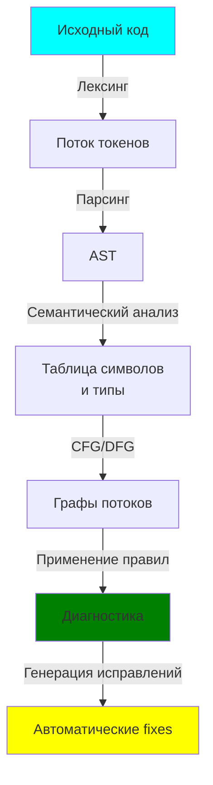
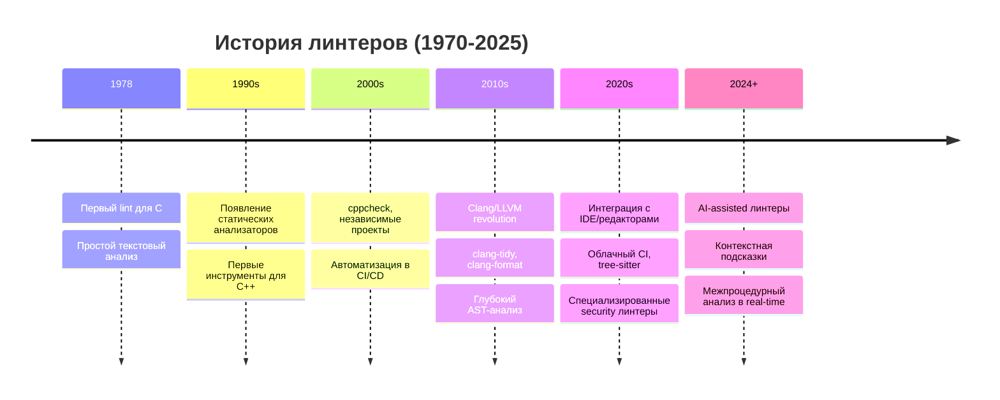
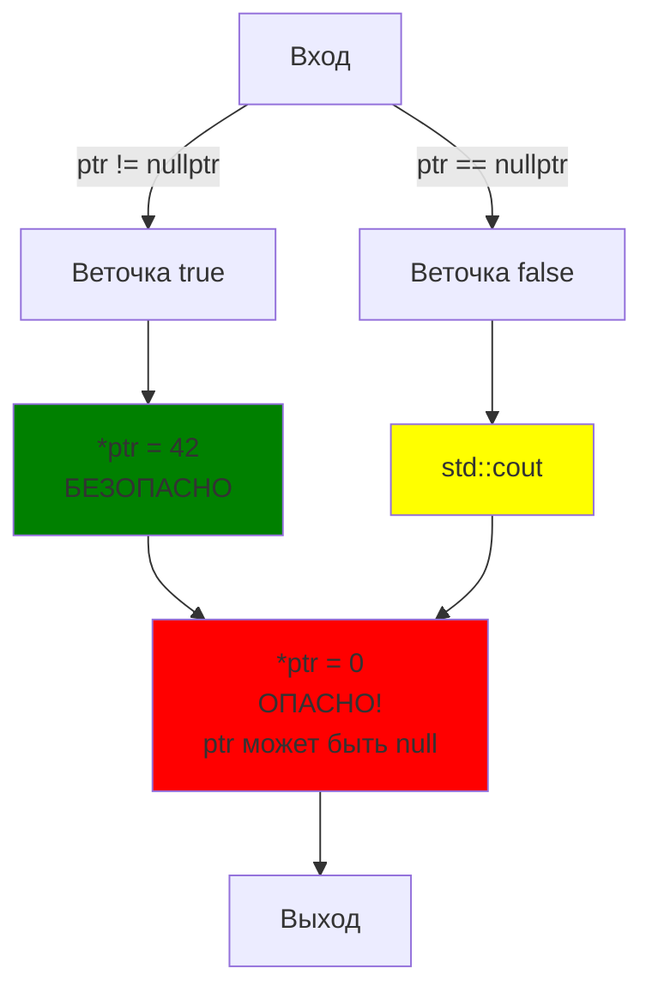
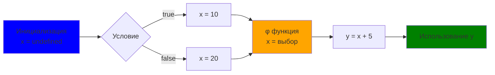
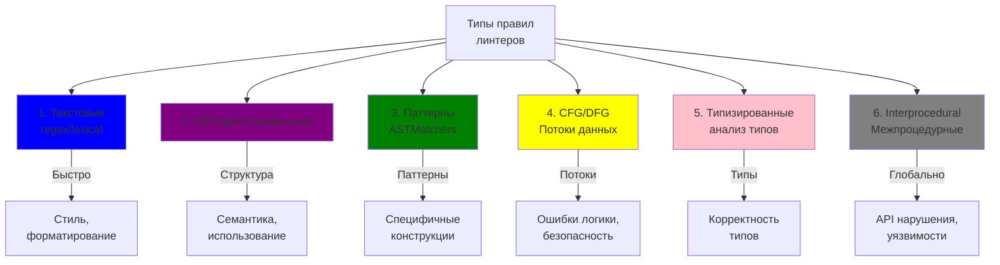
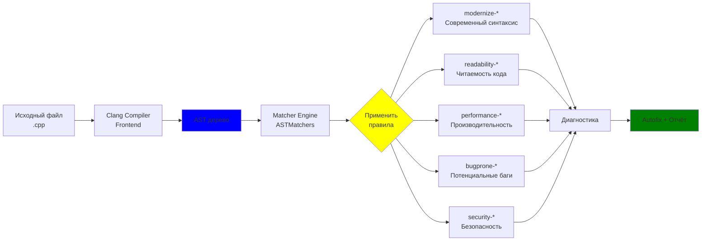
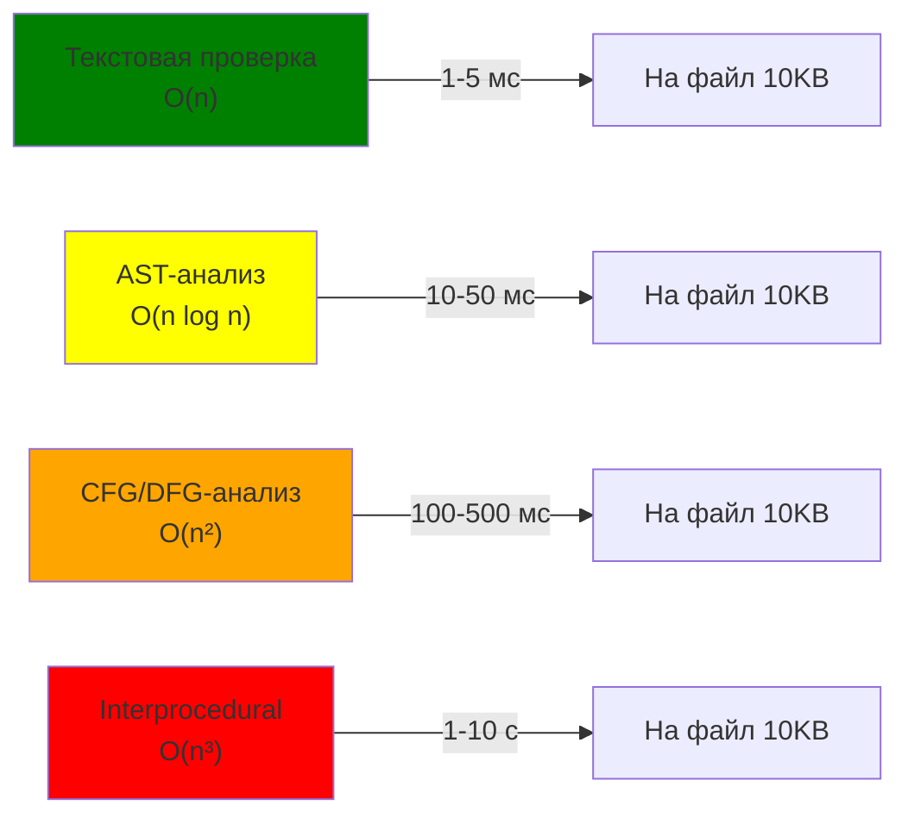
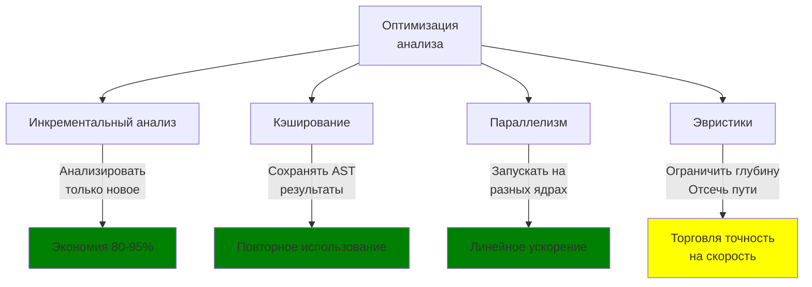
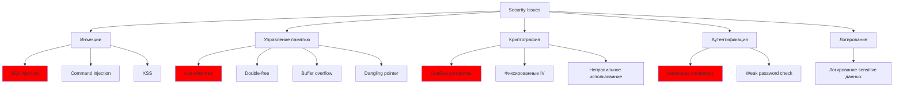

> **Главный автор:** Вадим Христенко  
> **Другие авторы:** —  
> **Последнее обновление:** 2025-10-27  
> **Ссылка на обсуждение:** [Чат в Telegram](https://t.me/ru_cpp_beginners)
> _Комментарий:_ ЧаВо по C++ для новичков.  
> _Теги:_ C++, основы, линтеры, качество кода, стиль кода

# Введение {id: "introduction"}

Линтеры — это инструменты, которые анализируют ваш код и помогают находить потенциальные ошибки, проблемы с производительностью и несоответствия стилю кодирования. Они могут работать как в режиме реального времени (например, в редакторах кода), так и в виде отдельных утилит, которые вы запускаете на своем коде.

Термин "lint" произошел от названия первой утилиты для C (1978, Bell Labs). Изначально это был простой текстовый анализатор, но с развитием инструментов линтеры превратились в мощные системы анализа, использующие полное синтаксическое дерево (AST), графы потоков управления (CFG) и анализ потоков данных (DFG).

**Использование линтеров позволяет:**

- 🐛 **Снижать количество ошибок и багов** — обнаружение проблем на этапе разработки вместо production
- 🎨 **Поддерживать единый стиль** кодирования в команде и долгосрочную поддерживаемость
- ⚡ **Ускорять процесс ревью кода** — автоматизация повторяющихся проверок
- 📚 **Повышать качество и читаемость** кода через обучение лучшим практикам
- 🔒 **Предотвращать уязвимости** — раннее обнаружение потенциально опасных конструкций
- ⏱️ **Экономить время** — быстрая обратная связь прямо в редакторе вместо ожидания CI

В этом гайде мы глубоко разберемся, как устроены линтеры, как использовать их в ваших проектах на C++, и даже как писать собственные правила.

## Что будет в этом гайде

Это всёобъёмлющий материал о линтерах: от базовой идеи до того, что происходит "под капотом", какие алгоритмы и представления кода используются, как писать и тестировать свои правила, как интегрировать линтеры в редакторы и CI, а также практические советы и источники.

## Краткий контракт (что даёт этот гайд)

- Вход: исходный код проекта (C++, но большинство идей универсальны).
- Выход: понимание архитектуры линтеров, примеры правил, конфигураций, и план для создания собственного линтера.
- Ограничения: глубокие реализации (полные движки) опущены; даются практические рецепты и ссылки.

## Быстрый обзор — типы инструментов {id: "overview"}

Перед тем как погружаться в детали, важно понимать, какие категории инструментов существуют:

| Инструмент | Назначение | Пример | Использует |
|:---|:---|:---|:---|
| **Форматтер** | Приводит код к единому стилю | clang-format, prettier | Синтаксис, не семантику |
| **Линтер** | Правило-ориентированные проверки | clang-tidy, cpplint | AST, токены |
| **Статический анализатор** | Поиск ошибок и UB | cppcheck, Coverity | AST, CFG, DFG |
| **Компилятор с проверками** | Встроенные проверки | GCC -Wall -Wextra | Компиляторный IR |
| **Специализированный анализатор** | Узконаправленные проверки | Clang Address Sanitizer | Инструментирование, runtime |

> **Примечание:** границы размыты — clang-tidy одновременно линтер и статический анализатор, предоставляя autofix и работая с AST.



---


## 1. Основные идеи и мотивация {id: "main_ideas"}

Почему линтеры нужны кроме "красоты" кода — это вопрос, который часто недооценивают. Ниже расширённое объяснение с историей и практическими примерами, чтобы даже новичку стало ясно, зачем всё это нужно.

### Краткая история линтеров {id: "history"}

Термин "lint" произошел от названия первой утилиты для C — **lint**, созданной **Стивеном Джонсоном** (Stephen C. Johnson) в **Bell Labs в конце 1970-х годов**. Первые инструменты были простыми: они искали потенциальные ошибки и подозрительные конструкции в тексте исходников.

**Эволюция линтеров:**



**Ключевые вехи:**

- **1970-е** — текстовые/лексические проверки для языка C (оригинальный `lint`)
- **1990-е** — появление более сложных статических анализаторов (компьютерные фундаменты безопасности)
- **2000-е** — независимые проекты (`cppcheck`), массовое внедрение в CI/CD пайплайны
- **2010-е** — революция **Clang/LLVM**: впервые полноценный компиляторный AST стал доступен для инструментов
- **2020-е** — интеграция в IDE, облачные решения, специализированные security-focused линтеры
- **2024+** — появление AI-assisted инструментов с контекстным анализом

С точки зрения архитектуры, эволюция шла от **текстовых проверок** → **синтаксическому анализу** → **семантическому анализу** → **графо-ориентированным представлениям** (CFG, DFG) → **машинному обучению и контексту**.


### Почему это важно (глубже) {id: "why"}

- Быстрый feedback. Подумайте: вместо того, чтобы ждать CI-пайплайн или ручного ревью, вы получаете подсказку прямо в редакторе — это экономит часы на отладку.
- Снижение количества ошибок. Простые ошибки (опечатки, пропущенные return, неинициализированные переменные) часто стоят дорого, если находить их после релиза.
- Поддерживаемость. Единый стиль и правила облегчают чтение кода другим людям и будущему вам.
- Безопасность. Многие уязвимости можно обнаружить статически (например, небезопасные API, возможные переполнения буфера).
- Обучение. Для новичка линтер работает как наставник — показывает лучшие практики и объясняет, почему что-то плохо.

Ключевая идея: код — это текст, но для большинства полезных проверок его нужно представить не просто как строки, а как структурированное представление (AST, CFG, DFG). Линтеры делают этот перевод и затем применяют правила к структуре.

---

---


## 2. Что происходит «под капотом» — основные ступени {id: "pipeline"}

Ниже — упрощённая, но практичная и подробная схема обработки кода линтером. Для новичка важно понять, какие данные на каком этапе формируются и какие проверки можно выполнять на каждом из уровней.

### Общая архитектура анализатора кода


**Сложность анализа на разных уровнях:**

$$
\text{Сложность} = \begin{cases}
O(n) & \text{для лексинга} \\
O(n \log n) & \text{для парсинга} \\
O(n^2) & \text{для семантического анализа} \\
O(n^3) & \text{для interprocedural анализа}
\end{cases}
$$

где $n$ — количество элементов (токенов, узлов, процедур).

### 1) Лексинг (tokenization) {id: "lexing"}

**Что это:** преобразование текста в поток токенов — минимальных смысловых единиц (идентификаторы, ключевые слова, числа, строки, скобки и т.д.).

**Зачем нужен:** если ваша проверка касается именно текста (например, пробелы, табы, длина строки, комментарии), лексинг даёт всю нужную информацию и работает очень быстро.

**Как реализуется:** обычно с помощью регулярных выражений или небольшого конечного автомата; многие парсеры сначала делают лексинг, затем парсинг.

**Пример:** правило "не должно быть trailing whitespace (пробелов в конце строки)" не требует полного парсинга — достаточно провести лексический проход или даже текстовый поиск.

Ограничения: лексинг не даёт структуры программы — он не скажет, где начинается функция или какой тип у переменной.

### 2) Парсинг -> AST (Abstract Syntax Tree) {id: "ast"}

**Что это:** сборка токенов в дерево, которое отражает структуру программы — выражения, операторы, объявления, блоки.

**Зачем нужен:** AST даёт возможность понимать семантику кода: какие есть функции, какие выражения, где находятся вызовы и т.д. Большинство стилевых и семантических правил работают по AST.

**Как реализуется:** существуют генераторы парсеров (ANTLR, Bison) и готовые парсеры (Clang для C/C++). Парсер строит дерево, где каждый узел имеет тип (if-statement, function-decl, call-expr и т.д.).

**Пример:** правило "вызов функции strcpy" удобней искать по AST (по узлу call-expression с именем функции), а не по простому текстовому совпадению.

**Ограничения:** для корректного построения AST иногда нужен полноценный контекст компиляции (include, определения типов).

### 3) Семантический анализ и symbol table {id: "semantic"}

**Что это:** этап, на котором инструмент пытается разрешить имена и типы — понять, какая именно функция или переменная используется.

**Зачем нужен:** без разрешения имён легко получить ложные срабатывания — например, есть несколько функций с именем foo в разных пространствах имён.

**Как реализуется:** строится таблица символов (symbol table), связываются обращения с их объявлениями, выполняется проверка типов.

**Пример:** правило, которое проверяет корректность типов аргументов у функции, требует семантического анализа.

**Ограничения:** семантика требует доступа к include-файлам и иногда к компиляционным флагам (для C++), поэтому некоторые линтеры получают конфигурацию компиляции (-p для clang-tidy).

### 4) Построение CFG (Control Flow Graph) {id: "cfg"}

**Что это:** представление возможных путей выполнения программы в виде графа — узлы это базовые блоки команд, рёбра — переходы.

**Зачем нужен:** нужен для анализа поведения программы при разных путях исполнения — например, чтобы понять, может ли указатель быть null в точке использования.

**Как реализуется:** строится по AST/IR — каждый условный оператор, цикл и переходы превращаются в ребра графа.

**Пример:** правило "возможный null-dereference (нулевой указатель)" будет смотреть на все пути, ведущие к точке использования указателя.

**Ограничения:** CFG полезен для локального анализа; для межпроцедурного анализа требуется расширение графа через вызовы функций.

**Пример CFG для условного оператора:**

```cpp
// Исходный код
if (ptr != nullptr) {
    *ptr = 42;      // Безопасно
} else {
    std::cout << "null ptr";
}
*ptr = 0;           // Потенциально опасно!
```



**Мультипараметрический анализ путей:**

Когда CFG имеет циклы и множество условий, количество путей может экспоненциально расти:

$$\text{Макс. количество путей} = 2^{\text{количество условий}}$$

Для реальных программ это приводит к "взрыву состояний" (state explosion), поэтому используют:
- Эвристики для отсечения маловероятных путей
- Абстрактную интерпретацию (abstract interpretation)
- Ограничение глубины анализа

### 5) Data Flow Analysis (DFG) / SSA {id: "dataflow"}

**Что это:** анализ того, как данные (значения переменных) текут по программе; **SSA** (Static Single Assignment) — представление, где каждая переменная присваивается ровно один раз, что упрощает анализ.

**Зачем нужен:** чтобы отслеживать, откуда пришло значение, возможно ли использование неинициализированного значения, есть ли утечка ресурса и т.д.

**Как реализуется:** строятся таблицы определения/использования (def-use), вычисляются живости переменных, строится SSA при необходимости.

**Пример:** проверка "использование переменной до инициализации" требует dataflow-анализа.

**Ограничения:** дорого по ресурсам; иногда прибегают к эвристикам, чтобы ускорить анализ на больших кодовых базах.

**Пример SSA преобразования:**

```cpp
// Оригинальный код
int x;
if (cond) {
    x = 10;
} else {
    x = 20;
}
int y = x + 5;
```

```
// SSA форма
x0 = undefined
if (cond) {
    x1 = 10
} else {
    x2 = 20
}
x3 = φ(x1, x2)  // phi-функция выбирает нужное значение
y = x3 + 5
```

**Граф потоков данных (Data Dependency Graph):**



**Анализ на основе lattice:**

$$\text{State} = \text{Domain} \rightarrow \text{Values}$$

где Domain может быть:
- Null/Non-null (для проверки null dereference)
- $[0, \infty)$ (для диапазонов индексов)
- Инициализировано/Не инициализировано (для use-before-init)

### 6) Трансформации и правила {id: "rules_stage"}

**Что это:** собственно этап применения наборов правил — сопоставление паттернов, вычисление предупреждений и подготовка возможных исправлений.

**Зачем нужен:** это сердце линтера — место, где формулируются конкретные проверки: от простых стилевых до сложных семантических.

**Как реализуется:** правило формулируется в терминах AST/CFG/DFG (или комбинации) и применяется на каждой релевантной части дерева/графа.

**Пример:** правило может искать вызовы устаревшей функции и предлагать заменить её на новую. Если возможно безопасное исправление, формируется patch.

**Ограничения:** качество правил и их точность сильно влияют на практическую полезность линтера.

### 7) Отчётность / интеграция {id: "reporting"}

**Что это:** сбор и выдача результатов — предупреждения, ошибки, предлагаемые autofix'ы, ссылки на документацию правила.

**Зачем нужен:** разработчики должны получить понятные сообщения с указанием файла, строки, описанием проблемы и, по возможности, решением.

**Как реализуется:** генерация форматов вывода (plain text, JSON, SARIF), интеграция с редакторами (LSP), CI и прочими инструментами.

**Пример:** clang-tidy может выводить результаты в формате, который понимает IDE, и автоматически подсвечивать место проблемы.

**Ограничения:** важно давать понятные сообщения и классифицировать серьёзность (error/warning/info).

---

## 3. Типы правил и техники их реализации {id: "rules"}

В этой секции для каждого типа правила даю подробное объяснение — что это, когда применять, пример и типичные ошибки/падения (false positives).

### Матрица типов правил



### 1) Правила на основе текста (regex/lexical) {id: "text_rules"}

**Описание:** операции на уровне строки/токенов без построения полной семантики. Быстрые и дешёвые.

**Когда использовать:** для проверок форматирования и простых конвенций — пробелы, табуляции, длина строк, формат комментариев и TODO меток.

**Пример реализации:** простая проверка длины строки — читаем файл построчно, проверяем `len(line)` и выдаём предупреждение если > 120.

**Типичные ложные срабатывания:** генераторы кода могут генерировать длинные строки — обычно такие файлы исключают из линтинга.

**Инструменты:** простые скрипты, grep, регулярки, специализированные линтеры для форматирования.

**Пример проверки на C++:**

```cpp
// ❌ ПЛОХО - trailing whitespace
int x = 5;   

// ✓ ХОРОШО
int x = 5;
```

**Regex для проверки:**
```regex
^\s+$|[ \t]+$
```

---

### 2) Правила на основе AST {id: "ast_rules"}

**Описание:** правила, использующие синтаксическое дерево — понимают структуру программы.

**Когда использовать:** когда нужно понимать, где начинается функция, где объявлена переменная, какие есть выражения.

**Пример:** проверка неиспользуемых переменных — AST позволяет найти объявление переменной и проверить, есть ли по дереву её использования.

**Типичные сложности:** C++ с шаблонами и макросами может усложнять AST, поэтому нужны дополнительные проверки.

**Инструменты:** Clang AST, LibTooling, tree-sitter (с более простым деревом) и другие парсеры.

**Пример проверки:**

```cpp
// ❌ ПЛОХО - неиспользуемая переменная
void foo() {
    int unused_var = 42;  // Warning: unused variable
    std::cout << "Hello";
}

// ✓ ХОРОШО
void foo() {
    std::cout << "Hello";
}

// ✓ ХОРОШО - используется
void foo() {
    int used_var = 42;
    std::cout << used_var;
}
```

---

### 3) Правила на основе паттернов/сопоставлений (AST matchers) {id: "matchers"}

**Описание:** декларативный способ описать паттерн в AST — например, "вызов функции с именем X" или "присваивание в теле цикла".

**Когда использовать:** удобно описывать шаблоны кода, которые считаются плохими.

**Пример:** с помощью Clang ASTMatchers можно написать выражение, которое найдёт все вызовы `strcpy` и затем выдаст подсказку заменить на `strncpy`.

**Типичные ложные срабатывания:** если имя функции переопределено в другом пространстве имён, может потребоваться семантическая проверка.

**Инструменты:** Clang ASTMatchers, libclang, tree-sitter + сопоставители.

**Пример проверки:**

```cpp
// ❌ ОПАСНО - буферное переполнение
void unsafe_copy(const char* src) {
    char dest[10];
    strcpy(dest, src);  // WARNING: Use of unsafe strcpy
}

// ✓ БЕЗОПАСНО - с проверкой размера
void safe_copy(const char* src) {
    char dest[10];
    strncpy(dest, src, sizeof(dest) - 1);
    dest[sizeof(dest) - 1] = '\0';
}

// ✓ ЛУЧШЕ ВСЕГО - используйте std::string
void best_copy(const char* src) {
    std::string dest = src;
}
```

**Clang ASTMatcher паттерн (pseudocode):**
```cpp
// Найти вызовы strcpy
auto Matcher = callExpr(
    callee(functionDecl(hasName("strcpy")))
).bind("call");
```

---

### 4) Dataflow/CFG-based правила {id: "dfg_rules"}

**Описание:** правила, которые используют контроль потока и поток данных для вывода о возможных состояниях программы (null, диапазон индексов и т.д.).

**Когда использовать:** для проверки потенциальных ошибок, зависящих от порядка выполнения (null-deref, use-after-free, утечки).

**Пример:** отслеживание, где ресурс выделяется и где освобождается — если есть путь, где освобождение пропущено, линтер выдаст предупреждение.

**Типичные трудности:** взрывное увеличение состояния (combinatorial explosion) при анализе всех путей; применяют эвристики.

**Инструменты:** собственные реализации анализа потоков, LLVM IR анализ, специализированные статические анализаторы.

**Пример проверки null-dereference:**

```cpp
// ❌ ОПАСНО - возможна разыменовка nullptr
void process(const char* ptr) {
    if (ptr == nullptr) {
        std::cout << "null pointer\n";
    }
    printf("%s\n", ptr);  // WARNING: possible null dereference
}

// ✓ ХОРОШО - правильная обработка
void process(const char* ptr) {
    if (ptr == nullptr) {
        return;
    }
    printf("%s\n", ptr);
}

// ✓ ХОРОШО - используйте optional
void process(std::optional<const char*> ptr) {
    if (!ptr) {
        return;
    }
    printf("%s\n", ptr.value());
}
```

---

### 5) Типизированные правила / анализ типов {id: "typed"}

**Описание:** правила, которые опираются на информацию о типах (например, шаблоны, наследование, преобразования типов).

**Когда использовать:** когда нужно удостовериться в корректности преобразований типов, шаблонных конструкций, перегрузок.

**Пример:** проверка небезопасных преобразований или операций, которые могут вызвать UB при определённых типах.

**Типичные сложности:** в C++ сложная система типов (шаблоны, SFINAE), поэтому такие правила требуют глубокого понимания языка.

**Инструменты:** компиляторные AST (Clang), системы типов и type-checkers.

**Пример проверки:**

```cpp
// ❌ ОПАСНО - небезопасное приведение типов
void bad_cast(const Base* obj) {
    // static_cast может привести к UB если obj не Base
    Derived* d = static_cast<Derived*>(const_cast<Base*>(obj));
}

// ✓ ХОРОШО - безопасное приведение
void good_cast(const Base* obj) {
    if (auto* d = dynamic_cast<Derived*>(const_cast<Base*>(obj))) {
        // Используем d безопасно
    }
}

// ✓ ХОРОШО - проектирование типов
template<typename T>
void template_safe(T value) {
    static_assert(std::is_integral_v<T>, "T должен быть интегральным типом");
}
```

---

### 6) Interprocedural анализ {id: "interprocedural"}

**Описание:** анализ, который учитывает переходы между функциями и модулями — как данные и состояния передаются через вызовы.

**Когда использовать:** когда ошибка проявляется не локально, а через последовательность вызовов в разных файлах (например, неправильный порядок вызовов API).

**Пример:** проверка, что объект создаётся и инициализируется перед использованием в другом модуле.

**Типичные проблемы:** требует больше памяти и времени; появляются сложности с динамическими вызовами и общими библиотеками.

**Инструменты:** межпроцедурные анализаторы в рамках Clang/LLVM, коммерческие SAST-инструменты.

**Пример проверки (API State Machine):**

```cpp
// ❌ ОПАСНО - неправильный порядок вызовов
class Socket {
    FILE* file;
public:
    void open(const char* path);
    void write(const char* data);
    void close();
};

void bad_usage() {
    Socket s;
    s.write("data");  // WARNING: open() not called first
    s.close();
}

// ✓ ХОРОШО - правильный порядок
void good_usage() {
    Socket s;
    s.open("file.txt");
    s.write("data");
    s.close();
}

// ✓ ЛУЧШЕ ВСЕГО - RAII гарантирует
class SafeSocket {
public:
    SafeSocket(const char* path) { /* открыть */ }
    ~SafeSocket() { /* закрыть */ }
    void write(const char* data);
};

void best_usage() {
    SafeSocket s("file.txt");
    s.write("data");
    // Автоматическое закрытие в деструкторе
}
```


## 4. Примеры реальных линтеров и их архитектуры {id: "real_linters"}

| Инструмент | Язык | Фокус | Основано на | Autofix | Интеграция |
|:---|:---|:---|:---|:---:|:---|
| **clang-tidy** | C/C++ | Модернизация, стиль, ошибки | AST Clang | ✅ Да | VS Code, CLion, CI |
| **clang-format** | C/C++ | Форматирование | Парсер Clang | ✅ Да | Везде |
| **cppcheck** | C/C++ | UB, ошибки, производительность | Свой AST | ⚠️ Ограниченно | IDE, CI |
| **cpplint** | C++ | Google-стиль C++ | Регулярные выражения | ❌ Нет | CI/скрипты |
| **Infer** | Java, C, C++ | Nullness, утечки, race conditions | LLVM + dataflow | ❌ Нет | CI |
| **Clang Static Analyzer** | C/C++ | UB, утечки памяти, API нарушения | LLVM, CFG/DFG | ❌ Нет | Scan-build |

### clang-tidy — Детальный взгляд

**clang-tidy** — это яркий пример современного линтера. Вот его архитектура:



**Ключевые возможности:**

1. **ASTMatchers API** — удобный DSL для описания паттернов
2. **Incremental analysis** — анализ только изменённых файлов
3. **Configuration** — гибкая система конфигурирования правил
4. **Cross-compilation** — поддержка compilation database (compile_commands.json)

---

## 5. Производительность и масштабирование {id: "performance"}

### Сложность анализа



### Проблемы при масштабировании

**Когда линтер анализирует большой монорепозиторий (1M+ строк):**

1. **Взрыв памяти** — полные AST для всех файлов требует ГБ ОЗУ
2. **Экспоненциальный growth CFG** — циклы и условия создают экспоненциально много путей
3. **Interprocedural анализ** — требует инфо из других файлов и модулей

### Тактики оптимизации



---

## 6. Ложные срабатывания (false positives) {id: "false_positives"}

### Причины и способы их минимизации

| Причина | Пример | Решение |
|:---|:---|:---|
| Неполный контекст | Нет include-файлов | Передать compilation database |
| Макросы | Макрос генерирует код | Расширить макрос перед анализом |
| Шаблоны C++ | Специализация на runtime | Анализировать instantiation |
| Динамические вызовы | Виртуальные функции | Использовать type hierarchy |
| Общие библиотеки | Внешний код | Доверять библиотеке / разместить stubs |

### Механизмы подавления

```cpp
// В коде - явное подавление
// NOLINTNEXTLINE(google-explicit-constructor)
MyClass(int x);

// Или через // clang-tidy: -checks=...
void legacy_code() {
    // clang-tidy: -checks=-performance-avoid-endl
    std::cout << "old code" << std::endl;
}
```

`.clang-tidy` конфиг:
```yaml
Checks: |
  -*,
  clang-analyzer-*,
  modernize-*,
  performance-*,
  -performance-no-int-to-ptr
HeaderFilterRegex: 'src/.*'
```

---

## 7. Безопасность и специализированные security-линтеры {id: "security"}

### Категории уязвимостей, которые ловят линтеры



### Примеры проверок безопасности

```cpp
// ❌ SQL Injection - опасно!
void database_query(const std::string& user_input) {
    std::string query = "SELECT * FROM users WHERE id = " + user_input;
    db.execute(query);  // WARNING: potential SQL injection
}

// ✓ Используйте параметризованные запросы
void safe_query(const std::string& user_input) {
    db.execute("SELECT * FROM users WHERE id = ?", user_input);
}

// ❌ Hardcoded credentials
const char* PASSWORD = "secret123";  // WARNING: hardcoded secret

// ✓ Используйте переменные окружения
const char* password = std::getenv("DB_PASSWORD");

// ❌ Weak cryptography
openssl_encrypt_with_md5(...);  // WARNING: MD5 is deprecated

// ✓ Используйте SHA-256 или лучше
openssl_encrypt_with_sha256(...);
```


---

## 8. Практический гайд: настройка clang-tidy в проекте {id: "setup_guide"}

### Шаг 1: Установка

```bash
# Ubuntu/Debian
sudo apt-get install clang-tidy

# macOS
brew install clang-tools

# Windows (LLVM)
choco install llvm
```

### Шаг 2: Создание compilation database

Линтер нужна информация о компиляции (флаги, include пути):

```bash
# Для CMake проекта
cmake -B build -DCMAKE_EXPORT_COMPILE_COMMANDS=ON
# Создаст build/compile_commands.json
```

### Шаг 3: Создание `.clang-tidy` конфигурации

`.clang-tidy` в корне проекта:

```yaml
---
Checks: |
  -*,
  clang-analyzer-*,
  cppcore-guidelines-*,
  modernize-*,
  performance-*,
  readability-avoid-const-params-in-decls,
  readability-identifier-naming,
  -modernize-use-trailing-return-type,
  -performance-inefficient-string-concatenation

WarningsAsErrors: |
  bugprone-*,
  clang-analyzer-security-*

HeaderFilterRegex: '^((?!/third_party|/generated).)*$'

FormatStyle: file

CheckOptions:
  - { key: readability-identifier-naming.VariableCase, value: lower_case }
  - { key: readability-identifier-naming.FunctionCase, value: lower_case }
  - { key: readability-identifier-naming.ClassCase, value: CamelCase }
```

### Шаг 4: Запуск

```bash
# На одном файле
clang-tidy src/main.cpp -p build

# На всех файлах
clang-tidy src/*.cpp -p build

# С автоматическими исправлениями (осторожно!)
clang-tidy src/main.cpp -p build --fix --fix-errors
```

### Шаг 5: Интеграция в CI

GitHub Actions пример:

```yaml
name: Linting

on: [push, pull_request]

jobs:
  lint:
    runs-on: ubuntu-latest
    steps:
      - uses: actions/checkout@v3
      
      - name: Install dependencies
        run: |
          sudo apt-get update
          sudo apt-get install -y clang-tidy cmake
      
      - name: Build compilation database
        run: |
          cmake -B build -DCMAKE_EXPORT_COMPILE_COMMANDS=ON
          
      - name: Run clang-tidy
        run: |
          cd build
          clang-tidy -p . ../src/*.cpp
```

---

## 9. Как писать свои правила для clang-tidy {id: "custom_rules"}

### Пример 1: Простое правило (запретить printf)

```cpp
// my-printf-check.cpp
#include <clang-tools-extra/clang-tidy/ClangTidyCheck.h>
#include <clang/ASTMatchers/ASTMatchers.h>

using namespace clang;
using namespace clang::ast_matchers;

class MyPrintfCheck : public ClangTidyCheck {
public:
    MyPrintfCheck(StringRef Name, ClangTidyContext *Context)
        : ClangTidyCheck(Name, Context) {}
    
    void registerMatchers(MatchFinder *Finder) override {
        Finder->addMatcher(
            callExpr(callee(functionDecl(hasName("printf"))))
                .bind("printfCall"),
            this
        );
    }
    
    void check(const MatchFinder::MatchResult &Result) override {
        const auto *Call = Result.Nodes.getNodeAs<CallExpr>("printfCall");
        if (Call) {
            diag(Call->getBeginLoc(), 
                "Use fmt::print instead of printf");
        }
    }
};
```

### Пример 2: Более сложное правило (проверка null dereference)

```cpp
class NullDereferenceCheck : public ClangTidyCheck {
    void registerMatchers(MatchFinder *Finder) override {
        // Найти дерефинцирование указателя
        Finder->addMatcher(
            unaryOperator(
                hasOperatorName("*"),
                hasUnaryOperand(implicitCastExpr(
                    hasSourceExpression(declRefExpr(
                        to(varDecl().bind("var"))
                    ))
                ))
            ).bind("deref"),
            this
        );
    }
};
```


---

## 10. Интеграция с IDE {id: "ide_integration"}

### VS Code

Установить расширение **clangd**:

```json
// .vscode/settings.json
{
    "clangd.arguments": [
        "--compile-flags-dir=build",
        "--header-insertion=iwyu"
    ],
    "clangd.onConfig": "prompt"
}
```

### CLion / IntelliJ IDEA

**Settings → Languages & Frameworks → C/C++ → Clang-Tidy:**

- ✅ Enable Clang-Tidy
- Path to Clang-Tidy: `/usr/bin/clang-tidy`
- Options: `-p build`

### Vim / Neovim

С помощью **vim-clang-format** и **ALE**:

```vim
let g:ale_linters = {'cpp': ['clang-tidy']}
let g:ale_cpp_clang_tidy_options = '-p build'
```

---

## 11. Лучшие практики {id: "best_practices"}

### ✅ ДА

- **Начните с критичных проверок** — безопасность, UB, производительность
- **Документируйте каждый отключённый чек** — напишите WHY в комментарии
- **Используйте autofix опционально** — проверяйте результаты перед коммитом
- **Разделяйте проверки на must-fix и nice-to-have**
- **Запускайте в CI на каждом коммите**
- **Постепенно включайте новые правила** — не включайте всё сразу

### ❌ НЕ ДЕЛАЙТЕ

- Не выключайте все проверки сразу (`Checks: '*'`)
- Не игнорируйте warnings из безопасности
- Не запускайте autofix без ревью
- Не добавляйте suppressions без причины
- Не используйте старые версии clang-tidy

---

## 12. Полезные ресурсы {id: "resources"}

### Официальная документация

- [Clang-Tidy Documentation](https://clang.llvm.org/extra/clang-tidy/)
- [Clang Static Analyzer](https://clang-analyzer.llvm.org/)
- [LLVM Documentation](https://llvm.org/docs/)

### Статьи и гайды

- [CppCoreGuidelines Rules](https://github.com/isocpp/CppCoreGuidelines)
- [MISRA C++ Rules](https://www.misra.org.uk/)
- [Google C++ Style Guide](https://google.github.io/styleguide/cppguide.html)

### Инструменты

- [Clang-Tools](https://clang.llvm.org/extra/index.html) — официальная коллекция
- [Infer](https://fbinfer.com/) — Facebook's static analyzer
- [PVS-Studio](https://pvs-studio.com/) — коммерческий статический анализатор

---

## 13. Таблица сравнения проверок по категориям {id: "checks_table"}

| Категория | Тип | Сложность | Инструмент | Примеры |
|:---|:---|:---:|:---|:---|
| **Стиль кода** | Текст/Regex | ⭐ | clang-format | Длина строки, indentation |
| **Форматирование** | Текст/Regex | ⭐ | clang-format | Пробелы, скобки |
| **Конвенции** | AST | ⭐⭐ | clang-tidy | Именование, const correctness |
| **Модернизация** | AST/Типы | ⭐⭐⭐ | clang-tidy | auto, smart pointers, C++17 features |
| **Производительность** | AST/DFG | ⭐⭐⭐ | clang-tidy, cppcheck | String concatenation, inefficient loop |
| **Ошибки логики** | CFG/DFG | ⭐⭐⭐⭐ | cppcheck, Clang SA | null-deref, use-after-free |
| **UB & Safety** | CFG/DFG/Типы | ⭐⭐⭐⭐ | cppcheck, Infer | Buffer overflow, signed overflow |
| **Безопасность** | Interprocedural | ⭐⭐⭐⭐⭐ | Infer, Clang SA | SQL injection, race conditions |

---

## 14. Практический пример: полный workflow {id: "complete_example"}

Представь, что ты разработчик проекта на C++. Вот типичный workflow:

### День 1: Настройка

```bash
# Шаг 1: Инициализировать проект с поддержкой lint
mkdir my-project && cd my-project

# Шаг 2: Создать .clang-tidy конфиг
cat > .clang-tidy << 'EOF'
---
Checks: |
  -*,
  bugprone-*,
  clang-analyzer-*,
  performance-*,
  readability-identifier-naming

CheckOptions:
  - { key: readability-identifier-naming.VariableCase, value: lower_case }
EOF

# Шаг 3: Создать compilation database
cmake -B build -DCMAKE_EXPORT_COMPILE_COMMANDS=ON

# Шаг 4: Запустить первый lint
clang-tidy src/main.cpp -p build
```

### День 2-N: Разработка

```cpp
// ❌ Код с ошибками
#include <stdio.h>
#include <string.h>

void process_string(const char* input) {
    char buffer[10];
    strcpy(buffer, input);  // 🚨 buffer overflow!
    
    printf("%s\n", buffer);
}

int main() {
    const char* test = "this is a very long string";
    process_string(test);
    return 0;
}
```

```bash
# Запустить lint
clang-tidy src/main.cpp -p build

# Получим warnings:
# warning: Use of unsafe strcpy [bugprone-unsafe-functions]
# warning: Use of printf instead of type-safe print [modernize-use-format]
```

### Исправление:

```cpp
// ✅ Исправленный код
#include <fmt/format.h>
#include <string>
#include <cstring>

void process_string(std::string_view input) {
    std::string buffer;
    if (input.size() < 10) {
        buffer = input;
    } else {
        buffer = input.substr(0, 9);
    }
    
    fmt::print("{}\n", buffer);
}

int main() {
    const char* test = "this is a very long string";
    process_string(test);
    return 0;
}
```

```bash
# Повторный lint - чистый!
clang-tidy src/main.cpp -p build
# No warnings!
```

---

## 15. Частые вопросы (FAQ) {id: "faq"}

**Q: Почему мой линтер выдаёт ошибки на валидном коде?**

A: Это ложное срабатывание. Причины:
- Неполный compilation database
- Макросы с сложной логикой
- Неправильная версия clang-tidy

Решение: передайте compilation database, проверьте версию.

---

**Q: Как отключить проверку для конкретного кода?**

A: Используйте комментарии:
```cpp
// NOLINTNEXTLINE(bugprone-unsafe-functions)
strcpy(dest, src);

// Или для нескольких строк:
// NOLINT(bugprone-*)
legacy_code_here();
```

---

**Q: Замедляет ли lint мою разработку?**

A: Изначально да, но потом ускоряет:
- 🐢 Первый запуск: 10-30 секунд (полный анализ)
- ⚡ Последующие: 1-2 секунды (инкрементальный)
- 💪 Экономия времени на ревью: часы в неделю

---

**Q: Нужны ли мне все проверки?**

A: Нет. Начните с:
1. `bugprone-*` (потенциальные баги)
2. `clang-analyzer-*` (ошибки логики)
3. `modernize-*` (C++ best practices)

Потом добавляйте `performance-*`, `readability-*` постепенно.

---

## Заключение

Линтеры — это больше, чем набор правил о стилях. Это способ формализовать лучшие практики, поймать баги на раннем этапе и автоматизировать часть ревью.

**Главные выводы:**

1. 🔍 **Используйте линтеры** — они экономят часы отладки
2. 📚 **Учитесь читать отчёты** — разберитесь, почему линтер жалуется
3. 🎯 **Включайте постепенно** — не включайте всё сразу
4. 🔄 **Интегрируйте в CI** — автоматизируйте проверки
5. 🚀 **Пишите свои правила** — когда стандартных недостаточно

Поняв архитектуру линтеров и техники анализа, вы сможете не только выбрать правильный инструмент, но и писать собственные, точные и полезные проверки для вашего кода.
