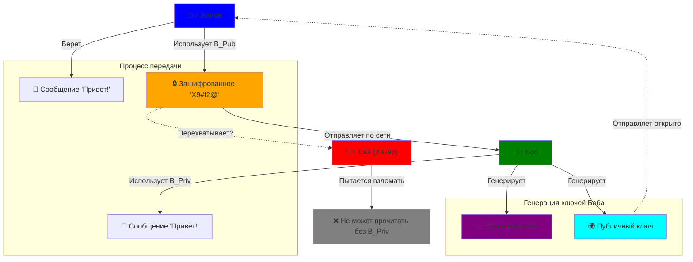
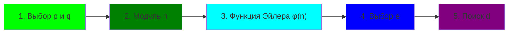
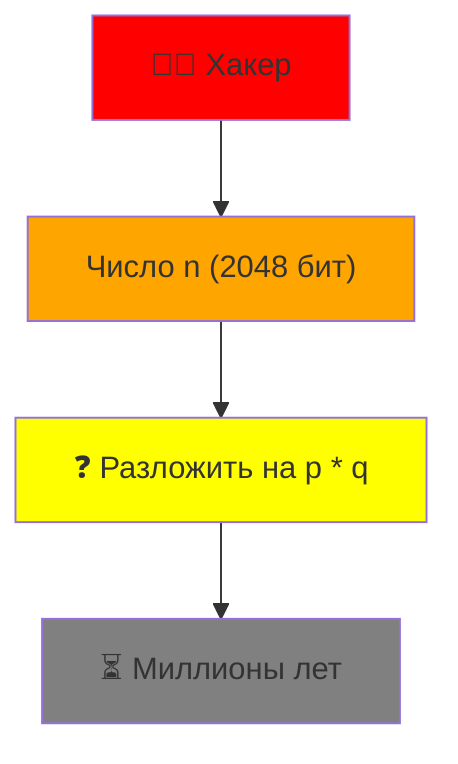

> **Главный автор:** Вадим Христенко  
> **Другие авторы:** —  
> **Последнее обновление:** 2025-11-25  
> **Ссылка на обсуждение:** [Чат в Telegram](https://t.me/tedu_notes)  
> _Комментарий:_ Разбираемся с криптографией на пальцах.  
> _Теги:_ RSA, шифрование, безопасность, математика  

# RSA: Что это и с чем его едят {id: "what_is_rsa"}

RSA (Rivest–Shamir–Adleman) — это один из первых и самых популярных алгоритмов **асимметричного шифрования**. Если говорить совсем просто: это магия, которая позволяет передавать секретные сообщения через открытый канал (например, интернет), не боясь, что их прочитает кто-то лишний.

> **Спойлер:** В названии статьи есть шутка про "эллиптические кривые". На самом деле RSA работает на **простых числах**, а эллиптические кривые (ECC) — это уже другой, более современный метод. Но принцип "публичный/приватный ключ" у них общий!

В этой статье я не буду грузить тебя десятком теорем и доказательств. Вместо этого разберёмся, **зачем вообще придумали RSA**, как он участвует в твоём любимом замочке в браузере и почему до сих пор не умер, хотя вокруг всё чаще говорят про эллиптические кривые.

Если совсем по-честному, RSA — это такой исторический динозавр, который до сих пор ходит по продакшену. На его основе строились первые массовые протоколы защиты в интернете, он до сих пор живёт в куче корпоративных VPN, старых банковских системах и даже в Smart-картах. Понимание RSA даёт хорошую интуицию и для всего остального семейства асимметричных штук.

### Немного истории {id: "rsa_history"}

RSA был опубликован в 1977 году тремя американскими криптографами — Роналдо Ривестом, Ади Шамиром и Леонардо Адлеманом (отсюда аббревиатура). Но вот интересный факт: за несколько лет до этого похожую схему в Великобритании уже придумал Clifford Cocks, но это было засекречено и долго оставалось тайной (рассекречено только в 1997 году!).

RSA стал настоящей революцией, потому что впервые позволил решить задачу **распределённого обмена ключами** без встреч и доверенных третьих лиц. До этого никто не верил, что можно безопасно шифровать, раздав всем свой публичный ключ.

Смешно, но в те времена RSA было трудно применять на практике — вычисления шли медленнее современного смартфона. Но Интернет рос, и уже в 1990-х годах RSA встроили в Netscape, что положило начало современному HTTPS. Сегодня в каждом TLS-сертификате, который ты видишь в браузере, либо сам RSA, либо его современные потомки (ECC).

## Зачем нам это нужно? {id: "why_rsa"}

Представь, что Алиса хочет отправить Бобу секретное письмо.
В **симметричном шифровании** (как AES) у них должен быть **один общий ключ**. Но как передать этот ключ, если канал прослушивается? Если Ева перехватит ключ, она сможет читать всё.

Классический подход до появления асимметричной криптографии выглядел так:

- договориться о ключе лично (не всегда возможно);
- доверять какому-то третьему лицу, которое раздаёт ключи (центральный сервер, курьер и т.п.);
- использовать какие-нибудь хитрые схемы с "кодовой книгой".

Во всех этих вариантах ключ либо можно перехватить, либо украсть, либо подменить.

Тут на сцену выходит **RSA**. У каждого участника есть **два ключа**:
1.  **Публичный ключ (Public Key):** Его знают все. Им можно **зашифровать** сообщение.
2.  **Приватный ключ (Private Key):** Его знает только владелец. Им можно **расшифровать** сообщение.

Это как почтовый ящик: любой может бросить туда письмо (используя публичный адрес), но открыть ящик и достать письмо может только владелец ключа.

И это только про **секретность**. Вторая большая задача — **доказать, что сообщение пришло именно от нужного человека**, а не от какого-то левого "банка". Для этого RSA используют в режиме **цифровой подписи**:

- сначала считается хэш сообщения;
- потом он "шифруется" приватным ключом отправителя;
- любой, у кого есть его публичный ключ, может проверить подпись.

То есть RSA умеет и **зашифровать письмо**, и **поставить подпись под договором**.

Если переформулировать совсем приземлённо:

- **шифрование RSA** защищает **конфиденциальность** (чтобы никто лишний не прочитал);
- **подпись RSA** защищает **целостность и подлинность** (чтобы было понятно, что сообщение не поменяли и оно действительно от того, кто подписался).

---

## Как это работает: Схема {id: "rsa_scheme"}

Давай посмотрим на процесс обмена сообщениями между Алисой и Бобом.



---

Самое важное в этой картинке — понять, что:

- по сети летит **не исходное сообщение**, а уже зашифрованная каша;
- публичный ключ Боба может лежать хоть на GitHub, хоть на рекламном щите — без приватного он бесполезен для расшифровки;
- Ева может перехватывать весь трафик, записывать его на диск и запускать брутфорс — но без знания разложения $n$ на $p$ и $q$ она упирается в очень неприятную математическую стену.

## Математика "под капотом" (для смелых) {id: "rsa_math"}

Вся магия RSA держится на том, что **перемножить два больших простых числа легко, а разложить результат обратно на множители — очень сложно**.

### Алгоритм генерации ключей {id: "keygen_algo"}

1.  Выбираем два больших простых числа $p$ и $q$.
2.  Считаем их произведение (модуль): $n = p \times q$.
3.  Считаем функцию Эйлера: $\phi(n) = (p-1) \times (q-1)$.
4.  Выбираем открытую экспоненту $e$ (обычно 65537), такую что $1 < e < \phi(n)$ и они взаимно просты.
5.  Находим секретную экспоненту $d$, такую что $d \times e \equiv 1 \pmod{\phi(n)}$.

**Итог:**
- **Публичный ключ:** $(e, n)$
- **Приватный ключ:** $(d, n)$

Интуитивно пара $(e, d)$ подбирается не случайно. Мы требуем, чтобы произведение $e \cdot d$ вело себя как **"единица" по модулю $\phi(n)$**. Из теоремы Эйлера (и немного китайской теоремы об остатках) следует, что при таких условиях

$$
M^{ed} \equiv M \pmod n
$$

для всех сообщений $M$, которые корректно закодированы. То есть "возвели в $e$" (зашифровали), потом "возвели в $d$" (расшифровали) — и аккуратно вернулись в исходную точку.

Здесь часто возникает несколько практических вопросов:

- **Почему именно 65537?** Это число выбрали как хорошую компромиссную открытую экспоненту: оно достаточно большое, чтобы избежать некоторых атак, но двоично в нём всего две единицы (`0b10000000000000001`), а это ускоряет возведение в степень.
- **Почему важно, чтобы $e$ и $\phi(n)$ были взаимно просты?** Тогда гарантированно существует обратный элемент $d$ по модулю $\phi(n)$ (то есть можно найти такую степень, которая "отменит" действие $e$).
- **Где тут вообще используется сложность факторизации?** В том, что злоумышленник знает только $n$ и $e$. Чтобы найти $d$, нужно знать $\phi(n)$, а её не вычислить, не зная $p$ и $q$. А вот разложить $n$ на множители при достаточной длине — очень тяжело.

### Шифрование и Дешифрование {id: "enc_dec_math"}

Пусть $M$ — наше сообщение (превращенное в число).

$$
\text{Шифрование: } C = M^e \pmod n
$$

$$
\text{Дешифрование: } M = C^d \pmod n
$$

Важно понимать, что на практике **целые сообщения напрямую так не шифруют**. Перед использованием RSA сообщение:

1. Сначала кодируют и дополняют специальным образом (паддинг, например, OAEP), чтобы защититься от атак по структуре.
2. Чаще всего RSA используют не для данных, а для **маленького случайного ключа симметричного алгоритма** (например, AES-ключ на 128/256 бит).

То есть реальный сценарий выглядит так: "RSA шифрует маленький секретный ключ, а уже этот ключ шифрует весь остальной трафик".

### Для математически любопытных {id: "math_deep_dive"}

Если ты всерьёз заинтересовался, почему вообще работает связка $M^{ed} \equiv M \pmod n$, вот что стоит за этим (без жёсткого формализма).

**Теорема Эйлера** говорит: если $\gcd(M, n) = 1$, то

$$M^{\phi(n)} \equiv 1 \pmod n$$

Это означает, что если возвести $M$ в степень $\phi(n)$, мы "делаем полный оборот" и возвращаемся в единицу (по модулю $n$).

Теперь вспомним, что мы подобрали $d$ и $e$ так, чтобы $d \cdot e \equiv 1 \pmod{\phi(n)}$. Это означает, что существует некое целое $k$, такое что

$$d \cdot e = 1 + k \cdot \phi(n)$$

Тогда:

$$M^{ed} = M^{1 + k \cdot \phi(n)} = M \cdot (M^{\phi(n)})^k \equiv M \cdot 1^k = M \pmod n$$

Вот и всё! Мы как бы "обмотали спираль" вокруг себя $k$ раз (через $\phi(n)$-шаги) и снова вернулись в исходное число.

**Китайская теорема об остатках** добавляет сюда изящество: она говорит, что вместо работы с одним большим модулем $n$, можно работать отдельно с остатками по $p$ и по $q$, а потом их объединить. Это ускоряет расшифровку в реальных реализациях примерно в 4 раза (используется в CRT-варианте RSA).

---

## Интерактивный пример на маленьких числах {id: "interactive_example"}

Давай попробуем "взломать" RSA на бумажке.



1.  Пусть $p = 3$, $q = 11$.
2.  $n = 3 \times 11 = 33$.
3.  $\phi(n) = (3-1) \times (11-1) = 2 \times 10 = 20$.
4.  Выберем $e = 3$ (оно взаимно просто с 20).
5.  Найдем $d$. Нам нужно $d \times 3 \equiv 1 \pmod{20}$.
    - $3 \times 7 = 21$.
    - $21 \pmod{20} = 1$.
    - Значит, $d = 7$.

**Ключи:**
- Публичный: $(3, 33)$
- Приватный: $(7, 33)$

**Попробуем зашифровать число 5:**
$$ C = 5^3 \pmod{33} = 125 \pmod{33} $$
$125 = 33 \times 3 + 26$.
Остаток $26$. Зашифрованное сообщение: **26**.

**Расшифруем 26 обратно:**
$$ M = 26^7 \pmod{33} $$

Можно чуть-чуть заглянуть внутрь дешифрования.

Разложим степень: $7 = 4 + 3$.

- $26^2 = 676$, $676 \pmod{33} = 17$;
- $26^4 \equiv 17^2 = 289 \equiv 24 \pmod{33}$;
- $26^3 = 26 \cdot 26^2 \equiv 26 \cdot 17 = 442 \equiv 5 \pmod{33}$;
- $26^7 = 26^{4+3} = 26^4 \cdot 26^3 \equiv 24 \cdot 5 = 120 \equiv 5 \pmod{33}$.

В итоге действительно вернулись к исходной пятёрке.

Этот пример специально взят на крошечных числах, чтобы можно было всё перепроверить руками или в любом калькуляторе. В реальной жизни $p$ и $q$ — числа с сотнями бит, и та же самая математика работает, только уже без "ручных" расчётов.

**Интересный момент:** если бы мы взяли не $p = 3, q = 11$, а, скажем, $p = 61, q = 53$, то $n = 3233$, и можно было бы хранить сообщения числами от 0 до 3232 включительно. Это уже больше для реальных букв. Но даже с такими "большими" числами современный компьютер разложит их за миллисекунды. Вот почему нужны сотни бит.

---

## Почему это безопасно? {id: "security"}

Безопасность RSA строится на сложности задачи **факторизации**.
Зная публичный ключ $(e, n)$, хакер видит $n$. Чтобы найти $d$, ему нужно знать $\phi(n)$, а для этого нужно знать $p$ и $q$.
То есть ему нужно разложить $n$ на множители.

Если $n$ — это число длиной 2048 бит (617 десятичных знаков), то даже суперкомпьютеру понадобятся миллионы лет, чтобы найти $p$ и $q$.



На практике сегодня:

- **1024 бита** — уже слабовато, так лучше не делать;
- **2048 бит** — минимальный вменяемый стандарт;
- **3072–4096 бит** — комфортный запас на будущее.

При этом криптография на практике чаще ломается не через голую математику, а через:

- плохую генерацию простых чисел (кривой ГСЧ);
- утечку приватного ключа (лежит на рабочем столе в `rsa_key.pem` без пароля);
- баги в протоколах и реализациях.

Типичные реальные истории взломов RSA:

- разные устройства (смарт-карты, роутеры) генерировали ключи с плохими случайными числами — в итоге многие ключи оказывались "похожими", и их можно было ломать пачками;
- разработчики забывали проверять паддинг, что открывало дорогу атакам вроде Bleichenbacher (по сути, сервер сам подсказывал злоумышленнику, насколько "близко" тот подобрал шифротекст);
- приватные ключи попадали в открытые репозитории, резервные копии, логи и т.п.

## Где используется? {id: "usage"}

- **HTTPS/TLS:** Когда ты видишь замочек в браузере 🔒, скорее всего, RSA использовался для обмена ключами в начале соединения.
- **Цифровые подписи:** RSA позволяет не только шифровать, но и подписывать документы (доказывая авторство).
- **SSH:** Для подключения к серверам.
- **VPN:** Для защищенных туннелей.

Давай чуть конкретнее посмотрим на путь обычного HTTPS-подключения:

1. Ты заходишь на `https://пример.ру`.
2. Сервер присылает **сертификат**, внутри которого лежит его **публичный ключ** и подпись от доверенного центра.
3. Браузер проверяет подпись (с помощью RSA или похожей схемы) и убеждается, что общается не с подставным сервером.
4. Только после этого при помощи RSA (или другого алгоритма) обмениваются временным симметричным ключом для AES/ChaCha.

Дальше весь трафик шифруется уже быстрым симметричным алгоритмом, а RSA остаётся в роли **торжественной церемонии рукопожатия и проверки документов на входе**.

Аналогично и в других сценариях:

- в **SSH** RSA может использоваться как один из вариантов ключей для авторизации (ты кладёшь публичный ключ на сервер, а приватный хранится у тебя на машине);
- в **VPN** RSA участвует в начальной фазе обмена ключами, а дальше по туннелю идёт уже симметричный трафик;
- в **подписанных обновлениях ПО** RSA-ключ встроен в приложение, а издатель подписывает новые версии — клиент просто проверяет, что обновление действительно от "своего" вендора.

### Коротко про эллиптические кривые {id: "rsa_vs_ecc"}

Те самые "эппилиптические" кривые (ECC, Elliptic Curve Cryptography) решают **ту же задачу**, что и RSA: дают нам асимметричное шифрование и цифровые подписи. Но вместо того чтобы полагаться на сложность **факторизации больших чисел**, ECC опирается на более хитрую математику — сложность **дискретного логарифма на эллиптических кривых**.

**Что такое эллиптическая кривая?**

В самом простом смысле — это кривая на плоскости, заданная уравнением типа:

$$y^2 = x^3 + ax + b$$

Выглядит немного магически, но главное свойство: **если взять две точки на этой кривой и провести через них "сложение"** (по специальным геометрическим правилам), результат тоже будет точкой на кривой. Это образует группу точек — алгебраическую структуру, в которой можно делать всякие операции.

**Почему это лучше, чем RSA?**

1. **Ключи намного короче:** ECC-ключ на **256 бит** обеспечивает примерно такую же безопасность, как **2048–3072-бит RSA**. Это означает:
   - Меньше трафика (важно для мобильных сетей).
   - Меньше памяти (важно для встраиваемых систем, смартфонов).
   - Меньше энергопотребления (критично для IoT и батарей).

2. **Быстрее:** операции с ECC часто на **порядок быстрее**, чем с RSA при эквивалентной безопасности. Это особенно заметно на мобильных устройствах и при частых криптографических операциях.

3. **Современнее:** ECC разработана позже (в 1980–90-х), поэтому с самого начала учитывала многие подводные камни, которые пришлось "латать" в RSA.

**Стандартные кривые, которые ты встретишь в реальности:**

- **P-256 (prime256v1, secp256r1):** стандартная кривая на 256 бит. Используется в TLS, HTTPS, подписях OpenPGP. При правильной реализации считается безопасной.
- **P-384 и P-521:** для тех, кто параноик и хочет бОльший запас безопасности.
- **Curve25519 (Ed25519):** оптимизированная кривая от проекта NaCl. Очень быстра, имеет хорошие свойства по защите от timing-атак. Популярна в SSH, Signal, WireGuard.

**Как это используется на практике?**

Вместо RSA-OAEP для шифрования (что редко), чаще встречаются:

- **ECDH (Elliptic Curve Diffie-Hellman):** для согласования общего секрета двумя сторонами. Используется в TLS 1.3 (современном стандарте интернета).
- **ECDSA (Elliptic Curve Digital Signature Algorithm):** для подписей вместо RSA-PSS. Тоже работает, но нужно быть внимательнее с генерацией случайных чисел (если ГСЧ плохой — может утечь приватный ключ).
- **Ed25519/Ed448:** современные подписи на основе Curve25519/448. Считаются более устойчивыми к ошибкам реализации.

**Реальные числа:**

| Алгоритм | Размер ключа | Защита на | Скорость |
|----------|-----------|----------|----------|
| RSA-2048 | 2048 бит | 112 бит | Базовая |
| ECC P-256 | 256 бит | 128 бит | ~10x быстрее |
| ECC P-384 | 384 бита | 192 бита | ~5x быстрее чем RSA-3072 |
| Ed25519 | 256 бит | 128 бит | ~20x быстрее RSA-2048 |

**Есть ли недостатки у ECC?**

1. **Немного сложнее реализовать правильно.** Если ошибиться с генерацией случайных чисел при подписи, весь приватный ключ может утечь. Известные примеры: ошибки в Android (2013), PlayStation 3 (2010). Поэтому говорят "ECC прощает меньше ошибок, чем RSA".

2. **Парамметры кривой нужно выбирать очень аккуратно.** Есть множество эллиптических кривых, но не все одинаково безопасны. На это один раз ошиблась американская NIST, рекомендовав набор параметров, в которых позже обнаружились свойства, похожие на бэкдор (это так и не доказано, но криптографы остались в сомнениях).

3. **Криптография на эллиптических кривых в школьном учебнике объяснить сложнее**, чем RSA. Поэтому меньше людей до конца понимают, как это работает (и это может быть как плюсом, так и минусом).

**Постепенная миграция на ECC:**

Индустрия медленно, но уверенно переходит с RSA на ECC:

- **TLS 1.3 (2018):** по умолчанию ECDH + Ed25519/P-256.
- **HTTPS сертификаты:** всё больше СА выдают ECC-сертификаты параллельно RSA.
- **SSH:** OpenSSH давно поддерживает Ed25519 как одну из лучших опций.
- **Blockchain и криптовалюты:** почти все используют ECC (Bitcoin/Ethereum = secp256k1).

**Но RSA не умирает!**

Несмотря на то что ECC "молодежь и инновации", классический RSA всё ещё:

- живёт в тучах старых сертификатов и инфраструктуры;
- требуется во множестве корпоративных систем по соображениям совместимости;
- хорошо изучен (люди доверяют "динозаврам");
- обязателен в некоторых регуляциях (например, ГОСТ для госсистем России часто требует RSA).

Поэтому в реальном production'е ты встретишь оба: старые системы держат RSA, новые переходят на ECC.

**Будущее: Post-Quantum Cryptography**

И ECC, и RSA — оба потенциально уязвимы для **квантовых компьютеров**. Алгоритм Шора (1994) теоретически может разломать оба. NIST сейчас стандартизирует **Post-Quantum алгоритмы** (CRYSTALS-Kyber для шифрования, CRYSTALS-Dilithium для подписей), которые должны быть стойкими даже против квантовых атак. Но это ещё впереди — квантовые компьютеры с достаточной производительностью ещё не построены в нужном масштабе.

---

## Продвинутые темы: атаки, модули и сертификаты {id: "advanced_topics"}

### Известные атаки на RSA {id: "rsa_attacks"}

Несмотря на кажущуюся стройность математики, RSA в реальности часто ломают не через факторизацию, а через боковые каналы и ошибки реализации. Вот самые интересные и опасные:

**Bleichenbacher атака (1998)**  
Это классический пример "side-channel attack" (атака по боковому каналу). Она работает, если сервер по-разному обрабатывает корректные и некорректные шифротексты — например, выдаёт разные сообщения об ошибке ("Invalid padding" vs "Decryption error") или отвечает немного по-разному по времени.

Злоумышленник может перебирать тысячи вариантов зашифрованных сообщений и слушать, как "шепчет" сервер. Постепенно, пошагово, он сужает множество возможных исходных сообщений. В результате даже без знания приватного ключа можно восстановить исходные данные.

Яркий пример: в 2014 году была найдена уязвимость в OpenSSL (CVE-2014-8730), которая позволяла это делать даже с современными ключами.

**Timing атаки**  
Если реализация расшифровки $M = C^d \pmod n$ работает дольше при одних входных данных и быстрее при других, можно извлечь информацию прямо из времени ответа. Например, если алгоритм останавливается раньше при нулевом бите в $d$, то анализируя время можно постепенно восстановить сам $d$ (или хотя бы его биты).

На такие вещи криптографы очень полагаются: вычисления должны быть **"constant-time"** — то есть занимать одно и то же время независимо от данных. Это особенно критично для операций с приватными ключами.

**Атаки на паддинг (PKCS#1 v1.5 vs OAEP)**  
Старый стандарт PKCS#1 v1.5 для паддинга имеет уязвимость: если сервер проверяет паддинг и выдаёт разные ошибки в зависимости от того, корректен ли он, это уже информация. На этой основе строятся **padding oracle атаки**.

Например, перехватив зашифрованное сообщение $C$, злоумышленник может немного изменить $C$ (получить $C'$), отправить его серверу, и по тому, какую ошибку вернёт сервер (или выдаст ошибку паддинга быстрее), узнать информацию об исходном сообщении.

**OAEP** (Optimal Asymmetric Encryption Padding) был специально разработан, чтобы защитить от таких вещей. Правильное использование RSA-OAEP + TLS даёт хорошую защиту.

**Атаки через общий модуль**  
Если несколько человек генерируют ключи и (из-за ошибки в инфраструктуре) используют **один и тот же модуль** $n$ — но разные $(e_1, d_1)$ и $(e_2, d_2)$ — то сообщение, зашифрованное для одного, может быть прочитано другим.

Это произошло в реальности: когда некоторые системы неправильно генерировали $n$, получалось, что разные пользователи имели один и тот же модуль. В результате они могли расшифровывать сообщения друг друга.

**Атаки на слабые экспоненты**  
Если $e$ выбран плохо (например, слишком мал), можно применить атаку Хастада. Если отправить одно и то же сообщение $M$ трём разным людям с одинаковой малой экспонентой $e = 3$, получаются три шифротекста:

$$C_1 = M^3 \pmod{n_1}, \quad C_2 = M^3 \pmod{n_2}, \quad C_3 = M^3 \pmod{n_3}$$

Благодаря китайской теореме об остатках можно восстановить **$M^3$ без модуля**, а потом просто извлечь кубический корень и получить $M$.

**Факторизация через утечки информации**  
Если вдруг какой-то кусочек приватного ключа $d$ утекает (например, через side-channel атаку на физический уровень), то с этой информацией можно часто восстановить весь $d$ или даже разложить $n$ на множители.

**Практические рекомендации защиты:**

- Используйте **RSA-OAEP**, а не PKCS#1 v1.5.
- Используйте **RSA-PSS** для подписей.
- Убедитесь, что операции с приватным ключом — **constant-time**.
- Защищайте приватные ключи от физических атак (используйте HSM, Trusted Enclave и т.д.).
- Используйте готовые библиотеки (OpenSSL, Sodium), а не писайте сами.
- Мониторьте время отклика и размер ошибок в логах — они могут быть утечкой информации.

### Генерация простых чисел {id: "prime_generation"}

Чтобы найти два больших простых числа $p$ и $q$, алгоритм обычно:

1. Генерирует случайное число нужной длины (например, 1024 бита).
2. Проверяет его на простоту (например, тестом Миллера–Рабина).
3. Если не простое — переходит к следующему нечётному числу, повторяет (обычно находит достаточно быстро).

Критически важно, чтобы **генератор случайных чисел был качественным**. История знает примеры, когда смарт-карты, роутеры и другие устройства использовали слабые ГСЧ, и множество ключей оказывались предсказуемыми или совпадали.

### Сертификаты и инфраструктура {id: "certificates_pki"}

В интернете RSA редко используется "в чистом виде". Обычно публичный ключ приходит в составе **цифрового сертификата** — подписанного документа, который говорит:

> "Я, доверенный центр сертификации, подтверждаю, что публичный ключ $K$ принадлежит компании example.com"

Сам сертификат подписан RSA-ключом центра (или его приватного ключа). Браузер при запуске уже знает публичные ключи нескольких главных центров (они защиты в браузер), поэтому может проверить цепочку подписей.

Это называется **PKI** (Public Key Infrastructure) — вся система управления ключами и доверия.

**Интересный факт:** когда ты устанавливаешь корпоративный прокси или антивирус, они часто добавляют свой корневой сертификат в браузер. Это означает, что они могут расшифровывать твой HTTPS-трафик (но это делается с твоего разрешения, вроде как).

### Размеры ключей: история и тренды {id: "key_sizes_trends"}

Размер ключа RSA — это один из главных факторов, определяющих его безопасность. Вот краткая история эволюции рекомендуемых размеров:

**512 бит (1990-е)**  
Считался нормой для личного использования, но уже к 2000-м годам был в практике сломан факторизацией (например, RSA-576 был разложен в 2003 году). Сегодня 512 бит — это совсем плохо, использовать нельзя.

**768 бит (2000-е)**  
Иногда использовался как компромисс, но в 2009 году был успешно разложен (RSA-768). На это потребовалось несколько месяцев и кластер машин, но это показало, что темп развития вычислений быстрее, чем ожидалось.

**1024 бита (2000-2010)**  
Стал стандартом де-факто в большинстве приложений. Но уже к 2010-м годам криптографы начали выражать озабоченность, что "скоро будет недостаточно". Сегодня 1024 бита — это уже плохо для долгоживущих данных (вроде архивов, которые должны быть секретными 20+ лет).

**2048 бит (с 2010-х и по сей день)**  
Это текущий минимум для сертификатов, HTTPS и большинства production-систем. NIST рекомендует 2048 бит как minimum до 2030-х годов. Большинство крупных браузеров и серверов требуют именно 2048 или больше. С 2048 бит ты в безопасности примерно до 2030-х годов (если не будет масштабного прорыва в факторизации).

**3072–4096 бит**  
Для параноиков, государственных систем и данных, которые должны быть секретными 50+ лет. Обеспечивает маржу безопасности на долгое время. Но имеет недостаток: операции медленнее примерно в 2–4 раза по сравнению с 2048 бит.

**4096 бит и выше**  
Иногда встречается в legacy-системах или экстремально консервативных установках. Но теоретически прямой выгоды по безопасности над 2048 (в смысле устойчивости к факторизации) нет в ближайшие десятилетия. Замедление производительности делает этот вариант неэффективным. Обычно вместо этого переходят на эллиптические кривые.

**Практические рекомендации:**

- Для старых систем, которые всё ещё используют RSA: минимум **2048 бит**.
- Для нового кода: рассмотрите переход на **ECC (ECDSA/ECDH)**, это быстрее и безопаснее.
- Для критичных долгоживущих данных (государственная статистика, архивы): **3072–4096 бит RSA** или **384–521 бит ECC**.
- Для будущего: следите за **Post-Quantum Cryptography** (NIST сейчас стандартизирует стойкие к квантовым компьютерам алгоритмы).

**Сравнение с ECC:**

Размер ECC-ключа для эквивалентной безопасности примерно в 6–8 раз **короче** (например, 256-бит ECC обеспечивает примерно такую же безопасность, как 2048-бит RSA). Это означает:

- **Меньше данных** — меньше трафика, меньше памяти.
- **Быстрее** — операции с ECC часто на порядок быстрее, особенно на мобильных устройствах.
- **Более подходит для IoT и мобильных** — именно поэтому современные смартфоны и IoT-устройства предпочитают ECC.

По этой причине индустрия медленно, но уверенно мигрирует с RSA на **ECDSA/ECDH** и готовится к **Post-Quantum алгоритмам**. Но RSA всё ещё жив благодаря наследию и совместимости.

---

## Мини-реализация игрушечного RSA на C++ {id: "rsa_cpp_example"}

Важно: **свой RSA для продакшена писать не надо**. Этот пример — чисто учебный, он опускает массу деталей (паддинг, большие числа, генерацию простых и т.д.). Но он даёт почувствовать, как шевелится математика внутри.

Ниже — маленькая программа на C++, которая:

- жёстко задаёт маленькие $p$ и $q$;
- считает $n$, $\phi(n)$, подбирает $d$;
- шифрует и расшифровывает целое число.

```cpp
#include <iostream>
#include <cstdint>

// Быстрое возведение в степень по модулю
std::uint64_t mod_pow(std::uint64_t base, std::uint64_t exp, std::uint64_t mod) {
    std::uint64_t result = 1 % mod;
    base %= mod;
    while (exp > 0) {
        if (exp & 1) {
            result = (result * base) % mod;
        }
        base = (base * base) % mod;
        exp >>= 1;
    }
    return result;
}

// Наивный поиск мультипликативной обратной по модулю phi
std::uint64_t mod_inverse(std::uint64_t e, std::uint64_t phi) {
    for (std::uint64_t d = 1; d < phi; ++d) {
        if ((d * e) % phi == 1) {
            return d;
        }
    }
    return 0; // не нашли (в реальной жизни так не делаем)
}

int main() {
    // Игрушечные простые числа (в реальности они гигантские)
    std::uint64_t p = 3;
    std::uint64_t q = 11;

    std::uint64_t n = p * q;              // модуль
    std::uint64_t phi = (p - 1) * (q - 1); // функция Эйлера

    std::uint64_t e = 3; // открытая экспонента, взаимно простая с phi
    std::uint64_t d = mod_inverse(e, phi);

    std::cout << "p = " << p << ", q = " << q << "\n";
    std::cout << "n = " << n << ", phi = " << phi << "\n";
    std::cout << "e = " << e << ", d = " << d << "\n";

    std::uint64_t m = 5; // сообщение (число меньше n)
    std::uint64_t c = mod_pow(m, e, n); // шифрование: c = m^e mod n
    std::uint64_t m2 = mod_pow(c, d, n); // расшифрование: m = c^d mod n

    std::cout << "Исходное сообщение: " << m << "\n";
    std::cout << "Зашифрованное: " << c << "\n";
    std::cout << "Расшифрованное: " << m2 << "\n";

    return 0;
}
```

Скомпилировать можно несколькими способами в зависимости от операционной системы:

**На Linux/macOS:**

```bash
g++ -std=c++17 rsa_toy.cpp -o rsa_toy
./rsa_toy
```

**На Windows с MinGW (если установлен в PATH):**

```cmd
g++ -std=c++17 rsa_toy.cpp -o rsa_toy.exe
rsa_toy.exe
```

**На Windows с MSVC (Visual Studio Command Prompt):**

```cmd
cl /std:latest rsa_toy.cpp /Fe:rsa_toy.exe
rsa_toy.exe
```

**На Windows в PowerShell (рекомендуемый способ для современных систем):**

```powershell
g++ -std=c++17 rsa_toy.cpp -o rsa_toy.exe
.\rsa_toy.exe
```

Если у тебя нет компилятора, можешь установить:
- **MinGW** — скачать с mingw-w64.org или через package manager (choco, winget);
- **MSVC** — входит в Visual Studio Community (бесплатно);
- **Clang** — установить через LLVM installer.

Суть везде одна: компилируем один файл и запускаем получившийся бинарник.

Ещё раз: это **учебная** реализация. В реальной жизни вместо ручного велосипеда на C++ нужно брать библиотеки уровня OpenSSL, Botan, libsodium и использовать готовые, хорошо изученные схемы (RSA+OAEP для шифрования, RSA-PSS для подписи и т.д.).

### Почему этот код неправильный для production {id: "why_not_production"}

Наша реализация имеет кучу проблем:

1. **Отсутствие паддинга:** мы шифруем целые числа напрямую, без OAEP. Это небезопасно.
2. **Наивная генерация ключей:** мы не проверяем, что $e$ и $\phi(n)$ взаимно просты, просто берём $e = 3$.
3. **Timing уязвимость:** операции `mod_pow` и `mod_inverse` занимают разное время в зависимости от входных данных.
4. **Маленькие числа:** работаем с `uint64_t`, что позволяет работать разве что с $n$ до ~$10^{18}$. Для 2048-бит RSA нужна арифметика больших чисел (BigInt).
5. **Нет проверок на ошибки:** если что-то сломается, программа просто вернёт 0.

Для реального шифрования используй OpenSSL.

## Итог {id: "summary"}

RSA — это фундамент современной безопасности. Он медленный для передачи больших файлов (поэтому им шифруют только маленький ключ для быстрого AES), но незаменим для аутентификации, цифровых подписей и старта защищённого разговора.

Если эта статья зашла и хочется копнуть дальше, можно:

- поиграться с генерацией ключей и шифрованием в Python через `cryptography`;
- посмотреть, как выглядят реальные TLS-сертификаты в браузере и какие алгоритмы там указаны;
- почитать про атаки на старые реализации RSA (Bleichenbacher, padding oracle), чтобы увидеть, как тонко всё ломается, если ошибиться в деталях.

> **Совет:** Никогда не пиши свою реализацию криптографии для продакшена. Используй готовые библиотеки (OpenSSL, Sodium). Математика ошибок не прощает!

