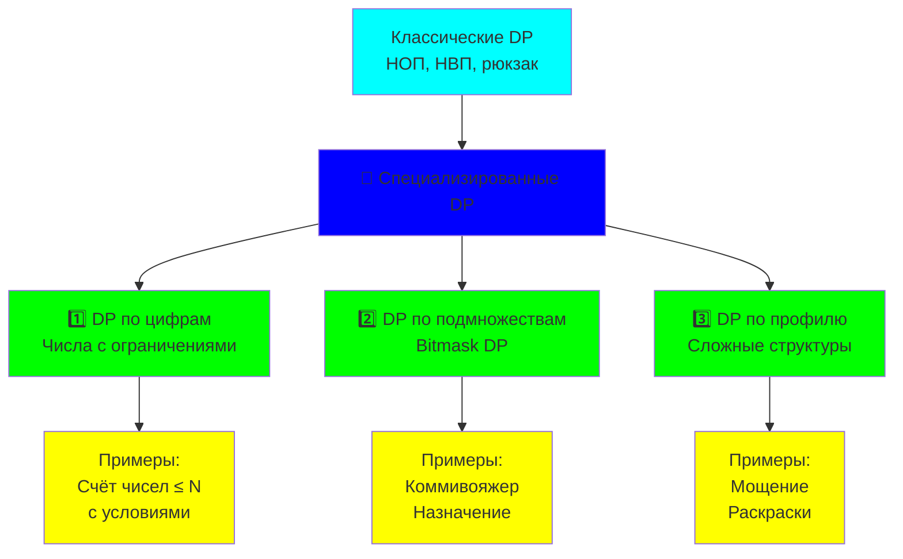
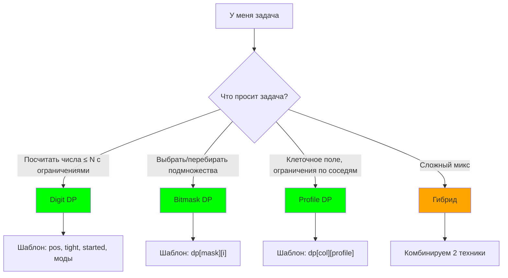
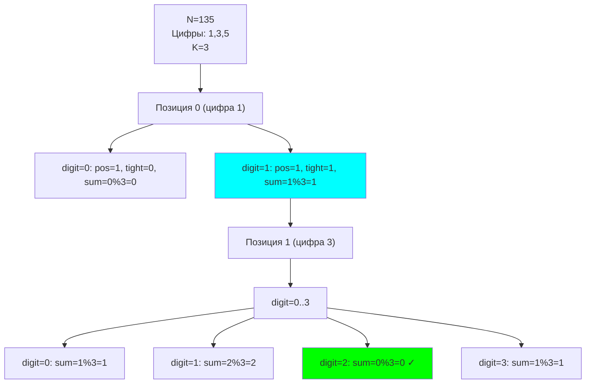
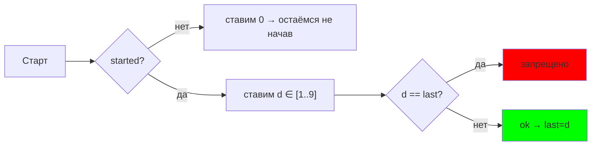
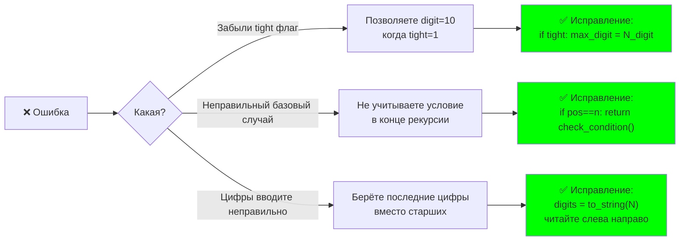
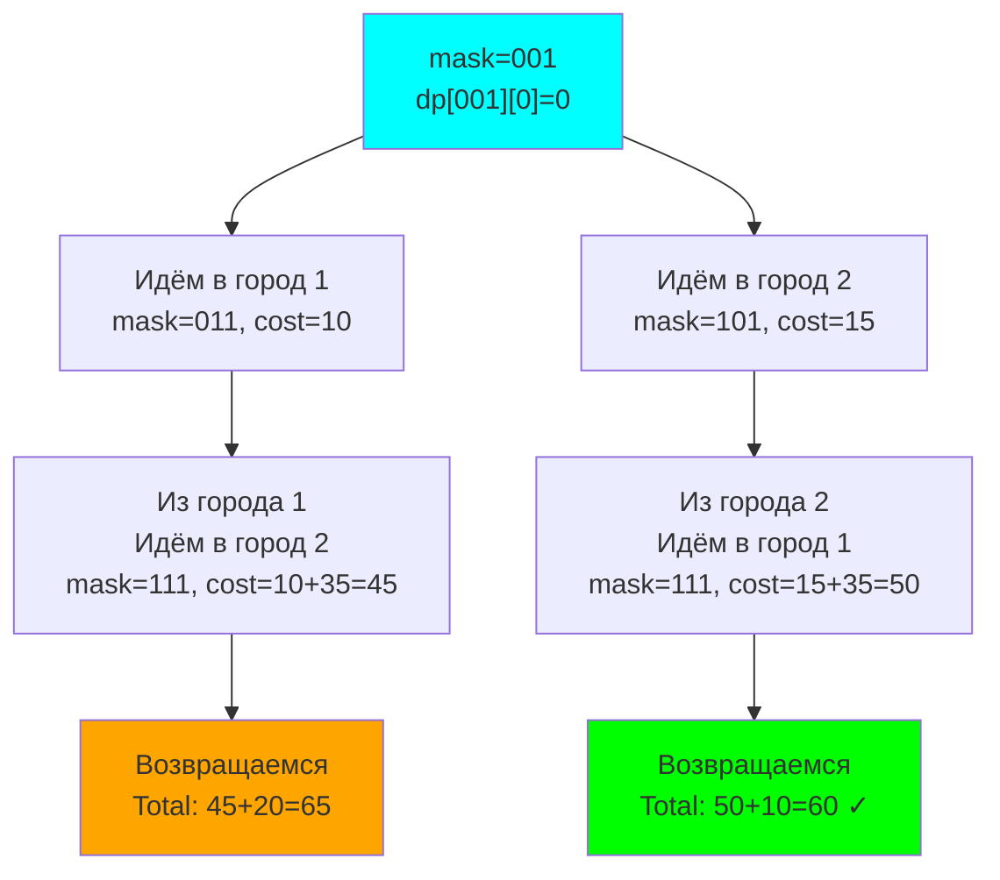
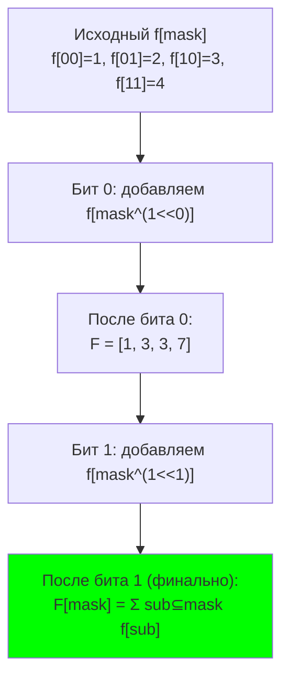
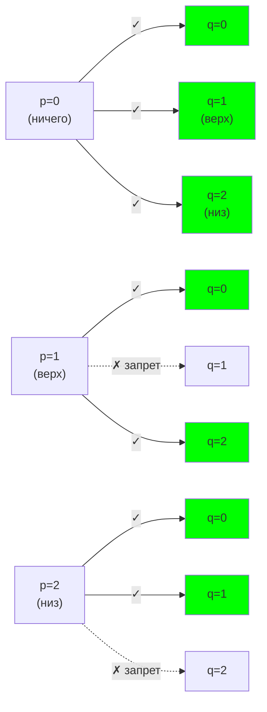
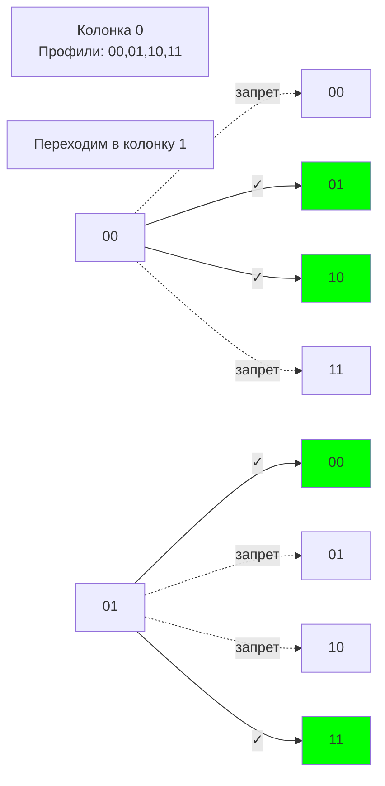
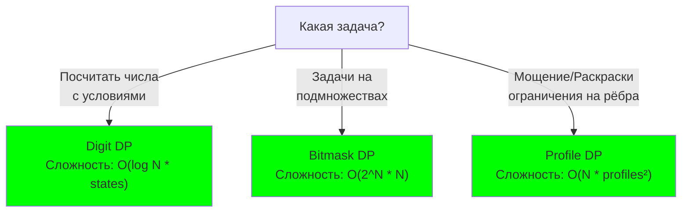

<h2>Тема конспекта: Специализированные DP — продвинутый уровень</h2>

> **Главный автор:** Вадим Христенко  
> **Основано на:** 191025.md (классические DP техники)  
> **Последнее обновление:** 2025-11-01  
> **Ссылка на обсуждение:** https://github.com/Vadim-Khristenko/Tedu_Notes/discussions/2
> _Комментарий:_ Расширенный курс для тех, кто освоил базовые DP и готов к специализированным техникам. Здесь вы найдёте DP по цифрам (поиск чисел), DP по подмножествам (маски), и DP по профилю.  
> _Теги:_ DP, DigitDP, Bitmask, SubsetDP, ProfileDP, AdvancedTechniques

---

# Введение: что дальше после классических DP? {id: "introduction"}

Вы уже знаете:
- ✅ НОП, НВП, рюкзак
- ✅ DP на деревьях
- ✅ Memoization и табуляцию
- ✅ Восстановление решений

Теперь переходим к **специализированным техникам**, которые решают задачи, требующие особого подхода:



> 💡 **Ключевая идея:** Все три техники опираются на одно — правильное определение состояния DP. Мастерство приходит с пониманием структуры задачи.

---

## Как пользоваться конспектом (дружелюбный режим) {id: "how-to-use"}

- Если вы впервые видите технику — начните с раздела «Идея» и «Шаблон». Затем сразу прочитайте «Типичные ошибки» — это экономит часы.
- Если у вас есть задача и вы сомневаетесь, что выбрать — используйте быстрый «Навигатор выбора техники» ниже.
- Если вы забыли детали — смотрите «Шпаргалки» и «Чек-листы» в конце разделов.



### Легенда цветов в диаграммах {id: "color-legend"}

- **лаймовый** — корректные и желательные состояния/ответы
- **оранжевый** — промежуточные или требующие внимания
- **красный** — ошибки/анти-паттерны
- **бирюзовый/синий** — процесс, маршрут вычислений
- **жёлтый** — примеры/факты

---

# Содержание {id: "contents"}

1. [Введение: что дальше?](#advanced-intro)
    - Когда нужны специализированные DP?
    - [Как пользоваться конспектом](#how-to-use)
    - [Легенда цветов](#color-legend)

2. [DP по цифрам (Digit DP)](#digit-dp)
    - Общая идея и рекуррентное соотношение
    - Пример 1: Счёт чисел ≤ N с условиями
    - Пример 2: Количество чисел, где сумма цифр делится на K
    - Пример 3: Поиск красивых чисел
    - [Лидирующие нули и флаг started](#digit-leading-zeros)
    - [Пример 4: Без подряд одинаковых цифр](#digit-no-adj-equal)
    - Оптимизации и трюки
    - Типичные ошибки

3. [DP по подмножествам (Bitmask DP)](#bitmask-dp)
    - Основы битовых масок
    - Рекуррентное соотношение
    - Пример 1: Задача коммивояжера (TSP)
    - Пример 2: Назначение задач оптимально
    - Пример 3: Максимальное независимое множество
    - Optimizations: Subset enumeration trick
    - [Быстрые преобразования: SOS DP](#sos-dp)
    - Когда использовать

4. [DP по профилю (Profile DP)](#profile-dp)
    - Концепция профиля
    - Пример 1: Мощение доски плитками
    - [Пример 2: Независимые множества 2×N](#profile-indep-sets)
    - [Пример 3: Раскраски 2×N в 2 цвета](#profile-coloring)
    - Оптимизации
    - Сложные случаи

5. [Гибридные DP](#hybrid-dp)
    - Комбинирование техник
    - Когда и зачем комбинировать?
    - Примеры гибридных решений

6. [Практические советы и оптимизации](#practical-tips)
    - Профилирование DP
    - Оптимизация памяти
    - Оптимизация времени
    - Отладка сложных DP
    - [Чек-лист перед сдачей](#pre-submit-checklist)

7. [FAQ](#faq)

8. [Лестница практики](#practice-ladder)

9. [Заключение и дальнейший путь](#conclusion)

---

# DP по цифрам (Digit DP) {id: "digit-dp"}

## Общая идея {#digit-dp-intro}

**Digit DP** используется для подсчёта количества чисел в диапазоне $[L, R]$, удовлетворяющих определённому условию.

**Ключевая идея:** вместо перебора всех чисел строим их поцифрово, используя DP.

### Рекуррентное соотношение {#digit-dp-recurrence}

Определим состояние:
- `pos` — текущая позиция цифры (старший разряд = 0)
- `tight` — флаг, указывает ли, что число всё ещё "прижато" к верхней границе
  - `tight == 1`: мы еще не "выбились" из границы N, максимальная цифра на позиции `pos` = `N[pos]`
  - `tight == 0`: мы уже "выбились" ниже (поставили цифру меньше N), теперь максимальная цифра = 9
- Дополнительные состояния в зависимости от условия (сумма цифр, остаток от деления и т.д.)

**Интуиция tight флага:**
```
Пример: N = 235, считаем числа ≤ 235
- Позиция 0: можем поставить 0,1,2
  - Если поставим 2 → tight=1 (всё ещё привязаны к границе)
  - Если поставим 0 или 1 → tight=0 (уже ниже, дальше можем 0-9)
- Позиция 1 (если tight=1, то есть первая цифра=2):
  - Можем поставить 0,1,2,3 (максимум 3 из N)
  - Если поставим 3 → tight=1 (продолжаем быть у границы)
  - Если меньше 3 → tight=0
- Если tight=0 с начала, то позиция 1: можем 0-9
```

```just-ncv
func digit_dp(pos, tight, other_states):
    # Базовый случай: рассчитали все цифры
    if pos == number_of_digits:
        return check_condition(other_states)  # 1 если условие выполнено, 0 иначе
    
    # Проверяем memo
    if dp[pos][tight][other_states] != -1:
        return dp[pos][tight][other_states]
    
    # Максимальная цифра на этой позиции
    max_digit = 9
    if tight == 1:
        max_digit = digit_of_limit[pos]
    
    result = 0
    for digit in 0..max_digit:
        new_tight = tight and (digit == digit_of_limit[pos])
        new_states = update_states(other_states, digit)
        result += digit_dp(pos + 1, new_tight, new_states)
    
    dp[pos][tight][other_states] = result
    return result
```

### Пример 1: Счёт чисел ≤ N {id: "digit-count-numbers"}

**Задача:** найти количество чисел в диапазоне $[0, N]$, где сумма цифр делится на K.

**Состояние DP:**
- `dp[pos][tight][sum_mod]` = количество способов заполнить оставшиеся цифры

**Решение:**

```just-ncv
func count_numbers_with_digit_sum(N: int64, K: int32) -> int64:
    digits = extract_digits(N)  # Преобразуем N в массив цифр
    n = len(digits)
    
    # dp[позиция][tight][остаток суммы по модулю K]
    dp = массив (n) × (2) × (K) инициализирован -1
    
    func solve(pos: int32, tight: int32, sum_mod: int32) -> int64:
        # Базовый случай: все цифры обработаны
        if pos == n:
            return 1 if sum_mod == 0 else 0
        
        # Проверяем кэш
        if dp[pos][tight][sum_mod] != -1:
            return dp[pos][tight][sum_mod]
        
        # Максимальная цифра на этой позиции
        max_digit = 9
        if tight == 1:
            max_digit = digits[pos]
        
        result = 0
        for digit in 0..max_digit:
            new_tight = tight and (digit == digits[pos])
            new_sum_mod = (sum_mod + digit) % K
            result += solve(pos + 1, new_tight, new_sum_mod)
        
        dp[pos][tight][sum_mod] = result
        return result
    
    return solve(0, 1, 0)

# Использование:
# Найти количество чисел ≤ 1000, где сумма цифр делится на 3
result = count_numbers_with_digit_sum(1000, 3)
```

**Пример трассировки для N = 135, K = 3:**



---

## Пример 2: Красивые числа {id: "digit-beautiful-numbers"}

**Задача:** число называется красивым, если оно ≤ N и его цифры в строго возрастающем порядке.

**Примеры:**
- 123, 1234, 12345 — красивые ✓
- 132, 1233, 100 — не красивые ✗

**Модификация DP:**

```just-ncv
func count_beautiful_numbers(N: int64) -> int64:
    digits = extract_digits(N)
    n = len(digits)
    
    # dp[позиция][tight][последняя_цифра]
    dp = массив (n) × (2) × (10) инициализирован -1
    
    func solve(pos: int32, tight: int32, last_digit: int32) -> int64:
        if pos == n:
            return 1
        
        if dp[pos][tight][last_digit] != -1:
            return dp[pos][tight][last_digit]
        
        max_digit = 9
        if tight == 1:
            max_digit = digits[pos]
        
        result = 0
        # Следующая цифра должна быть СТРОГО больше предыдущей
        for digit in (last_digit + 1)..max_digit:
            new_tight = tight and (digit == digits[pos])
            result += solve(pos + 1, new_tight, digit)
        
        dp[pos][tight][last_digit] = result
        return result
    
    return solve(0, 1, 0)  # Начинаем с 0 как предыдущей цифры
```

---

## Лидирующие нули и флаг started {id: "digit-leading-zeros"}

Во многих задачах нужно отличать «мы уже начали число» от «мы всё ещё ставим лидирующие нули». Это влияет на ограничения (например, запреты на подряд одинаковые цифры не должны срабатывать до начала числа).

Добавим флаг `started` (0/1) и обработку ведущих нулей:

```just-ncv
func count_with_started(N: int64, K: int32) -> int64:
    digits = extract_digits(N)
    n = len(digits)
    # dp[pos][tight][started][mod]
    dp = массив (n) × 2 × 2 × K инициализирован -1

    func solve(pos: int32, tight: int32, started: int32, mod: int32) -> int64:
        if pos == n:
            # Если ничего не начали, считаем ли пустое число? Обычно нет → 0
            return 1 if (started == 1 and mod == 0) else 0

        if dp[pos][tight][started][mod] != -1:
            return dp[pos][tight][started][mod]

        limit = digits[pos] if tight == 1 else 9
        res = 0
        for d in 0..limit:
            ntight = tight and (d == limit)
            if started == 0 and d == 0:
                # Продолжаем лидирующие нули, сумма/состояния не меняются
                res += solve(pos+1, ntight, 0, mod)
            else:
                nmod = (mod + d) % K
                res += solve(pos+1, ntight, 1, nmod)

        dp[pos][tight][started][mod] = res
        return res

    return solve(0, 1, 0, 0)
```

---

## Пример 3: Без подряд одинаковых цифр {id: "digit-no-adj-equal"}

Посчитаем числа ≤ N без подряд одинаковых цифр (например, «1223» — нельзя из-за «22»). Добавим в состояние «последнюю цифру» и «started»:

```just-ncv
func count_no_adjacent_equals(N: int64) -> int64:
    digits = extract_digits(N)
    n = len(digits)
    # last ∈ [-1..9] кодируем 0..10, где 10 = "ещё не начинали"
    NONE = 10
    dp = массив (n) × 2 × 2 × 11 инициализирован -1

    func solve(pos: int32, tight: int32, started: int32, last: int32) -> int64:
        if pos == n:
            return 1 if started == 1 else 0

        if dp[pos][tight][started][last] != -1:
            return dp[pos][tight][started][last]

        limit = digits[pos] if tight == 1 else 9
        res = 0
        for d in 0..limit:
            ntight = tight and (d == limit)
            if started == 0 and d == 0:
                res += solve(pos+1, ntight, 0, NONE)
            else:
                if started == 1 and last != NONE and d == last:
                    continue  # запрещаем подряд одинаковые
                res += solve(pos+1, ntight, 1, d)

        dp[pos][tight][started][last] = res
        return res

    return solve(0, 1, 0, NONE)
```



### Типичные ошибки в Digit DP



---

# DP по подмножествам (Bitmask DP) {id: "bitmask-dp"}

## Основы битовых масок {#bitmask-basics}

**Битовая маска** — представление подмножества элементов одним числом, где каждый бит = принадлежность элемента.

**Примеры:**
- `mask = 0b101 = 5` → элементы 0 и 2 входят
- `mask = 0b1111 = 15` → все 4 элемента (при 4 элементах)
- `mask & (1 << i) != 0` → проверка, входит ли элемент i

### Операции с масками {#bitmask-operations}

| Операция | Код | Пояснение |
|----------|-----|----------|
| Добавить элемент `i` | `mask \| (1 << i)` | Установить бит i в 1 |
| Удалить элемент `i` | `mask \& \sim(1 << i)` | Установить бит i в 0 |
| Проверить элемент `i` | `(mask >> i) \& 1` | Проверить бит i |
| Перечислить подмножества | `for sub in mask..1` | Перечислить все подмножества маски |
| Количество элементов | `__builtin_popcount(mask)` | Количество единичных битов |

```just-ncv
# Примеры операций
mask = 0b1010  # Элементы 1 и 3

# Добавить элемент 0
mask = mask | (1 << 0)  # mask = 0b1011

# Проверить элемент 2
if (mask >> 2) & 1 == 1:
    print("Элемент 2 входит")
else:
    print("Элемент 2 не входит")

# Перечислить все подмножества маски
sub = mask
while sub > 0:
    # Обработать подмножество sub
    sub = (sub - 1) & mask
```

### Пример 1: Задача коммивояжера (TSP) с Bitmask {id: "bitmask-tsp"}

**Задача:** посетить все N городов ровно один раз с минимальной стоимостью.

**Состояние DP:**
- `dp[mask][i]` = минимальная стоимость пути, посетив города из маски, заканчивая в городе i

**Решение:**

```just-ncv
func traveling_salesman_bitmask(dist: array<array>) -> int64:
    N = len(dist)
    INF = positive_infinity
    
    # dp[посещённые города][последний город]
    dp = массив (1 << N) × N инициализирован INF
    
    dp[1][0] = 0  # Начинаем в городе 0, посетили только его
    
    for mask in 1..(1 << N):
        for i in 0..N-1:
            if dp[mask][i] == INF:
                continue
            if not (mask & (1 << i)):  # City i not in mask
                continue
            
            # Пробуем идти в город j
            for j in 0..N-1:
                if mask & (1 << j) == 0:  # Город j не посещали
                    new_mask = mask | (1 << j)
                    dp[new_mask][j] = min(dp[new_mask][j], 
                                          dp[mask][i] + dist[i][j])
    
    # Ищем минимум среди всех завершений (возврат в город 0)
    all_visited = (1 << N) - 1
    result = INF
    for i in 1..N-1:
        result = min(result, dp[all_visited][i] + dist[i][0])
    
    return result

# Использование:
dist = [
    [0, 10, 15, 20],
    [10, 0, 35, 25],
    [15, 35, 0, 30],
    [20, 25, 30, 0]
]
result = traveling_salesman_bitmask(dist)
```

**Пример трассировки для 3 городов:**



---

## Пример 2: Оптимальное назначение задач {id: "bitmask-assignment"}

**Задача:** есть N рабочих и N задач. Каждый рабочий может выполнять каждую задачу за определённое время. Распределить задачи так, чтобы минимизировать максимальное время.

**Состояние:**
- `dp[worker][tasks_mask]` = минимальное максимальное время, когда рабочие 0..worker выполнили задачи из маски

```just-ncv
func min_max_assignment(time: array<array>) -> int64:
    N = len(time)
    INF = positive_infinity
    
    # dp[рабочий][выполненные задачи]
    dp = массив N × (1 << N) инициализирован INF
    
    # Базовый случай: рабочий 0 выполняет одну задачу
    for task in 0..N-1:
        dp[0][1 << task] = time[0][task]
    
    for worker in 1..N-1:
        for tasks_mask in 0..(1 << N):
            if popcount(tasks_mask) != worker + 1:
                continue  # Должно быть ровно worker+1 задач
            
            # Какую задачу выполнил этот рабочий?
            for task in 0..N-1:
                if tasks_mask & (1 << task):
                    prev_mask = tasks_mask ^ (1 << task)
                    if dp[worker-1][prev_mask] != INF:
                        max_time = max(dp[worker-1][prev_mask], time[worker][task])
                        dp[worker][tasks_mask] = min(dp[worker][tasks_mask], max_time)
    
    all_tasks = (1 << N) - 1
    return dp[N-1][all_tasks]
```

---

## Оптимизация: Трюк с перечислением подмножеств (Subset Enumeration Trick)  {id: "subset-enumeration-trick"}

Часто нужно перечислить все подмножества маски. Вот эффективный способ:

```just-ncv
func enumerate_subsets(mask: int32):
    sub = mask
    while sub > 0:
        # Обработать подмножество sub
        print(sub)
        sub = (sub - 1) & mask  # Переход к следующему подмножеству
```

**Почему это работает?**
- `(sub - 1)` уменьшает число, сбрасывая младший бит и устанавливая биты справа
- `& mask` сбрасывает "лишние" биты, оставляя только подмножество

**Пример для mask = 0b1101 = 13:**

```
0b1101 (13)
0b1100 (12) 
0b1001 (9)
0b1000 (8)
0b0101 (5)
0b0100 (4)
0b0001 (1)
0b0000 (0) — выход
```

---

## Быстрые преобразования: SOS DP / Zeta Transform (база) {id: "sos-dp"}

Иногда нужно для каждой маски `mask` знать сумму/количество по всем подмножествам $sub ⊆ mask$. Это можно сделать за $O(n \times 2^n)$ с помощью Zeta-преобразования.

**Проблема:** дан массив `f[mask]` — количество «чего-то» ровно для подмножества `mask`. Хотим $\text{F[mask]} = \Sigma\ \text{f[sub]}$ по всем $sub ⊆ mask$.

Наивный подход: для каждой маски перебираем все её подмножества (трюк из раздела выше) → $O(3^n)$.

**Оптимальное решение (Zeta Transform):**

Идея: обрабатываем биты по одному. На каждом шаге для бита `i`:
- Если в маске установлен бит `i`, добавляем вклад версии маски БЕЗ бита `i`

```just-ncv
func sos_zeta(F: array<int64>, n: int32):
    # На входе: F = f (исходные значения)
    # На выходе: F[mask] = Σ_{sub ⊆ mask} f[sub]
    for bit in 0..n-1:
        for mask in 0..(1<<n)-1:
            if (mask & (1<<bit)) != 0:  # Если бит установлен
                # Добавляем вклад маски без этого бита
                F[mask] += F[mask ^ (1<<bit)]
                #        ↑ XOR сбросит бит, дав нам маску-без-бита
```

**Почему это работает? Пошаговый пример:**

```
n = 2, маски: 00, 01, 10, 11
Исходно (f): f[00]=1, f[01]=2, f[10]=3, f[11]=4

Обработка бита 0 (правый бит):
  - mask=00: бит не установлен, пропускаем
  - mask=01: бит установлен → F[01] += F[00] → F[01] = 2+1 = 3
  - mask=10: бит не установлен, пропускаем
  - mask=11: бит установлен → F[11] += F[10] → F[11] = 4+3 = 7
  Сейчас: F = [1, 3, 3, 7]
  (Каждая маска содержит сумму по подмножествам, отличающимся только битом 0)

Обработка бита 1 (левый бит):
  - mask=00: бит не установлен, пропускаем
  - mask=01: бит не установлен, пропускаем
  - mask=10: бит установлен → F[10] += F[00] → F[10] = 3+1 = 4
  - mask=11: бит установлен → F[11] += F[01] → F[11] = 7+3 = 10
  Финально: F = [1, 3, 4, 10]

Проверка:
  - F[00] = f[00] = 1 ✓
  - F[01] = f[00] + f[01] = 1+2 = 3 ✓
  - F[10] = f[00] + f[10] = 1+3 = 4 ✓
  - F[11] = f[00] + f[01] + f[10] + f[11] = 1+2+3+4 = 10 ✓
```

Обратное преобразование (Moebius) вычитает вместо сложения.

**Где применяется:**
- Подсчёт «сколько наборов элементов удовлетворяют условиям из маски» для всех масок одновременно
- Предобработка для задач по битовым фильтрам (например, «найти подмножество с максимальной суммой, где каждый элемент совместим»)
- Подсчёты «по всем поднаборам» без вложенных циклов



---

# DP по профилю (Profile DP) {id: "profile-dp"}

## Концепция профиля {id: "profile-concept"}

**Profile DP** используется при обработке объектов поочередно (чаще слева направо или сверху вниз) с ограничениями на соседние объекты.

**Профиль** — состояние границы между обработанной и необработанной частями.

### Пример 1: Мощение доски плитками {id: "profile-tiling"}

**Задача:** замостить доску размером $2 \times N$ плитками $1 \times 2$ (горизонтальными и вертикальными). Сколько способов?

**Интуиция:**
- Обрабатываем доску слева направо колонка за колонкой
- Профиль = какие клетки последней колонки уже заполнены
- Профиль можно кодировать одним битом (2 состояния на колонку)

**Состояние DP:**
- `dp[i][profile]` = количество способов замостить первые i колонок так, чтобы профиль = profile
- profile может быть 0 (оба свободны), 1 (верхний занят), 2 (нижний занят), 3 (оба занят)

```just-ncv
func count_tilings(N: int32) -> int64:
    # dp[колонка][профиль]
    # профиль: бит 0 = верхний, бит 1 = нижний
    dp = массив (N + 1) × (4) инициализирован 0
    
    dp[0][0] = 1  # В начале всё свободно
    
    func fill_column(col: int32, cur_profile: int32, next_profile: int32, 
                     row: int32) -> int64:
        # Заполняем колонку col начиная с row
        # cur_profile = какие клетки уже обработаны в этой колонке
        # next_profile = какие клетки влияют на следующую колонку
        
        if row == 2:
            # Закончили с этой колонкой
            return dp[col][next_profile]
        
        if (cur_profile >> row) & 1:
            # Эта клетка уже заполнена
            return fill_column(col, cur_profile, next_profile, row + 1)
        
        result = 0
        
        # Вариант 1: Вертикальная плитка (заполняет текущую и следующую в этом row)
        if row + 1 < 2 and not ((cur_profile >> (row + 1)) & 1):
            # Оба места свободны — кладём вертикальную
            new_cur = cur_profile | (1 << row) | (1 << (row + 1))
            result += fill_column(col, new_cur, next_profile, row + 2)
        
        # Вариант 2: Горизонтальная плитка (заполняет текущую и следующую колонку)
        new_next = next_profile | (1 << row)
        result += fill_column(col, cur_profile | (1 << row), new_next, row + 1)
        
        return result
    
    for col in 0..N-1:
        for profile in 0..3:
            if dp[col][profile] > 0:
                dp[col + 1][fill_column(col, 0, 0, 0)] += dp[col][profile]
    
    return dp[N][0]
```

---

## Пример 2: Независимые множества на решётке 2×N {id: "profile-indep-sets"}

**Задача:** сколько способов выбрать клетки на доске 2×N так, чтобы никакие две выбранные не были соседями по стороне?

**Пример для 2×3:**
- ✓ можем выбрать: (1,1) и (1,3) — они не соседи
- ✗ нельзя выбрать: (1,1) и (1,2) — соседи горизонтально
- ✗ нельзя выбрать: (1,1) и (2,1) — соседи вертикально

**Идея Profile DP:**
Профиль колонки кодирует, какие клетки выбраны в этой колонке:
- Профиль 0 = "00" (ничего не выбрано)
- Профиль 1 = "01" (выбран верх)
- Профиль 2 = "10" (выбран низ)
- Профиль 3 = "11" (оба выбраны) — **ЗАПРЕЩЕНО**, т.к. вертикальные соседи!

**Правила переходов между колонками:**
Если текущая колонка имеет профиль `p`, то следующая может иметь профиль `q` только если:
- p = 0 (ничего): может идти 0, 1, 2 (не 3)
- p = 1 (верх выбран): не может быть 1 или 3 → только 0, 2
- p = 2 (низ выбран): не может быть 2 или 3 → только 0, 1
- p = 3: невозможное состояние

**Код и матрица переходов:**

```just-ncv
func count_independent_sets_2xN(N: int32) -> int64:
    PROFILES = [0, 1, 2]  # Исключаем 3
    dp = массив (N+1) × (4) инициализирован 0
    dp[0][0] = 1  # Начинаем с пустой колонки

    func compatible(p: int32, q: int32) -> bool:
        # Запрещены вертикальные соседи внутри колонки (но это уже исключено)
        # Запрещены горизонтальные соседи (одна и та же позиция в соседних колонках)
        if p == 1 and q == 1: return false  # Оба выбрали верх
        if p == 2 and q == 2: return false  # Оба выбрали низ
        return true

    for col in 1..N:
        for p in PROFILES:
            for q in PROFILES:
                if compatible(p, q):
                    dp[col][q] += dp[col-1][p]

    # Суммируем все финальные профили
    return dp[N][0] + dp[N][1] + dp[N][2]
```

**Матрица переходов (визуально):**



**Пример для N=2:** F(2) = ?
- Колонка 0: выбираем профиль 0 → dp[1] = [1, 1, 1]
  - Из 0 идём в 0, 1, 2: увеличиваем dp[1][0], dp[1][1], dp[1][2]
- Колонка 1: от dp[1] = [1, 1, 1]
  - От p=0: можем в q=0, 1, 2 → увеличиваем dp[2][*] на 1
  - От p=1: можем в q=0, 2 → увеличиваем dp[2][0] и dp[2][2] на 1
  - От p=2: можем в q=0, 1 → увеличиваем dp[2][0] и dp[2][1] на 1
  - Итог: dp[2] = [3, 2, 2]
- Ответ: dp[2][0] + dp[2][1] + dp[2][2] = 3 + 2 + 2 = 7

---

## Пример 3: Раскраски 2×N в 2 цвета без одинаковых соседей {id: "profile-coloring"}

Каждую клетку красим в чёрный (0) / белый (1), запрещая совпадение по стороне. Профиль колонки — пара бит (цвета в верхней и нижней клетке).

**Разрешённые переходы:**
- Если в колонке i профиль (верх, низ), то в колонке i+1 профиль (верх', низ') разрешен если:
  - верх ≠ верх' (вертикальные соседи по верхней строке)
  - низ ≠ низ' (вертикальные соседи по нижней строке)
  - Внутри одной колонки верх ≠ низ не требуется (они не соседи)

```just-ncv
func count_colorings_2xN(N: int32) -> int64:
    # dp[col][profile] где profile ∈ {00, 01, 10, 11}
    # бит 0 = цвет верхней клетки, бит 1 = цвет нижней
    dp = массив (N+1) × (4) инициализирован 0
    dp[0][0] = 1  # Начинаем с (0,0)
    
    func compatible(prev_prof: int32, next_prof: int32) -> bool:
        # Проверяем нет ли совпадений по вертикали
        prev_top = (prev_prof >> 0) & 1
        prev_bot = (prev_prof >> 1) & 1
        next_top = (next_prof >> 0) & 1
        next_bot = (next_prof >> 1) & 1
        
        return (prev_top != next_top) and (prev_bot != next_bot)
    
    for col in 1..N:
        for prev_prof in 0..3:
            for next_prof in 0..3:
                if compatible(prev_prof, next_prof):
                    dp[col][next_prof] += dp[col-1][prev_prof]
    
    # Суммируем все возможные финальные профили
    return dp[N][0] + dp[N][1] + dp[N][2] + dp[N][3]
```

**Пример для N=2:**



Результат: линейная рекурренция с коэффициентами. При N→∞, темп роста примерно Fibonacci-подобный.

---

# Гибридные DP {id: "hybrid-dp"}

Иногда удобно сочетать техники, чтобы уместиться во время/память.

## Пример A: Digit DP + моды (несколько ограничений) {id: "hybrid-digit-mods"}

**Задача:** считаем числа ≤ N, у которых сумма цифр делится на K И число само делится на M.

**Идея:** храним два остатка в состоянии: (`sum_mod_K`, `value_mod_M`).

```just-ncv
func count_with_two_conditions(N: int64, K: int32, M: int32) -> int64:
    digits = extract_digits(N)
    n = len(digits)
    # dp[pos][tight][sum_mod][value_mod]
    dp = массив (n) × (2) × (K) × (M) инициализирован -1
    
    func solve(pos: int32, tight: int32, sum_mod: int32, value_mod: int32) -> int64:
        if pos == n:
            return 1 if (sum_mod == 0 and value_mod == 0) else 0
        
        if dp[pos][tight][sum_mod][value_mod] != -1:
            return dp[pos][tight][sum_mod][value_mod]
        
        limit = digits[pos] if tight == 1 else 9
        res = 0
        for d in 0..limit:
            ntight = tight and (d == limit)
            new_sum = (sum_mod + d) % K
            new_value = (value_mod * 10 + d) % M
            res += solve(pos+1, ntight, new_sum, new_value)
        
        dp[pos][tight][sum_mod][value_mod] = res
        return res
    
    return solve(0, 1, 0, 0)
```

**Сложность:** O(log₁₀(N) × 2 × K × M × 10) = O(log N × K × M)

---

## Пример B: Bitmask DP + Meet-in-the-middle {id: "hybrid-bitmask-mitm"}

**Задача:** если N ≈ 30–40 (даже N=25 может быть 2^25 = 33M состояний), чистое `O(2^N)` тяжело.

**Идея:**
1. Делим множество пополам: левая половина (элементы 0..n/2-1) и правая (n/2..n-1)
2. Для левой половины считаем все маски и их значения (O(2^(n/2)))
3. Для правой половины считаем все маски и их значения (O(2^(n/2)))
4. Для каждой маски справа ищем подходящие маски слева (обычно через сортировку/двоичный поиск)

```just-ncv
func solve_with_mitm(n: int32, values: array) -> result:
    # Разбиваем на две половины
    left_size = n / 2
    right_size = n - left_size
    
    # Шаг 1: Вычисляем все маски левой половины
    left_results = map  # mask → value
    for mask in 0..(1 << left_size):
        value = compute_value(mask, values[0..left_size-1])
        left_results[mask] = value
    
    # Шаг 2: Вычисляем маски правой половины и ищем в левых
    best = negative_infinity
    for right_mask in 0..(1 << right_size):
        right_value = compute_value(right_mask, values[left_size..n-1])
        
        # Ищем в left_results подходящую маску
        # (например, с суммой ≥ какого-то значения)
        for left_mask, left_value in left_results:
            if is_compatible(left_value, right_value):
                best = max(best, combine(left_value, right_value))
    
    return best
```

**Сложность:** O(2^(n/2) + 2^(n/2) × log(2^(n/2))) = O(2^(n/2) × n/2)  
Для n=40: O(2^20 × 20) ≈ 20M операций вместо 2^40 операций!

---

## Пример C: Profile DP + Bitmask для узкой доски {id: "hybrid-profile-bitmask"}

**Задача:** заполнить доску 3×N фигурами, но нам нужно отслеживать не только профиль колонки, но и какие «цвета» уже использовались.

**Идея:** профиль = (верх, середина, низ) + дополнительный бит-маск использованных цветов.

```just-ncv
func fill_board_with_colors(N: int32, num_colors: int32) -> int64:
    # Для 3×N: профиль может быть 3 бита (8 вариантов)
    # Добавим маску использованных цветов (2^num_colors вариантов)
    
    # dp[col][profile][colors_used_mask]
    dp = массив (N+1) × (8) × (1 << num_colors) инициализирован 0
    
    dp[0][0][0] = 1  # Начинаем с пустой доски, ничего не использовано
    
    for col in 0..N-1:
        for profile in 0..7:
            for colors_mask in 0..(1 << num_colors):
                if dp[col][profile][colors_mask] == 0:
                    continue
                
                # Пробуем раскрасить текущую колонку
                for next_profile in 0..7:
                    if compatible_profile(profile, next_profile):
                        # Определяем какие цвета будут использованы
                        new_colors_mask = colors_mask
                        for bit in 0..2:
                            if (next_profile >> bit) & 1:
                                new_colors_mask |= (1 << some_color)
                        
                        dp[col+1][next_profile][new_colors_mask] += dp[col][profile][colors_mask]
    
    return sum(dp[N][any_profile][any_colors_mask])
```

**Сложность:** O(N × 8 × 2^num_colors × 8) для переходов.

---

# Практические советы и оптимизации {id: "practical-tips"}

## 1. Оптимизация памяти в Digit DP

**Проблема:** для больших N и большого количества состояний память может быть недостаточной.

**Решение:** используем rolling array (только текущая позиция):

```just-ncv
func digit_dp_optimized(N: int64, K: int32):
    digits = extract_digits(N)
    n = len(digits)
    
    # Вместо dp[n][2][K], используем dp[2][K]
    prev = массив (2) × (K) инициализирован 0
    curr = массив (2) × (K) инициализирован 0
    
    prev[1][0] = 1  # Начальное состояние
    
    for pos in 0..n-1:
        for tight in 0..1:
            for sum_mod in 0..K-1:
                curr[tight][sum_mod] = 0
        
        for tight in 0..1:
            for sum_mod in 0..K-1:
                max_digit = 9
                if tight == 1:
                    max_digit = digits[pos]
                
                for digit in 0..max_digit:
                    new_tight = tight and (digit == digits[pos])
                    new_sum_mod = (sum_mod + digit) % K
                    curr[new_tight][new_sum_mod] += prev[tight][sum_mod]
        
        prev, curr = curr, prev
    
    return prev[0][0] + prev[1][0]
```

---

## 2. Subset Enumeration для больших N

**Проблема:** если N велико (>20), Bitmask DP невозможен.

**Решение:** используйте другие техники:
- **Meet-in-the-middle:** разделите на две части, обработайте отдельно
- **Различные типы DP:** если это граф, может быть алгоритм Флойда-Уоршелла быстрее

---

## 3. Отладка Profile DP

**Совет:** выведите все переходы профилей:

```just-ncv
func debug_profile_dp():
    for cur_profile in 0..max_profile:
        print(f"Текущий профиль: {bin(cur_profile)}")
        for action in 0..num_actions:
            next_profile = transition(cur_profile, action)
            print(f"  Действие {action} → {bin(next_profile)}")
```

---

## 4. Чек-лист перед сдачей решения {id: "pre-submit-checklist"}

- Состояние DP минимально? Уберите лишние измерения (часто помогает `started` для Digit DP).
- Базовые случаи корректны? Конечные условия возвращают именно то, что нужно.
- Порядок обхода верный? 0-1 рюкзак — справа налево; профили — по колонкам; bitmask — по размеру маски.
- Нет ли переполнений? Для подсчёта способов используйте 64-битные целые и/или модуль.
- Добавили восстановление ответа, если это требуется задачей?

---

# FAQ (частые вопросы) {id: "faq"}

1) Почему мой Digit DP считает «пустое» число?  
— Добавьте `started` и в базовом случае возвращайте 0, если `started == 0`.

2) Почему Bitmask DP слишком медленный на N=25?  
— Проверьте, не делаете ли вложенный перебор масок без трюка подмасок. Подумайте про meet-in-the-middle.

3) Как отлаживать Profile DP?  
— Напечатайте все допустимые профили и таблицу совместимости, проверьте на N=1..4 руками.

---

# Лестница практики (по возрастанию сложности) {id: "practice-ladder"}

1. Digit DP: сумма цифр по модулю K  
2. Digit DP: без подряд одинаковых цифр  
3. Bitmask DP: назначение задач  
4. Bitmask DP: коммивояжёр для N≤15  
5. SOS DP: Σ по подмножествах  
6. Profile DP: независимые множества 2×N  
7. Profile DP: раскраски 2×N в 2 цвета  
8. Гибрид: Digit DP + два модуля  
9. Гибрид: Meet-in-the-middle + Bitmask DP

---

# Заключение и дальнейший путь {id: "conclusion"}

## Что вы теперь знаете {id: "what-you-know"}

✅ **Digit DP:** подсчёт чисел с условиями  
✅ **Bitmask DP:** задачи с подмножествами  
✅ **Profile DP:** сложные структурные ограничения  

## Когда какую использовать? {id: "which-dp-to-use"}



---

## Практические задачи для тренировки {id: "practice-problems"}

### Digit DP {id: "practice-digit-dp"}
1. Сколько чисел от 1 до N содержат ровно K различных цифр?
2. Найти сумму всех чисел ≤ N, где цифры расположены в возрастающем порядке
3. Количество чисел ≤ N без нулей, где каждая цифра > предыдущей

### Bitmask DP {id: "practice-bitmask-dp"}
1. Максимальное независимое множество в графе (N ≤ 20)
2. Раскраска графа в K цветов (минимальное K)
3. Максимальное совпадение в двудольном графе

### Profile DP {id: "practice-profile-dp"}
1. Мощение доски плитками L-образными
2. Расстановка ладей на шахматной доске с ограничениями
3. Подсчёт способов расставить не бьющие друг друга фигуры

---

## Следующие уровни {id: "next-level-techniques"}

- **Convex Hull Trick:** оптимизация DP O(N²) → O(N log N)
- **Divide and Conquer Optimization:** оптимизация определённых DP
- **DP на графах:** Беллман-Форд, SPFA для бесконечных графов
- **Linear Recurrence Solving:** матричное возведение в степень

---

$\text{От ученика для учеников.}\\ \text{\textcolor{red}{С продвинутыми} техниками для \textcolor{yellow}{Т-Образования}.}\\ \textcolor{cyan}{Вадим\ Христенко.}$
