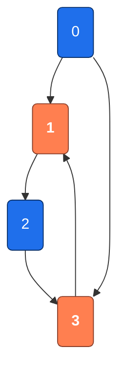
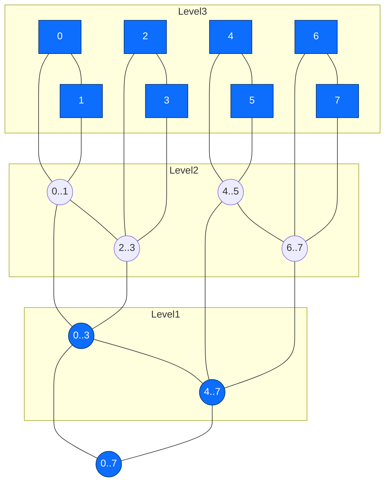
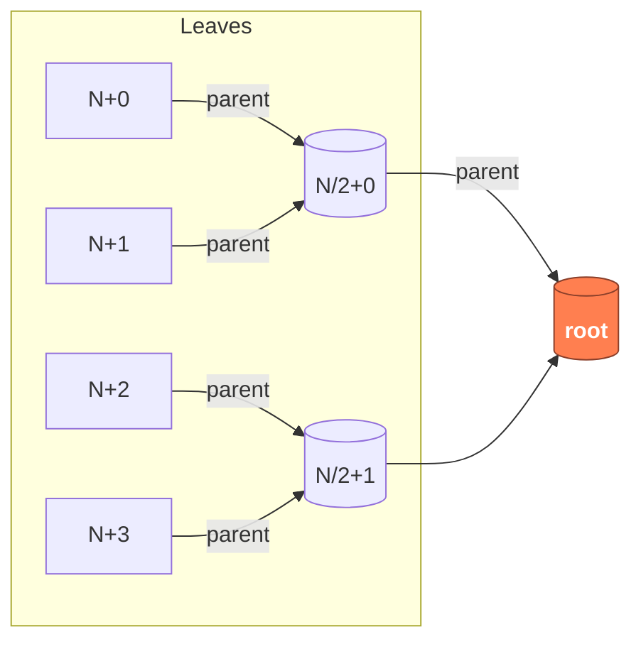
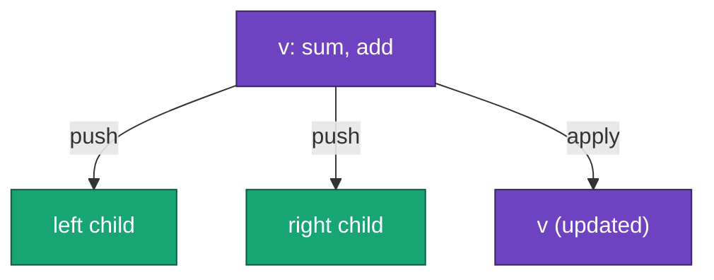
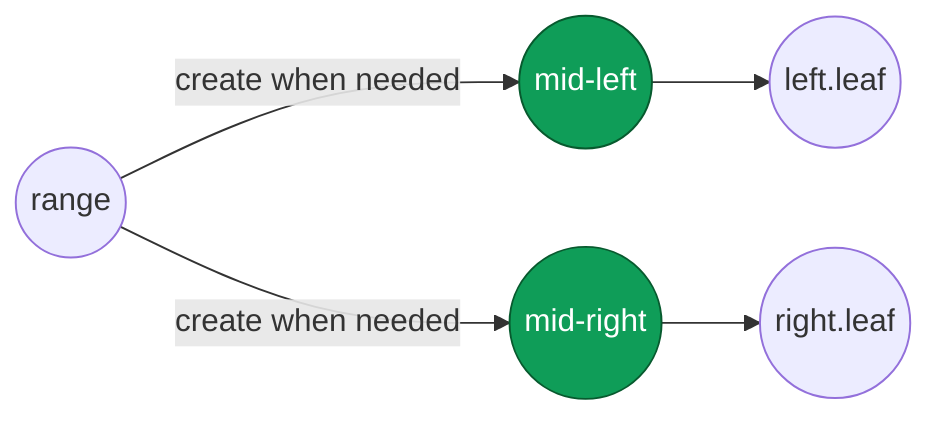

<h2>Тема конспекта: Сегментарное дерево — мастер-класс</h2>

> **Главный автор:** Вадим Христенко  
> **Другие авторы:** —  
> **Последнее обновление:** 2025-10-18  
> **Ссылка на обсуждение:** *Для хардов ссылки на обсуждение пока что нет.*  
> _Комментарий:_ Этот конспект — часть продвинутого материала для самой сильной параллели T-Образования.  
> _Теги:_ SegmentTree, RangeQueries, LazyPropagation, Сегментарное дерево, Диапазонные запросы

---

# Введение {id: "introduction"}

**Сегментарное дерево** (Segment Tree) — это одна из самых универсальных и мощных структур данных в арсенале конкурентного программиста.

Если **Fenwick дерево** — это сухая булка, то **Segment Tree** — это швейцарский нож. 🔧

В этом конспекте мы разберём:
- ✅ Как сегментарное дерево работает на самом деле
- ✅ Когда его использовать и когда это может быть overkill
- ✅ Все варианты: от базовых до продвинутых
- ✅ Практические трюки для ускорения кода

---

# Содержание {id: "contents"}

## Часть I: Задача про нечётные циклы в графе {id: "contests-part-1"}

1. [Разбор задачки L](#problem-l)
   - [Формулировка](#problem-l-formulation)
   - [Главная редукция](#problem-l-reduction)
   - [DFS и классификация рёбер](#problem-l-dfs)
   - [Фактор паритета](#problem-l-parity)
   - [Фундаментальные циклы](#problem-l-fundamental)
   - [Покрытие путей](#problem-l-covering)
   - [Дифференциальная маркировка](#problem-l-differential)
   - [Обработка компонент](#problem-l-components)
   - [Фильтрация back-рёбер](#problem-l-filtering)
   - [Корректность критерия](#problem-l-correctness)
   - [Граничные случаи](#problem-l-edge-cases)
   - [Иллюстрация](#problem-l-illustration)
   - [Примеры реализации](#problem-l-implementation)
   - [Память и масштабируемость](#problem-l-memory)
   - [Временная сложность](#problem-l-complexity)
   - [Корректность формулы](#problem-l-formula)
   - [Частые ошибки](#problem-l-mistakes)
   - [Алгоритм](#problem-l-algorithm)
   - [Резюме](#problem-l-summary)

## Часть II: Сегментарное дерево {id: "contests-part-2"}

<h3>
<a href="#segment-tree">Перейти к блоку</a>
</h3>

2. [Когда начать учить Segment Tree](#when-to-start-st)
3. [Основная интуиция](#st-intuition)
4. [Базовое дерево без ленивых меток](#st-basic)
5. [Память: правда о 2N, 3N и 4N](#st-memory)
6. [Рекурсивная реализация](#st-recursive)
7. [Итеративная реализация (bottom-up)](#st-iterative)
8. [Ленивое распространение (Lazy Propagation)](#st-lazy)
9. [Продвинутые операции](#st-advanced)
10. [Динамические и разреженные деревья](#st-dynamic)
11. [Неявное дерево](#st-implicit)
12. [Edge cases](#st-edge-cases)
13. [Сравнение с Fenwick](#st-vs-fenwick)
14. [Шаблон нейтральных элементов](#st-neutral)
15. [Поиск k-th](#st-kth)
16. [Оптимизации](#st-optimizations)
17. [Частые ошибки](#st-mistakes)
18. [Большой пример](#st-example)
19. [Шпаргалка](#st-cheatsheet)
20. [Примеры задач](#st-examples)
21. [Цитаты](#st-quotes)

---

# Разбор задачки L {id: "problem-l"}

> Эта задача была предложена на контесте Параллели B и требует глубокого понимания теории графов, особенно нечётных циклов и их пересечений.

## Формулировка (перефраз) {id: "problem-l-formulation"}

Есть неориентированный граф $G=(V,E)$, $|V|=n$, $|E|=m$, каждая вершина — монета. Известно, что ровно одна монета медная, остальные — из двух других материалов (назовём их «железо» и «бронза»). Для каждой из $m$ пар $(a_i,b_i)$ сказано: материалы различны.

## Главная редукция {id: "problem-l-reduction"}
Вершина $p$ допустима $\Longleftrightarrow$ $G\setminus\{p\}$ не содержит нечётных циклов.  
Следовательно, $p$ допустима $\Longleftrightarrow$ каждая нечётная циклическая компонента $G$ содержит $p$.  
То есть множество ответов — пересечение всех нечётных циклов графа.  
Если нечётных циклов нет (граф уже двудольный), ответ: все вершины.

Обозначим:
- множество всех нечётных циклов: $\mathcal{C}_{odd}$;
- их пересечение: $I = \bigcap_{C\in \mathcal{C}_{odd}} C$;
- итоговый ответ: $I$ (или все вершины, если $\mathcal{C}_{odd}=\varnothing$).

### 3. Стандартный DFS и классификация рёбер {id: "problem-l-dfs"}
Строим DFS-лес (граф может быть несвязным):
- для каждой вершины $v$: глубина $depth(v)$ (корень компоненты имеет глубину $0$ или $1$ — не важно, лишь бы единообразно);
- классифицируем встреченные рёбра:
  - $tree$-рёбра — ведущие к непосещённым вершинам;
  - $back$-рёбра — к уже посещённым предкам (в неориентированном графе можно ограничиться ребром к предку по времени входа, условие $tin(u)>tin(v)$ и $v$ — предок).
(Рёбра к уже пройденным «не-предкам» в неориентированном не возникают как отдельная категория — каждое такое будет зеркалом «back» в другом порядке обхода.)

Обозначим время входа $tin(v)$ для фильтрации повторов и $\;parent(v)$ в дереве.

### 4. Фактор паритета {id: "problem-l-parity"}
Определим паритет вершины: $parity(v)=depth(v)\bmod 2$.  
Рассмотрим $back$-ребро $(u,v)$, где $v$ — предок $u$. Пусть путь в дереве между $u$ и $v$ имеет длину $L$. Тогда соответствующий фундаментальный цикл имеет длину $L+1$.  
Цикл нечётный $\Longleftrightarrow (L+1)\bmod 2=1 \Longleftrightarrow L$ чётен $\Longleftrightarrow parity(u)=parity(v)$.

Таким образом: каждое $back$-ребро, соединяющее вершины одинакового паритета, образует один фундаментальный нечётный цикл.

### 5. Почему достаточно фундаментальных нечётных циклов {id: "problem-l-fundamental"}
Для каждого нечётного цикла $C$ выберем его ребро, являющееся $back$-ребром в DFS (оно существует, иначе цикл был бы чисто из $tree$-рёбер — невозможно). Это $back$-ребро соединяет вершины одинакового паритета (иначе цикл был бы чётным). Соответствующий фундаментальный нечётный цикл $F$ — подмножество вершин (и рёбер) $C$.  
Если вершина $x$ содержится во всех фундаментальных нечётных циклах, то для любого нечётного $C$ она лежит в принадлежащем $C$ фундаментальном цикле $F$, следовательно $x\in C$.  
Итак:
$$
I = \bigcap_{C\in \mathcal{C}_{odd}} C = \bigcap_{F\in \mathcal{F}_{odd}} F,
$$
где $\mathcal{F}_{odd}$ — множество фундаментальных нечётных циклов ($back$-рёбра между вершинами одинакового паритета).

### 6. Задача сводится к подсчёту покрытия путей {id: "problem-l-covering"}
Каждый фундаментальный нечётный цикл состоит из:
- пути в DFS-дереве между $(u,v)$ (включительно);
- самого $back$-ребра $(u,v)$ (оно не добавляет новых вершин).

Значит достаточно пометить все вершины пути между $u$ и $v$ для каждого такого $back$-ребра, подсчитать для каждой вершины $v$ число фундаментальных нечётных циклов, проходящих через неё:
- обозначим $total_{odd}$ — общее число таких $back$-рёбер;
- обозначим $cnt(v)$ — сколько раз вершина оказалась на отмеченных путях.  
Тогда:
$$
v \text{ в ответе } \Longleftrightarrow
\begin{cases}
total_{odd}=0 & \text{(граф двудолен)}\\
\text{или } cnt(v)=total_{odd} & \text{(вершина лежит во всех нечётных фундаментальных циклах)}
\end{cases}
$$

### 7. Дифференциальная маркировка путей (без обхода каждого пути целиком) {id: "problem-l-differential"}
Пусть нужно «прибавить $1$» ко всем вершинам на (включительном) пути между $u$ и $v$. Обозначим $w = LCA(u,v)$ (наименьший общий предок в DFS-дереве). Корень компоненты обозначим $root$.  
Корректная разностная формула (для вершин):
- $add(u) \mathrel{+}= 1$;
- $add(v) \mathrel{+}= 1$;
- $add(w) \mathrel{-}= 1$;
- если $parent(w)$ существует, то $add(parent(w)) \mathrel{-}= 1$.

После того как все такие операции применены для всех фундаментальных нечётных циклов, выполняем один пост-обход (суммирование значений детей в родителя). Итоговое накопленное значение $sum(v)$ (равное скорректированному $add(v)$ после агрегации) и есть $cnt(v)$.

Почему работает:
- Рассмотрим дерево с направлением «вниз» от $root$. Любая вершина получает +1 от каждого пути, в котором она лежит между $u$ и $v$.
- Вычитание в $w$ и его родителе «останавливает» распространение суммы выше $w$, гарантируя включение самого $w$ (а не его предков вне пути).
- В случае $w = root$ (нет $parent(w)$) делаем только три операции.

Особые случаи:
- Если $u = v$ (например, самопетля): путь — единственная вершина; формула даёт:
  $add(u) \mathrel{+}=1$, ещё раз $add(v) \mathrel{+}=1$ (то есть $+2$), затем $add(w) \mathrel{-}=1$ (итого $+1$), и если нет родителя — всё. Получаем корректно $cnt(u)$ увеличивается на $1$.
- Если самопетли в разных вершинах: каждый даёт независимый нечётный цикл длины $1$. Пересечение всех таких циклов — пусто, если самопетли в двух разных вершинах. Это автоматически выявится: для двух самопетель в $v_1$ и $v_2$: $cnt(v_1)=1$, $cnt(v_2)=1$, $total_{odd}=2$, ни одна вершина не набирает $2$.

### 8. Обработка всех компонент {id: "problem-l-components"}
Граф может быть несвязным:
- выполняем DFS из каждой непосещённой вершины, формируем отдельное дерево;
- внутри каждой компоненты считаем $depth$, $parent$, $tin$, и обрабатываем её $back$-рёбра;
- суммирование $add$ делается по каждому корню отдельно (лес);
- $total_{odd}$ — глобально по всему графу.

Фактически $cnt(v)$ — число фундаментальных нечётных циклов (в глобальном лесу), проходящих через $v$.

### 9. Паритет и фильтрация $back$-рёбер {id: "problem-l-filtering"}
Для каждого кандидатного $back$-ребра $(u,v)$ (где $v$ — предок):
- Проверяем $parity(u)=parity(v)$.
- Если да — это фундаментальный нечётный цикл; применяем разностную операцию; увеличиваем $total_{odd}$.

Замечание: каждое неориентированное ребро встречается дважды в списках смежности — нужно обеспечить учёт только «вниз → вверх» (например, условие $tin(v)<tin(u)$) чтобы не удвоить цикл.

### 10. Обоснование корректности критерия ответа {id: "problem-l-correctness"}
Итог:
- Если $total_{odd}=0$, граф двудолен: любое удаление вершины сохраняет двудольность $\Rightarrow$ все вершины возможны.
- Иначе вершина $p$ допустима $\Longleftrightarrow$ удаление $p$ уничтожает все нечётные циклы $\Longleftrightarrow p$ лежит в пересечении всех фундаментальных нечётных циклов $\Longleftrightarrow cnt(p)=total_{odd}$.

### 11. Разбор типичных граничных случаев {id: "problem-l-edge-cases"}
1. $n=1, m=0$: нечётных циклов нет $\Rightarrow$ ответ: $\{1\}$.
2. Самопетля в единственной вершине $v$: $total_{odd}=1$, $cnt(v)=1$ $\Rightarrow$ ответ $\{v\}$.
3. Две самопетли в разных вершинах: два нечётных цикла длины $1$ без пересечения $\Rightarrow$ $cnt(v_i)=1$, $total_{odd}=2$, ответ пуст.
4. Параллельные рёбра между $u$ и $v$: цикл длины $2$ (чётный) — не влияет.
5. Несколько нечётных циклов, пересекающихся частично: формула автоматически оставляет только их общее пересечение.
6. Компонента без нечётных циклов и другая с нечётными: если хотя бы одна нечётная компонента существует, вершины из полностью двудольных компонент могут быть ответом только если они лежат во всех нечётных циклах? Но они не лежат ни в одном нечётном цикле ⇒ их $cnt=0 < total_{odd}$ ⇒ они исключаются, и это корректно: удаление вершины из «бипартитной» отдельной компоненты не удалит нечётный цикл в другой компоненте.
7. Вершина на «одних» нечётных циклах, но не на других — как в примере с циклами $(1,2,3)$ и $(0,1,3)$: $cnt(1)=cnt(3)=2$, $cnt(2)=1$, $cnt(0)=1$, $total_{odd}=2$, ответ $\{1,3\}$.

### 12. Иллюстрация {id: "problem-l-illustration"}
Пример с двумя нечётными циклами, пересечение которых состоит из двух вершин.


### 13. Примеры реализации на C++ {id: "problem-l-implementation"}
Ниже приведён упрощённый код для решения задачи L с использованием Tarjan LCA для экономии памяти. Предполагаем, что граф задан списком смежности `vector<vector<int>> g(n)`.

```cpp
#include <bits/stdc++.h>
using namespace std;

const int MAXN = 3000010;
vector<int> g[MAXN];
int n, m;
int depth[MAXN], parent[MAXN], tin[MAXN], timer;
bool vis[MAXN];
long long add[MAXN], sum_cnt[MAXN];
int parity[MAXN];
int total_odd = 0;

// Tarjan LCA structures
vector<int> queries[MAXN];
int anc[MAXN], rankk[MAXN];
vector<pair<int, int>> query_list;
map<pair<int, int>, int> query_id;

void dfs(int v, int p, int d) {
    vis[v] = true;
    depth[v] = d;
    parity[v] = d % 2;
    parent[v] = p;
    tin[v] = timer++;
    for (int u : g[v]) {
        if (u == p) continue;
        if (!vis[u]) {
            dfs(u, v, d + 1);
        } else if (tin[u] < tin[v]) { // back edge
            if (parity[u] == parity[v]) {
                // fundamental odd cycle
                total_odd++;
                // LCA query for u and v
                query_list.emplace_back(u, v);
                int qid = query_list.size() - 1;
                queries[u].push_back(qid);
                queries[v].push_back(qid);
            }
        }
    }
}

int find(int x) {
    return anc[x] == x ? x : anc[x] = find(anc[x]);
}

void unite(int x, int y) {
    x = find(x); y = find(y);
    if (rankk[x] < rankk[y]) swap(x, y);
    anc[y] = x;
    if (rankk[x] == rankk[y]) rankk[x]++;
}

void tarjan_lca(int v, int p) {
    anc[v] = v;
    for (int u : g[v]) {
        if (u == p) continue;
        tarjan_lca(u, v);
        unite(v, u);
        anc[find(v)] = v; // path compression
    }
    for (int q : queries[v]) {
        auto [a, b] = query_list[q];
        int other = (a == v ? b : a);
        if (find(other) != -1) { // other is already processed
            int lca = find(other);
            // now apply differential marking
            add[a] += 1;
            add[b] += 1;
            add[lca] -= 1;
            if (parent[lca] != -1) add[parent[lca]] -= 1;
        }
    }
}

void accumulate(int v, int p) {
    for (int u : g[v]) {
        if (u != p) {
            accumulate(u, v);
            sum_cnt[v] += sum_cnt[u];
        }
    }
    sum_cnt[v] += add[v];
}

int main() {
    cin >> n >> m;
    for (int i = 0; i < m; i++) {
        int a, b;
        cin >> a >> b;
        g[a].push_back(b);
        g[b].push_back(a);
    }
    // Run DFS from each unvisited node
    for (int i = 0; i < n; i++) {
        if (!vis[i]) {
            dfs(i, -1, 0);
            tarjan_lca(i, -1);
        }
    }
    // Accumulate counts
    for (int i = 0; i < n; i++) {
        if (parent[i] == -1) { // root
            accumulate(i, -1);
        }
    }
    // Collect answer
    vector<int> ans;
    if (total_odd == 0) {
        for (int i = 0; i < n; i++) ans.push_back(i);
    } else {
        for (int i = 0; i < n; i++) {
            if (sum_cnt[i] == total_odd) ans.push_back(i);
        }
    }
    cout << ans.size() << '\n';
    for (int x : ans) cout << x << ' ';
    return 0;
}
```

Этот код использует Tarjan для офлайн LCA, что позволяет избежать бинлифтинга и сэкономить память. Обратите внимание на фильтрацию back-рёбер по паритету и дифференциальную маркировку.

### 13. Память и масштабируемость {id: "problem-l-memory"}
Ограничения: $n,m \le 3\cdot 10^6$.
- Хранение списка смежности: по два конца на ребро ⇒ $2m$ целых. При 4 байтах на число: $\approx 8m$ байт (до $\approx 24$ МБ при $m=3\cdot 10^6$) + массивы индексов, итого разумно, если использовать плотные массивы.
- Массивы размеров $n$: $depth$, $parent$, $tin$, $add$, $sum$, булевы флаги — ещё порядка нескольких десятков мегабайт.
- LCA: классический бинлифтинг требует $n \log n$; для $n=3\cdot 10^6$ и $\log_2 n \approx 22$ это $\approx 66$ млн целых ⇒ риск превышения памяти. Возможные стратегии:
  - (a) LCA через «время входа + RMQ по эйлерову проходу»: хранение эйлерова массива длины $2n$ и Sparse Table ($2n \log(2n)$) — тоже дорого;
  - (b) Онлайновый подъём без предобработки (поднимая более глубокую вершину наверх по $parent$) слишком медленный в худшем случае (длинные пути);
  - (c) Сжатие глубины: если граф «широкий», но не «глубокий», бинлифтинг дешевле;
  - (d) Альтернатива: заменить LCA на офлайн метод типа Tarjan LCA (требует запросов заранее — здесь каждое $back$-ребро инициирует один запрос; можно запускать Tarjan параллельно с DFS). Тогда не нужен бинлифтинг: память уменьшается до $O(n + m)$.

Вывод: практически для больших $n$ целесообразно использовать офлайн Tarjan LCA или аккуратно реализованный бинлифтинг с 32-битными числами.

### 14. Временная сложность {id: "problem-l-complexity"}
- Один проход DFS: $O(n + m)$.
- Обработка каждого $back$-ребра: $O(1)$ на классификацию + $O(1)$ на «маркировку» (четыре операции).
- LCA: 
  - бинлифтинг: подготовка $O(n \log n)$, запрос $O(\log n)$ для каждого фундаментального нечётного цикла;
  - или Tarjan LCA: суммарно $O(n + m + q)$, где $q$ — число запросов (не более числа $back$-рёбер).
- Финальное накопление по дереву(ям): $O(n)$.
Итого доминирует $O(n + m)$ при использовании Tarjan LCA или практически $O((n+m)\log n)$ при бинлифтинге.

### 15. Корректность формулы для включительного пути {id: "problem-l-formula"} 
Пусть $Path(u,v)$ — множество вершин на пути $u \leadsto v$. Покажем, что после операций
$$
add(u){+}{=}1,\quad add(v){+}{=}1,\quad add(w){-}{=}1,\quad add(parent(w)){-}{=}1
$$
и накопления снизу-вверх значение $sum(x)$ равно количеству путей, покрывающих $x$.
- Подъём суммы из листьев гарантирует, что $sum(x)=add(x)+\sum_{c\;child\;x} sum(c)$.
- Вклад пути в вершину $x$ не идёт выше $parent(w)$, т.к. там вычтено $1$; одновременно $w$ остаётся включённым (его итоговое изменение $+1+1-1-(1 \text{ если есть parent})$ даёт чистый $+1$).
- Любая вершина вне пути получает баланс $0$ (либо не получает инкрементов, либо +1/-1 компенсируются по ветвям).

### 16. Частые ошибки {id: "problem-l-mistakes"}
1. Использование формулы $add(u){+}{=}1, add(v){+}{=}1, add(w){-}{=}2$ (которая корректна для подсчёта рёбер, а не вершин) — теряется $LCA$.
2. Двойной учёт одного $back$-ребра (нефильтрация по $tin$).
3. Неправильная обработка самопетель: пропуск или двойной учёт.
4. Игнорирование несвязных компонент (некорректные $parent$ / отсутствие $LCA$).
5. Ошибочный вывод при отсутствии нечётных циклов (нужно вывести все вершины).
6. Переполнение стека рекурсией при длинной цепочке (нужен итеративный DFS при больших $n$).
7. Неверное вычисление $LCA$, что искажает путь и счётчики.

### 17. Итоговая словесная схема (алгоритм без кода) {id: "problem-l-algorithm"}
1. Инициализация структур для DFS и матрицы/механизма $LCA$ (бинлифтинг или Tarjan).
2. Для каждой непосещённой вершины запускаем DFS:
   - фиксируем $depth$, $parent$, $tin$;
   - при встрече ребра $(u,v)$:
     - если $v$ непосещён — $tree$-ребро;
     - иначе если $v$ — предок и $tin(v) < tin(u)$ — кандидат $back$-ребра:
       - проверяем $parity(u)=parity(v)$; если да:
         - находим $w=LCA(u,v)$;
         - применяем дифференциальные обновления $add$;
         - увеличиваем $total_{odd}$.
3. После полного обхода леса выполняем пост-обход(ы) для аккумуляции $add \to sum$.
4. Если $total_{odd}=0$: ответ — весь список вершин.
5. Иначе формируем множество $Ans = \{ v \mid sum(v)= total_{odd} \}$.
6. Если $Ans=\varnothing$: выводим $0$. Иначе — $|Ans|$ и отсортированные вершины (при необходимости сортировки; порядок обхода дерева не гарантирует глобальной отсортированности).
7. (Опционально) Проверяем особые тривиальные случаи заранее (самопетли в разных вершинах).

### 18. Резюме {id: "problem-l-summary"}
- Задача сводится к пересечению всех нечётных циклов.
- Достаточно рассматривать фундаментальные нечётные циклы из $back$-рёбер одинакового паритета глубин.
- Маркировка путей делается дифференциально через $u$, $v$, $LCA(u,v)$ и $parent(LCA)$.
- Вершины с $cnt(v)=total_{odd}$ образуют искомое пересечение.
- В отсутствии нечётных циклов все вершины допустимы.

---

## Дерево отрезков (Segment Tree) {id: "segment-tree"}

> «Дерево отрезков — это как швейцарский нож: 90% задач ты решишь стандартным лезвием $(sum\ /\ min)$, остальные 10% — добор насадок $(lazy, beats, persist)$.»

### 1. Интуиция и когда применять {id: "when-to-start-st"}
Хотим быстро отвечать на запросы вида «агрегат по подотрезку» + вносить изменения. Если нужны: сумма, минимум, максимум, $gcd$, первый индекс с условием, подсчёт кол-ва элементов, частота — это сюда.  
Если операции коммутативные и только $prefix$ → можно $Fenwick$. Если нужны сложные кастомные merge или несколько типов обновлений — $Segment\ Tree$.

### 2. Базовое дерево отрезков (только точечные) {id: "st-intuition"}
Самый первый слой: поддерживаем массив длины $n$, умеем:
1. Построить дерево за $O(n)$.
2. Сделать точечное присваивание/прибавление.
3. Получить агрегат (например, сумму) на любом $[l,r]$.

Без ленивых меток мы работаем только с путём от листа к корню: глубина $\approx \lceil \log_2 n \rceil$.

Когда хватает базового варианта:
- много точечных апдейтов, мало диапазонных;
- или диапазоны маленькие (можно разбить на точки без боли);
- задача «подсчитать сумму по префиксу/отрезку» + «обновить элемент».

### 3. Память: 2N, 3N, 4N — мифы и факты {id: "st-basic"}
Повторим и усилим:
— Итеративно: берём $N = 2^{\lceil \log_2 n \rceil}$ → размер массива $2N$ (листья в $[N,2N)$).  
— Рекурсивно: $4n$ — тупо, надёжно, не думаем.
— Почему не $3n$? Потому что может встретиться $n$ чуть больше половины степени двойки и тогда нужно почти удвоить число листьев.
Формула грубо: число узлов полного двоичного дерева $\le 2\cdot 2^{\lceil \log_2 n \rceil}$.  
Если нужна экономия — итеративный вариант.

### 4. Почему иногда не хватает 3N: контрпример {id: "st-memory"}
Возьмём $n = 2^{k-1}+1$. Тогда $\lceil \log_2 n \rceil = k$ и $N = 2^k$.  
Число узлов у полного дерева: $2N - 1 = 2^{k+1}-1$.  
Отношение к $n$:
$\frac{2^{k+1}-1}{2^{k-1}+1} = \frac{4\cdot 2^{k-1}-1}{2^{k-1}+1} \approx 4 - \frac{5}{2^{k-1}+1}.$  
При большом $k$ отношение стремится к $4$. Значит нужно почти $4n$ узлов; $3n$ объективно недостаточно — вот «то самое дерево», которое «не влезает в $3n$».

Мини-числовой пример: $n=9$. Тогда $N=16$, узлов $=31$. $3n=27 < 31$ → действительно мало.

### Схематика: базовая структура дерева
Ниже простая схема дерева отрезков для массива длины 8 (листья на уровне 3):


### 5. Базовые операции (функции и их назначение) {id: "st-basic-ops"}
| Функция | Назначение | Критично помнить |
|---------|------------|------------------|
| $build$   | Построение агрегатов снизу вверх | $O(n)$ итеративно; рекурсивно тоже $O(n)$ |
| $query$   | Сбор результата по покрывающим сегментам | Возвращает $NEUTRAL$ на пустом пересечении |
| $\text{update (point)}$ | Изменить лист и пересчитать путь вверх | $Высота ≈ log (n)$ |
| `range_update` $(lazy)$ | Массово изменить интервал | Не спускаемся полностью, ставим метки |
| $\text{push}$    | Проталкивание ленивых меток вниз | Вызывать перед частичным разбиением |
| $\text{apply}$   | Применение метки к узлу | Корректно менять агрегат и накапливать флаг |
| $\text{merge}$   | Комбинация двух детей | Ассоциативность обязательна |

### 6. Рекурсивная реализация + разбор функций {id: "st-recursive"}
```cpp
struct SegBasic {
  struct Node { long long sum = 0; }; // можно расширить
  int n; vector<Node> st;
  SegBasic(int n): n(n), st(4*n) {}
  template<class Arr>
  void build(int v,int tl,int tr,const Arr& a){
    if(tl==tr){ st[v].sum = a[tl]; return; }
    int tm=(tl+tr)>>1;
    build(v<<1, tl, tm, a);
    build(v<<1|1, tm+1, tr, a);
    st[v].sum = st[v<<1].sum + st[v<<1|1].sum; // merge
  }
  void point_set(int v,int tl,int tr,int pos,long long val){
    if(tl==tr){ st[v].sum = val; return; }
    int tm=(tl+tr)>>1;
    if(pos<=tm) point_set(v<<1, tl, tm, pos, val);
    else        point_set(v<<1|1, tm+1, tr, pos, val);
    st[v].sum = st[v<<1].sum + st[v<<1|1].sum;
  }
  long long range_sum(int v,int tl,int tr,int l,int r){
    if(l>r) return 0; // NEUTRAL
    if(l==tl && r==tr) return st[v].sum;
    int tm=(tl+tr)>>1;
    return range_sum(v<<1, tl, tm, l, min(r, tm)) +
         range_sum(v<<1|1, tm+1, tr, max(l, tm+1), r);
  }
};
```
Пояснения: 
- $NEUTRAL$ для суммы — 0; для минимума взяли бы $+\infty$.  
- Любой выход за границы возвращает $NEUTRAL$.

### 7. Итеративная реализация bottom-up {id: "st-iterative"}
```cpp
struct SegIter {
  int N; vector<long long> t; // t[1] — корень, листья в [N,2N)
  SegIter(int n){ N=1; while(N<n) N<<=1; t.assign(2*N, 0); }
  template<class Arr>
  void build(const Arr& a){
    for(size_t i=0;i<a.size();++i) t[N+i]=a[i];
    for(int v=N-1; v>0; --v) t[v]=t[v<<1]+t[v<<1|1];
  }
  void point_set(int pos,long long val){
    int v = N+pos; t[v]=val; v>>=1;
    while(v){ t[v]=t[v<<1]+t[v<<1|1]; v>>=1; }
  }
  long long range_sum(int l,int r){
    long long res=0; l+=N; r+=N;
    while(l<=r){
      if(l&1) res+=t[l++];
      if(!(r&1)) res+=t[r--];
      l>>=1; r>>=1;
    }
    return res;
  }
};
```
Фишка: нет рекурсии, минимальные константы — топ для интенсивных запросов.

### Схематика: итеративное расположение
Иллюстрация, как в итеративной реализации листья лежат в диапазоне `[N,2N)` и как индексы двигаются вверх:


### 8. Lazy propagation: add, assign, mix {id: "st-lazy"}
Рассмотрим наиболее частые комбинации.

#### (a) Только диапазонное добавление + сумма
```cpp
struct SegLazyAdd {
  struct Node { long long sum=0, add=0; };
  int n; vector<Node> st;
  SegLazyAdd(int n): n(n), st(4*n) {}
  template<class A>
  void build(int v,int tl,int tr,const A& a){
    if(tl==tr){ st[v].sum=a[tl]; return; }
    int tm=(tl+tr)>>1; build(v<<1,tl,tm,a); build(v<<1|1,tm+1,tr,a);
    st[v].sum = st[v<<1].sum + st[v<<1|1].sum;
  }
  void apply(int v,int tl,int tr,long long add){
    st[v].sum += (tr-tl+1)*add;
    st[v].add += add;
  }
  void push(int v,int tl,int tr){
    if(st[v].add==0 || tl==tr) return; int tm=(tl+tr)>>1;
    apply(v<<1, tl, tm, st[v].add);
    apply(v<<1|1, tm+1, tr, st[v].add);
    st[v].add=0;
  }
  void range_add(int v,int tl,int tr,int l,int r,long long x){
    if(l>r) return; if(l==tl && r==tr){ apply(v,tl,tr,x); return; }
    push(v,tl,tr); int tm=(tl+tr)>>1;
    range_add(v<<1,tl,tm,l,min(r,tm),x);
    range_add(v<<1|1,tm+1,tr,max(l,tm+1),r,x);
    st[v].sum = st[v<<1].sum + st[v<<1|1].sum;
  }
  long long range_sum(int v,int tl,int tr,int l,int r){
    if(l>r) return 0; if(l==tl && r==tr) return st[v].sum;
    push(v,tl,tr); int tm=(tl+tr)>>1;
    return range_sum(v<<1,tl,tm,l,min(r,tm)) +
         range_sum(v<<1|1,tm+1,tr,max(l,tm+1),r);
  }
};
```

### Схематика: lazy propagation (push/apply)
Схема работы ленивых меток: метка хранится в узле и проталкивается вниз при частичном покрытии.


> Примечание: раньше была метка с `|` внутри (`NodeA[Node v | sum, add]`), это ломало парсер — заменил на `:` и взял метку в кавычки.

#### (b) Диапазонное присваивание (assign) + добавление + сумма
В узле надо хранить: $sum$, $add$, $hasAssign$, $assignVal$. Порядок push: если есть pending assign — сначала проталкиваем его, и только потом add.
```cpp
struct SegLazyAssignAdd {
  struct Node { long long sum=0, add=0, assignVal=0; bool hasAssign=false; };
  int n; vector<Node> st;
  SegLazyAssignAdd(int n): n(n), st(4*n) {}
  void build(int v,int tl,int tr,const vector<long long>& a){
    if(tl==tr){ st[v].sum=a[tl]; return; }
    int tm=(tl+tr)>>1; build(v<<1,tl,tm,a); build(v<<1|1,tm+1,tr,a);
    st[v].sum = st[v<<1].sum + st[v<<1|1].sum;
  }
  void applyAssign(int v,int tl,int tr,long long val){
    st[v].sum = (tr-tl+1)*val;
    st[v].assignVal = val; st[v].hasAssign = true; st[v].add = 0;
  }
  void applyAdd(int v,int tl,int tr,long long x){
    st[v].sum += (tr-tl+1)*x;
    if(st[v].hasAssign) st[v].assignVal += x; else st[v].add += x;
  }
  void push(int v,int tl,int tr){
    if(tl==tr) return; int tm=(tl+tr)>>1;
    if(st[v].hasAssign){
      applyAssign(v<<1, tl, tm, st[v].assignVal);
      applyAssign(v<<1|1, tm+1, tr, st[v].assignVal);
      st[v].hasAssign=false;
    }
    if(st[v].add){
      applyAdd(v<<1, tl, tm, st[v].add);
      applyAdd(v<<1|1, tm+1, tr, st[v].add);
      st[v].add=0;
    }
  }
  void range_assign(int v,int tl,int tr,int l,int r,long long val){
    if(l>r) return; if(l==tl && r==tr){ applyAssign(v,tl,tr,val); return; }
    push(v,tl,tr); int tm=(tl+tr)>>1;
    range_assign(v<<1,tl,tm,l,min(r,tm),val);
    range_assign(v<<1|1,tm+1,tr,max(l,tm+1),r,val);
    st[v].sum = st[v<<1].sum + st[v<<1|1].sum;
  }
  void range_add(int v,int tl,int tr,int l,int r,long long x){
    if(l>r) return; if(l==tl && r==tr){ applyAdd(v,tl,tr,x); return; }
    push(v,tl,tr); int tm=(tl+tr)>>1;
    range_add(v<<1,tl,tm,l,min(r,tm),x);
    range_add(v<<1|1,tm+1,tr,max(l,tm+1),r,x);
    st[v].sum = st[v<<1].sum + st[v<<1|1].sum;
  }
  long long range_sum(int v,int tl,int tr,int l,int r){
    if(l>r) return 0; if(l==tl && r==tr) return st[v].sum;
    push(v,tl,tr); int tm=(tl+tr)>>1;
    return range_sum(v<<1,tl,tm,l,min(r,tm)) +
         range_sum(v<<1|1,tm+1,tr,max(l,tm+1),r);
  }
};
```

### 9. Advanced: минимум + счётчик, gcd, k-th, первая позиция по предикату {id: "st-advanced"}
1. $(min,\ countMin)$: храним $mn$, $cnt$. merge: выбираем меньший $mn$, если равны — складываем $cnt$.
2. $gcd$: merge = $gcd(left, right)$; $NEUTRAL = 0$.
3. $k$-th по суммам: если `sum(left) >= k` → влево, иначе `k -= sum(left)` и вправо.
4. Первая позиция с `sumPrefix >= X` — аналогично $k$-th.
5. Первое место где $mn < 0$ — спускаемся только если $node.mn < 0$.

### 10. Dynamic / Sparse / Persistent / Beats
| Вид | Где нужен | Суть |
|-----|-----------|------|
| $Dynamic$ | Большой диапазон (до $1e18$) c малым числом точек | Узлы создаём по требованию (указатели / индекс-пул) |
| $Persistent$ | Нужны версии по времени (immutable) | Каждый update копирует путь до корня ($O(log (n))$ новых узлов) |
| $Sparse$ (коорд. компрессия) | Большие координаты, известны заранее точки | Сжимаем и строим обычное дерево |
| $Beats$ | Операции типа $chmin\ /\ chmax$ + запрос суммы/макс/мин | Храним $max1,\ max2,\ cntMax$ и т.п., проталкиваем умно |

### 11. Неявное (implicit) дерево отрезков {id: "st-implicit"}
Иногда диапазон индексов огромный (например, координаты до $10^{18}$), но реально используемых позиций мало. Тогда мы не можем выделить массив на $N = 2^{\lceil \log_2 n \rceil}$. Решение — неявное (implicit) ДО: создаём узлы на лету, когда до них доходим.

Простейшая версия для суммы точечных обновлений:
```cpp
struct Node {
  long long sum=0; Node *L=nullptr,*R=nullptr;
};
const long long MINX = 0, MAXX = (1LL<<60); // адаптировать под диапазон

void point_add(Node*& v,long long tl,long long tr,long long pos,long long val){
  if(!v) v=new Node();
  if(tl==tr){ v->sum += val; return; }
  long long tm=(tl+tr)>>1;
  if(pos<=tm) point_add(v->L,tl,tm,pos,val);
  else point_add(v->R,tm+1,tr,pos,val);
  long long leftSum = v->L? v->L->sum:0;
  long long rightSum= v->R? v->R->sum:0;
  v->sum = leftSum + rightSum;
}

long long range_sum(Node* v,long long tl,long long tr,long long l,long long r){
  if(!v || l>r) return 0;
  if(l==tl && r==tr) return v->sum;
  long long tm=(tl+tr)>>1;
  return range_sum(v->L,tl,tm,l,min(r,tm)) +
       range_sum(v->R,tm+1,tr,max(l,tm+1),r);
}
```

### Схематика: неявное дерево (implicit) 
Схема создания узлов по требованию — только ветви с обновлёнными позициями существуют:

Плюсы: память пропорциональна числу реально обновлённых позиций ($O(m \log R)$ узлов максимум). Минусы: указатели, аллокации, хуже константы.

Можно расширить до lazy для диапазонных операций — храним метку в узле, создаём детей только когда нужно push.

### 12. Edge cases и как их обрабатывать {id: "st-edge-cases"}
| Ситуация | Проблема | Решение |
|----------|----------|---------|
| $n=1$ | Границы, $tl==tr$ | Просто возвращаем лист |
| Запрос вне диапазона | $l>r$ | Возвращаем $NEUTRAL$ | 
| Переполнение суммы | $int\ overflow$ | $long\ long$ + осторожно с $(tr-tl+1)*val$ |
| Все элементы одинаковы | проверка обновлений | Должно корректно пересчитаться (не кэшировать вне узлов) |
| $assign + add$ | порядок | Сначала $assign$ (перезаписывает), затем $add$ |
| Много версий (persistent) | Память | Пул узлов + шаринг неизменённых |
| Очень глубокая рекурсия | $Stack\ overflow$ | Итеративный или свой стек |
| $Lazy$ забыли $push$ | Неверный ответ | Всегда $push$ при частичном покрытии |
| $k$-th не существует | выход за суммарную сумму | Проверять $k<=totalSum$ заранее |
| $gcd$ с нулями | $gcd(0,x)=x$ | Ок — это и есть $NEUTRAL$ |

### 13. Сравнение с Fenwick {id: "st-vs-fenwick"}
| Критерий | Segment Tree | Fenwick |
|----------|--------------|---------|
| Память | $2N$ или $4N$ | $N$ |
| Гибкость | Любые ассоц. $merge + сложный\ lazy$ | Почти только + / $XOR$ / $prefix$ |
| $Range\ assign$ | $Lazy\ просто$ | Сложно (двойной $Fenwick$ только для разностей) |
| $k$-th | Да | Да (по префиксной сумме) |
| $Beats$ / сложные операции | Да | Нет |

### 14. Шаблон нейтральных элементов {id: "st-neutral"}
| Операция | $merge$ | $NEUTRAL$ |
|----------|-------|---------|
| sum | $a+b$ | $0$ |
| min | $min(a,b)$ | $+\infty$ |
| max | $max(a,b)$ | $-\infty$ |
| gcd | $gcd(a,b)$ | $0$ |
| xor | $a \oplus b$ | $0$ |
| (mn,cnt) | $min$ по $mn$ + $sum$ $cnt$ | $(+\infty,0)$ |

### 15. Поиск k-th (подробно) {id: "st-kth"}
Алгоритм (рекурсивно):
1. Если $tl==tr$ → вернуть $tl$.
2. Пусть $left$ = сумма левого сына.
3. Если $k <= left$ → влево, иначе $k-left$ → вправо.
Итеративно: идём от корня, пока не достигли листа. Работает только если все значения неотрицательны (иначе префиксная монотонность ломается).

### 16. Оптимизации и мелкие трюки {id: "st-optimizations"}
- Сбрасывать вектор через $assign$ быстрее чем $resize$ в некоторых случаях.
- Для speed: пометить функции $inline$, включить `-O2 -march=native`.
- Использовать `__builtin_clz` чтобы быстро получить $ceil\_pow2$.
- В итеративной версии можно хранить «ленивые» метки отдельно и проталкивать при подъёме (требует аккуратности).
- Композиция операций: для ($assign,\ add$) метка-композиция — если новая $assign$ приходит поверх $add$, $add$ обнуляется.

### 17. Частые ошибки и диагностика {id: "st-mistakes"}
| Симптом | Возможная причина | Как проверить |
|---------|------------------|---------------|
| Ответ случайно больше/меньше | Не протолкнули lazy | Логирование push вызовов |
| Виснет / $TLE$ | Рекурсия + $n≈2e5$ + слабый компилятор | Перейти на итеративный |
| Негативные значения ломают $k$-th | Предполагали монотонность | Добавить проверку или хранить $prefix$ отдельно |
| $Память > лимит$ | $4n$*несколько деревьев | Совместить/удалить лишнее, перейти на итеративный |
| Неверные $gcd$ | $NEUTRAL ≠ 0$ | Исправить NEUTRAL |

### 18. Большой пример: комбинированные операции {id: "st-example"}
Задача: поддерживать массив с операциями: $1\ l\ r\ add\ x$, $2\ l\ r\ assign\ x$, $3\ l\ r\ query\ sum$, $4\ l\ r\ query\ min$.
Подход: Храним для узла: $sum$, $mn$, $add$, $assign$, $hasAssign$. 

При применении:
```
applyAssign: sum = len*val; mn = val; assignVal=val; hasAssign=true; add=0
applyAdd: sum += len*x; mn += x; if(hasAssign) assignVal+=x; else add+=x
push: если hasAssign → вниз assign; затем если add → вниз add
```
Запрос min и sum используют одинаковое дерево — переиспользование состояния.

### 19. Шпаргалка ультра-коротко {id: "st-cheatsheet"}
```
size: 2N или 4n
build: O(n)
point / range (lazy): O(log n)
NEUTRAL sum=0, min=+INF, max=-INF, gcd=0
lazy: apply + push (очистить флаг после проталкивания)
assign + add: порядок = assign -> add
k-th: спуск по суммам (неотрицательные)
dynamic: узлы по требованию
persistent: копируем путь
beats: сложные chmin/chmax
```

### 20. Примеры задач с решениями {id: "st-examples"}
#### Задача 1: Сумма на отрезке с обновлениями
Дан массив $a[1..n]$. Операции: обновить элемент, запрос суммы на $[l,r]$.
Решение: Базовое дерево отрезков с суммой.
```cpp
// Используем SegBasic из примера выше
SegBasic st(n);
st.build(1, 0, n-1, a);
st.point_set(1, 0, n-1, pos, val);
long long res = st.range_sum(1, 0, n-1, l, r);
```

#### Задача 2: Минимум на отрезке с ленивыми присваиваниями
Массив, операции: присвоить значение на $[l,r]$, запрос минимума на $[l,r]$.
Решение: Lazy propagation с assign.
```cpp
// Аналогично SegLazyAssignAdd, но только assign, без add
struct SegMinAssign {
  struct Node { long long mn = LLONG_MAX/2, assignVal = 0; bool hasAssign = false; };
  // ... аналогично, но merge = min(left.mn, right.mn)
};
```

#### Задача 3: K-th элемент по сумме
Массив неотрицательных чисел. Найти индекс, где префиксная сумма достигает $k$.
Решение: K-th поиск в дереве сумм.
```cpp
long long find_kth(SegBasic& st, long long k) {
  return find_kth_rec(1, 0, n-1, k);
}
long long find_kth_rec(int v, int tl, int tr, long long k) {
  if (tl == tr) return tl;
  int tm = (tl + tr) / 2;
  if (st.st[v<<1].sum >= k) return find_kth_rec(v<<1, tl, tm, k);
  else return find_kth_rec(v<<1|1, tm+1, tr, k - st.st[v<<1].sum);
}
```

#### Задача 4: Динамическое дерево с большими координатами
Координаты до $10^{18}$, обновления точечные, запросы суммы на $[l,r]$.
Решение: Неявное дерево отрезков.
```cpp
Node* root = nullptr;
point_add(root, MINX, MAXX, pos, val);
long long res = range_sum(root, MINX, MAXX, l, r);
```

Эти примеры покрывают базовые применения. Для сложных задач комбинируйте операции.

### 21. Цитаты для мотивации :octocat: {id: "st-quotes"}
> «Если решение не укладывается в структуру данных, расширь структуру».  
> «Segment Tree — это когда лень писать Mo и хочется логарифмы».  
> «Каждый забытый push — плюс 30 минут дебага».

---
Если заметил неточность — стукни: перепишу после того как перестанет звенеть в голове. - Vadim Khristenko, 2025

---

$\text{От ученика для учеников.}\\ \text{\textcolor{red}{С любовью} к \textcolor{yellow}{Т-Образованию}.}\\ \textcolor{#86cecb}{Вадим\ Христенко.}$