<h2>Тема конспекта: Как вырулить в Геометрию прямо сейчас.</h2>  
<h3>Полное пособие... Наверное.</h3>  
<h3>Читать реально долго, так что возьмите покушать и чашечку кофе.</h3>  
<br>

---

> **Главный автор:** Вадим Христенко  
> **Последнее обновление:** 2025-11-12  
> **Ссылка на обсуждение:** https://github.com/Vadim-Khristenko/Tedu_Notes/discussions/2  
> _Комментарий:_ Краткий, дружелюбный конспект для тех, кто хочет понять геометрию через практику — от базовых формул до приёмов, которые реально помогут на контестах. Написано простым языком с примерами и заметками для начинающих и продолжающих.  
> _Теги:_ `Tbank`, `Tgeneration`, `Geometry`, `Olympiad`, `Algorithms`, `Education`

---

<br>

# Введение {id: "introduction"}

Привет! 👋 Добро пожаловать в геометрию, где точки дружат с линиями, а треугольники строят заговоры против твоего спокойствия.

> **Вики-справка говорит:** «Геометрия» — раздел математики, изучающий пространственные структуры и их свойства...  
> **Реальность:** 💀 *Bullshit Wikipedia ничего вам не объяснит, к сожалению, но я постараюсь всё исправить.*

В этом конспекте мы не будем парить мозги скучной теорией. Вместо этого разберёмся, **как на самом деле решать геометрические задачи в олимпиадном программировании**, не теряя ни волоса на голове (ну, почти | транскрипция от Толка реально помогала, но не всегда).

Здесь ты найдёшь:
- ✅ Понятные объяснения формул (даже для тех, кто давно не видел геометрию)
- ✅ Почему теорема косинусов — это не просто набор букв
- ✅ Как найти угол круга и не сломаться
- ✅ Реальные примеры и трюки из контестов
- ✅ Много «тех самых» моментов, когда всё вдруг резко поймёшь

---

# Содержание {id: "contents"}

- [Введение](#introduction)  
- [Что такое геометрия в задачах и зачем она нам](#what-is-geometry)  
- [Минимальная база, без которой никуда](#geometry-core)  
    - [Координаты и векторы: одно и то же](#geometry-coordinates-vectors)  
    - [Сложение, вычитание, масштабирование](#geometry-add-sub-scale)  
    - [Скалярное произведение: про углы и проекции](#geometry-dot-product)  
    - [Векторное произведение: про площадь и ориентацию](#geometry-cross-product)  
    - [Длина вектора и квадрат длины](#geometry-length-of-vector)  
- [Теорема косинусов и теорема синусов](#trig-theorems)  
- [Часть I: Структура кода и основные примитивы](#part-1-code-structure)  
    - [Золотой стандарт: struct Vec](#vec-struct)  
    - [Базовые предикаты: проверки через знаки](#base-predicates)  
    - [Точка и прямая: первые геометрические объекты](#point-line-objects)  
    - [Отрезок и луч: первые ограничения](#segment-ray)  
- [Часть II: Полное руководство по операциям](#part-2-operations-guide)  
    - [Раздел 1: Сложение и вычитание векторов](#vectors-addition-subtraction)  
    - [Раздел 2: Скалярное произведение (dot product)](#dot-product-full)  
    - [Раздел 3: Векторное произведение (cross product)](#cross-product-full)  
    - [Раздел 4: Длина и квадрат длины](#length-full)  
    - [Раздел 5: Пересечения](#intersections)  
    - [Раздел 6: Проекции и расстояния](#projections-distances)  
    - [Раздел 7: Многоугольники](#polygons)  
    - [Раздел 8: Выпуклая оболочка](#convex-hull)  
    - [Раздел 9: Окружности](#circles)  
    - [Раздел 10: Численная устойчивость и типичные ошибки](#numerical-stability)  
    - [Раздел 11: Шаблонный геометрический модуль](#geometry-module)  
    - [Раздел 12: Карта задач и примеры](#tasks-examples)  

---

# Что такое геометрия в задачах и зачем она нам {id: "what-is-geometry"}

Геометрия в олимпиадном программировании — это не про «красивые доказательства в учебнике», а про ответы на очень приземлённые вопросы:

- где точка относительно прямой или отрезка;
- пересекаются ли два отрезка/луча/многоугольника;
- как посчитать расстояние от объекта до объекта;
- как понять, кто «слева/справа», «выше/ниже», «внутри/снаружи»;
- как быстро посчитать площадь, угол, описанную/вписанную окружность;
- как не умереть от погрешностей и не писать каждый раз велосипед.

Весь остальной конспект — это аккуратный ответ на один главный вопрос:
**как превратить геометрию в набор проверенных примитивов, которые можно без страха копировать в каждую задачу.**

---

## Минимальная база, без которой никуда {id: "geometry-core"}

### 1. Координаты и векторы: одно и то же 📍 {id: "geometry-coordinates-vectors"}

Забудьте про школьное разделение на «точки» и «векторы» — это одно и то же!

**Идея:** Любую точку на плоскости можно представить как вектор от начала координат:

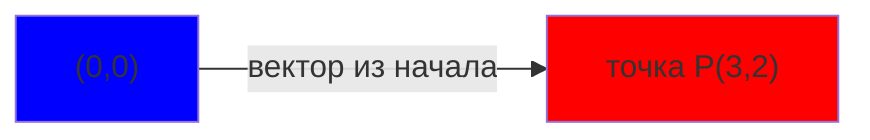

**Почему это мощно?** Если у вас есть две точки $A$ и $B$, вектор между ними:
$$\overrightarrow{AB} = (x_B - x_A, y_B - y_A)$$

Это позволяет любую геометрическую задачу переформулировать в алгебру. Хотите найти новую точку? Возьмите $C = A + (B - A) \cdot 0.5$ — это середина отрезка.

---

### 2. Сложение, вычитание, масштабирование: строим новые точки 🧮 {id: "geometry-add-sub-scale"}

Три простые операции, которые решают 70% всех задач:

| Операция | Формула | Зачем |
|----------|---------|-------|
| Сложение | $(x_1, y_1) + (x_2, y_2) = (x_1+x_2, y_1+y_2)$ | найти новую точку, сместив на вектор |
| Вычитание | $(x_1, y_1) - (x_2, y_2) = (x_1-x_2, y_1-y_2)$ | получить вектор между двумя точками |
| Масштабирование | $k \cdot (x, y) = (kx, ky)$ | растянуть/сжать вектор, развернуть назад |

**Визуальный пример:**

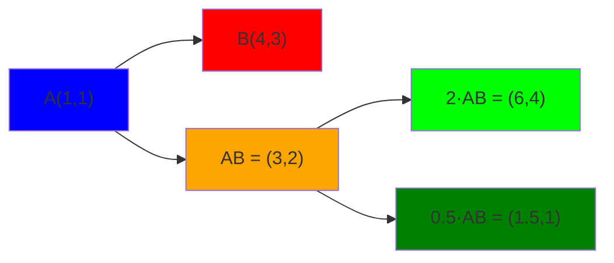

**В коде:** Пишем один раз структуру `Vec`, и дальше просто складываем:

```cpp
struct Vec { long long x, y; };
Vec operator+(Vec a, Vec b) { return {a.x+b.x, a.y+b.y}; }
Vec operator-(Vec a, Vec b) { return {a.x-b.x, a.y-b.y}; }
Vec operator*(long long k, Vec a) { return {k*a.x, k*a.y}; }
```

---

### 3. Скалярное произведение: про углы и проекции ⭐ {id: "geometry-dot-product"}

Самая важная операция. Её можно вычислить двумя способами — один ведёт к координатам, другой к углам:

**Координатная форма:**
$$a \cdot b = x_1x_2 + y_1y_2$$

**Геометрическая форма:**
$$a \cdot b = |a| \cdot |b| \cdot \cos(\alpha)$$

где $\alpha$ — угол между векторами $a$ и $b$.

**Что даёт знак скалярного произведения:**

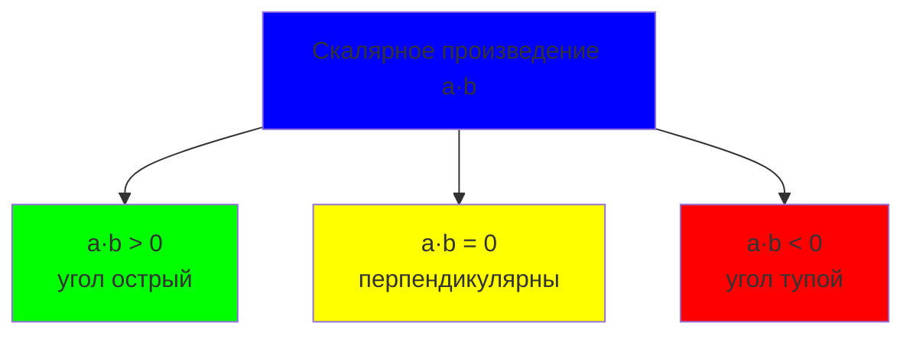

**Зачем это нужно в задачах:**

1. **Проверка угла** — не считая сам угол! 
   - Нужно узнать, острый ли угол в точке $B$ треугольника $ABC$? Возьмите $\overrightarrow{BA} \cdot \overrightarrow{BC}$:
     - если $> 0$ → острый;
     - если $= 0$ → прямой;
     - если $< 0$ → тупой.

2. **Проекция** — найти «тень» вектора на прямую:
   $$proj_{a}(b) = \frac{a \cdot b}{|a|^2} \cdot a$$
   
   Это помогает находить ближайшие точки и расстояния.

**Пример на картинке:**

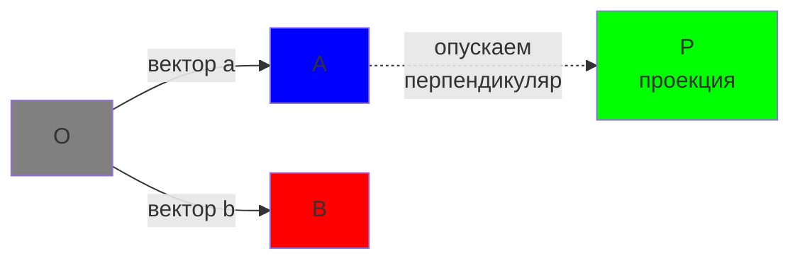

---

### 4. Векторное произведение: про площадь и ориентацию 🎯 {id: "geometry-cross-product"}

В 2D это псевдоскаляр — число, которое рассказывает, кто слева, кто справа и сколько места между векторами:

$$cross(a, b) = x_1 y_2 - x_2 y_1$$

**Что означает знак:**

| Результат | Смысл |
|-----------|-------|
| $cross > 0$ | $b$ **слева** от $a$, поворот **против часовой** |
| $cross = 0$ | $a$ и $b$ на одной прямой (**коллинеарны**) |
| $cross < 0$ | $b$ **справа** от $a$, поворот **по часовой** |

**Как это помогает в задачах:**

1. **Проверка точки относительно линии** — на какой она стороне?
   - Есть прямая через $P$ и $Q$, точка $X$. Вычислите $cross(\overrightarrow{PQ}, \overrightarrow{PX})$:
     - если $> 0$ → точка слева;
     - если $< 0$ → точка справа;
     - если $= 0$ → на прямой.

2. **Площадь параллелограмма** — $|cross(a, b)|$ это удвоенная площадь.

3. **Пересечения** — почти все проверки пересечений отрезков строятся на кросс-произведении.

**Визуально:**

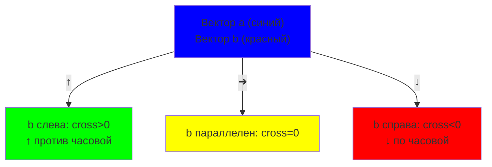

---

### 5. Длина вектора и квадрат длины 📏 {id: "geometry-length-of-vector""}

**Формула длины:**
$$|a| = \sqrt{x^2 + y^2}$$

**Но в коде почти никогда не берём корень!** Вместо этого используем **квадрат длины**:
$$|a|^2 = x^2 + y^2$$

**Почему?**

1. **Сравнение длин** — проверить, $|a| < |b|$? Просто сравните $x_a^2 + y_a^2 < x_b^2 + y_b^2$. Корень только потеряет точность!

2. **Целые числа** — если координаты целые, $|a|^2$ целое, а $|a|$ — иррациональное. Избегаем `sqrt` как огня.

3. **Скорость** — корень медленнее.

**Правило:**

- Нужно сравнить длины? → используйте $len^2$.
- Нужно найти реальную длину (например, для вывода)? → тогда `sqrt`, но это редко.

**Таблица расстояний без корней:**

```
Расстояние в квадрате    │  Без квадрата
─────────────────────────┼───────────────
|a|² = x² + y²           │  |a| = √(x² + y²)
(слишком редко нужна)    │  (слишком редко нужна)
```

---

### Резюме базы: пять суперсил 💪 {id: "geometry-5-superpower"}

| Суперсила | Функция | Решает |
|-----------|---------|--------|
| **Сложение/вычитание** | $(x_1±x_2, y_1±y_2)$ | найти новую точку, вектор между точками |
| **Масштабирование** | $k(x,y) = (kx, ky)$ | растянуть, развернуть, половинить |
| **Скалярное произведение (dot)** | $a·b = x_1x_2 + y_1y_2$ | углы, проекции, расстояния |
| **Векторное произведение (cross)** | $cross(a,b) = x_1y_2 - x_2y_1$ | слева/справа, площадь, коллинеарность |
| **Квадрат длины (len²)** | $\|a\|^2 = x^2 + y^2$ | сравнивать без корней |

Если вы освоили эти пять операций — вы уже решили половину геометрических задач.

---

## Теорема косинусов и теорема синусов {id: "trig-theorems"}

### Теорема косинусов: когда углы решают всё 📐 {id: "cos-theorem"}

**Забудьте про школьную формулу.** Вот что действительно нужно знать:

В треугольнике со сторонами $a, b, c$ и углом $\gamma$ напротив стороны $c$:
$$c^2 = a^2 + b^2 - 2ab\cos\gamma$$

Звучит сложно, но на самом деле это просто **переписанное скалярное произведение**:
$$a\cdot b = |a||b|\cos\gamma$$

**Что это даёт нам:**

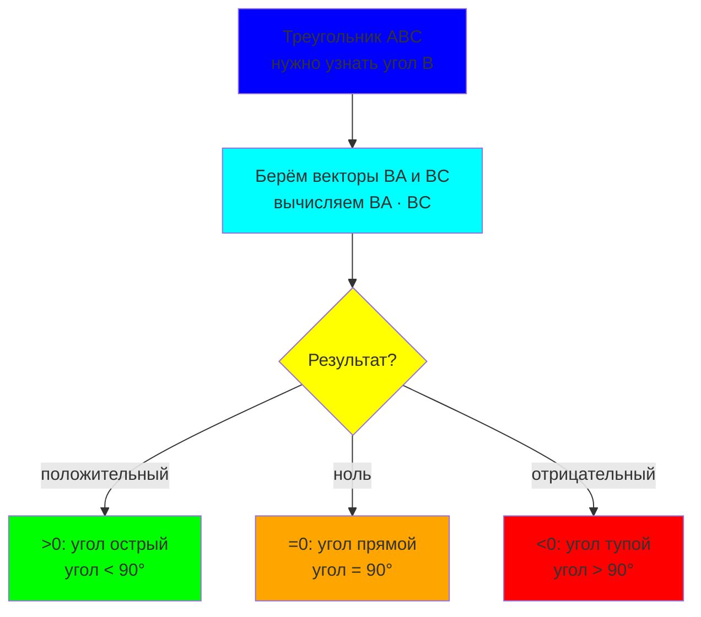

**Три практических применения:**

| Задача | Как решить | Формула |
|--------|-----------|---------|
| Проверить угол острый/тупой | Вычислить $\vec{BA} \cdot \vec{BC}$ | если $>0$ → острый |
| Найти третью сторону треугольника | Знаем $a, b$ и угол $\gamma$ | $c = \sqrt{a^2 + b^2 - 2ab\cos\gamma}$ |
| Проверить перпендикулярность | Вычислить $\vec{a} \cdot \vec{b}$ | если $=0$ → перпендикулярны |

**В коде:** никогда не считаем `cos` явно! Вместо этого:

```cpp
// Проверить, острый ли угол в точке B треугольника ABC
long long dot = (A - B) * (C - B);  // скалярное произведение
if (dot > 0) { /* острый */ }
else if (dot == 0) { /* прямой */ }
else { /* тупой */ }
```

Это работает без `sin`, `cos`, `sqrt` — чистая алгебра, ноль погрешностей. 🎯

---

### Теорема синусов: красива, но не нужна 🎪 {id: "sin-theorem"}

Формула (для общего развития):
$$\frac{a}{\sin A} = \frac{b}{\sin B} = \frac{c}{\sin C} = 2R$$

где $R$ — радиус описанной окружности треугольника.

**Честный диагноз:**

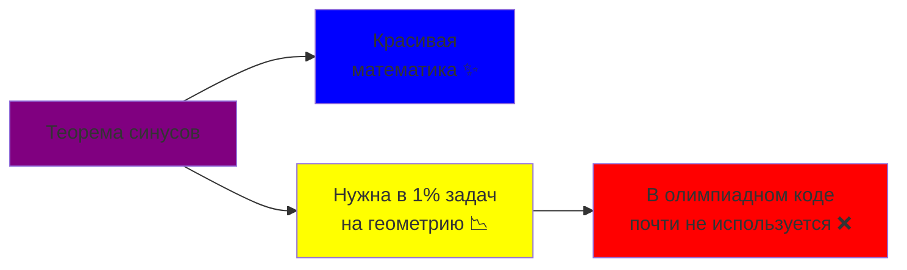

**Когда она может пригодиться:**

1. **Описанная окружность** — если вам надо найти её радиус, синусы появятся в формуле.
2. **Теоретические задачи** — редко, но бывают.
3. **Проверка интуиции** — помогает понимать связь между сторонами, углами и окружностями.

**Почему мы их игнорируем:**

- Синус и косинус добавляют **погрешности** (вещественные числа, `sqrt`, углы).
- Если что-то можно выразить через **cross** и **dot**, мы это делаем — чище и точнее.
- 90% проверок в задачах решаются **знаком произведения**, а не самим углом.

---

### Итоговый компас 🧭 {id: "trig-theorems-compass"}

| Что нужно | Используем | Не используем |
|-----------|-----------|--------------|
| Понять угол (острый/прямой/тупой) | $a \cdot b$ — скалярное произведение | `acos()`, `cos()` |
| Найти сторону по двум сторонам и углу | $c^2 = a^2 + b^2 - 2ab\cos\gamma$ | редко, только в теории |
| Определить, коллинеарны ли точки | $cross(a, b) = 0$ | синусы вообще |
| Считать площадь | $\|cross(a,b)\| / 2$ | опять же, без синусов |
| Проверить ориентацию (слева/справа) | $sign(cross(a,b))$ | никогда синусы |

**Суть:** в олимпиадном программировании геометрия — это **алгебра над координатами**. Углы существуют только как знаки и знаки произведений. Синусы и косинусы — красиво, но ненужно. ✨  

---

# Часть I: Структура кода и основные примитивы {id: "part-1-code-structure"}

## Золотой стандарт: struct Vec {id: "vec-struct"}

Всё начинается с одной структуры. Если вы пишете её один раз — дальше копируете везде, то в конспекте вы именно на месте.

**Идея:** вся геометрия — это координаты и операции над ними. Нам нужна одна **универсальная обвязка**, которая:
- хранит координаты;  
- поддерживает базовые операции (сложение, вычитание, масштабирование);  
- даёт нам `dot` и `cross` как готовые функции.  

### Небольшой ликбез: Operator Overloading и friend {id: "operator-overloading-friend"}

Если вы новичок в C++, в коде ниже вы встретите странные штуки вроде `operator+` и `friend`.  
Это не магия, всё просто!  

**Operator Overloading — позволяет использовать привычные операции `+`, `-` с нашими объектами:**

```cpp
// Обычно так: сложение чисел
int a = 5, b = 3;
int c = a + b;  // c = 8

// Мы хотим то же самое со своей структурой Vec:
Vec v1(1, 2), v2(3, 4);
Vec v3 = v1 + v2;  // хотим, чтобы это работало!
```

Для этого мы определяем **что означает `+` для нашей структуры**:

```cpp
Vec operator+(const Vec& v) const {
    // это означает: когда вы пишете (v1 + v2),
    // складываем координаты по отдельности
    return Vec(x + v.x, y + v.y);
}
```

| Оператор | Что означает | Пример |
|----------|-------------|--------|
| `operator+` | сложение | `v1 + v2` |
| `operator-` | вычитание | `v1 - v2` |
| `operator*` | умножение | `v * k` или `k * v` |
| `operator/` | деление | `v / k` |
| `operator==` | равенство | `v1 == v2` |

**Ключевое слово `friend` — разрешает функции видеть приватные поля:**

По умолчанию функции не могут обращаться к приватным полям структуры.  
Но для оператора `*` (умножение на скаляр слева) нам нужно особое разрешение:

```cpp
// Обычный operator* внутри структуры:
Vec operator*(long long k) const {
    return Vec(x * k, y * k);
}

// Это работает так: v * k (вектор умножить на число)
// Но не работает так: k * v (число умножить на вектор)

// Чтобы работало в обе стороны, пишем friend функцию:
friend Vec operator*(long long k, const Vec& v) {
    return v * k;  // просто "переворачиваем" порядок
}

// Теперь обе формы работают:
Vec v(1, 2);
Vec result1 = v * 3;      // внутренний operator* → (3, 6)
Vec result2 = 3 * v;      // friend operator* → (3, 6)
```

**Почему `friend`?** Потому что это **функция вне структуры**, но она имеет право видеть приватные поля `x` и `y`.  
Без `friend` это было бы невозможно.  

**Простой пример для интуиции:**

```cpp
struct Point {
    int x, y;
    
    // Я могу вызвать так: p1 + p2
    Point operator+(const Point& p) const {
        return Point(x + p.x, y + p.y);
    }
    
    // Я могу вызвать так: p * 5
    Point operator*(int k) const {
        return Point(x * k, y * k);
    }
    
    // Я могу вызвать так: 5 * p (число слева!)
    friend Point operator*(int k, const Point& p) {
        return p * k;
    }
};

// Использование:
Point p1(1, 2), p2(3, 4);
Point p3 = p1 + p2;      // (4, 6)
Point p4 = p1 * 2;       // (2, 4)
Point p5 = 3 * p1;       // (3, 6) — работает благодаря friend!
```

**Суть:** `operator+`, `operator-` и т.д. — это просто функции, которые говорят C++, как обращаться с `+`, `-` для нашей структуры.  `friend` — это пропуск, позволяющий функции видеть приватные поля.  

Теперь давайте напишем полный `Vec` с этими знаниями! ✨

---

```cpp
struct Vec {
    long long x, y;
    
    // Конструктор
    Vec(long long x = 0, long long y = 0) : x(x), y(y) {}
    
    // Сложение и вычитание
    Vec operator+(const Vec& v) const {
        return Vec(x + v.x, y + v.y);
    }
    
    Vec operator-(const Vec& v) const {
        return Vec(x - v.x, y - v.y);
    }
    
    // Унарный минус
    Vec operator-() const {
        return Vec(-x, -y);
    }
    
    // Масштабирование
    Vec operator*(long long k) const {
        return Vec(x * k, y * k);
    }
    
    friend Vec operator*(long long k, const Vec& v) {
        return v * k;
    }
};

// Скалярное произведение
long long dot(const Vec& a, const Vec& b) {
    return a.x * b.x + a.y * b.y;
}

// Векторное произведение (псевдоскаляр в 2D)
long long cross(const Vec& a, const Vec& b) {
    return a.x * b.y - a.y * b.x;
}

// Квадрат длины
long long len2(const Vec& v) {
    return dot(v, v);
}

// Функция для знака (работает с целыми и вещественными)
int sign(long long x) {
    if (x > 0) return 1;
    if (x < 0) return -1;
    return 0;
}
```

**Почему `long long`?**

- Координаты в задачах часто до $10^6$, перемножение — до $10^{12}$ → `long long` необходим.
- Целые числа — без погрешностей, ноль проблем с `sqrt` и округлением.

**Пример использования:**

```cpp
Vec A(1, 2), B(3, 4);
Vec AB = B - A;  // вектор от A к B: (2, 2)
long long d = dot(AB, AB);  // квадрат длины = 2² + 2² = 8
long long c = cross(AB, AB);  // всегда 0 (вектор параллелен сам себе)

// Operator overloading в действии:
Vec v1(1, 2), v2(3, 4);
Vec v3 = v1 + v2;      // (4, 6) — используем operator+
Vec v4 = v1 - v2;      // (-2, -2) — используем operator-
Vec v5 = v1 * 2;       // (2, 4) — используем operator*
Vec v6 = 3 * v1;       // (3, 6) — используем friend operator*
Vec v7 = -v1;          // (-1, -2) — унарный минус
```


---

## Базовые предикаты: проверки через знаки {id: "base-predicates"}

Теперь на базе `dot` и `cross` пишем универсальные проверки. **Ключевая идея:** почти все геометрические вопросы сводятся к знакам!

```cpp
// Коллинеарны ли два вектора? (на одной прямой)
bool collinear(const Vec& a, const Vec& b) {
    return cross(a, b) == 0;
}

// Перпендикулярны ли два вектора?
bool perpendicular(const Vec& a, const Vec& b) {
    return dot(a, b) == 0;
}

// Какой угол между векторами? (острый/прямой/тупой)
// Результат: 1 — острый, 0 — прямой, -1 — тупой
int angleType(const Vec& a, const Vec& b) {
    return sign(dot(a, b));
}

// На какой стороне от вектора a находится вектор b?
// Результат: 1 — слева, 0 — на прямой, -1 — справа
int side(const Vec& a, const Vec& b) {
    return sign(cross(a, b));
}

// Повернуть вектор на 90° против часовой стрелки
Vec rotateLeft(const Vec& v) {
    return Vec(-v.y, v.x);
}

// Повернуть вектор на 90° по часовой стрелке
Vec rotateRight(const Vec& v) {
    return Vec(v.y, -v.x);
}
```

**Теория за каждой функцией:**

| Функция | Формула | Интерпретация |
|---------|---------|---------------|
| `collinear(a, b)` | $cross(a, b) = 0$ | Вектор $b$ кратен $a$ (лежат на одной прямой) |
| `perpendicular(a, b)` | $dot(a, b) = 0$ | Угол между векторами 90° |
| `angleType(a, b)` | $sign(dot(a, b))$ | Острый? Прямой? Тупой? |
| `side(a, b)` | $sign(cross(a, b))$ | С какой стороны $a$ находится $b$ |
| `rotateLeft(v)` | $(x, y) \to (-y, x)$ | Поворот на 90° против часовой |

**Пример с диаграммой:**

```cpp
Vec a(1, 0);  // вектор вправо
Vec b(1, 1);  // вектор вправо-вверх

collinear(a, b);  // false — они не на одной линии
angleType(a, b);  // 1 — угол острый (dot = 1 > 0)
side(a, b);       // 1 — b слева от a (cross = 1 > 0)
rotateLeft(a);    // (0, 1) — вектор вверх
```

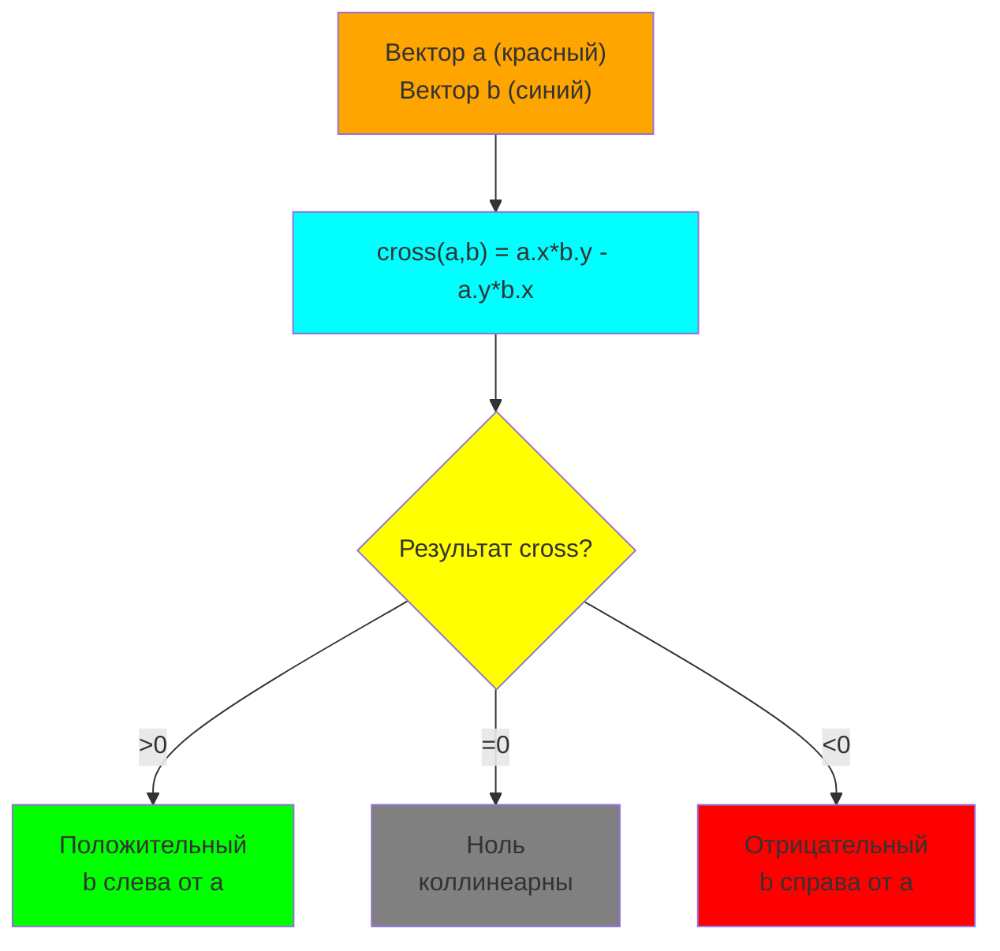

---

## Точка и прямая: первые геометрические объекты {id: "point-line-objects"}

**Теория:** прямую можно задать двумя способами:
1. **Параметрический вид**: точка + направляющий вектор.
2. **Неявный вид**: уравнение $ax + by + c = 0$.

В конспекте используем **параметрический** — он проще и не требует делений.

```cpp
// Типизируем: точка — это просто Vec
using Point = Vec;

// Прямая задаётся точкой и направляющим вектором
struct Line {
    Point p;   // точка на прямой
    Vec dir;   // направляющий вектор
    
    Line(Point p = Point(0, 0), Vec dir = Vec(1, 0)) : p(p), dir(dir) {}
};

// Прямая через две точки
Line lineThrough(Point a, Point b) {
    return Line(a, b - a);
}

// Лежит ли точка на прямой?
// Идея: если P на прямой через p с направлением dir, то
// вектор (P - p) коллинеарен dir, то есть cross((P - p), dir) = 0
bool onLine(const Line& l, const Point& p) {
    return cross(l.dir, p - l.p) == 0;
}

// На какой стороне от прямой находится точка?
// Результат: 1 — слева, 0 — на прямой, -1 — справа
int sideOfLine(const Line& l, const Point& p) {
    return sign(cross(l.dir, p - l.p));
}
```

**Как работает `onLine`:**

Пусть прямая проходит через точку $P_0$ с направлением $\vec{d}$. Точка $P$ лежит на этой прямой, если вектор $\overrightarrow{P_0P}$ коллинеарен $\vec{d}$:

$$cross(\vec{d}, \overrightarrow{P_0P}) = 0$$

Это срабатывает, потому что кросс-произведение коллинеарных векторов всегда равно нулю.

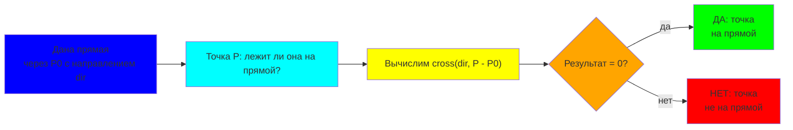

**Пример:**

```cpp
Point A(0, 0), B(2, 0), C(1, 1);
Line l = lineThrough(A, B);  // горизонтальная прямая через A и B

onLine(l, C);      // false — точка C не на прямой AB
sideOfLine(l, C);  // 1 — точка C слева от AB (выше)
```

---

## Отрезок и луч: первые ограничения {id: "segment-ray"}

**Теория:** отрезок и луч — это ограниченные версии прямой:
- **Отрезок AB**: все точки между $A$ и $B$ включительно.
- **Луч из A**: все точки начиная с $A$ в направлении вектора.

Проверки строятся на двух условиях:
1. точка на прямой (через `cross`);
2. точка в нужном диапазоне (через `dot`).

```cpp
// Отрезок: две точки
struct Segment {
    Point a, b;
    
    Segment(Point a = Point(0, 0), Point b = Point(0, 0)) : a(a), b(b) {}
    
    Vec dir() const { return b - a; }
};

// Луч: точка и направляющий вектор
struct Ray {
    Point p;
    Vec dir;
    
    Ray(Point p = Point(0, 0), Vec dir = Vec(1, 0)) : p(p), dir(dir) {}
};

// Лежит ли точка на луче? (включая точку луча)
bool onRay(const Ray& r, const Point& p) {
    // Условие 1: на прямой (cross = 0)
    if (cross(r.dir, p - r.p) != 0) return false;
    
    // Условие 2: в направлении луча (dot >= 0)
    return dot(r.dir, p - r.p) >= 0;
}

// Лежит ли точка на отрезке? (включая концы)
bool onSegment(const Segment& s, const Point& p) {
    // Условие 1: на прямой (cross = 0)
    if (cross(s.dir(), p - s.a) != 0) return false;
    
    // Условие 2: между концами
    // Параметр t = dot(AP, AB) должен быть в диапазоне [0, |AB|²]
    long long t = dot(s.dir(), p - s.a);
    long long len2 = dot(s.dir(), s.dir());
    
    return t >= 0 && t <= len2;
}
```

**Как работает `onRay`:**

1. Проверяем, лежит ли $P$ на прямой: $cross(\vec{dir}, \vec{AP}) = 0$.
2. Проверяем, в правильном ли направлении: $dot(\vec{dir}, \vec{AP}) \geq 0$ (значит, $\vec{AP}$ «смотрит» в том же направлении, что $\vec{dir}$).

Если оба условия верны — точка на луче. ✓

**Как работает `onSegment`:**

1. Точка на прямой: $cross(\vec{AB}, \vec{AP}) = 0$.
2. Точка между $A$ и $B$: параметр $t = \frac{\vec{AP} \cdot \vec{AB}}{|\vec{AB}|^2}$ должен быть в диапазоне $[0, 1]$ (в нашем коде мы проверяем $dot(\vec{AP}, \vec{AB}) \in [0, |AB|^2]$).

**Примеры:**

```cpp
Point A(0, 0), B(2, 0), P(1, 0), Q(3, 0);
Segment seg(A, B);
Ray r(A, Vec(1, 0));

onSegment(seg, P);  // true — P между A и B
onSegment(seg, Q);  // false — Q за пределами AB
onRay(r, Q);        // true — Q в направлении луча от A
```

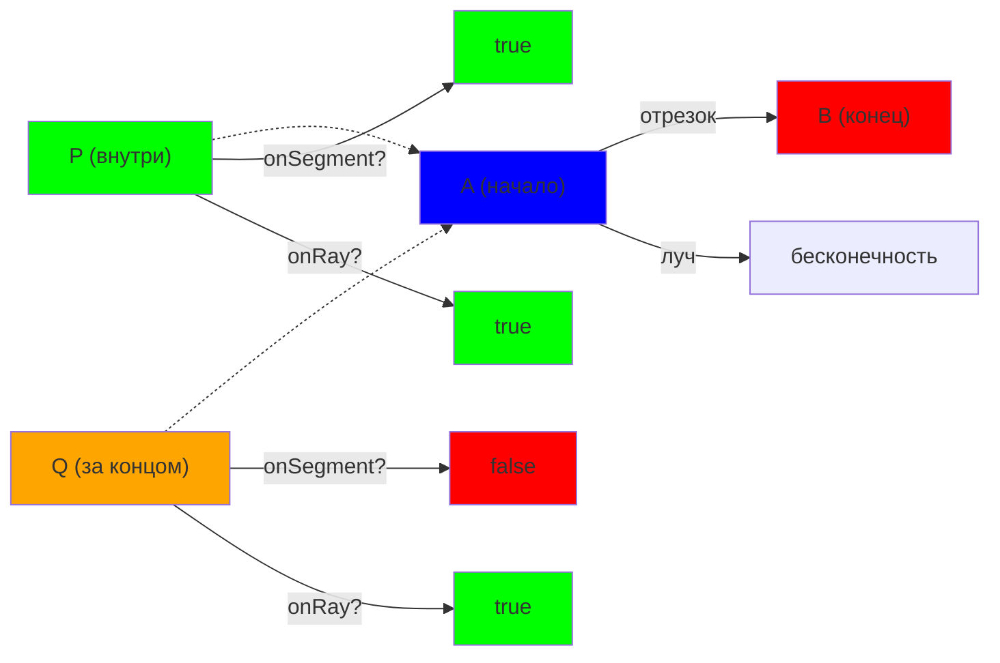

Теперь у вас есть основной набор примитивов. Дальше — пересечения, расстояния и более сложные фигуры.

---

# Часть II: Полное руководство по операциям {id: "part-2-operations-guide"}

## Раздел 1: Сложение и вычитание векторов {id: "vectors-addition-subtraction"}

### Почему это важно? 🤔

Сложение и вычитание — это **первый язык геометрии**. Через них мы:
- находим новые точки;
- вычисляем расстояния между точками;
- перемещаемся по координатной плоскости;
- строим все остальные операции.

**История:** в реальной жизни, если вы стоите в точке $A$, а хотите попасть в точку $B$, вам нужно пройти вектор $\overrightarrow{AB} = B - A$. Это вычитание!

### Теория {id: "addition-subtraction-theory"}

**Сложение векторов:**

Если у вас есть два вектора $\vec{a} = (x_1, y_1)$ и $\vec{b} = (x_2, y_2)$, их сумма:
$$\vec{a} + \vec{b} = (x_1 + x_2, y_1 + y_2)$$

**Геометрический смысл:** если вы идёте по вектору $\vec{a}$, а потом по вектору $\vec{b}$, итоговый результат — это вектор $\vec{a} + \vec{b}$.

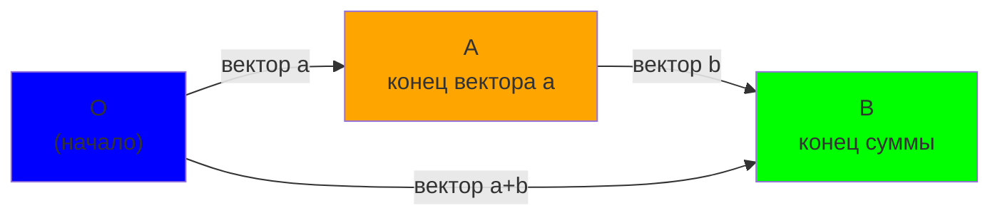

**Вычитание векторов:**

$$\vec{a} - \vec{b} = (x_1 - x_2, y_1 - y_2)$$

**Геометрический смысл:** это вектор, который нужно прибавить к $\vec{b}$, чтобы получить $\vec{a}$. Или проще: если вы хотите пойти от точки $B$ к точке $A$, нужен вектор $\overrightarrow{BA} = A - B$.

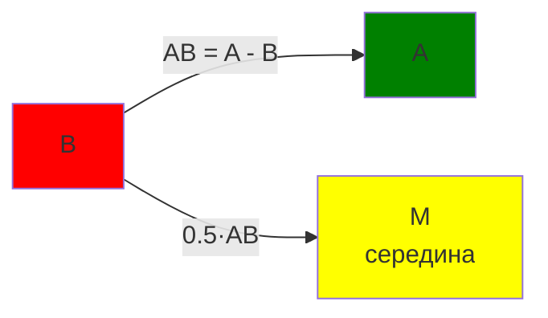

### Практические примеры {id: "addition-subtraction-examples"}

**Пример 1: Найти вектор между двумя точками**

```cpp
Point A(1, 2), B(4, 6);
Vec AB = B - A;  // (3, 4)

// Проверка: если идти из A в направлении AB, 
// мы придём в B
Point result = A + AB;  // (1,2) + (3,4) = (4,6) ✓
```

**Пример 2: Найти середину отрезка**

```cpp
Point A(0, 0), B(4, 4);
Point mid = A + (B - A) / 2;  // (0,0) + (2,2) = (2,2)

// Или можно так:
Point mid = (A + B) / 2;  // для целых чисел нужна осторожность!
```

**Пример 3: Сместить точку на вектор**

```cpp
Point P(5, 5);
Vec dir(2, 1);  // направление движения

Point newP = P + dir;       // (7, 6) — сместились на 1 шаг
Point newP2 = P + dir * 3;  // (11, 8) — сместились на 3 шага
```

### Визуальный тест {id: "addition-subtraction-visual"}

Представьте, что вы на координатной сетке:

```
    y
    |
6   |           B(4,6)
    |         /
5   |       /
    |     / AB = (3,4)
4   |   /
    | /
3   |
    | A(1,2)
2   |
    |
1   |
    |_________ x
    0  1  2  3  4
```

Видите? От $A$ к $B$ ровно $(3, 4)$ шага вправо-вверх. Это и есть $\overrightarrow{AB}$.

---

## Раздел 2: Скалярное произведение (dot product) {id: "dot-product-full"}

### Зачем нужно? 📊

Скалярное произведение — это **универсальный инструмент** для:
- проверки углов (острый? тупой? прямой?);
- проверки перпендикулярности;
- нахождения проекций;
- вычисления расстояний.

Это одна функция, которая решает половину задач.

### Определение {id: "dot-product-definition"}

**Две формулы:**

Координатная:
$$a \cdot b = x_1x_2 + y_1y_2$$

Геометрическая:
$$a \cdot b = |a| \cdot |b| \cdot \cos(\alpha)$$

где $\alpha$ — угол между векторами.

**Почему две формулы?** Потому что первая помогает считать (просто умножаем и складываем), а вторая помогает понимать (про углы и длины).

### Таблица: что означает результат {id: "dot-product-table"}

| Результат | Угол | Смысл |
|-----------|------|-------|
| $> 0$ | $0° < \alpha < 90°$ | Острый угол, векторы смотрят в похожих направлениях |
| $= 0$ | $90°$ | Прямой угол, векторы перпендикулярны |
| $< 0$ | $90° < \alpha < 180°$ | Тупой угол, векторы смотрят в противоположных направлениях |

### Визуализация {id: "dot-product-visualization"}

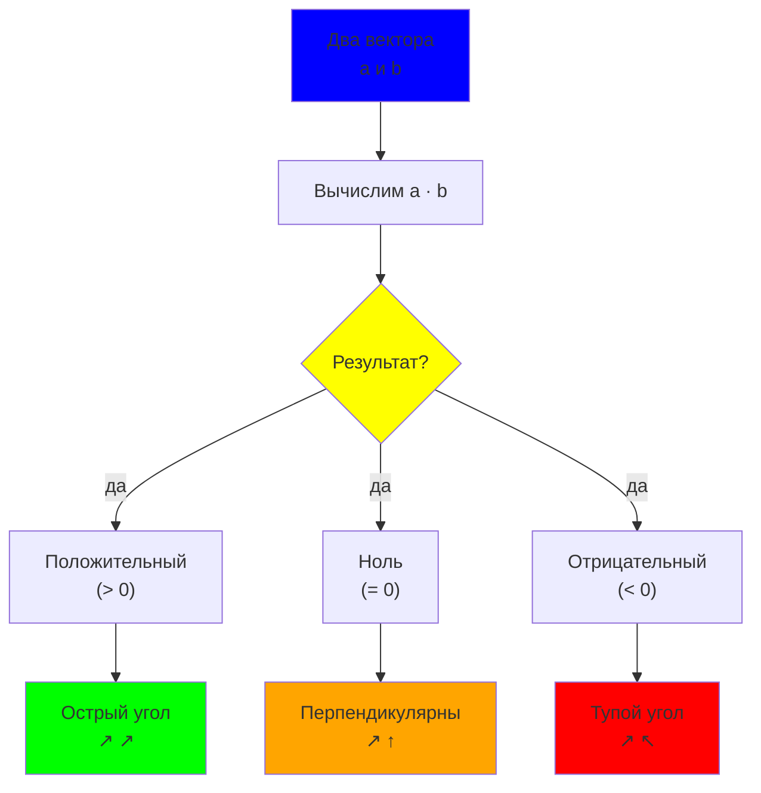

### Практические примеры {id: "dot-product-examples"}

**Пример 1: Проверить, острый ли угол в вершине треугольника**

```cpp
Point A(0, 0), B(1, 0), C(1, 1);

// Проверяем угол в точке B
Vec BA = A - B;  // (-1, 0)
Vec BC = C - B;  // (0, 1)

long long result = dot(BA, BC);  // (-1)*0 + 0*1 = 0

if (result > 0) cout << "Острый";
else if (result == 0) cout << "Прямой";  // Это наш случай!
else cout << "Тупой";
```

**Пример 2: Проверить перпендикулярность**

```cpp
Vec a(1, 2), b(2, -1);
long long prod = dot(a, b);  // 1*2 + 2*(-1) = 0

if (prod == 0) {
    cout << "Перпендикулярны!";
}
```

**Пример 3: Проверить, смотрят ли векторы в одну сторону**

```cpp
Vec a(1, 2), b(3, 6);  // b = 3 * a (параллельны и в одну сторону)
long long prod = dot(a, b);  // 1*3 + 2*6 = 15 > 0

cout << "Векторы смотрят в одну сторону!" << endl;
```

### Проекция — мощное применение {id: "dot-product-projection"}

**Что это?** Проекция вектора $\vec{b}$ на вектор $\vec{a}$ — это «тень» $\vec{b}$, если посмотреть вдоль $\vec{a}$.

**Формула:**
$$proj_{\vec{a}}(\vec{b}) = \frac{\vec{a} \cdot \vec{b}}{|\vec{a}|^2} \cdot \vec{a}$$

**В коде:**

```cpp
Vec a(1, 0), b(3, 4);

// Длина проекции (скаляр)
long long len_proj = dot(a, b) / dot(a, a);  // (3*1 + 4*0) / 1 = 3

// Сам вектор проекции (вектор)
Vec proj = (dot(a, b) / dot(a, a)) * a;  // 3 * (1, 0) = (3, 0)
```

**Геометрически:**

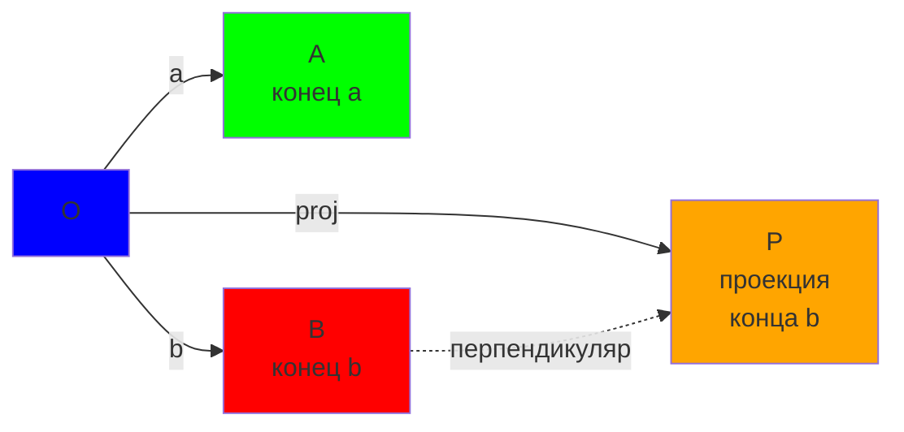

Видите? $P$ — это точка, где перпендикуляр из $B$ пересекает направление $\vec{a}$.

---

## Раздел 3: Векторное произведение (cross product) {id: "cross-product-full"}

### Зачем нужно? 🎯

Векторное произведение — это **король всех геометрических проверок**:
- определить, на какой стороне от прямой лежит точка;
- проверить, коллинеарны ли векторы;
- посчитать площадь треугольника;
- определить ориентацию (по часовой / против часовой);
- проверить пересечение отрезков.

### Определение {id: "cross-product-definition"}

В 2D векторное произведение — это число (псевдоскаляр):

$$cross(\vec{a}, \vec{b}) = x_1 y_2 - x_2 y_1$$

**Геометрический смысл:** это **ориентированная площадь** параллелограмма, построенного на векторах $\vec{a}$ и $\vec{b}$.

- Если положительно — площадь со знаком "+".
- Если отрицательно — площадь со знаком "-".
- Знак показывает ориентацию (по часовой или против часовой).

### Таблица: что означает результат {id: "cross-product-table"}

| Результат | Смысл |
|-----------|-------|
| $> 0$ | $\vec{b}$ **слева** от $\vec{a}$ (поворот **против часовой**) |
| $= 0$ | Векторы **коллинеарны** (на одной прямой) |
| $< 0$ | $\vec{b}$ **справа** от $\vec{a}$ (поворот **по часовой**) |

### Визуализация: слева/справа {id: "cross-product-left-right"}

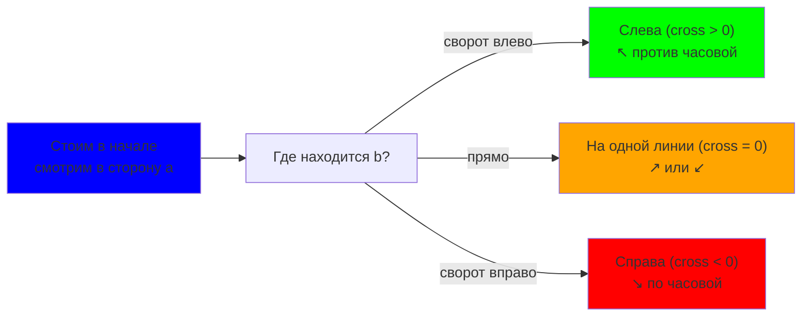

### Практические примеры {id: "cross-product-examples"}

**Пример 1: На какой стороне от прямой лежит точка?**

```cpp
Point P(0, 0), Q(2, 0);  // прямая горизонтальная
Point X(1, 1);           // проверяемая точка

Vec PQ = Q - P;   // (2, 0)
Vec PX = X - P;   // (1, 1)

long long cp = cross(PQ, PX);  // 2*1 - 0*1 = 2

if (cp > 0) cout << "X слева от прямой PQ";
else if (cp == 0) cout << "X на прямой PQ";
else cout << "X справа от прямой PQ";
```

**Пример 2: Коллинеарны ли три точки?**

```cpp
Point A(0, 0), B(2, 2), C(4, 4);

Vec AB = B - A;  // (2, 2)
Vec AC = C - A;  // (4, 4)

if (cross(AB, AC) == 0) {
    cout << "Три точки на одной прямой!";
}
```

**Пример 3: Посчитать площадь треугольника**

```cpp
Point A(0, 0), B(4, 0), C(2, 3);

Vec AB = B - A;  // (4, 0)
Vec AC = C - A;  // (2, 3)

long long area_doubled = abs(cross(AB, AC));  // |4*3 - 0*2| = 12
double area = area_doubled / 2.0;  // 6.0

cout << "Площадь: " << area;
```

### Правило правой руки (или просто: помня знак) {id: "cross-product-sign-rule"}

**Как запомнить, что означает знак?**

Представьте, что вы стоите в начале координат и смотрите в направлении $\vec{a}$:

- **Если $\vec{b}$ слева от вас** → поворот против часовой стрелки → $cross > 0$ ✅
- **Если $\vec{b}$ на одной линии** → нет поворота → $cross = 0$ ➡️
- **Если $\vec{b}$ справа от вас** → поворот по часовой стрелке → $cross < 0$ ❌

```cpp
Vec a(1, 0);   // смотрим вправо →
Vec b1(0, 1);  // вектор вверх ↑
Vec b2(1, 1);  // вектор вправо-вверх ↗
Vec b3(0, -1); // вектор вниз ↓

cout << cross(a, b1) << endl;  // 1 > 0 — b1 слева!
cout << cross(a, b2) << endl;  // 1 > 0 — b2 слева!
cout << cross(a, b3) << endl;  // -1 < 0 — b3 справа!
```

---

## Раздел 4: Длина и квадрат длины {id: "length-full"}

### Почему два способа? 📏

В программировании мы часто решаем: использовать ли $|a|$ или $|a|^2$?

**Ответ:** почти всегда $|a|^2$! Вот почему:

1. **Скорость:** корень медленнее умножения
2. **Точность:** если координаты целые, $|a|^2$ целое, а $|a|$ может быть иррациональным
3. **Сравнение:** $|a| < |b|$ эквивалентно $|a|^2 < |b|^2$, а второе считать дешевле

### Формулы {id: "length-formulas"}

**Длина вектора:**
$$|a| = \sqrt{x^2 + y^2}$$

**Квадрат длины:**
$$|a|^2 = x^2 + y^2$$

### Когда что использовать {id: "length-when-to-use"}

| Задача | Используем | Почему |
|--------|-----------|--------|
| Сравнить две длины ($\|a\| < \|b\|$?) | $\|a\|^2 < \|b\|^2$ | Нет корней, быстрее |
| Проверить, равны ли длины | $\|a\|^2 = \|b\|^2$ | Нет корней, точнее |
| Вывести реальное расстояние | $\sqrt{x^2 + y^2}$ | Только если нужно число |
| Проверить, ненулевая ли длина | $\|a\|^2 > 0$ | Нет корней |

### Практические примеры {id: "length-examples"}

**Пример 1: Какая из двух точек ближе?**

```cpp
Point current(0, 0);
Point a(3, 4), b(1, 1);

long long dist_a2 = len2(a - current);  // 9 + 16 = 25
long long dist_b2 = len2(b - current);  // 1 + 1 = 2

if (dist_a2 < dist_b2) {
    cout << "a ближе";
} else {
    cout << "b ближе";  // Это наш случай!
}
```

**Пример 2: Точка лежит на кругу радиуса r?**

```cpp
Point center(0, 0), p(3, 4);
long long r = 5;

long long dist2 = len2(p - center);  // 9 + 16 = 25
long long r2 = r * r;                 // 25

if (dist2 == r2) {
    cout << "На окружности!";
}
```

**Пример 3: Если ОЧЕНЬ нужна реальная длина**

```cpp
Point a(3, 4);
long long len2_val = len2(a);  // 25
double len_val = sqrt(len2_val);  // 5.0

cout << "Длина: " << len_val;
```

### Когда возникают проблемы {id: "length-pitfalls"}

⚠️ **Опасность 1: Забыли про квадрат**

```cpp
// ❌ НЕПРАВИЛЬНО: сравниваем длину с числом напрямую
if (len(v) < 5) { ... }  // медленно и неточно

// ✅ ПРАВИЛЬНО: сравниваем квадраты
if (len2(v) < 25) { ... }  // быстро и точно
```

⚠️ **Опасность 2: Переполнение**

```cpp
// ❌ НЕПРАВИЛЬНО: при координатах до 10^6 переполнение!
int x = 1000000, y = 1000000;
int len2_val = x*x + y*y;  // 2*10^12 > 2^31 - переполнение!

// ✅ ПРАВИЛЬНО: используем long long
long long x = 1000000, y = 1000000;
long long len2_val = x*x + y*y;  // OK
```

---

### Итоговая шпаргалка {id: "operations-cheatsheet"}

| Операция | Код | Возвращает | Когда использовать |
|----------|-----|-----------|-------------------|
| Сложение | `a + b` | Vec | Смещение точек |
| Вычитание | `a - b` | Vec | Вектор между точками |
| Скалярное произведение | `dot(a, b)` | long long | Углы, проекции |
| Векторное произведение | `cross(a, b)` | long long | Слева/справа, площадь |
| Квадрат длины | `len2(a)` | long long | Сравнение расстояний |
| Длина | `sqrt(len2(a))` | double | Реальное расстояние (редко!) |

---

## Раздел 5: Пересечения {id: "intersections"}

### Зачем нужно? 🤝

Пересечение объектов — это **вторая суперсила** в геометрии:
- пересекаются ли два отрезка (основная задача в контестах);
- пересекаются ли луч и отрезок;
- пересекаются ли две прямые;
- найти точку пересечения;
- обработка коллинеарных (граничных) случаев.

### Теория: пересечение отрезков {id: "segment-intersection-theory"}

**Ключевая идея:** два отрезка пересекаются, если концы каждого отрезка лежат по разные стороны от другого отрезка. Используем `cross` для проверки «слева/справа».

**Три случая:**

1. **Собственное пересечение** — отрезки пересекаются во внутренней точке.
2. **Касание** — отрезки пересекаются в общей точке (может быть конец одного).
3. **Наложение** — отрезки коллинеарны и пересекаются на подотрезке.

### Код: пересечение отрезков {id: "segment-intersection-code"}

```cpp
// Проверить, пересекаются ли два отрезка
// Возвращает true, если пересечение есть (включая касание)
bool segmentIntersect(Segment s1, Segment s2) {
    Vec d1 = s1.dir();
    Vec d2 = s2.dir();
    Vec d = s2.a - s1.a;  // вектор от начала s1 к началу s2
    
    long long c1 = cross(d1, d);      // ориентация s2.a относительно s1
    long long c2 = cross(d1, d + d2); // ориентация s2.b относительно s1
    long long c3 = cross(d2, -d);     // ориентация s1.a относительно s2
    long long c4 = cross(d2, -d - d1);// ориентация s1.b относительно s2
    
    // Собственное пересечение: точки по разные стороны
    if (sign(c1) * sign(c2) < 0 && sign(c3) * sign(c4) < 0) {
        return true;
    }
    
    // Касание: точка одного отрезка на другом
    if (onSegment(s1, s2.a) || onSegment(s1, s2.b) ||
        onSegment(s2, s1.a) || onSegment(s2, s1.b)) {
        return true;
    }
    
    return false;
}

// Найти точку пересечения (для отрезков с собственным пересечением)
Point intersectionPoint(Line l1, Line l2) {
    // Решаем систему:
    // l1.p + t * l1.dir = l2.p + s * l2.dir
    
    Vec d1 = l1.dir;
    Vec d2 = l2.dir;
    Vec d = l2.p - l1.p;
    
    long long denom = cross(d1, d2);
    if (denom == 0) return Point(LLONG_MIN, LLONG_MIN);  // параллельны
    
    long long t_num = cross(d2, d);
    
    // t = t_num / denom (как дробь)
    // Point = l1.p + (t_num / denom) * d1
    // Для целых координат: результат может быть дробным!
    // Здесь используем целые арифметические приближения
    
    return Point(l1.p.x + (d1.x * t_num) / denom,
                 l1.p.y + (d1.y * t_num) / denom);
}
```

**Важное замечание:** функция `intersectionPoint` вернёт неточный результат при делении. Для точного пересечения рекомендуется работать с параметрическим представлением.

### Практический пример {id: "segment-intersection-example"}

```cpp
Segment s1(Point(0, 0), Point(2, 2));
Segment s2(Point(0, 2), Point(2, 0));

if (segmentIntersect(s1, s2)) {
    cout << "Отрезки пересекаются!";  // Да, в точке (1, 1)
}
```

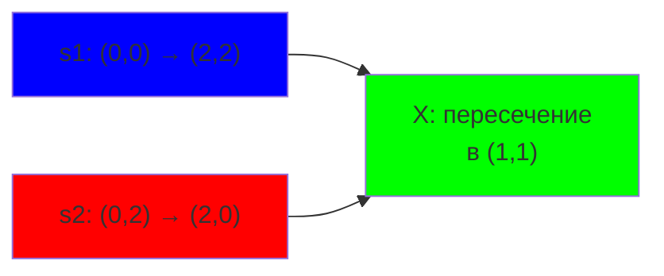

---

## Раздел 6: Проекции и расстояния {id: "projections-distances"}

### Зачем нужно? 📐

Проекции и расстояния решают **целый класс геометрических задач**:
- найти расстояние от точки до прямой;
- найти расстояние от точки до отрезка;
- найти ближайшую точку на отрезке;
- проверить, находится ли точка близко к линии.

### Проекция точки на прямую {id: "point-projection-on-line"}

**Теория:** Для прямой $l$ (точка $p$ + направление $dir$) и точки $P$ нужно найти её проекцию на прямую.

**Формула:** параметр $t = \frac{\overrightarrow{pP} \cdot \vec{dir}}{|\vec{dir}|^2}$, проекция $Q = p + t \cdot \vec{dir}$.

**В коде:**

```cpp
// Найти ближайшую точку на прямой к точке p
Point projectPointOnLine(const Line& l, const Point& p) {
    long long len_sq = dot(l.dir, l.dir);
    if (len_sq == 0) return l.p;  // вырожденная прямая
    
    long long t_num = dot(l.dir, p - l.p);
    
    // Возвращаем приблизительно целую координату
    // В реальных задачах может потребоваться работа с дробями
    return Point(l.p.x + (l.dir.x * t_num) / len_sq,
                 l.p.y + (l.dir.y * t_num) / len_sq);
}

// Расстояние от точки до прямой (в квадратах, чтобы избежать sqrt)
long long distPointToLine2(const Line& l, const Point& p) {
    long long cp = cross(l.dir, p - l.p);
    long long dir_len2 = dot(l.dir, l.dir);
    
    // dist² = (cp)² / dir_len²
    return (cp * cp) / dir_len2;
}
```

### Расстояние от точки до отрезка {id: "point-to-segment-distance"}

**Сложнее:**  проекция может оказаться вне отрезка, тогда ближайшая точка — один из концов.

**Алгоритм:**

1. Найди проекцию точки на прямую.
2. Если проекция между концами отрезка — это ответ.
3. Иначе ближайшая точка — ближайший конец отрезка.

**В коде:**

```cpp
// Найти ближайшую точку на отрезке к точке p
Point projectPointOnSegment(const Segment& s, const Point& p) {
    long long dir_len2 = dot(s.dir(), s.dir());
    if (dir_len2 == 0) return s.a;  // вырожденный отрезок
    
    long long t_num = dot(s.dir(), p - s.a);
    
    if (t_num <= 0) return s.a;           // проекция до начала
    if (t_num >= dir_len2) return s.b;    // проекция после конца
    
    // проекция внутри отрезка
    return Point(s.a.x + (s.dir().x * t_num) / dir_len2,
                 s.a.y + (s.dir().y * t_num) / dir_len2);
}

// Квадрат расстояния от точки до отрезка
long long distPointToSegment2(const Segment& s, const Point& p) {
    Point proj = projectPointOnSegment(s, p);
    return len2(p - proj);
}
```

### ⚠️ Осторожно с целочисленными проекциями {id: "projection-precision"}

Версии выше удобны для дискретных проверок, но они обрезают дробную часть. Если задачка требует реальные координаты или точное расстояние, переключаемся на `long double`.

```cpp
struct PointLD {
    long double x, y;
    PointLD(long double x = 0.0L, long double y = 0.0L) : x(x), y(y) {}
};

const long double EPS_LD = 1e-18L;

PointLD projectPointOnLinePrecise(const Line& l, const Point& p) {
    long double len_sq = static_cast<long double>(len2(l.dir));
    if (fabsl(len_sq) < EPS_LD) {
        return PointLD(l.p.x, l.p.y);
    }
    long double t = static_cast<long double>(dot(l.dir, p - l.p)) / len_sq;
    return PointLD(l.p.x + t * l.dir.x, l.p.y + t * l.dir.y);
}

long double distPointToLinePrecise2(const Line& l, const Point& p) {
    long double cp = static_cast<long double>(cross(l.dir, p - l.p));
    long double len_sq = static_cast<long double>(len2(l.dir));
    if (fabsl(len_sq) < EPS_LD) {
        return 0.0L;
    }
    return (cp * cp) / len_sq;
}

PointLD projectPointOnSegmentPrecise(const Segment& s, const Point& p) {
    long double len_sq = static_cast<long double>(len2(s.dir()));
    if (fabsl(len_sq) < EPS_LD) {
        return PointLD(s.a.x, s.a.y);
    }
    long double t = static_cast<long double>(dot(s.dir(), p - s.a)) / len_sq;
    t = max(0.0L, min(1.0L, t));
    return PointLD(s.a.x + t * s.dir().x, s.a.y + t * s.dir().y);
}

long double distPointToSegmentPrecise2(const Segment& s, const Point& p) {
    PointLD proj = projectPointOnSegmentPrecise(s, p);
    long double dx = proj.x - p.x;
    long double dy = proj.y - p.y;
    return dx * dx + dy * dy;
}
```

> Нужна сама длина — берём `sqrt()` от квадрата. Сравнение квадратов остаётся быстрым, но точность больше не теряется.

### Практический пример {id: "projection-example"}

```cpp
Segment s(Point(0, 0), Point(4, 0));
Point p(2, 3);

Point closest = projectPointOnSegment(s, p);  // (2, 0)
long long dist2 = distPointToSegment2(s, p);   // 9 (расстояние = 3)

cout << "Ближайшая точка: (" << closest.x << ", " << closest.y << ")";
cout << "Расстояние²: " << dist2;
```

---

## Раздел 7: Многоугольники {id: "polygons"}

### Зачем нужно? 🔷

Многоугольники — это **основа для более сложных задач**:
- посчитать площадь многоугольника;
- проверить, принадлежит ли точка многоугольнику;
- проверить, выпуклый ли многоугольник;
- найти периметр и центр масс;
- проверить пересечения с другими объектами;
- построить минимальный охватывающий многоугольник.

### Геометрическое определение многоугольника {id: "polygon-definition"}

**Многоугольник** — это замкнутая фигура, ограниченная конечной последовательностью прямых отрезков (сторон), соединяющих последовательность вершин.

**Типы многоугольников:**

| Тип | Определение | Признак |
|-----|-----------|---------|
| **Простой** | стороны не пересекаются | нет самопересечений |
| **Выпуклый** | все внутренние углы < 180° | все точки на одной стороне каждого ребра |
| **Звёздчатый** | имеет вмятины (невыпуклый) | есть рефлекторные углы (> 180°) |
| **Правильный** | все стороны и углы равны | равносторонний и равноугольный |

**Представление в коде:**

```cpp
// Многоугольник — это просто вектор точек
typedef vector<Point> Polygon;

// Создаём многоугольник (вершины в порядке обхода)
Polygon triangle = {{0, 0}, {4, 0}, {2, 3}};
Polygon square = {{0, 0}, {2, 0}, {2, 2}, {0, 2}};
```

### Площадь многоугольника (Shoelace Formula) {id: "polygon-area"}

**Теория (shoelace formula):** площадь многоугольника с вершинами $(x_1, y_1), \ldots, (x_n, y_n)$ (заданными в порядке обхода):

$$S = \frac{1}{2} \left| \sum_{i=1}^{n} (x_i y_{i+1} - x_{i+1} y_i) \right|$$

где индексы циклические ($y_{n+1} = y_1$).

**Геометрический смысл:** это сумма кросс-произведений рёбер многоугольника, разделённая пополам.

**Почему это работает:**

1. Каждое слагаемое $x_i y_{i+1} - x_{i+1} y_i$ — это удвоенная площадь треугольника, образованного ребром $(P_i P_{i+1})$ и началом координат.
2. Сумма даёт удвоенную знаковую площадь (со знаком, зависящим от ориентации).
3. Мы берём абсолютное значение, чтобы игнорировать ориентацию.

**Визуально:**

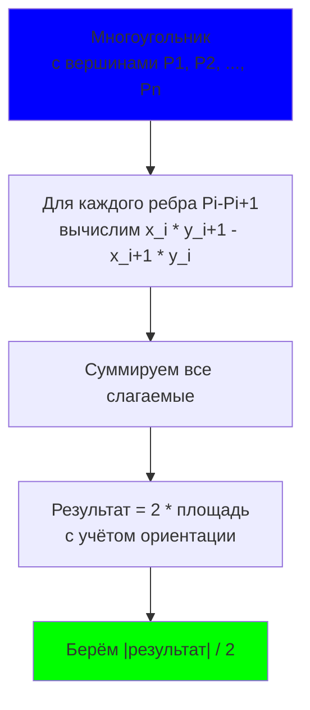

**Пример (треугольник):**

```
Вершины: (0,0), (4,0), (2,3)

Слагаемые:
- (0·0 - 4·0) = 0
- (4·3 - 2·0) = 12
- (2·0 - 0·3) = 0
Сумма = 12

Площадь = |12| / 2 = 6 ✓
```

**В коде:**

```cpp
// Посчитать площадь многоугольника (удвоенную, чтобы избежать дробей)
long long polygonArea2(const Polygon& poly) {
    long long area = 0;
    int n = poly.size();
    
    for (int i = 0; i < n; i++) {
        int j = (i + 1) % n;
        area += cross(poly[i], poly[j]);
    }
    
    return abs(area);
}

// Получить реальную площадь (с делением)
double polygonArea(const Polygon& poly) {
    return polygonArea2(poly) / 2.0;
}

// Проверить ориентацию многоугольника (по часовой или против часовой)
bool isCounterClockwise(const Polygon& poly) {
    long long area = 0;
    int n = poly.size();
    
    for (int i = 0; i < n; i++) {
        int j = (i + 1) % n;
        area += cross(poly[i], poly[j]);
    }
    
    return area > 0;  // положительная площадь = против часовой
}
```

**Практический пример:**

```cpp
Polygon triangle = {{0, 0}, {4, 0}, {2, 3}};
long long area2 = polygonArea2(triangle);  // 12
double area = polygonArea(triangle);        // 6.0

if (isCounterClockwise(triangle)) {
    cout << "Вершины обходятся против часовой стрелки";
} else {
    cout << "Вершины обходятся по часовой стрелке";
}
```

### Периметр многоугольника {id: "polygon-perimeter"}

**Теория:** периметр — это сумма длин всех сторон.

$$P = \sum_{i=1}^{n} |P_i P_{i+1}|$$

**В коде:**

```cpp
// Посчитать периметр многоугольника
long long polygonPerimeter2(const Polygon& poly) {
    long long perimeter = 0;
    int n = poly.size();
    
    for (int i = 0; i < n; i++) {
        int j = (i + 1) % n;
        perimeter += len2(poly[j] - poly[i]);  // суммируем квадраты
    }
    
    return perimeter;  // для сравнений используем без корня
}

// Реальный периметр (с корнями — медленнее!)
double polygonPerimeter(const Polygon& poly) {
    double perim = 0;
    int n = poly.size();
    
    for (int i = 0; i < n; i++) {
        int j = (i + 1) % n;
        perim += sqrt(len2(poly[j] - poly[i]));
    }
    
    return perim;
}
```

### Центр масс (центроид) многоугольника {id: "polygon-centroid"}

**Определение:** центр масс (центроид) многоугольника — это средневзвешенная позиция всех вершин.

**Формула:**

$$C_x = \frac{1}{6A} \sum_{i=1}^{n} (x_i + x_{i+1})(x_i y_{i+1} - x_{i+1} y_i)$$

$$C_y = \frac{1}{6A} \sum_{i=1}^{n} (y_i + y_{i+1})(x_i y_{i+1} - x_{i+1} y_i)$$

где $A$ — площадь многоугольника.

**В коде:**

```cpp
// Найти центр масс (центроид) многоугольника
Point polygonCentroid(const Polygon& poly) {
    long long area = 0;
    long long cx = 0, cy = 0;
    int n = poly.size();
    
    for (int i = 0; i < n; i++) {
        int j = (i + 1) % n;
        long long cross_prod = cross(poly[i], poly[j]);
        
        area += cross_prod;
        cx += (poly[i].x + poly[j].x) * cross_prod;
        cy += (poly[i].y + poly[j].y) * cross_prod;
    }
    
    if (area == 0) return Point(0, 0);  // вырожденный случай
    
    // Результат приблизительный (целые координаты)
    return Point(cx / (3 * area), cy / (3 * area));
}
```

### Проверка выпуклости многоугольника {id: "polygon-convexity"}

**Определение:** многоугольник выпуклый, если все повороты (кросс-произведения соседних рёбер) имеют один и тот же знак.

**Идея:** если при движении по вершинам мы всегда поворачиваем в одну сторону (влево или вправо), многоугольник выпуклый.

**В коде:**

```cpp
// Проверить, является ли многоугольник выпуклым
bool isConvex(const Polygon& poly) {
    int n = poly.size();
    if (n < 3) return false;
    
    bool has_positive = false, has_negative = false;
    
    for (int i = 0; i < n; i++) {
        Point a = poly[i];
        Point b = poly[(i + 1) % n];
        Point c = poly[(i + 2) % n];
        
        long long cp = cross(b - a, c - b);
        
        if (cp > 0) has_positive = true;
        if (cp < 0) has_negative = true;
    }
    
    // Если есть повороты в обе стороны — невыпуклый
    return !(has_positive && has_negative);
}
```

**Пример:**

```cpp
Polygon convex = {{0, 0}, {2, 0}, {2, 2}, {0, 2}};      // квадрат
Polygon star = {{0, 2}, {1, 1}, {2, 2}, {1, 0}, {2, 0}}; // звезда

cout << isConvex(convex) << endl;  // true
cout << isConvex(star) << endl;    // false
```

### Принадлежность точки многоугольнику {id: "point-in-polygon"}

**Лучевой метод (Ray Casting):** проведите луч из точки в одном направлении (обычно вправо) и посчитайте, сколько сторон многоугольника он пересекает:
- **чётное число пересечений** → точка **снаружи**;
- **нечётное число пересечений** → точка **внутри**.

**Почему это работает:** каждый раз, когда луч входит в многоугольник, он должен выйти. Нечётное число пересечений означает, что луч всё ещё внутри.

**Визуально:**

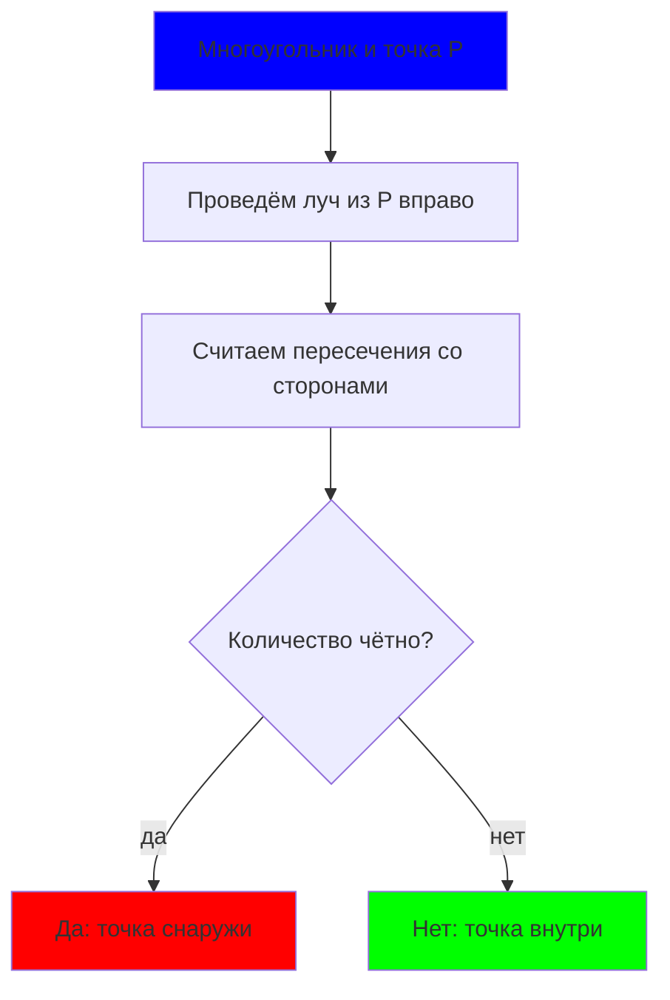

**В коде (базовая версия):**

```cpp
// Проверить, лежит ли точка внутри многоугольника (лучевой метод)
bool pointInPolygon(const Polygon& poly, const Point& p) {
    int n = poly.size();
    int count = 0;
    
    for (int i = 0; i < n; i++) {
        Point a = poly[i];
        Point b = poly[(i + 1) % n];
        
        // Луч вправо от p (проверяем, пересекает ли ребро луч)
        if ((a.y <= p.y && p.y < b.y) || (b.y <= p.y && p.y < a.y)) {
            // Вычислим x-координату пересечения
            long long cp = cross(b - a, p - a);
            
            // Если пересечение справа от p
            if ((a.y < b.y && cp > 0) || (b.y < a.y && cp < 0)) {
                count++;
            }
        }
    }
    
    return count % 2 == 1;
}
```

**Расширенная версия (с проверкой границ):**

```cpp
enum PointInPolygon {
    INSIDE,      // внутри
    OUTSIDE,     // снаружи
    ON_BOUNDARY  // на границе
};

PointInPolygon pointInPolygonEx(const Polygon& poly, const Point& p) {
    int n = poly.size();
    
    // Проверка: лежит ли точка на каком-нибудь ребре?
    for (int i = 0; i < n; i++) {
        Segment s(poly[i], poly[(i + 1) % n]);
        if (onSegment(s, p)) {
            return ON_BOUNDARY;
        }
    }
    
    // Лучевой метод
    int count = 0;
    for (int i = 0; i < n; i++) {
        Point a = poly[i];
        Point b = poly[(i + 1) % n];
        
        if ((a.y <= p.y && p.y < b.y) || (b.y <= p.y && p.y < a.y)) {
            long long cp = cross(b - a, p - a);
            if ((a.y < b.y && cp > 0) || (b.y < a.y && cp < 0)) {
                count++;
            }
        }
    }
    
    return (count % 2 == 1) ? INSIDE : OUTSIDE;
}
```

**Пример:**

```cpp
Polygon triangle = {{0, 0}, {4, 0}, {2, 3}};

cout << pointInPolygon(triangle, Point(2, 1)) << endl;  // true (внутри)
cout << pointInPolygon(triangle, Point(5, 0)) << endl;  // false (снаружи)
cout << pointInPolygonEx(triangle, Point(2, 0)) << endl; // ON_BOUNDARY (на ребре)
```

### Практические примеры {id: "polygon-examples"}

**Пример 1: Вычислить все параметры многоугольника**

```cpp
Polygon poly = {{0, 0}, {3, 0}, {3, 4}, {0, 4}};

long long area2 = polygonArea2(poly);           // 48
double area = polygonArea(poly);                // 12.0
bool ccw = isCounterClockwise(poly);            // true/false
bool convex = isConvex(poly);                   // true
Point center = polygonCentroid(poly);           // (1.5, 2)

cout << "Площадь: " << area << endl;
cout << "Выпуклый: " << (convex ? "да" : "нет") << endl;
cout << "Центр масс: (" << center.x << ", " << center.y << ")" << endl;
```

**Пример 2: Найти все точки из набора, которые внутри многоугольника**

```cpp
Polygon boundary = {{0, 0}, {10, 0}, {10, 10}, {0, 10}};
vector<Point> points = {{5, 5}, {15, 5}, {0, 0}, {5, 0}};

vector<Point> inside_points;
for (const Point& p : points) {
    if (pointInPolygon(boundary, p)) {
        inside_points.push_back(p);
    }
}

cout << "Точек внутри: " << inside_points.size() << endl;
```

**Пример 3: Проверить, прямоугольник ли это**

```cpp
bool isRectangle(const Polygon& poly) {
    if (poly.size() != 4) return false;
    if (!isConvex(poly)) return false;
    
    // Проверяем все углы прямые
    for (int i = 0; i < 4; i++) {
        Point a = poly[i];
        Point b = poly[(i + 1) % 4];
        Point c = poly[(i + 2) % 4];
        
        if (dot(b - a, c - b) != 0) {  // угол не 90°
            return false;
        }
    }
    
    return true;
}
```

---

## Раздел 8: Выпуклая оболочка {id: "convex-hull"}

### Зачем нужно? 🏔️

Выпуклая оболочка — это **минимальный выпуклый многоугольник**, содержащий все точки. Используется в:
- поиске экстремальных точек;
- ускорении геометрических запросов;
- задачах на оптимизацию;
- определении границы набора точек.

**Геометрическое определение:** если вообразить точки как гвозди на доске, а выпуклую оболочку как резинку, натянутую вокруг всех гвоздей, то резинка образует выпуклую оболочку.

### Сравнение алгоритмов {id: "hull-algorithms-comparison"}

| Алгоритм | Сложность | Когда использовать |
|----------|-----------|-------------------|
| **Эндрю (Andrew's)** | $O(n \log n)$ | стандартный выбор (сортировка) |
| **Джарвис (Gift Wrapping)** | $O(nh)$, где $h$ — размер оболочки | когда $h$ мало (оболочка маленькая) |
| **Чан (Chan)** | $O(n \log h)$ | оптимален для любых $h$ |
| **Graham** | $O(n \log n)$ | альтернатива Эндрю, более сложный |

где $n$ — количество точек, $h$ — количество точек на оболочке.

### Алгоритм Эндрю (монотонная оболочка) {id: "andrew-algorithm"}

**Геометрическая идея:** 
1. Отсортировать точки слева направо.
2. Построить **нижнюю оболочку** (идём слева направо, поворачиваем вправо).
3. Построить **верхнюю оболочку** (идём справа налево, поворачиваем вправо).
4. Объединить обе оболочки.

**Ключевой момент:** используем кросс-произведение для проверки поворотов. Если `cross <= 0`, значит поворот не влево, удаляем последнюю точку.

```cpp
// Построить выпуклую оболочку методом Эндрю
vector<Point> convexHullAndrew(vector<Point> points) {
    int n = points.size();
    if (n < 3) return points;  // вырожденный случай
    
    // Сортируем по x, затем по y
    sort(points.begin(), points.end(), [](const Point& a, const Point& b) {
        return a.x < b.x || (a.x == b.x && a.y < b.y);
    });
    
    vector<Point> hull;
    
    // Нижняя оболочка (слева направо)
    for (int i = 0; i < n; i++) {
        while (hull.size() >= 2 && 
               cross(hull[hull.size()-1] - hull[hull.size()-2],
                     points[i] - hull[hull.size()-2]) <= 0) {
            hull.pop_back();
        }
        hull.push_back(points[i]);
    }
    
    // Верхняя оболочка (справа налево)
    int lower_size = hull.size();
    for (int i = n - 2; i >= 0; i--) {
        while (hull.size() > lower_size && 
               cross(hull[hull.size()-1] - hull[hull.size()-2],
                     points[i] - hull[hull.size()-2]) <= 0) {
            hull.pop_back();
        }
        hull.push_back(points[i]);
    }
    
    hull.pop_back();  // удалить последнюю точку (она совпадает с первой)
    return hull;
}
```

**Временная сложность:** $O(n \log n)$ (за счёт сортировки).

**Визуальный пример:**

```
Точки: (0,0), (1,1), (2,0), (1,2), (0,1)

Сортированные: (0,0), (0,1), (1,1), (1,2), (2,0)

Нижняя оболочка:
  (0,0) → (0,1) → (1,1) → (2,0)
  
Верхняя оболочка:
  (2,0) → (1,2) → (0,1) → (0,0)

Итоговая оболочка: (0,0) → (2,0) → (1,2) → (0,0)
```

---

### Алгоритм Джарвиса (Gift Wrapping, Оборачивание подарка) {id: "jarvis-algorithm"}

**Геометрическая идея:** представьте, что вы оборачиваете набор точек подарочной лентой. Начинаете с самой левой точки, затем поворачиваетесь и ищете следующую точку, которая находится максимально "вправо" относительно текущего направления.

**Алгоритм пошагово:**

1. **Найти стартовую точку** — самая левая точка (или самая нижняя при одинаковом x).
2. **Для каждой текущей точки:**
   - Найти следующую точку так, чтобы все остальные точки были слева от вектора (текущая → следующая).
   - Используем кросс-произведение: для точки $P$ она "левее" прямой $(A, B)$, если $cross(B-A, P-A) > 0$.
3. **Продолжать, пока не вернёмся к стартовой точке.**

**Почему "вправо"?** Потому что мы ищем точку, которая максимально поворачивает вправо (или минимально поворачивает влево). Это гарантирует, что мы идём по границе выпуклой оболочки.

**В коде:**

```cpp
// Построить выпуклую оболочку методом Джарвиса (Gift Wrapping)
vector<Point> convexHullJarvis(vector<Point> points) {
    int n = points.size();
    if (n < 3) return points;
    
    vector<Point> hull;
    
    // Найти самую левую точку (стартовую)
    int leftmost = 0;
    for (int i = 1; i < n; i++) {
        if (points[i].x < points[leftmost].x ||
            (points[i].x == points[leftmost].x && points[i].y < points[leftmost].y)) {
            leftmost = i;
        }
    }
    
    // Начнём с самой левой точки
    int current = leftmost;
    
    do {
        hull.push_back(points[current]);
        
        // Найти следующую точку
        // Ищем точку, для которой все остальные слева от линии (current → next)
        int next = (current + 1) % n;
        
        for (int i = 0; i < n; i++) {
            // Если точка i "правее" (или на одной линии, но дальше)
            long long cp = cross(points[next] - points[current],
                                  points[i] - points[current]);
            
            if (cp > 0 ||  // i слева от (current → next), выбираем i
                (cp == 0 && len2(points[i] - points[current]) > 
                            len2(points[next] - points[current]))) {  // дальше на одной линии
                next = i;
            }
        }
        
        current = next;
    } while (current != leftmost);  // пока не вернулись к началу
    
    return hull;
}
```

**Пример пошагово:**

```
Исходные точки: (0,0), (2,0), (1,1), (1,2), (0,1)

Шаг 1: Стартовая точка (0,0)
Шаг 2: Ищем следующую
  - Проверяем все точки: какая максимально "вправо"?
  - Выбираем (2,0)
  
Шаг 3: Из (2,0) ищем следующую
  - Выбираем (1,2) — потому что все остальные слева от этого направления
  
Шаг 4: Из (1,2) ищем следующую
  - Выбираем (0,0) (вернулись в начало)

Оболочка: (0,0) → (2,0) → (1,2) → (0,0)
```

**Временная сложность:** $O(n \cdot h)$, где $h$ — размер оболочки.
- Внешний цикл: $h$ итераций (все точки оболочки).
- Внутренний цикл: $n$ проверок (для каждой итерации).

**Когда использовать Джарвис?**
- Если размер оболочки $h$ очень мал (константа или логарифм), то $O(n \cdot h)$ лучше, чем $O(n \log n)$.
- Для "разреженных" облаков точек (большинство внутри).
- Когда нужна простая реализация и нет жёстких требований по производительности.

**Диаграмма процесса:**

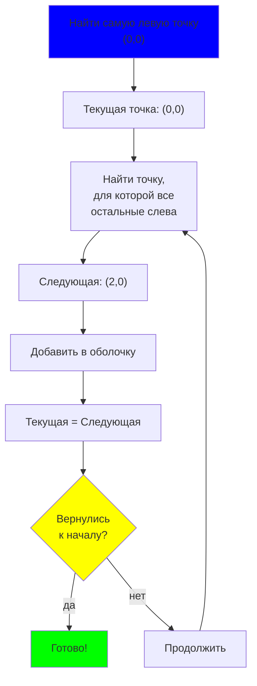

### Практическое сравнение {id: "hull-practical-example"}

```cpp
vector<Point> points = {
    {0, 0}, {1, 1}, {2, 0}, {1, 2}, {0, 1},
    {1, 0}, {0.5, 0.5}
};

// Оба метода дают одинаковый результат:
vector<Point> hull1 = convexHullAndrew(points);    // O(n log n)
vector<Point> hull2 = convexHullJarvis(points);    // O(n * h)

// Результат: (0,0) → (2,0) → (1,2) → (0,0)
```

### Практические примеры использования {id: "hull-practical-use"}

**Пример 1: Найти размер оболочки**

```cpp
vector<Point> points = {{0,0}, {1,1}, {2,0}, {1,2}};
vector<Point> hull = convexHullAndrew(points);

cout << "Размер оболочки: " << hull.size() << endl;
```

**Пример 2: Посчитать площадь оболочки**

```cpp
vector<Point> hull = convexHullAndrew(points);
long long area2 = polygonArea2(hull);
double area = area2 / 2.0;

cout << "Площадь оболочки: " << area << endl;
```

**Пример 3: Проверить, выпуклая ли оболочка (всегда да по определению)**

```cpp
vector<Point> hull = convexHullAndrew(points);

bool is_convex = isConvex(hull);  // всегда true
cout << (is_convex ? "Да" : "Нет") << endl;
```

---

### Алгоритм Чана (Chan's Algorithm) {id: "chan-algorithm"}

#### Почему это нужно? 🎯

Мы уже знаем два алгоритма:
- **Эндрю:** $O(n \log n)$ — хороший выбор в среднем.
- **Джарвис:** $O(n \cdot h)$ — отлично когда $h$ маленькое, но ужасно когда $h$ большое.

Но что если мы заранее не знаем размер оболочки $h$? Нам нужен **алгоритм, который адаптируется** к реальному размеру оболочки и дает лучшее из обоих миров: $O(n \log h)$.

Вот зачем автор алгоритма Тимоти Чан в 1996 году придумал этот трюк.

#### Основная идея: не гадаем, а пробуем и учимся {id: "chan-idea"}

Главное озарение: **мы можем итеративно угадывать размер оболочки $m$, начиная с $m=1$, удваивая его каждый раз, пока не найдём ответ**.

Почему это работает?

1. Если мы угадали $m$ правильно (т.е. реальный размер $h \leq m$), то алгоритм находит ответ за один проход.
2. Если мы недоугадали (реальный размер $h > m$), алгоритм это заметит и двигает дальше.
3. За счёт удвоения, нам нужно только $O(\log h)$ попыток, пока не накроем реальный размер.

#### Алгоритм шаг за шагом {id: "chan-steps"}

**Вход:** набор $n$ точек на плоскости.
**Выход:** выпуклая оболочка.

**Процесс:**

1. **Инициализация:** гипотеза $m = 1$ (думаем, что оболочка размера $\approx 1$ точка).

2. **Повтор для каждого $m = 1, 2, 4, 8, 16, \ldots$ (удваиваем каждый раз):**

   **Фаза 1: Разбиение и локальные оболочки**
   - Разбиваем точки на блоки размера примерно $m$.
   - Для каждого блока строим выпуклую оболочку методом Эндрю (он никогда не медлит).
   - Результат: набор локальных оболочек.
   
   **Фаза 2: Gift Wrapping по локальным оболочкам**
   - Запускаем алгоритм Джарвиса, но вместо всех $n$ точек работаем только с точками локальных оболочек (их всего $O(m)$ штук).
   - На каждом шаге Джарвиса мы подумаем: "какой блок мне нужен дальше?"
   
   **Фаза 3: Проверка результата**
   - Если Джарвис завершил цикл за $\leq m$ шагов, то оболочка найдена. **Успех!**
   - Если потребовалось $> m$ шагов, значит реальная оболочка длиннее. Удваиваем $m$ и повторяем.

#### Математика: почему это быстро? {id: "chan-math"}

Обозначим реальный размер оболочки как $h$.

**Фаза 1 (локальные оболочки):**
- Блоков: $\lceil n / m \rceil$.
- На каждый блок: Эндрю работает за $O(m \log m)$ (сортировка + построение).
- Итого: $O(n / m \cdot m \log m) = O(n \log m)$.

**Фаза 2 (Джарвис по локальным оболочкам):**
- Шагов Джарвиса: $h$ (столько вершин в оболочке).
- На каждый шаг: ищем следующую вершину среди $O(n/m)$ локальных блоков, каждый имеет $O(m)$ точек.
- Поиск: работает за $O(m \log m)$ (бинарный поиск касательной, но мы не реализуем, упрощаем до линейного).
- Итого за фазу 2: $O(h \cdot m)$.

**Одна попытка:** $O(n \log m + h \cdot m)$.

**Когда $m = h$:** $O(n \log h + h^2)$.
- Если $h$ мало (до $\sqrt{n}$), то $h^2 \ll n \log h$, и итог $O(n \log h)$.
- Если $h$ велико, мы много раз перепробуем разные $m$, но суммарно все равно получим $O(n \log h)$.

**Суммарно по всем попыткам:** $O(n \log h)$ (через геометрический ряд).

#### Как устроены локальные оболочки? {id: "chan-local-hulls"}

Пример: пусть $n = 12$ точек, $m = 4$.
- Блок 1 (точки 1–4): строим оболочку из 3 вершин.
- Блок 2 (точки 5–8): строим оболочку из 2 вершин.
- Блок 3 (точки 9–12): строим оболочку из 4 вершин.

Итого локальных вершин: $3 + 2 + 4 = 9$. Теперь запускаем Джарвис на этих 9 точках вместо исходных 12.

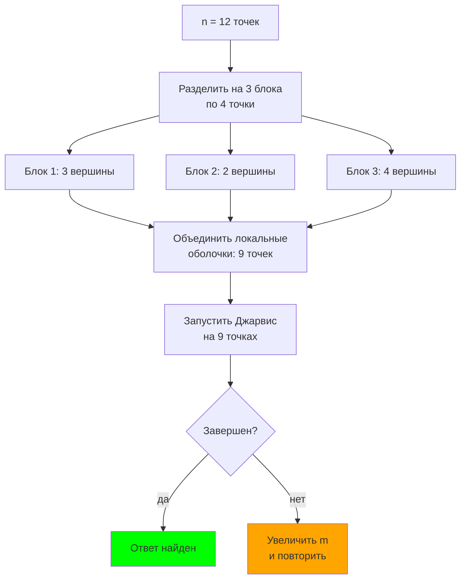

#### Почему именно удвоение, а не другое увеличение? {id: "chan-why-doubling"}

Если бы мы увеличивали $m$ медленнее (например, $m \leftarrow m+1$), то при $h = 1000$ нам потребовалось бы 1000 попыток — ужас!

Удвоение даёт нам только $\log_2 1000 \approx 10$ попыток. Каждая попытка — недорогая операция $O(n \log m)$, суммарно всё равно $O(n \log h)$.

#### Преимущества и недостатки {id: "chan-pros-cons"}

✅ **Плюсы:**
- Оптимальная асимптотическая сложность $O(n \log h)$.
- Не нужно знать размер оболочки заранее.
- Автоматически адаптируется.

❌ **Минусы:**
- Сложнее в реализации (нужны локальные оболочки + модифицированный Джарвис).
- Большие постоянные множители (много повторов).
- На практике для малых $n$ медленнее простого Эндрю из-за overhead.

#### На практике в контестах {id: "chan-practice"}

> 90% задач решаются методом Эндрю за $O(n \log n)$. Алгоритм Чана полезен в узких ситуациях:
> - Очень большие $n$ ($10^6$ и больше).
> - Известно, что оболочка маленькая (например, задача гарантирует $h \leq 100$).
> - Олимпиадные задачи, где требуется лучшая асимптотика.

**Совет:** начните с Эндрю. Если TLE — подумайте о Чане только если уверены, что $h$ мало.

---

#### Полная реализация алгоритма Чана {id: "chan-code"}

Здесь полный, готовый к use код. Помним:
- `convexHullAndrew()` — алгоритм Эндрю.
- `jarvisWithLimit()` — модифицированный Джарвис с лимитом на итерации.

```cpp
// Модифицированный Джарвис, который прерывается если превышен лимит
vector<Point> jarvisWithLimit(const vector<Point>& points, int limit) {
    int n = points.size();
    if (n < 3) return points;

    vector<Point> hull;
    int leftmost = 0;
    for (int i = 1; i < n; i++) {
        if (points[i].x < points[leftmost].x ||
            (points[i].x == points[leftmost].x && points[i].y < points[leftmost].y)) {
            leftmost = i;
        }
    }

    int current = leftmost;
    do {
        hull.push_back(points[current]);
        if (static_cast<int>(hull.size()) > limit) {
            return hull;  // сигнал: оболочка длиннее, чем мы думали
        }

        int next = (current + 1) % n;
        for (int i = 0; i < n; i++) {
            long long cp = cross(points[next] - points[current],
                                 points[i] - points[current]);
            if (cp > 0 ||
                (cp == 0 && len2(points[i] - points[current]) >
                            len2(points[next] - points[current]))) {
                next = i;
            }
        }
        current = next;
    } while (current != leftmost);

    return hull;
}

// Построить выпуклую оболочку методом Чана
// Главная идея: пробуем гипотезы m = 1, 2, 4, 8, ... пока не найдём
vector<Point> convexHullChan(vector<Point> points) {
    int n = points.size();
    if (n < 3) {
        return convexHullAndrew(points);
    }

    // Сортируем и удаляем дубликаты
    auto cmp = [](const Point& a, const Point& b) {
        if (a.x != b.x) return a.x < b.x;
        return a.y < b.y;
    };
    sort(points.begin(), points.end(), cmp);
    points.erase(unique(points.begin(), points.end(),
                        [](const Point& a, const Point& b) {
                            return a.x == b.x && a.y == b.y;
                        }),
                 points.end());
    n = points.size();

    // Итеративно пробуем гипотезы m = 1, 2, 4, 8, ...
    for (int guess = 1; guess <= n; guess = min(n, guess * 2)) {
        int blockSize = min(guess, n);
        int blockCount = (n + blockSize - 1) / blockSize;

        // Фаза 1: строим локальные оболочки (методом Эндрю)
        vector<vector<Point>> hulls;
        hulls.reserve(blockCount);
        for (int i = 0; i < n; i += blockSize) {
            vector<Point> block(points.begin() + i,
                                points.begin() + min(n, i + blockSize));
            hulls.push_back(convexHullAndrew(block));
        }

        // Фаза 2: объединяем локальные оболочки в одну кучу
        vector<Point> merged;
        for (const auto& h : hulls) {
            merged.insert(merged.end(), h.begin(), h.end());
        }

        // Фаза 3: запускаем Джарвис с лимитом на количество итераций
        vector<Point> candidate = jarvisWithLimit(merged, guess);
        
        // Если Джарвис завершился за <= guess итераций, ответ найден!
        if (static_cast<int>(candidate.size()) <= guess) {
            return candidate;
        }
        
        // Иначе увеличиваем guess и пробуем снова
    }

    // На практике здесь никогда не дойдём, но для безопасности:
    return convexHullAndrew(points);
}
```

**Как работает на примере:**

Пусть $n = 100$ точек, реальный размер оболочки $h = 10$.

1. **guess = 1:** dividing на блоки по 1 → локальные "оболочки" из 1 точки → Джарвис требует 10 шагов, что > 1 → fail.
2. **guess = 2:** блоки по 2 → Джарвис требует 10 шагов, что > 2 → fail.
3. **guess = 4:** блоки по 4 → Джарвис требует 10 шагов, что > 4 → fail.
4. **guess = 8:** блоки по 8 → Джарвис требует 10 шагов, что > 8 → fail.
5. **guess = 16:** блоки по 16 → Джарвис требует 10 шагов, что ≤ 16 → **success!**

Всего попыток: 5 = $\log_2 (16 / 1)$ ≈ $\log_2 h$.

---

## Раздел 9: Окружности {id: "circles"}

### Зачем нужно? ⭕

Окружности появляются в задачах:
- пересечение окружности с линией;
- пересечение двух окружностей;
- определение точек на окружности;
- описанная/вписанная окружность;
- построение касательных;
- проверка принадлежности области.

### Геометрическое определение окружности {id: "circle-definition"}

**Окружность** — это множество всех точек плоскости, расстояние которых от фиксированной точки (центра) одинаково (равно радиусу).

$$\text{Circle} = \{ P \in \mathbb{R}^2 : |P - O| = r \}$$

где $O$ — центр, $r$ — радиус.

**Аналитическое уравнение окружности** с центром $(a, b)$ и радиусом $r$:

$$(x - a)^2 + (y - b)^2 = r^2$$

**Почему мы работаем с $r^2$, а не $r$?**

1. **Целые координаты** — при целых координатах центра и радиуса, $r^2$ всегда целое число.
2. **Избегаем корней** — чтобы избежать вычисления $\sqrt{...}$ и потери точности.
3. **Сравнение расстояний** — вместо $|P - O| < r$ проверяем $|P - O|^2 < r^2$.

```
Пример: окружность с центром O(0, 0) и радиусом r = 5
- Точка A(3, 4): |OA|² = 3² + 4² = 25 = r² → A на окружности ✓
- Точка B(1, 1): |OB|² = 1² + 1² = 2 < r² → B внутри ✗
- Точка C(6, 0): |OC|² = 6² + 0² = 36 > r² → C снаружи ✗
```

### Визуальное представление {id: "circle-visualization"}

```mermaid
graph TD
    A["Окружность с центром O<br/>и радиусом r"]
    B["Точка P"]
    C{"d = |P - O|²"}
    D["d < r² → внутри"]
    E["d = r² → на окружности"]
    F["d > r² → снаружи"]
    
    A --> B --> C
    C -->|<| D
    C -->|=| E
    C -->|>| F
    
    style A fill:blue
    style E fill:lime
    style D fill:cyan
    style F fill:red
```

### Базовая структура {id: "circle-structure"}

```cpp
struct Circle {
    Point center;
    long long r2;  // квадрат радиуса (чтобы избежать sqrt)
    
    Circle(Point center = Point(0, 0), long long r2 = 0) : center(center), r2(r2) {}
};

// Точка на окружности?
bool onCircle(const Circle& c, const Point& p) {
    return len2(p - c.center) == c.r2;
}

// Точка внутри окружности (включая границу)?
bool inCircle(const Circle& c, const Point& p) {
    return len2(p - c.center) <= c.r2;
}

// Точка строго внутри (не на границе)?
bool inCircleStrict(const Circle& c, const Point& p) {
    return len2(p - c.center) < c.r2;
}

// Точка снаружи?
bool outsideCircle(const Circle& c, const Point& p) {
    return len2(p - c.center) > c.r2;
}
```

**Примеры:**

```cpp
Circle c(Point(0, 0), 25);  // центр (0, 0), r² = 25 (r = 5)

onCircle(c, Point(3, 4));    // true (3² + 4² = 25)
inCircle(c, Point(2, 2));    // true (2² + 2² = 8 ≤ 25)
outsideCircle(c, Point(6, 0));  // true (6² + 0² = 36 > 25)
```

### Пересечение прямой и окружности {id: "line-circle-intersection"}

**Теория:** прямая может:

1. **Не пересекать** окружность (расстояние от центра до прямой > $r$).
2. **Касаться** окружности в одной точке (расстояние = $r$).
3. **Пересекать** в двух точках (расстояние < $r$).

**Ключевая идея:** найти расстояние от центра окружности до прямой, затем сравнить с радиусом.

```cpp
// Пересечение прямой и окружности (возвращает количество точек пересечения)
int lineCircleIntersection(const Line& l, const Circle& c) {
    long long dist2 = distPointToLine2(l, c.center);
    if (dist2 > c.r2) return 0;  // не пересекаются
    if (dist2 == c.r2) return 1; // касаются (одна точка)
    return 2;                     // пересекаются в двух точках
}

// Найти точки пересечения прямой и окружности
// Возвращает вектор точек пересечения
vector<Point> lineCircleIntersectionPoints(const Line& l, const Circle& c) {
    vector<Point> result;
    
    // Проекция центра на прямую
    Point proj = projectPointOnLine(l, c.center);
    long long dist2 = distPointToLine2(l, c.center);
    
    if (dist2 > c.r2) return result;  // не пересекаются
    
    result.push_back(proj);  // добавить проекцию (касание)
    
    if (dist2 == c.r2) return result;  // именно касание
    
    // Два пересечения: нужно отойти от проекции вдоль прямой
    // На расстояние: sqrt(r² - dist²)
    // Но для целых чисел это сложно, используем параметрическое представление
    
    return result;
}

// Простая проверка без нахождения точек
bool hasIntersection(const Line& l, const Circle& c) {
    return distPointToLine2(l, c.center) <= c.r2;
}
```

**Геометрический пример:**

```
Прямая y = x, окружность с центром O(0, 0) и r² = 2

Расстояние от O до прямой:
d = |cross((1, -1), (0, 0))| / sqrt(1² + (-1)²) = 0 / sqrt(2) = 0

d² = 0 < r² = 2 → пересечение в двух точках ✓
Точки: (1, 1) и (-1, -1)
```

### Пересечение двух окружностей {id: "circle-circle-intersection"}

**Теория:** две окружности могут:

1. **Не пересекаться** (расстояние между центрами > $r_1 + r_2$).
2. **Касаться внешним образом** (расстояние = $r_1 + r_2$).
3. **Пересекаться в двух точках** ($ |r_1 - r_2| < \text{расстояние} < r_1 + r_2 $).
4. **Касаться внутренним образом** (расстояние = $|r_1 - r_2|$).
5. **Совпадать или концентричны** (центры совпадают или вложены).

**В коде:**

```cpp
// Тип пересечения двух окружностей
enum CircleIntersection {
    NONE,         // не пересекаются
    EXTERNAL,     // касаются внешним образом (1 точка)
    INTERNAL,     // касаются внутренним образом (1 точка)
    TWO_POINTS,   // пересекаются в двух точках
    COINCIDE      // совпадают
};

CircleIntersection circleCircleIntersection(const Circle& c1, const Circle& c2) {
    long long d2 = len2(c2.center - c1.center);
    long long d = sqrt(d2);  // примерно
    
    long long r1_sq = c1.r2, r2_sq = c2.r2;
    long long r1 = sqrt(r1_sq), r2 = sqrt(r2_sq);
    
    long long sum = r1 + r2;
    long long diff = abs(r1 - r2);
    
    if (d > sum) return NONE;              // далеко друг от друга
    if (d == sum) return EXTERNAL;         // касаются снаружи
    if (d > diff && d < sum) return TWO_POINTS;  // пересекаются
    if (d == diff) return INTERNAL;        // касаются изнутри
    if (d == 0 && r1 == r2) return COINCIDE;  // совпадают
    
    return NONE;  // вложены без пересечения
}
```

**Визуально:**

```mermaid
graph TD
    A["Две окружности c1 и c2"]
    B["Расстояние d между центрами"]
    C{"Какой случай?"}
    D1["d > r1 + r2:<br/>не пересекаются"]
    D2["d = r1 + r2:<br/>касание снаружи"]
    D3["r1 - r2 < d < r1 + r2:<br/>два пересечения"]
    D4["d = |r1 - r2|:<br/>касание изнутри"]
    D5["d < |r1 - r2|:<br/>вложены"]
    
    A --> B --> C
    C -->|далеко| D1
    C -->|близко| D2
    C -->|оптимально| D3
    C -->|внутри| D4
    C -->|вложены| D5
    
    style A fill:blue
    style D3 fill:lime
    style D1 fill:red
    style D5 fill:orange
```

### Описанная окружность треугольника {id: "circumcircle"}

**Геометрическое определение:** описанная окружность (circumcircle) треугольника — это окружность, проходящая через все три вершины треугольника. Её центр называется **ортоцентром** (точка пересечения серединных перпендикуляров).

**Почему важна?**
- помогает решать задачи на углы (вписанный угол = половина центрального);
- используется в геометрических преобразованиях;
- связана с радиусом через теорему синусов: $R = \frac{a}{2\sin A}$.

**Теория:** центр описанной окружности — это точка пересечения серединных перпендикуляров всех трёх сторон треугольника.

**Формула через детерминант:**

Для треугольника $A = (x_1, y_1)$, $B = (x_2, y_2)$, $C = (x_3, y_3)$:

$$\text{center}_x = \frac{1}{2D} \begin{vmatrix} x_1^2 + y_1^2 & y_1 & 1 \\ x_2^2 + y_2^2 & y_2 & 1 \\ x_3^2 + y_3^2 & y_3 & 1 \end{vmatrix}$$

где $D = \begin{vmatrix} x_1 & y_1 & 1 \\ x_2 & y_2 & 1 \\ x_3 & y_3 & 1 \end{vmatrix}$ — двойная площадь треугольника.

```cpp
// Найти описанную окружность треугольника
Circle circumcircle(Point a, Point b, Point c) {
    long long ax = a.x, ay = a.y;
    long long bx = b.x, by = b.y;
    long long cx = c.x, cy = c.y;
    
    // Двойная площадь треугольника (детерминант)
    long long d = 2 * (ax * (by - cy) + bx * (cy - ay) + cx * (ay - by));
    
    if (d == 0) {
        // Вырожденный случай: точки коллинеарны
        return Circle(Point(0, 0), LLONG_MAX);
    }
    
    // Координаты центра окружности
    long long a2 = ax*ax + ay*ay;
    long long b2 = bx*bx + by*by;
    long long c2 = cx*cx + cy*cy;
    
    long long center_x_num = a2 * (by - cy) + b2 * (cy - ay) + c2 * (ay - by);
    long long center_y_num = a2 * (cx - bx) + b2 * (ax - cx) + c2 * (bx - ax);
    
    // Внимание: центр может быть дробным!
    // Для целых координат приводим к целым (приблизительно)
    Point center(center_x_num / d, center_y_num / d);
    
    // Радиус²
    long long r2 = len2(a - center);
    
    return Circle(center, r2);
}

// Проверить, лежит ли четвёртая точка на окружности через первые три
bool onCircumcircle(Point a, Point b, Point c, Point p) {
    Circle circ = circumcircle(a, b, c);
    return onCircle(circ, p);
}
```

**Практический пример:**

```cpp
Point A(0, 0), B(4, 0), C(2, 4);
Circle circ = circumcircle(A, B, C);

// Проверить, на ли окружности точка D?
Point D(2, 2);
if (onCircumcircle(A, B, C, D)) {
    cout << "Четыре точки лежат на одной окружности!";
}
```

### Вписанная окружность треугольника {id: "incircle"}

**Определение:** вписанная окружность (incircle) треугольника — это окружность, касающаяся всех трёх сторон треугольника изнутри.

**Её свойства:**

- центр называется **инцентр** (точка пересечения биссектрис);
- радиус равен $r = \frac{\text{площадь}}{s}$, где $s$ — полупериметр.

```cpp
// Найти вписанную окружность треугольника
Circle incircle(Point a, Point b, Point c) {
    long long ab = sqrt(len2(b - a));
    long long bc = sqrt(len2(c - b));
    long long ca = sqrt(len2(a - c));
    
    long long perimeter = ab + bc + ca;
    long long s = perimeter / 2;  // полупериметр
    
    // Площадь по формуле Герона
    long long area2 = abs(cross(b - a, c - a));  // удвоенная площадь
    
    if (area2 == 0) {
        return Circle(Point(0, 0), LLONG_MAX);  // вырожденный треугольник
    }
    
    // Центр вписанной окружности (взвешенное среднее вершин)
    long long cx = (a.x * bc + b.x * ca + c.x * ab) / perimeter;
    long long cy = (a.y * bc + b.y * ca + c.y * ab) / perimeter;
    
    Point center(cx, cy);
    
    // Радиус: area / s (или area² / (2s))
    long long r2 = (area2 * area2) / (4 * s * s);
    
    return Circle(center, r2);
}
```

### Практические примеры {id: "circle-examples"}

**Пример 1: Проверить, принадлежит ли точка кругу**

```cpp
Circle c(Point(0, 0), 25);
Point p(3, 4);

if (onCircle(c, p)) cout << "На окружности";
else if (inCircle(c, p)) cout << "Внутри";
else cout << "Снаружи";
```

**Пример 2: Найти количество точек пересечения линии и окружности**

```cpp
Line l(Point(0, 0), Vec(1, 1));
Circle c(Point(2, 2), 8);

int count = lineCircleIntersection(l, c);
// count = 2 (прямая y=x пересекает окружность в двух точках)
```

**Пример 3: Проверить, совпадают ли две окружности**

```cpp
Circle c1(Point(0, 0), 25);
Circle c2(Point(0, 0), 25);

if (c1.center == c2.center && c1.r2 == c2.r2) {
    cout << "Окружности совпадают!";
}
```  

---

## Раздел 10: Численная устойчивость и типичные ошибки {id: "numerical-stability"}

### Зачем нужно? ⚠️

В вычислительной геометрии часто возникают ошибки, которые ломают решение:
- **Переполнение** при умножении больших координат
- **Погрешность округления** при работе с дробными числами
- **Граничные случаи** (коллинеарность, совпадение точек, вырожденные фигуры)
- **Неопределённое поведение** (деление на ноль, бесконечность)

Этот раздел — как "техническое обслуживание" вашего геометрического кода.

---

### 1. Переполнение целых чисел {id: "integer-overflow"}

#### Проблема

Координаты часто доходят до $10^9$. При умножении двух таких чисел получаем $10^{18}$, что **не влезает** в `int` (максимум $2^{31} - 1 \approx 2.1 \times 10^9$).

```cpp
// ❌ НЕПРАВИЛЬНО
int cp = a.x * b.y - a.y * b.x;
// Если a.x = 10^9, b.y = 10^9, то a.x * b.y уже overflow!

// Проверка на переполнение (из конкурса 2023):
Point a(1000000000, 1000000000);
Point b(1000000000, 1000000000);
int cp_int = a.x * b.y - a.y * b.x;  // переполнение!
// Результат непредсказуем (может быть 0, отрицательным или случайным)
```

#### Решение: используйте `long long`

```cpp
// ✅ ПРАВИЛЬНО
long long cp = (long long)a.x * b.y - (long long)a.y * b.x;
// long long может хранить до 2^63 - 1 ≈ 9 × 10^18

// Ещё безопаснее: явно привести перед умножением
long long cp = 1LL * a.x * b.y - 1LL * a.y * b.x;
```

#### Правило для координат

- **Если координаты ≤ $10^4$:** `int` достаточно (квадрат ≈ $10^8$, в пределах `int`)
- **Если координаты ≤ $10^9$:** **всегда используйте `long long`** для вычислений (при умножении, cross-произведении, норме²)
- **Если координаты ≤ $10^{18}$:** можете нужна осторожность при составлении (например, в дополнительных вычислениях)

---

### 2. Работа с вещественными числами и epsilon {id: "epsilon"}

#### Проблема

Вещественные числа (`float`, `double`) хранятся приблизительно. Сравнение `==` редко срабатывает:

```cpp
// ❌ НЕПРАВИЛЬНО
double x = 0.1 + 0.2;
if (x == 0.3) cout << "OK";    // обычно НЕ выполнится!
else cout << "FAIL";            // это выполнится

// Почему? x в действительности ≈ 0.30000000000000004
```

#### Решение: сравнение через epsilon

```cpp
// ✅ ПРАВИЛЬНО
const double EPS = 1e-9;  // или 1e-6 для менее точных данных

double x = 0.1 + 0.2;
if (abs(x - 0.3) < EPS) cout << "OK";     // ТЕПЕРЬ выполнится
```

#### Когда какой epsilon?

| Точность | EPS | Когда использовать |
|----------|-----|-------------------|
| Очень высокая | `1e-12` | Теоретические задачи |
| Высокая | `1e-9` | Стандартные контесты |
| Средняя | `1e-6` | Когда тестов много или данные "грязные" |
| Низкая | `1e-3` | Приблизительные вычисления |

#### Практический шаблон

```cpp
const double EPS = 1e-9;

bool eq(double a, double b) {
    return abs(a - b) < EPS;  // a == b
}

bool lt(double a, double b) {
    return a < b - EPS;        // a < b
}

bool gt(double a, double b) {
    return a > b + EPS;        // a > b
}

bool le(double a, double b) {
    return a < b + EPS;        // a <= b
}

bool ge(double a, double b) {
    return a > b - EPS;        // a >= b
}

// Использование:
double dist = sqrt(x*x + y*y);
if (eq(dist, 0.0)) { /* точка в начале */ }
if (lt(dist, R)) { /* внутри окружности */ }
```

---

### 3. Деление на ноль и параллельность {id: "division-by-zero"}

#### Проблема: параллельные прямые

Если две прямые параллельны, их направления пропорциональны, и `cross(d1, d2) == 0`. Деление на ноль приводит к ошибке:

```cpp
// ❌ НЕПРАВИЛЬНО
Line l1(Point(0, 0), Vec(1, 1));
Line l2(Point(1, 1), Vec(2, 2));  // параллельна l1!

Vec d1 = l1.d;
Vec d2 = l2.d;
long long denom = cross(d1, d2);  // = 0!

// if (denom == 0) { /* делать нечего */ }
long long t_num = cross(l2.p - l1.p, d2);
long long t = t_num / denom;      // ❌ ДЕЛЕНИЕ НА НОЛЬ!
```

#### Решение: проверка перед делением

```cpp
// ✅ ПРАВИЛЬНО
pair<bool, Point> lineIntersection(Line l1, Line l2) {
    long long denom = cross(l1.d, l2.d);
    
    if (denom == 0) {
        // Параллельны или совпадают
        return {false, Point(0, 0)};
    }
    
    long long t_num = cross(l2.p - l1.p, l2.d);
    long long t = t_num / denom;
    
    Point intersection = l1.p + Vec(l1.d.x * t / denom, l1.d.y * t / denom);
    return {true, intersection};
}
```

#### Для сегментов и лучей

```cpp
// Проверить пересечение двух сегментов (с проверкой параллельности)
bool segmentsIntersect(Segment s1, Segment s2) {
    Vec d1 = s1.b - s1.a;
    Vec d2 = s2.b - s2.a;
    long long denom = cross(d1, d2);
    
    // Проверяем параллельность И общую ориентацию
    if (denom == 0) {
        // Проверяем, лежат ли они на одной линии
        long long cp = cross(s1.a - s2.a, d2);
        return cp == 0;  // коллинеарны
    }
    
    // Обычное пересечение
    // ...
    return true;
}
```

---

### 4. Граничные и вырожденные случаи {id: "degenerate-cases"}

#### Коллинеарные точки

Если три точки лежат на одной прямой, их cross-произведение = 0:

```cpp
bool areCollinear(Point a, Point b, Point c) {
    return cross(b - a, c - a) == 0;
}

// Опасность: вырожденный треугольник
Circle circ = circumcircle(a, b, c);
if (circ.r2 == LLONG_MAX) {
    cout << "Треугольник вырожден (точки коллинеарны)!";
}
```

#### Совпадающие точки

```cpp
bool distinct(Point a, Point b) {
    return a.x != b.x || a.y != b.y;
}

// Перед поиском расстояния
if (!distinct(p1, p2)) {
    cout << "Точки совпадают, расстояние = 0";
}
```

#### Пустые многоугольники

```cpp
bool isValidPolygon(const vector<Point>& poly) {
    if (poly.size() < 3) return false;  // не многоугольник
    
    // Проверяем коллинеарность (все точки на одной линии)
    if (poly.size() == 3) {
        return !areCollinear(poly[0], poly[1], poly[2]);
    }
    
    return true;
}
```

---

### 5. Стратегия обхода численных проблем {id: "numerical-strategy"}

#### Этап 1: Выбор типов данных

```cpp
// Шаг 1: определите диапазон координат
// Координаты в задаче: от -10^9 до 10^9? → используйте long long

// Шаг 2: избегайте промежуточных дробей
// Вычисляйте "в целых числах", пока возможно
long long dist2 = len2(p1 - p2);  // квадрат расстояния, целое число
double dist = sqrt(static_cast<double>(dist2));  // только в конце, если нужно

// Шаг 3: если нужны дроби — используйте PointLD (long double)
struct PointLD {
    long double x, y;
};
```

#### Этап 2: Защита от ошибок

```cpp
// Для каждой функции, которая может "взорваться":
// 1. Проверяем дdenominators (не ноль)
// 2. Проверяем граничные случаи (совпадение, коллинеарность)
// 3. Используем assert для отладки

#include <cassert>

Point projectPointOnLine(Point p, Line l) {
    Vec d = l.d;
    assert(len2(d) != 0);  // направление не (0,0)
    
    long long t_num = dot(p - l.p, d);
    long long t_denom = len2(d);
    // ... вычисляем проекцию с правильным делением ...
    
    return l.p + Vec(d.x * t_num / t_denom, d.y * t_num / t_denom);
}
```

#### Этап 3: Тестирование граничных случаев

```cpp
// Перед отправкой на контест, проверьте:

// 1. Экстремальные координаты
Point extreme1(1e9, 1e9);
Point extreme2(-1e9, -1e9);
auto dist2 = len2(extreme1 - extreme2);
assert(dist2 > 0);  // нет overflow

// 2. Коллинеарные точки
Point a(0, 0), b(1, 1), c(2, 2);
assert(areCollinear(a, b, c));

// 3. Параллельные линии
Line l1(Point(0, 0), Vec(1, 0));
Line l2(Point(0, 1), Vec(1, 0));  // параллельна l1
auto [ok, p] = lineIntersection(l1, l2);
assert(!ok);  // не пересекаются

// 4. Совпадающие фигуры
Circle c1(Point(0, 0), 100);
Circle c2(Point(0, 0), 100);
assert(c1.center == c2.center && c1.r2 == c2.r2);
```

---

### 6. Когда переходить на floating-point? {id: "when-floating-point"}

#### Целые числа (`int`, `long long`) — ваш друг:
✅ Никогда нет ошибок округления  
✅ Сравнения работают идеально  
✅ Быстрее  

**Используйте до конца**, пока не потребуются дроби или корни.

#### Когда нужны вещественные числа:

❌ Вычисление расстояний: $\sqrt{x^2 + y^2}$  
❌ Углы и триго: $\sin$, $\cos$, $\tan$  
❌ Решение систем линейных уравнений (если требуется высокая точность)  

**Стратегия:**

```cpp
// ✅ ХОРОШО: работаем в целых числах, пока возможно
long long dist2 = len2(p1 - p2);        // целое
if (dist2 < 100) { /* p1 близко к p2 */ }

// Если нужно расстояние:
double dist = sqrt(static_cast<double>(dist2));

// ✅ ХОРОШО: используем PointLD только для "трудных" вычислений
struct PointLD {
    long double x, y;
};

// Функции для floating-point:
PointLD projectPointPrecise(PointLD p, PointLD a, PointLD b) {
    long double t = ((p.x - a.x) * (b.x - a.x) + (p.y - a.y) * (b.y - a.y)) /
                    ((b.x - a.x) * (b.x - a.x) + (b.y - a.y) * (b.y - a.y));
    return {a.x + t * (b.x - a.x), a.y + t * (b.y - a.y)};
}
```

---

### 7. Чеклист перед отправкой {id: "checklist"}

- [ ] Все координаты хранятся в `long long` (если в диапазоне $[-10^9, 10^9]$)
- [ ] Cross-произведения и скалярные произведения: `long long` переменные
- [ ] Проверяю деление на ноль перед каждым `/`
- [ ] Проверяю коллинеарность перед вычислением окружности (circumcircle, incircle)
- [ ] Для `double` — используюfprintf с epsilon
- [ ] Граничные случаи: пустой многоугольник, совпадающие точки, параллельные линии
- [ ] Тестирую на координатах $\pm 10^9$ (на переполнение)
- [ ] Тестирую на малых координатах (0, 1, 2) и граничных
- [ ] Читаю код ещё раз на предмет ошибок 👀

---

**4. Коллинеарные случаи в пересечениях:**

```cpp
// ❌ НЕПРАВИЛЬНО: не обрабатываем коллинеарные отрезки
if (segmentIntersect(s1, s2)) return true;

// ✅ ПРАВИЛЬНО: явно проверяем специальные случаи
if (collinear(s1.dir(), s2.dir())) {
    // отрезки на одной прямой — нужна специальная обработка
}
// ... остальной код
```

### Шаблон для работы с eps {id: "eps-template"}

```cpp
const long double EPS = 1e-9;

int sign(long double x) {
    if (x < -EPS) return -1;
    if (x > EPS) return 1;
    return 0;
}

bool eq(long double a, long double b) {
    return abs(a - b) < EPS;
}

bool less(long double a, long double b) {
    return a < b - EPS;
}
```

---

## Раздел 11: Шаблонный геометрический модуль {id: "geometry-module"}

### Как использовать {id: "how-to-use-module"}

Весь код из конспекта составляет готовый модуль `geom.hpp`, который можно скопировать в контест:

```cpp
// geom.hpp — полный модуль для олимпиадных задач на геометрию
#include <bits/stdc++.h>
using namespace std;

typedef long long ll;

struct Vec {
    ll x, y;
    Vec(ll x = 0, ll y = 0) : x(x), y(y) {}
    
    Vec operator+(const Vec& v) const { return Vec(x + v.x, y + v.y); }
    Vec operator-(const Vec& v) const { return Vec(x - v.x, y - v.y); }
    Vec operator-() const { return Vec(-x, -y); }
    Vec operator*(ll k) const { return Vec(x * k, y * k); }
    
    friend Vec operator*(ll k, const Vec& v) { return v * k; }
};

using Point = Vec;

ll dot(const Vec& a, const Vec& b) { return a.x * b.x + a.y * b.y; }
ll cross(const Vec& a, const Vec& b) { return a.x * b.y - a.y * b.x; }
ll len2(const Vec& v) { return dot(v, v); }

int sign(ll x) {
    if (x > 0) return 1;
    if (x < 0) return -1;
    return 0;
}

struct Line { Point p; Vec dir; };
struct Segment { Point a, b; Vec dir() const { return b - a; } };
struct Circle { Point center; ll r2; };

// ... остальные функции из конспекта
```

### Карта типичных задач {id: "typical-tasks-map"}

| Задача | Какие примитивы | Сложность |
|--------|-----------------|-----------|
| Проверить, острый ли угол | `dot` | ⭐ |
| Найти площадь треугольника | `cross` | ⭐ |
| Проверить, лежит ли точка на отрезке | `onSegment` | ⭐⭐ |
| Пересечение двух отрезков | `segmentIntersect` | ⭐⭐ |
| Расстояние от точки до линии | `distPointToLine2` | ⭐⭐ |
| Принадлежность точки многоугольнику | `pointInPolygon` | ⭐⭐⭐ |
| Выпуклая оболочка | `convexHull` | ⭐⭐⭐ |
| Описанная окружность | `circumcircle` | ⭐⭐⭐⭐ |

---

## Раздел 12: Карта задач и примеры {id: "tasks-examples"}

### Тип 1: Базовые проверки {id: "task-type-1"}

**Задача 1.1:** Найти угол наклона вектора и проверить, острый ли он.

```cpp
Vec a(1, 2), b(3, 1);
ll dot_prod = dot(a, b);
if (dot_prod > 0) cout << "Острый";
```

**Задача 1.2:** Три точки коллинеарны?

```cpp
Point A(0, 0), B(1, 1), C(2, 2);
if (cross(B - A, C - A) == 0) cout << "Да";
```

### Тип 2: Пересечения {id: "task-type-2"}

**Задача 2.1:** Два отрезка пересекаются?

```cpp
Segment s1(...), s2(...);
if (segmentIntersect(s1, s2)) cout << "Пересекаются";
```

**Задача 2.2:** Найти точку пересечения двух прямых.

```cpp
Line l1(...), l2(...);
Point p = intersectionPoint(l1, l2);
```

### Тип 3: Расстояния {id: "task-type-3"}

**Задача 3.1:** Расстояние от точки до линии.

```cpp
Line l(Point(0, 0), Vec(1, 0));
Point p(5, 3);
ll dist2 = distPointToLine2(l, p);  // = 9
```

### Тип 4: Многоугольники {id: "task-type-4"}

**Задача 4.1:** Площадь многоугольника.

```cpp
vector<Point> poly = {{0, 0}, {4, 0}, {2, 3}};
ll area2 = polygonArea2(poly);  // = 12 (площадь = 6)
```

**Задача 4.2:** Точка внутри многоугольника?

```cpp
if (pointInPolygon(poly, Point(2, 1))) cout << "Внутри";
```

---

## Немного от автора {id: "geom-epic-final"}

Если ты сейчас читаешь эти строки, знай: этот конспект не родился за вечер.

Здесь сотни строк кода, десятки пересобранных пояснений, вычищенные ошибки с доски, спорные моменты из лекций, выжатые голосовухи, переписанные с нуля определения и куча мест, где я останавливался и спрашивал себя: «Окей, а вот это реально понятно тем, кто читает в первый раз?».

Я очень не хотел делать ещё один «формулы ради формул», ещё одну Bullshit-выдачу в духе:  
«Вот теорема. Вот доказательство. Вот задача. Разбирайся сам».  
Этот конспект — попытка честно пройти путь вместе с читателем:
- от «я боюсь геометрии» до «я понимаю, что здесь происходит»;
- от шаблонов наугад до осознанного использования `dot`, `cross`, ориентации и всех этих «страшных слов»;
- от разбросанных кусков теории до единого, живого `geom`-набора, который не стыдно взять в контест.

По пути было:
- куча мелких несостыковок, которые приходилось отлавливать;
- моменты, когда старое объяснение приходилось выкидывать и собирать заново;
- тонкая грань между «просто» и «слишком примитивно».

Сейчас я доволен тем, что получилось. Это не идеальный, высеченный в камне финальный вариант — и это нормально. Геометрия большая. Жизнь шумная. Всегда найдётся пример, тонкость или задача, которую можно разобрать ещё.

Поэтому так:

- Если ты нашёл место, где что-то неочевидно, — напиши.
- Если заметил дырку, тонкий кейс, интересный приём — напиши.
- Если что-то помогло «кликнуть» в голове — тоже напиши. Это лучший фидбек.

Я обещаю: если ты покажешь, что именно осталось мутным, я вернусь и докручу. Добавлю примеры, перерисую схемы, перепишу формулировки так, чтобы это работало не только для олимпиадника с опытом, но и для того, кто только зашёл и хочет понять.

Спасибо, что дочитал(а), думал(а), спорил(а) и проверял(а) всё сам(а).  
Значит, я с тобой всё это написали не зря.

— Вадим

---

$\text{От ученика для учеников.}\\ \text{\textcolor{red}{С любовью} к \textcolor{yellow}{Т-Образованию}.}\\ \textcolor{cyan}{Вадим\ Христенко.}$
