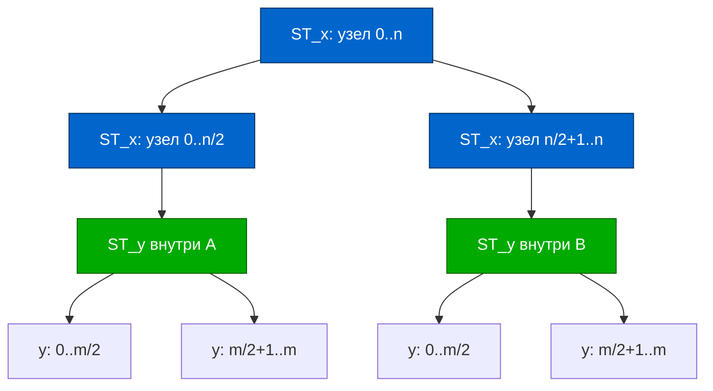

<h2>Тема конспекта: Дерево отрезков на отрезках — 2D революция</h2>

> **Главный автор:** Вадим Христенко  
> **Другие авторы:** —  
> **Последнее обновление:** 2025-11-01  
> **Ссылка на обсуждение:** *Материал в активной разработке. Помощь приветствуется!*  
> _Комментарий:_ Продвинутый конспект для тех, кто уже знает 1D дерево отрезков и готов к трёхмерной математике.  
> _Теги:_ SegmentTree2D, 2DRangeQueries, AdvancedDataStructures, RangeTrees

---

# Введение {id: "introduction"}

**Дерево отрезков на отрезках** — это когда дерево отрезков становится двумерным. Звучит как Inception, правда? 

Представьте: нужно отвечать на запросы суммы/минимума в **прямоугольнике** $[x_1, x_2] \times [y_1, y_2]$ за $O(\log^2 N)$ с обновлениями за то же время.

**Случаи применения:**
- 2D диапазонные запросы (сумма в прямоугольнике)
- Запросы k-D при $k > 1$
- Персистентные структуры
- Динамическое добавление координат

---

# Содержание {id: "contents"}

1. [Интуиция и архитектура](#intuition)
2. [Segment Tree of Segment Trees](#st-of-st)
   - [Базовая структура](#st-of-st-basic)
   - [Построение](#st-of-st-build)
   - [Запросы](#st-of-st-query)
   - [Обновления](#st-of-st-update)
3. [Fenwick Tree 2D](#fenwick-2d)
4. [Оптимизации и трюки](#optimizations)
5. [Практические примеры](#examples)
6. [Граничные случаи](#edge-cases)

---

# Интуиция и архитектура {id: "intuition"}

## Идея

1D дерево отрезков: корень хранит сумму всего массива, дети — половины и т.д.

2D дерево отрезков: каждый узел 1D дерева по $x$ содержит **внутри себя целое 1D дерево по $y$**.



---

# Segment Tree of Segment Trees {id: "st-of-st"}

## Базовая структура {id: "st-of-st-basic"}

```cpp
struct ST2D {
    struct Node {
        long long sum = 0;
        Node* left = nullptr;
        Node* right = nullptr;
        Node* y_tree = nullptr; // 1D дерево по y внутри
    };
    
    int n, m;
    Node* root_x = nullptr;
    
    ST2D(int n, int m) : n(n), m(m) {}
    
    // Построение 1D дерева по y для диапазона y_tl..y_tr
    Node* build_y(int y_tl, int y_tr, vector<vector<long long>>& grid, int x) {
        Node* v = new Node();
        if (y_tl == y_tr) {
            v->sum = grid[x][y_tl];
            return v;
        }
        int y_tm = (y_tl + y_tr) / 2;
        v->left = build_y(y_tl, y_tm, grid, x);
        v->right = build_y(y_tm + 1, y_tr, grid, x);
        v->sum = v->left->sum + v->right->sum;
        return v;
    }
    
    // Построение 2D дерева
    Node* build_x(int x_tl, int x_tr, vector<vector<long long>>& grid) {
        Node* v = new Node();
        if (x_tl == x_tr) {
            v->y_tree = build_y(0, m - 1, grid, x_tl);
            v->sum = v->y_tree->sum;
            return v;
        }
        int x_tm = (x_tl + x_tr) / 2;
        v->left = build_x(x_tl, x_tm, grid);
        v->right = build_x(x_tm + 1, x_tr, grid);
        // Слияние: сумма левого и правого y_tree
        v->sum = v->left->sum + v->right->sum;
        // v->y_tree не нужно на промежуточных уровнях (либо слияние деревьев, но дорого)
        return v;
    }
};
```

---

## Построение {id: "st-of-st-build"}

```cpp
void build(vector<vector<long long>>& grid) {
    root_x = build_x(0, n - 1, grid);
}
```

**Сложность:** $O(NM \log N \log M)$ — каждый из $O(NM)$ листьев добавляет логарифмическую глубину в обе стороны.

---

## Запросы {id: "st-of-st-query"}

Хотим найти сумму в прямоугольнике $[x1, x2] \times [y1, y2]$.

**Идея:** 
1. Спускаемся по дереву $x$ между $x1$ и $x2$
2. На каждом уровне спускаемся по внутреннему дереву $y$ между $y1$ и $y2$

```cpp
long long query_y(Node* vy, int y_tl, int y_tr, int y1, int y2) {
    if (y1 > y2 || !vy) return 0;
    if (y_tl == y1 && y_tr == y2) return vy->sum;
    int y_tm = (y_tl + y_tr) / 2;
    return query_y(vy->left, y_tl, y_tm, y1, min(y2, y_tm)) +
           query_y(vy->right, y_tm + 1, y_tr, max(y1, y_tm + 1), y2);
}

long long query(Node* vx, int x_tl, int x_tr, int x1, int x2, int y1, int y2) {
    if (x1 > x2) return 0;
    if (x_tl == x1 && x_tr == x2) {
        // Спускаемся по внутреннему y_tree
        return query_y(vx->y_tree, 0, m - 1, y1, y2);
    }
    int x_tm = (x_tl + x_tr) / 2;
    return query(vx->left, x_tl, x_tm, x1, min(x2, x_tm), y1, y2) +
           query(vx->right, x_tm + 1, x_tr, max(x1, x_tm + 1), x2, y1, y2);
}

long long query(int x1, int x2, int y1, int y2) {
    return query(root_x, 0, n - 1, x1, x2, y1, y2);
}
```

**Сложность:** $O(\log^2 N \log^2 M)$ — каждое деление по $x$ может требовать лог-уровня по $y$.

На практике чаще $O(\log^2 N)$ если диапазон по одной из осей маленький.

---

## Обновления {id: "st-of-st-update"}

При обновлении точки $(x, y)$ обновляем путь в дереве $x$ и внутри каждого узла пути обновляем в дереве $y$.

```cpp
void update_y(Node* vy, int y_tl, int y_tr, int y, long long val) {
    if (y_tl == y_tr) {
        vy->sum = val;
        return;
    }
    int y_tm = (y_tl + y_tr) / 2;
    if (y <= y_tm) {
        update_y(vy->left, y_tl, y_tm, y, val);
    } else {
        update_y(vy->right, y_tm + 1, y_tr, y, val);
    }
    vy->sum = (vy->left ? vy->left->sum : 0) + (vy->right ? vy->right->sum : 0);
}

long long update_x(Node* vx, int x_tl, int x_tr, int x, int y, long long val) {
    if (x_tl == x_tr) {
        update_y(vx->y_tree, 0, m - 1, y, val);
        vx->sum = vx->y_tree->sum;
        return vx->sum;
    }
    int x_tm = (x_tl + x_tr) / 2;
    if (x <= x_tm) {
        update_x(vx->left, x_tl, x_tm, x, y, val);
    } else {
        update_x(vx->right, x_tm + 1, x_tr, x, y, val);
    }
    vx->sum = (vx->left ? vx->left->sum : 0) + (vx->right ? vx->right->sum : 0);
    return vx->sum;
}

void update(int x, int y, long long val) {
    update_x(root_x, 0, n - 1, x, y, val);
}
```

**Сложность:** $O(\log^2 N \log^2 M)$ в худшем случае, $O(\log N \log M)$ в среднем.

---

# Fenwick Tree 2D {id: "fenwick-2d"}

Альтернатива, менее мощная, но проще в реализации.

```cpp
struct Fenwick2D {
    vector<vector<long long>> tree;
    int n, m;
    
    Fenwick2D(int n, int m) : n(n + 1), m(m + 1), tree(n + 1, vector<long long>(m + 1, 0)) {}
    
    void update(int x, int y, long long delta) {
        for (int i = x; i <= n; i += i & (-i)) {
            for (int j = y; j <= m; j += j & (-j)) {
                tree[i][j] += delta;
            }
        }
    }
    
    long long query(int x, int y) {
        long long res = 0;
        for (int i = x; i > 0; i -= i & (-i)) {
            for (int j = y; j > 0; j -= j & (-j)) {
                res += tree[i][j];
            }
        }
        return res;
    }
    
    long long range_query(int x1, int y1, int x2, int y2) {
        return query(x2, y2) - query(x1 - 1, y2) - query(x2, y1 - 1) + query(x1 - 1, y1 - 1);
    }
};
```

**Плюсы:**
- Проще реализовать
- Память $O(NM)$

**Минусы:**
- Нет ленивых меток (не поддерживает range update)
- Медленнее для разреженных данных

---

# Оптимизации и трюки {id: "optimizations"}

## Координатное сжатие

Если координаты большие, но точек мало, сжимаем координаты:

```cpp
vector<int> compress(vector<int> coords) {
    sort(coords.begin(), coords.end());
    coords.erase(unique(coords.begin(), coords.end()), coords.end());
    return coords;
}
```

## Неявное (Implicit) дерево 2D

Для очень больших диапазонов создаём узлы только когда нужны:

```cpp
struct ImplicitST2D {
    map<pair<pair<int,int>, pair<int,int>>, Node*> nodes;
    
    Node* get_or_create(int x1, int x2, int y1, int y2) {
        auto key = make_pair(make_pair(x1, x2), make_pair(y1, y2));
        if (nodes.find(key) == nodes.end()) {
            nodes[key] = new Node();
        }
        return nodes[key];
    }
};
```

## Персистентная версия

Храним версии дерева — для каждого обновления создаём новый путь без копирования неизменённых узлов.

---

# Практические примеры {id: "examples"}

### Пример 1: Сумма в прямоугольнике

Дана матрица $n \times m$. Запросы: сумма элементов в $[x_1, x_2] \times [y_1, y_2]$.

**Решение:** ST of ST с суммой.

```cpp
ST2D st(n, m);
st.build(grid);
// После построения:
// cout << st.query(0, 1, 0, 1) << endl; // сумма в прямоугольнике [0,1]×[0,1]
```

### Пример 2: Минимум в прямоугольнике с обновлениями

Вместо суммы — минимум. Обновляем значение и запрашиваем минимум.

```cpp
// Аналогично, но merge = min вместо +
// update вызывается, и автоматически пересчитываются минимумы
```

---

# Граничные случаи {id: "edge-cases"}

| Случай | Как обрабатывать |
|--------|-----------------|
| $n=1$ или $m=1$ | Вырождается в 1D дерево |
| Разреженные данные | Координатное сжатие или неявное дерево |
| Огромные координаты | Сжатие или неявное дерево |
| Отрицательные координаты | Сдвиг на константу |
| Запрос вне диапазона | Проверить границы, вернуть $0$ или $NEUTRAL$ |

---

$\text{От ученика для учеников.}\\ \text{\textcolor{red}{С любовью} к \textcolor{yellow}{Т-Образованию}.}\\ \textcolor{cyan}{Вадим\ Христенко.}$
