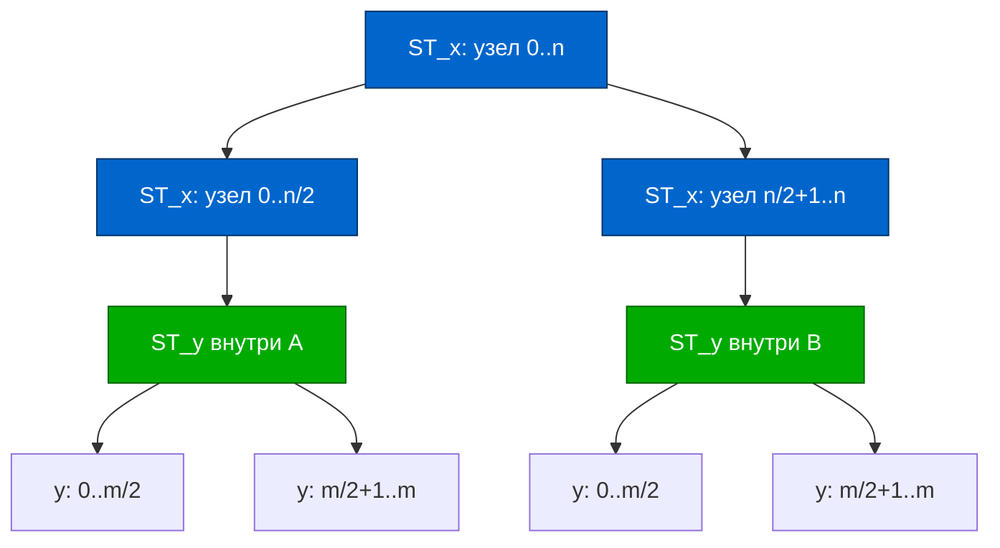

<h2>Тема конспекта: Дерево отрезков на отрезках — 2D революция</h2>

> **Главный автор:** Вадим Христенко  
> **Другие авторы:** —  
> **Последнее обновление:** 2025-11-01  
> **Ссылка на обсуждение:** *Материал в активной разработке. Помощь приветствуется!*  
_Комментарий:_ Обновлённый, подробный и практичный конспект для тех, кто уже дружит с 1D деревом отрезков и готов к двумерной магии без чёрных ящиков.  
> _Теги:_ SegmentTree2D, 2DRangeQueries, AdvancedDataStructures, RangeTrees

---

# Введение {id: "introduction"}

## Что это и зачем это нужно?

**Дерево отрезков на отрезках (2D Segment Tree или Segment Tree of Segment Trees)** — это двумерное расширение классического дерева отрезков. Это не просто структура данных, это **архитектурный паттерн**, который позволяет эффективно решать одну из самых базовых задач вычислительной геометрии: находить агрегирующие функции (сумму, минимум, максимум, XOR и т.д.) внутри произвольного прямоугольника в матрице.

**Ключевая идея:** Вместо того, чтобы хранить обычное 1D дерево отрезков по оси $x$, мы в каждом узле этого дерева храним **целое дерево отрезков по оси $y$**. Это создаёт вложенную (nested) структуру — вспомните фильм «Inception» с его слоями снов. По аналогии, здесь слои — это оси координат.

```
Матрица 4×4:                 Дерево отрезков 2D:
┌────┬────┬────┬────┐       
│ 1  │ 2  │ 3  │ 4  │       1D ST по X:    [x: 0..3]
├────┼────┼────┼────┤           ├─ [x: 0..1] с ST_Y внутри
│ 5  │ 6  │ 7  │ 8  │           └─ [x: 2..3] с ST_Y внутри
├────┼────┼────┼────┤       
│ 9  │10  │11  │12  │       Каждый узел по X содержит ST_Y
├────┼────┼────┼────┤       
│13  │14  │15  │16  │       
└────┴────┴────┴────┘
```

## Характеристики структуры

| Характеристика | Значение |
|--|--|
| **Время построения** | $O(NM)$ или $O(NM \log N \log M)$ в зависимости от варианта |
| **Память** | $O(NM \log N \log M)$ в худшем случае (но часто $O(NM)$ на практике) |
| **Точечный запрос** | $O(\log N \log M)$ |
| **Диапазонный запрос** | $O(\log N \log M)$ |
| **Точечное обновление** | $O(\log N \log M)$ |
| **Диапазонное обновление** | $O(\log N \log M)$ по отдельности, или $O(\log^2 N \log^2 M)$ с ленивыми метками |

## Когда применять 2D Segment Tree?

Дерево отрезков 2D идеально подходит для:

1. **Статичные или полудинамические матрицы** — когда много запросов и относительно мало обновлений, или структура полностью статична после построения.
2. **Плотные данные** — когда координаты это обычные индексы от 0 до N-1.
3. **Типичные агрегирующие функции** — сумма, минимум, максимум, XOR, GCD и т.п.
4. **Небольшие ограничения на память** — $N, M \leq 5000$ без оптимизаций, до $10^5$ с компрессией.
5. **Высокие требования к скорости** — каждая операция должна быть действительно быстрой.

## Когда НЕ применять?

- **Огромные разреженные координаты** ($10^9$ координат, но мало точек) — здесь лучше координатное сжатие + неявное дерево.
- **Нужна порядковая статистика** в подматрице (k-й элемент, сколько элементов ≤ X) — используйте Wavelet Matrix/Wavelet Tree.
- **Только оффлайн-запросы и сложные операции** — Mo's algorithm может быть проще.
- **k-D запросы при k ≥ 3** — здесь KD-tree или range tree будут лучше по памяти.

## TL;DR версия

Выбирай так:
- **Плотная матрица, простые операции, нужна скорость** → 2D Segment Tree
- **Плотная матрица, только суммы** → 2D Fenwick (проще реализовать)
- **Разреженные данные** → Компрессия координат + неявное дерево
- **Порядковая статистика** → Wavelet Matrix
- **Очень большие координаты, редкие точки** → Range Tree или неявные структуры

---

# Содержание {id: "contents"}

1. [Введение](#introduction)
   - Что это и зачем это нужно?
   - Характеристики структуры
   - Когда применять 2D Segment Tree?
2. [Интуиция и архитектура](#intuition)
   - Идея основной структуры
   - Диаграмма взаимосвязи узлов
3. [Segment Tree of Segment Trees](#st-of-st)
   - [Базовая структура](#st-of-st-basic)
   - [Построение](#st-of-st-build)
   - [Запросы](#st-of-st-query)
   - [Обновления](#st-of-st-update)
4. [Fenwick Tree 2D](#fenwick-2d)
   - Альтернативный подход
   - Структура и операции
   - Сравнение с 2D Segment Tree
5. [Альтернативы и когда что выбирать](#alternatives)
   - Range Tree, Wavelet Tree, Mo's Algorithm, KD-Tree
   - Рекомендационная таблица
6. [Оптимизации и трюки](#optimizations)
   - Координатное сжатие
   - Неявное дерево 2D
   - Персистентная версия
   - Ленивые метки
   - Гибридный подход
7. [Практические примеры](#examples)
   - Пример 1: Сумма в прямоугольнике
   - Пример 2: Минимум с обновлениями
   - Пример 3: 2D Fenwick для больших матриц
   - Пример 4: Координатное сжатие
8. [Граничные случаи и подводные камни](#edge-cases)
   - Таблица проблем и решений
   - Частые ошибки реализации
   - Техники отладки
9. [Глубокое погружение](#deep-dive)
   - Почему это быстро?
   - Интуиция и механизм
   - Строение памяти
   - Полное сравнение подходов
10. [Дополнительные ресурсы](#advanced)
    - Персистентные 2D деревья
    - Sqrt Decomposition
    - Offline Queries
11. [Практические советы](#tips-and-tricks)
    - Советы реализации и отладки
12. [Заключение](#conclusion)

---

# Интуиция и архитектура {id: "intuition"}

## Идея

1D дерево отрезков: корень хранит сумму всего массива, дети — половины и т.д.

2D дерево отрезков: каждый узел 1D дерева по $x$ содержит **внутри себя целое 1D дерево по $y$**, которое агрегирует значения на соответствующем диапазоне по $x$.



---

# Segment Tree of Segment Trees {id: "st-of-st"}

## Базовая структура {id: "st-of-st-basic"}

### Общее описание {id: "st-of-st-overview"}

В корректной реализации у каждого узла по оси x должен быть свой полноценный Y-дерево, полученное слиянием Y-деревьев его потомков. Это обеспечивает запросы за $O(\log N \log M)$, а не медленнее.

Структурно это выглядит так:
- **Уровень X:** обычное дерево отрезков, где каждый узел отвечает за диапазон $[lx, rx]$ по x.
- **Уровень Y внутри каждого узла X:** дерево отрезков, где каждый узел отвечает за диапазон $[ly, ry]$ по y **и только для тех строк, что покрывает родительский узел по x**.

Пусть $n, m$ — размеры матрицы. Для удобства используем 1-based индексацию внутри дерева (0-based на входе).

### Представление структуры {id: "st-of-st-structure"}

```just-ncv
struct SegTree2D:
    n: int32              # Размер матрицы по X
    m: int32              # Размер матрицы по Y
    t: array<array<int64>>  # Двумерный массив: t[1..4*n][1..4*m]
    
    func __init__(n: int32, m: int32):
        self.n = n
        self.m = m
        self.t = массив размером (4*n) × (4*m), инициализирован нулями
    
    # Вспомогательная функция слияния двух значений
    func merge(left: int64, right: int64) -> int64:
        return left + right  # Для суммы; для минимума: return min(left, right)
```

### Ключевые методы {id: "st-of-st-key-methods"}

```just-ncv
# build_y: строит Y-дерево на фиксированном узле по X (vx)
# Параметры:
#   - a: исходная матрица
#   - vx: номер узла по X
#   - lx, rx: диапазон по X, который покрывает узел vx
#   - vy: номер узла по Y
#   - ly, ry: диапазон по Y
func build_y(a: matrix, vx: int32, lx: int32, rx: int32, 
             vy: int32, ly: int32, ry: int32):
    if ly == ry:
        # Листовой узел по Y: либо копируем элемент, либо сливаем двух потомков
        if lx == rx:
            t[vx][vy] = a[lx][ly]  # Окончательный лист
        else:
            t[vx][vy] = merge(t[vx*2][vy], t[vx*2+1][vy])
        return
    
    # Рекурсивно строим левое и правое поддеревья
    my = (ly + ry) / 2  # Середина по Y
    build_y(a, vx, lx, rx, vy*2,   ly,   my)
    build_y(a, vx, lx, rx, vy*2+1, my+1, ry)
    
    # Сливаем результаты потомков
    t[vx][vy] = merge(t[vx][vy*2], t[vx][vy*2+1])
```

**Логика:** Для каждого узла по X мы полностью перестраиваем дерево по Y. На глубине по Y высоту $\log M$, а всего узлов по X высоту $\log N$, поэтому суммарно $O(NM)$ элементарных операций при построении.

---

## Построение {id: "st-of-st-build"}

```just-ncv
# build_x: главная функция построения
# Строит X-дерево и для каждого узла вызывает build_y
func build_x(a: matrix, vx: int32, lx: int32, rx: int32):
    # Сначала рекурсивно строим потомков (если это не лист)
    if lx != rx:
        mx = (lx + rx) / 2  # Середина по X
        build_x(a, vx*2,   lx,   mx)  # Левое поддерево
        build_x(a, vx*2+1, mx+1, rx)  # Правое поддерево
    
    # Затем для данного узла по X строим Y-дерево
    # Это дерево будет заботиться обо всех строках [lx, rx]
    build_y(a, vx, lx, rx, 1, 0, m-1)

# Точка входа построения
func build(a: matrix):
    build_x(a, 1, 0, n-1)
```

**Сложность:** $O(NM)$ для плотной матрицы. Каждый элемент матрицы участвует в нескольких слияниях, но амортизированно это даёт линейный результат.

**Чему это учит:** Важно понимать, что строим **в два этапа**:
1. Сначала укладываем структуру по X (всего $O(N)$ узлов).
2. Для каждого из них полностью строим Y-дерево ($O(M)$ элементов).

---

## Построение {id: "st-of-st-build"}

Вызов `build(grid)` из структуры выше.

Корректная оценка: для плотной статичной матрицы построение стоит $O(NM)$ (каждый элемент участвует в $O(1)$ слияний по y на каждом фиксированном узле по x; суммарно по всем узлам это сворачивается в линейное от размера данных число операций). В некоторых реализациях анализа удобнее писать $O(NM \log N)$ или $O(NM \log M)$ в силу учёта «дублирования» уровней, но амортизированно для классической сборки через merge — $O(NM)$ достаточно точна.

---

## Запросы {id: "st-of-st-query"}

### Проблемная постановка {id: "st-of-st-query-problem"}

Дан прямоугольник $[x_1, x_2] \times [y_1, y_2]$. Нужно найти **агрегирующую функцию** (для нашего примера — сумму) всех элементов внутри этого прямоугольника.

### Идея решения {id: "st-of-st-query-idea"}

1. Спускаемся по дереву по X, ища все узлы, которые полностью или частично покрывают диапазон $[x_1, x_2]$.
2. Для каждого такого узла по X спускаемся по его внутреннему Y-дереву, ища узлы в диапазоне $[y_1, y_2]$.
3. Суммируем результаты всех найденных узлов.

```just-ncv
# query_y: запрос суммы по Y в поддереве узла vx
# Параметры:
#   - vx: узел по X (фиксирован)
#   - vy: текущий узел по Y
#   - ly, ry: диапазон по Y, который покрывает узел vy
#   - ql, qr: запрашиваемый диапазон по Y
func query_y(vx: int32, vy: int32, ly: int32, ry: int32, 
             ql: int32, qr: int32) -> int64:
    # Если запрос пуст или лежит вне диапазона
    if ql > qr:
        return 0
    
    # Если узел полностью покрывает запрос
    if ly == ql and ry == qr:
        return t[vx][vy]
    
    # Иначе рекурсивно ищем в потомках
    my = (ly + ry) / 2
    
    # Левая часть запроса: [ql, min(qr, my)]
    # Правая часть запроса: [max(ql, my+1), qr]
    left_result = query_y(vx, vy*2,   ly,   my, 
                          ql, min(qr, my))
    right_result = query_y(vx, vy*2+1, my+1, ry, 
                           max(ql, my+1), qr)
    
    return merge(left_result, right_result)  # Слияние результатов

# query_x: запрос суммы по X (главная функция)
func query_x(vx: int32, lx: int32, rx: int32, 
             qlx: int32, qrx: int32, qly: int32, qry: int32) -> int64:
    # Если запрос пуст
    if qlx > qrx:
        return 0
    
    # Если узел полностью покрывает запрос по X
    if lx == qlx and rx == qrx:
        # Спускаемся в Y-дерево этого узла
        return query_y(vx, 1, 0, m-1, qly, qry)
    
    # Иначе рекурсивно ищем в потомках
    mx = (lx + rx) / 2
    
    left_result = query_x(vx*2,   lx,   mx, 
                          qlx, min(qrx, mx), qly, qry)
    right_result = query_x(vx*2+1, mx+1, rx, 
                           max(qlx, mx+1), qrx, qly, qry)
    
    return merge(left_result, right_result)

# Публичный интерфейс
func query(x1: int32, x2: int32, y1: int32, y2: int32) -> int64:
    return query_x(1, 0, n-1, x1, x2, y1, y2)
```

### Анализ сложности {id: "st-of-st-query-complexity"}

- **По X:** спускаемся на глубину $\log N$, на каждом уровне посещаем $O(1)$ узлов → $O(\log N)$ уровней.
- **По Y:** для каждого узла по X спускаемся на глубину $\log M$ → $O(\log M)$ уровней.
- **Итого:** $O(\log N \cdot \log M)$ операций слияния.

**Почему это хорошо?** Даже при $N = M = 10^6$ это $\log 10^6 \approx 20$, так что $20 \times 20 = 400$ операций — это очень быстро.

---

## Обновления {id: "st-of-st-update"}

### Точечное обновление {id: "st-of-st-update-point"}

Когда мы обновляем элемент в позиции $(x, y)$ на новое значение $val$:

1. Идём по пути в дереве от корня до листа по оси X.
2. На каждом шаге (для каждого узла по X, который лежит на пути) мы спускаемся по его Y-дереву и обновляем путь там.
3. При возврате из рекурсии пересчитываем значения в узлах.

```just-ncv
# update_y: обновляет значение в Y-дереве узла vx
func update_y(vx: int32, lx: int32, rx: int32, 
              vy: int32, ly: int32, ry: int32, 
              x: int32, y: int32, val: int64):
    
    if ly == ry:
        # Листовой узел по Y: обновляем или сливаем
        if lx == rx:
            # Окончательный лист: прямое обновление
            t[vx][vy] = val
        else:
            # Пересчитываем слияние от потомков
            t[vx][vy] = merge(t[vx*2][vy], t[vx*2+1][vy])
        return
    
    # Спускаемся в нужное поддерево
    my = (ly + ry) / 2
    if y <= my:
        update_y(vx, lx, rx, vy*2,   ly,   my, x, y, val)
    else:
        update_y(vx, lx, rx, vy*2+1, my+1, ry, x, y, val)
    
    # Пересчитываем значение узла
    t[vx][vy] = merge(t[vx][vy*2], t[vx][vy*2+1])

# update_x: обновляет значение в X-дереве
func update_x(vx: int32, lx: int32, rx: int32, 
              x: int32, y: int32, val: int64):
    
    if lx != rx:
        # Спускаемся в нужное поддерево
        mx = (lx + rx) / 2
        if x <= mx:
            update_x(vx*2,   lx,   mx, x, y, val)
        else:
            update_x(vx*2+1, mx+1, rx, x, y, val)
    
    # Пересчитываем Y-дерево для этого узла по X
    update_y(vx, lx, rx, 1, 0, m-1, x, y, val)

# Публичный интерфейс
func update(x: int32, y: int32, val: int64):
    update_x(1, 0, n-1, x, y, val)
```

### Трассировка обновления {id: "st-of-st-update-trace"}

Пример: обновляем ячейку $(3, 5)$ в матрице $8 \times 8$.

```
Путь по X-дереву:  1 → 2 (или 3) → ... → листовой узел
Для каждого узла по X:
  Путь по Y-дереву: 1 → 2 (или 3) → ... → листовой узел
  Пересчитываем значения снизу вверх
Пересчитываем значения по X снизу вверх
```

### Сложность обновления {id: "st-of-st-update-complexity"}

- **По X:** $O(\log N)$ узлов на пути.
- **Для каждого:** спускаемся в Y-дерево ($O(\log M)$) и пересчитываем обратно ($O(\log M)$).
- **Итого:** $O(\log N \cdot \log M)$.

### Замечание о диапазонных обновлениях {id: "st-of-st-update-range"}

Если нужно обновить все элементы в прямоугольнике $[x_1, x_2] \times [y_1, y_2]$ на одну и ту же дельта, это намного сложнее с использованием 2D Segment Tree с ленивыми метками (lazy propagation). Рекомендуется либо:
- Использовать **2D Fenwick** с техникой включений/исключений (difference array).
- Обрабатывать обновления **оффлайн** (Mo's algorithm).
- Применять **неявные структуры** с ленивыми метками.

---

# Fenwick Tree 2D {id: "fenwick-2d"}

## Альтернативный подход {id: "fenwick-2d-overview"}

Дерево Фенвика (Binary Indexed Tree, BIT) — менее мощное, чем 2D Segment Tree, но значительно проще в реализации. Если вам нужны только **точечные обновления и запросы сумм в прямоугольнике**, этого часто достаточно.

### Структура и идея {id: "fenwick-2d-structure"}

Вместо двух вложенных деревьев здесь используется **две вложенные иерархии индексов**, которые напоминают двоичное представление числа. Каждый элемент $tree[i][j]$ отвечает за сумму в некотором прямоугольнике, размер которого зависит от последних единиц в двоичном представлении $i$ и $j$.

```just-ncv
struct Fenwick2D:
    tree: array<array<int64>>   # tree[1..n+1][1..m+1]
    n: int32
    m: int32
    
    func __init__(n: int32, m: int32):
        self.n = n + 1
        self.m = m + 1
        self.tree = массив (n+1) × (m+1), инициализирован нулями

# Вспомогательная функция: выделить последний бит
func lowbit(x: int32) -> int32:
    return x & (-x)  # Магия двоичной арифметики
```

### Обновление (точечное) {id: "fenwick-2d-update"}

При добавлении дельты $delta$ в позицию $(x, y)$:

```just-ncv
func update(x: int32, y: int32, delta: int64):
    # Итерируем по всем затронутым ячейкам в дереве
    i = x
    while i <= n:
        j = y
        while j <= m:
            tree[i][j] += delta
            # Переходим к следующей затронутой ячейке
            j += lowbit(j)
        i += lowbit(i)
```

**Объяснение:** Для каждого узла дерева, который должен быть обновлён (его координаты влияют на сумму в прямоугольнике, содержащем $(x, y)$), мы добавляем дельту. Количество таких узлов: $O(\log N \cdot \log M)$.

### Запрос (префиксная сумма) {id: "fenwick-2d-query"}

Запрос суммы в прямоугольнике от $(1, 1)$ до $(x, y)$:

```just-ncv
func query_prefix(x: int32, y: int32) -> int64:
    result = 0
    i = x
    while i > 0:
        j = y
        while j > 0:
            result += tree[i][j]
            # Переходим к предыдущей затронутой ячейке
            j -= lowbit(j)
        i -= lowbit(i)
    return result

# Запрос суммы в произвольном прямоугольнике [x1, y1] × [x2, y2]
# используя принцип включения-исключения (как 2D префиксные суммы)
func range_query(x1: int32, y1: int32, x2: int32, y2: int32) -> int64:
    # Убедимся, что x1 <= x2 и y1 <= y2
    if x1 > x2 or y1 > y2:
        return 0
    
    # Формула включения-исключения для прямоугольника
    return query_prefix(x2, y2) 
         - query_prefix(x1-1, y2) 
         - query_prefix(x2, y1-1) 
         + query_prefix(x1-1, y1-1)
```

### Сравнение с 2D Segment Tree {id: "fenwick-2d-comparison"}

| Аспект | 2D Segment Tree | 2D Fenwick |
|--------|-----------------|-----------|
| **Сложность запроса** | $O(\log N \log M)$ | $O(\log N \log M)$ |
| **Сложность обновления** | $O(\log N \log M)$ | $O(\log N \log M)$ |
| **Память** | $O(NM \log N \log M)$ на полное дерево, но часто $O(NM)$ в практике | $O(NM)$ всегда |
| **Диапазонные обновления** | Возможны, но сложно | Нужна разностная матрица |
| **Реализация** | Сложнее | Проще |
| **Гибкость** | Легко адаптировать под разные операции (min, max, XOR, GCD) | Только сумма и операции, где важна линейность |

**Когда выбрать Fenwick 2D:**
- Нужны только суммы в диапазонах.
- Хотите проще кодить и меньше ошибок.
- Память на уме и хотите сэкономить.

**Когда выбрать Segment Tree 2D:**
- Нужны минимумы/максимумы/другие неаддитивные операции.
- Нужны диапазонные обновления.
- Хотите максимальную гибкость.

---

## Выбор структуры: полное руководство {id: "alternatives"}

### Range Tree (диапазонное дерево) {id: "range-tree"}

**Когда использовать:**
- Статичные наборы точек в 2D-пространстве.
- Нужны запросы «сколько/сумма внутри прямоугольника» без обновлений.
- Нужна порядковая статистика в диапазоне (k-й по величине элемент).
- Расширение до $k$-мерий для $k > 2$.

**Как работает:** Range Tree строит одно дерево по первой координате, а в каждом узле хранит отсортированный список элементов по второй координате. Запросы выполняются поиском в первом дереве и фракционной каскадацией во втором.

**Сложность:** Построение $O(N \log N)$, запрос $O(\log^2 N)$.

---

### Wavelet Tree / Wavelet Matrix {id: "wavelet-tree"}

**Когда использовать:**
- Нужны порядковые статистики в подматрице (сколько элементов $\leq X$, k-й элемент).
- Данные можно рассматривать как последовательность элементов с индексами.
- Нужна память $O(N \log \Sigma)$, где $\Sigma$ — размер алфавита значений.

**Как работает:** Wavelet Matrix рекурсивно разделяет элементы по старшему биту, создавая бинарное дерево структур, которое позволяет быстро отвечать на запросы с ранжированием.

**Сложность:** Построение $O(N \log \Sigma)$, запрос $O(\log \Sigma)$.

---

### Mo's Algorithm на подматрице {id: "mo_s-algorithm"}

**Когда использовать:**
- Только оффлайн-запросы (все вопросы известны заранее).
- Нужна агрегация сложной функции (например, количество различных элементов, XOR медиана и т.п.).
- Обновления не требуются или обрабатываются отдельно.

**Как работает:** Сортируем запросы специальным образом (обычно по блокам) и обходим матрицу в порядке, минимизирующем движение указателя. Для каждой ячейки считаем вклад в текущий результат.

**Сложность:** $O((NM + Q) \cdot \sqrt{NM})$, где $Q$ — количество запросов.

---

### KD-Tree {id: "kd-tree"}

**Когда использовать:**
- Динамические точки и поиск ближайших соседей/прямоугольные запросы.
- Координаты разреженные или несколько хаотичные.
- Данные не слишком большие ($\leq 10^5$ точек).

**Как работает:** Рекурсивно разделяет пространство перпендикулярно осям, создавая двоичное дерево, которое позволяет быстро отсеивать невозможные регионы.

**Сложность:** Запрос/обновление в среднем $O(\log N)$, в худшем $O(N)$.

---

### Рекомендационная таблица {id: "recommendation-table"}

| Задача | Решение | Причина |
|--------|---------|--------|
| Суммы в прямоугольниках, плотная матрица | 2D Segment Tree | Быстро, гибко, просто |
| Только суммы, плотная матрица | 2D Fenwick | Проще кодить, достаточно памяти |
| Суммы, разреженные координаты | Компрессия + неявное дерево | Экономим память |
| Минимум/максимум в диапазоне | 2D Segment Tree (с доп. логикой) | Адаптируем операцию слияния |
| Порядковая статистика в прямоугольнике | Wavelet Matrix + Persistent ST | Природное для этой задачи |
| Статичные точки, диапазонные запросы | Range Tree (фракционная каскадация) | Асимптотика $O(\log^2 N)$ |
| Оффлайн-запросы с сложной функцией | Mo's Algorithm | Оффлайн обычно проще |
| Динамические точки, ближайший сосед | KD-Tree | Природное расширение BIT |

---

# Оптимизации и трюки {id: "optimizations"}

## 1. Координатное сжатие (Coordinate Compression) {id: "coordinate-compression"}

### Проблема {id: "coordinate-compression-problem"}

Если координаты матрицы могут быть огромными ($x, y \leq 10^9$), но количество уникальных координат мало ($\leq 10^5$), мы не можем создать массив размером $10^9 \times 10^9$.

### Решение {id: "coordinate-compression-solution"}

Сопоставляем каждую уникальную координату с индексом от 1 до $k$, где $k$ — количество уникальных координат.

```just-ncv
func compress_coordinates(events: array<pair<int32, int32>>) -> map<int32, int32>:
    # Собираем все координаты
    coords_x = пустой набор
    coords_y = пустой набор
    
    for (x, y) in events:
        coords_x.add(x)
        coords_y.add(y)
    
    # Сортируем и индексируем
    sorted_x = sort(coords_x.to_list())
    sorted_y = sort(coords_y.to_list())
    
    mapping_x = {}
    mapping_y = {}
    
    for i in 0..len(sorted_x)-1:
        mapping_x[sorted_x[i]] = i + 1
    
    for i in 0..len(sorted_y)-1:
        mapping_y[sorted_y[i]] = i + 1
    
    # Результат может быть использован как:
    # compressed_x = mapping_x[original_x]
    # compressed_y = mapping_y[original_y]
    
    return (mapping_x, mapping_y)
```

**Сложность:** $O(K \log K)$, где $K$ — количество уникальных координат.

**Пример:**
```
Исходные координаты: (1, 5), (3, 2), (1, 100)
Уникальные X: [1, 3] → {1: 1, 3: 2}
Уникальные Y: [2, 5, 100] → {2: 1, 5: 2, 100: 3}

После компрессии: (1,2), (2,1), (1,3)
Новая матрица: 2×3 вместо 3×100
```

---

## 2. Неявное (Implicit) дерево 2D {id: "implicit-2d-st"}

### Идея {id: "implicit-2d-st-idea"}

Создаём узлы дерева **только при обращении**, а не заранее. Это экономит память для очень разреженных данных.

```just-ncv
struct ImplicitNode:
    value: int64
    left: optional<ImplicitNode>
    right: optional<ImplicitNode>

struct ImplicitST2D:
    # Используем карту для хранения узлов вместо массива
    # Ключ: (vx, vy), значение: узел
    nodes: map<pair<int32, int32>, ImplicitNode>
    
    func get_or_create(vx: int32, vy: int32) -> ImplicitNode:
        key = (vx, vy)
        if key not in nodes:
            nodes[key] = ImplicitNode(0, null, null)
        return nodes[key]
    
    func update(vx: int32, lx: int32, rx: int32, 
                vy: int32, ly: int32, ry: int32,
                x: int32, y: int32, val: int64):
        node = get_or_create(vx, vy)
        
        if ly == ry and lx == rx:
            node.value = val
            return
        
        # ... остальная логика как в обычном дереве ...
```

**Преимущества:**
- Память $O(K \log N \log M)$ вместо $O(NM \log N \log M)$, где $K$ — количество операций.
- Работает даже с координатами до $10^{18}$.

**Недостатки:**
- Медленнее обычного дерева из-за доступа к хэш-таблице.
- Сложнее реализовать.

---

## 3. Персистентная версия (Persistent Segment Tree 2D) {id: "persistent-2d-st"}

### Зачем? {id: "persistent-2d-st-why"}

Иногда нужно отвечать на запросы не для текущего состояния, а для какого-то исторического. Например:

> Каков был минимум в прямоугольнике $[1, 5] \times [2, 8]$ после 10-го обновления?

### Как работает? {id: "persistent-2d-st-how"}

При каждом обновлении вместо модификации узлов создаём новые узлы (версии), и старые версии остаются неизменными. Это похоже на системы контроля версий (Git).

```just-ncv
# Вместо изменения: node.value = new_value
# Создаём новый узел:
new_node = Node(new_value, node.left, node.right)
versions.append(new_node)  # Сохраняем версию

# Позже можно запросить версию 10
answer = query(versions[10], ...)
```

**Память:** $O(K \log N \log M)$, где $K$ — количество версий.

**Сложность:** Каждое обновление добавляет $O(\log N \log M)$ новых узлов.

---

## 4. Ленивые метки для диапазонных обновлений (Lazy Propagation) {id: "lazy-propagation-2d"}

### Проблема {id: "lazy-propagation-2d-problem"}

Если нужны **диапазонные обновления** (добавить дельту ко всем элементам в прямоугольнике), простой 2D Segment Tree становится медленным.

### Идея {id: "lazy-propagation-2d-idea"}

Вместо немедленного распространения изменения по дереву, отмечаем узел ленивой меткой и распространяем изменение только при необходимости (ленивое вычисление).

```just-ncv
struct LazyNode2D:
    value: int64
    lazy: int64  # Отложенное изменение

func push(vx: int32, vy: int32, ly: int32, ry: int32):
    # Применяем отложенное изменение к текущему узлу
    if lazy[vx][vy] != 0:
        t[vx][vy] += lazy[vx][vy] * (число элементов)
        
        # Передаём ленивую метку потомкам
        if ly != ry:  # Не листовой узел
            lazy[vx][vy*2] += lazy[vx][vy]
            lazy[vx][vy*2+1] += lazy[vx][vy]
        
        lazy[vx][vy] = 0

func update_range(vx: int32, lx: int32, rx: int32,
                  vy: int32, ly: int32, ry: int32,
                  qlx: int32, qrx: int32,
                  qly: int32, qry: int32, delta: int64):
    push(vx, vy, ly, ry)
    
    # Если запрос не пересекается с текущим узлом
    if qrx < lx or qlx > rx or qry < ly or qly > ry:
        return
    
    # Если узел полностью внутри запроса
    if qlx <= lx and rx <= qrx and qly <= ly and ry <= qry:
        lazy[vx][vy] += delta
        push(vx, vy, ly, ry)
        return
    
    # Иначе спускаемся к потомкам
    mx = (lx + rx) / 2
    my = (ly + ry) / 2
    
    update_range(vx*2, lx, mx, vy*2, ly, my, ...)
    update_range(vx*2+1, mx+1, rx, vy*2+1, my+1, ry, ...)
    
    # Пересчитываем текущий узел
    t[vx][vy] = merge(t[vx*2][vy], t[vx*2+1][vy])
```

**Сложность:** Диапазонное обновление/запрос $O(\log^2 N \log^2 M)$.

**Замечание:** Это работает для аддитивных операций (сумма, XOR), но не для минимума/максимума.

---

## 5. Гибридный подход: 1D на строках, затем ST/Fenwick {id: "hybrid-1d-2d"}

### Идея {id: "hybrid-1d-2d-idea"}

Если одна размерность намного меньше другой (например, $M \ll N$), можно хранить по одному 1D дереву на каждой строке, а затем создать структуру выше.

**Пример:** Матрица $10^6 \times 100$. Вместо полного 2D дерева:
- Создаём 100 1D деревьев (по одному на каждую строку).
- Поверх них создаём ещё одно 1D дерево (уровень выше).

**Преимущества:**
- Память $O(NM)$ вместо $O(NM \log M)$.
- Запрос/обновление $O(\log N \log M)$ (без экономии).

---


# Практические примеры {id: "examples"}

## Пример 1: Сумма в прямоугольнике (2D Segment Tree) {id: "example-sum-2d-st"}

### Постановка задачи {id: "example-sum-2d-st-problem"}

Дана матрица $n \times m$ целых чисел. Нужно ответить на $q$ запросов вида:
> Найти сумму элементов в прямоугольнике с углами $(x_1, y_1)$ и $(x_2, y_2)$.

А также обработать $u$ обновлений:
> Обновить элемент в позиции $(x, y)$ на значение $val$.

**Ограничения:** $n, m \leq 5000$, $q + u \leq 10^5$.

### Решение пошагово {id: "example-sum-2d-st-solution"}

```just-ncv
struct Solution:
    # Инициализируем 2D Segment Tree
    st: SegTree2D
    
    func __init__(matrix: array<array<int64>>):
        n = len(matrix)
        m = len(matrix[0])
        st = SegTree2D(n, m)
        st.build(matrix)
    
    func handle_query(x1: int32, y1: int32, x2: int32, y2: int32) -> int64:
        # Убедимся, что координаты в правильном порядке
        if x1 > x2:
            swap(x1, x2)
        if y1 > y2:
            swap(y1, y2)
        
        # Запрос суммы
        return st.query(x1, x2, y1, y2)
    
    func handle_update(x: int32, y: int32, val: int64):
        st.update(x, y, val)

# Использование
matrix = [
    [1, 2, 3],
    [4, 5, 6],
    [7, 8, 9]
]
sol = Solution(matrix)

# Запрос суммы в [0,1]×[0,1]
sum1 = sol.handle_query(0, 0, 1, 1)  # 1+2+4+5 = 12

# Обновление
sol.handle_update(1, 1, 10)  # Меняем 5 на 10

# Запрос после обновления
sum2 = sol.handle_query(0, 0, 1, 1)  # 1+2+4+10 = 17
```

### Анализ {id: "example-sum-2d-st-analysis"}

- **Построение:** $O(NM) = O(25,000,000)$ в худшем случае (может быть медленнее в практике).
- **Каждый запрос:** $O(\log N \log M) = O(\log 5000)^2 \approx 144$ операций.
- **Каждое обновление:** $O(\log N \log M) \approx 144$ операций.
- **Итого:** быстро для данных ограничений.

---

## Пример 2: Минимум в прямоугольнике с обновлениями {id: "example-min-2d-st"}

### Изменения для минимума {id: "example-min-2d-st-changes"}

Единственное отличие от суммы — изменяем функцию слияния:

```just-ncv
func merge(left: int64, right: int64) -> int64:
    # Вместо сложения
    return min(left, right)  # Для минимума

# Также меняем нейтральный элемент
NEUTRAL = positive_infinity  # Вместо 0

# Инициализация всех элементов дерева
for i in 0..(4*n-1):
    for j in 0..(4*m-1):
        t[i][j] = NEUTRAL
```

### Трассировка {id: "example-min-2d-st-trace"}

Дана матрица:
```
3  1  4
2  5  6
7  1  2
```

Запрос: минимум в $[0, 1] \times [0, 1]$?

```
Спускаемся по X-дереву, находим узлы, покрывающие [0, 1]
Для каждого спускаемся в Y-дерево, ищем [0, 1]
Слияние: min(min(3, 1), min(2, 5)) = min(1, 2) = 1
Ответ: 1
```

---

## Пример 3: 2D Fenwick для больших матриц (только суммы) {id: "example-fenwick-2d"}

### Сценарий {id: "example-fenwick-2d-scenario"}

Дана матрица $10^4 \times 10^4$. Нужны суммы и точечные обновления. 2D Segment Tree может быть слишком тяжелый по памяти.

### Реализация {id: "example-fenwick-2d-implementation"}

```just-ncv
struct FenwickSolution:
    fw: Fenwick2D
    original_matrix: array<array<int64>>
    
    func __init__(n: int32, m: int32):
        fw = Fenwick2D(n, m)
        original_matrix = массив размером (n+1) × (m+1)
        
        # Инициализируем дерево через разности
        for i in 1..n:
            for j in 1..m:
                delta = original_matrix[i][j]
                if i > 1:
                    delta -= original_matrix[i-1][j]
                if j > 1:
                    delta -= original_matrix[i][j-1]
                if i > 1 and j > 1:
                    delta += original_matrix[i-1][j-1]
                fw.update(i, j, delta)
    
    func handle_query(x1: int32, y1: int32, x2: int32, y2: int32) -> int64:
        # Переходим на 1-based индексы
        return fw.range_query(x1+1, y1+1, x2+1, y2+1)
    
    func handle_update(x: int32, y: int32, new_val: int64):
        # Используем разностное представление
        x += 1  # 1-based
        y += 1  # 1-based
        
        old_val = original_matrix[x][y]
        delta = new_val - old_val
        original_matrix[x][y] = new_val
        
        fw.update(x, y, delta)
```

### Анализ памяти {id: "example-fenwick-2d-memory-analysis"}

- **2D Segment Tree:** $4N \times 4M = O(NM \log^2 N)$ теоретически, но часто проще считать как $O(4 \times 4 \times NM) \approx 1.6 \text{ ГБ}$ для $10^4 \times 10^4$.
- **2D Fenwick:** $(N+1) \times (M+1) \approx 100 \text{ МБ}$ для $10^4 \times 10^4$ (в 16 раз экономнее!).

---

## Пример 4: Координатное сжатие с разреженными данными {id: "example-compressed-2d-st"}

### Сценарий {id: "example-compressed-2d-st-scenario"}

На бесконечной плоскости есть события (обновления) в координатах $x, y \leq 10^9$, но всего событий только $K = 10^5$. Нужны запросы суммы в прямоугольниках (оффлайн).

### Подход {id: "example-compressed-2d-st-approach"}

```just-ncv
struct CompressedSolution:
    events: array<tuple<int32, int32, int64>>  # (x, y, value)
    queries: array<tuple<int32, int32, int32, int32>>  # (x1, y1, x2, y2)
    
    func __init__(events_list, queries_list):
        events = events_list
        queries = queries_list
        
        # Собираем все координаты
        coords_x = set()
        coords_y = set()
        
        for (x, y, _) in events:
            coords_x.add(x)
            coords_y.add(y)
        
        for (x1, y1, x2, y2) in queries:
            coords_x.add(x1)
            coords_x.add(x2)
            coords_y.add(y1)
            coords_y.add(y2)
        
        # Компресс
        sorted_x = sort(coords_x.to_list())
        sorted_y = sort(coords_y.to_list())
        
        mapping_x = {}
        mapping_y = {}
        
        for i, v in enumerate(sorted_x):
            mapping_x[v] = i
        for i, v in enumerate(sorted_y):
            mapping_y[v] = i
        
        # Создаём сжатую матрицу
        n = len(sorted_x)
        m = len(sorted_y)
        
        compressed_matrix = массив размером n × m инициализирован нулями
        for (x, y, val) in events:
            cx = mapping_x[x]
            cy = mapping_y[y]
            compressed_matrix[cx][cy] += val  # Если несколько событий в одной точке
        
        # Строим дерево
        st = SegTree2D(n, m)
        st.build(compressed_matrix)
    
    func answer_query(x1, y1, x2, y2) -> int64:
        cx1 = mapping_x[x1]
        cy1 = mapping_y[y1]
        cx2 = mapping_x[x2]
        cy2 = mapping_y[y2]
        
        return st.query(cx1, cx2, cy1, cy2)
```

### Анализ {id: "example-compressed-2d-st-analysis"}

- **Память:** $O(K \log K)$ для сжатия + $O(K^2)$ для дерева (очень экономно!).
- **Построение:** $O(K \log K + K^2)$.
- **Запрос:** $O(\log K)$ после сжатия.

Для $K = 10^5$ это работает отлично, в то время как полная матрица была бы $10^9 \times 10^9$.

---

# Граничные случаи и подводные камни {id: "edge-cases"}

## Таблица проблем и решений {id: "edge-cases-table"}

| Случай | Проблема | Решение |
|--------|----------|---------|
| $n=1$ или $m=1$ | Вырождается в 1D дерево | Оптимизировать код для 1D (более быстрый вариант) |
| Все элементы нулевые | Нейтральный элемент | Убедитесь, что используете правильный NEUTRAL (0 для суммы, $+\infty$ для минимума) |
| Разреженные данные | Огромная память для дерева | Координатное сжатие или неявное дерево |
| Огромные координаты ($10^{18}$) | Не влезают в int32 | Используйте int64, неявное дерево или сжатие |
| Отрицательные координаты | Сдвиг индексов | Добавьте смещение ко всем координатам перед использованием |
| Запрос вне диапазона | Ошибка доступа | Проверить границы, вернуть NEUTRAL если вне границ |
| Множество типов запросов | Сложная логика | Рассмотрите несколько деревьев (одно для суммы, одно для минимума) |
| Порядковая статистика | Неподходящая структура | Используйте Wavelet Matrix или персистентные деревья |
| Очень большие значения | Переполнение int64 | Используйте модульную арифметику или big integer |
| Отрицательные значения с минимумом | Неправильный нейтральный элемент | NEUTRAL должен быть $+\infty$, а не 0 |

---

## Частые ошибки реализации {id: "common-mistakes"}

### Ошибка 1: Неправильный нейтральный элемент {id: "common-mistakes-neutral"}

```just-ncv
# ОШИБКА: используем 0 для минимума
NEUTRAL = 0
func merge(left, right):
    return min(left, right)

# Когда-то вычислим:
min(0, 5) = 0  # Но на самом деле должно быть 5!

# ПРАВИЛЬНО:
NEUTRAL = positive_infinity
func merge(left, right):
    return min(left, right)

min(positive_infinity, 5) = 5  # Верно
```

### Ошибка 2: Путаница между 0-based и 1-based индексацией {id: "common-mistakes-indexing"}

```just-ncv
# ОШИБКА: смешиваем индексацию
func query(x1, x2, y1, y2):  # Предполагаем 0-based
    return query_x(1, 0, n-1, x1, x2, y1, y2)
    # Но query_x ожидает 1-based вершины!

# ПРАВИЛЬНО: используем одну систему везде
# Либо 0-based везде, либо 1-based везде
```

### Ошибка 3: Y-дерево не построено в промежуточных узлах по X {id: "common-mistakes-build-y"}

```just-ncv
# ОШИБКА: забыли вызвать build_y в build_x
func build_x(a, vx, lx, rx):
    if lx != rx:
        mx = (lx + rx) / 2
        build_x(a, vx*2, lx, mx)
        build_x(a, vx*2+1, mx+1, rx)
    # ЗАБЫЛИ: build_y(a, vx, lx, rx, 1, 0, m-1)

# ПРАВИЛЬНО:
func build_x(a, vx, lx, rx):
    if lx != rx:
        mx = (lx + rx) / 2
        build_x(a, vx*2, lx, mx)
        build_x(a, vx*2+1, mx+1, rx)
    build_y(a, vx, lx, rx, 1, 0, m-1)  # Важно!
```

### Ошибка 4: Некорректное слияние при обновлении {id: "common-mistakes-merge-update"}

```just-ncv
# ОШИБКА: забыли пересчитать значение узла после обновления потомков
func update_y(...):
    # ... логика обновления ...
    # ЗАБЫЛИ пересчитать t[vx][vy]

# ПРАВИЛЬНО:
func update_y(...):
    # ... логика обновления потомков ...
    t[vx][vy] = merge(t[vx][vy*2], t[vx][vy*2+1])  # Важно!
```

### Ошибка 5: Fenwick 2D — неправильное применение формулы включения-исключения {id: "common-mistakes-fenwick-range-query"}

```just-ncv
# ОШИБКА: неправильный порядок вычтаний
func range_query(x1, y1, x2, y2):
    return query_prefix(x2, y2) 
         - query_prefix(x1, y2)      # НЕПРАВИЛЬНО
         - query_prefix(x2, y1) 
         + query_prefix(x1, y1)

# ПРАВИЛЬНО (формула включения-исключения):
func range_query(x1, y1, x2, y2):
    return query_prefix(x2, y2) 
         - query_prefix(x1-1, y2)    # x1-1, не x1!
         - query_prefix(x2, y1-1)    # y1-1, не y1!
         + query_prefix(x1-1, y1-1)  # x1-1, y1-1!
```

---

## Граничные случаи и особенности {id: "edge-cases-special"}

### Случай: Очень малые ограничения {id: "small-constraints"}

Если $n, m \leq 100$, вообще можно обойтись без структур данных:

```just-ncv
func naive_query(matrix, x1, y1, x2, y2):
    sum = 0
    for i in x1..x2:
        for j in y1..y2:
            sum += matrix[i][j]
    return sum  # O(NM) на запрос, но просто и быстро для малых данных
```

**Когда это хорошо:** $N \times M \leq 10^4$ и запросов мало.

---

### Случай: Единственная операция — построение {id: "single-build"}

Если нет обновлений и нет запросов, просто вычислите ответ один раз:

```just-ncv
func build_prefix_sum(matrix):
    n = len(matrix)
    m = len(matrix[0])
    prefix = массив размером (n+1) × (m+1) инициализирован нулями
    
    for i in 1..n:
        for j in 1..m:
            prefix[i][j] = matrix[i-1][j-1] 
                          + prefix[i-1][j] 
                          + prefix[i][j-1] 
                          - prefix[i-1][j-1]
    
    return prefix

# Запрос за O(1)
func query_prefix_sum(prefix, x1, y1, x2, y2):
    return prefix[x2+1][y2+1] 
         - prefix[x1][y2+1] 
         - prefix[x2+1][y1] 
         + prefix[x1][y1]
```

**Когда это хорошо:** Только точечные запросы без обновлений (предварительно вычислим всё).

---

### Случай: Все запросы идентичны {id: "identical-queries"}

Если нужно найти минимум/максимум/сумму **одного и того же** прямоугольника много раз:

```just-ncv
func cache_based_solution(matrix, rect):
    # Кэшируем результат
    cached_result = compute_rect(matrix, rect)
    
    # Все последующие запросы за O(1)
    for _ in 0..number_of_queries:
        return cached_result
```

---

## Техники отладки {id: "debugging-techniques"}

### Техника 1: Трассировка по шагам {id: "step-tracing"}

Вручную проследите работу алгоритма на маленьком примере (2×2 матрица):

```
Матрица:
1 2
3 4

Дерево по X:
  root(1,0)
  /       \
node(2,0) node(3,0)

Для каждого узла по X — дерево по Y:
node(2,0) содержит Y-ST для строк [0,0]:
  root_y(1, 0)
  /           \
node_y(2, 0)  node_y(3, 0)

И так далее...
```

### Техника 2: Проверка инвариантов {id: "invariant-checking"}

После каждого обновления проверяйте, что:
- Листовые узлы содержат правильные значения.
- Внутренние узлы — корректное слияние потомков.
- Границы диапазонов соответствуют уровню в дереве.

### Техника 3: Сравнение с наивным решением {id: "compare-naive"}

```just-ncv
func verify(efficient_tree, naive_matrix):
    # Выполняем несколько случайных запросов
    for test in 0..1000:
        x1 = random(0, n)
        x2 = random(x1, n)
        y1 = random(0, m)
        y2 = random(y1, m)
        
        result_efficient = efficient_tree.query(x1, x2, y1, y2)
        result_naive = compute_naive(naive_matrix, x1, x2, y1, y2)
        
        assert result_efficient == result_naive, 
            "Mismatch at rect " + str((x1, y1, x2, y2))
```

---

## Рекомендации по оптимизации {id: "optimization-tips"}

1. **Используйте битовые операции** для быстрого вычисления середины: `mid = (l + r) >> 1` вместо `mid = (l + r) / 2`.

2. **Минимизируйте рекурсию**, где возможно, используя итеративные версии (если время критично).

3. **Кэшируйте результаты** часто выполняемых операций (например, `lowbit` в Fenwick).

4. **Профилируйте код** — иногда оказывается, что наивное решение быстрее для данного набора тестов.

5. **Используйте статические массивы** вместо динамических (`vector`) при известном размере — это быстрее.

---

# Глубокое погружение: как это работает изнутри {id: "deep-dive"}

## Почему это быстро? Интуиция {id: "why-fast-intuition"}

Представьте, что вам нужно найти сумму в прямоугольнике матрицы. **Наивный подход:** пройти по каждому элементу и сложить — $O(NM)$.

**Дерево отрезков 2D:** вместо того, чтобы каждый раз ходить по элементам, мы **предварительно вычисляем суммы** для кучи подматриц. Затем для любого запроса мы собираем ответ из этих предвычисленных блоков.

```
Наивный подход (O(NM)):
┌─────────────────────────┐
│ Проходим каждый элемент │
└─────────────────────────┘

2D ST подход (O(log N log M)):
┌──────────────────────────────────┐
│ Берём несколько предвычисленных  │
│ блоков и складываем              │
│ (блоков = O(log N log M))        │
└──────────────────────────────────┘
```

## Почему именно $O(\log N \log M)$? {id: "why-logn-logm"}

- **Логарифм по X:** Дерево по X имеет высоту $\log N$. На каждом уровне мы посещаем $O(1)$ узлов (благодаря свойству дерева отрезков: мы либо полностью включаем узел, либо спускаемся глубже).
- **Логарифм по Y:** Для каждого узла по X мы спускаемся в его Y-дерево высоты $\log M$. На каждом уровне снова $O(1)$ узлов.
- **Итого:** $O(\log N) \times O(\log M) = O(\log N \log M)$.

## Строение памяти {id: "memory-structure"}

```
┌─────────────────────────────────┐
│ 2D Segment Tree                 │
├─────────────────────────────────┤
│ Узел 1 (корень по X)            │
│  ├─ Y-дерево для X ∈ [0, n-1]   │
│  │   ├─ Узел 1_Y1 (сумма Y∈[0,m/2])
│  │   └─ Узел 1_Y2 (сумма Y∈[m/2+1,m-1])
│  │       ├─ ...и дальше рекурсивно...
│  │
│  ├─ Левое поддерево по X        │
│  │   └─ Y-дерево для X ∈ [0, m/2]
│  │
│  └─ Правое поддерево по X       │
│      └─ Y-дерево для X ∈ [m/2+1, n-1]
│
└─────────────────────────────────┘
```

## Трассировка запроса: путь знаний {id: "query-trace"}

Давайте проследим запрос суммы в $[1, 3] \times [2, 4]$ в матрице $8 \times 8$:

```
Шаг 1: Начинаем в корне по X (покрывает [0, 7])
  Диапазон [1, 3] пересекается, но не совпадает полностью
  Спускаемся

Шаг 2: Левое дерево по X (покрывает [0, 3])
  [0, 3] полностью содержит [1, 3]!
  Переходим в его Y-дерево и ищем [2, 4]

  В Y-дереве (высота 3):
    - Корень Y (покрывает [0, 7]) → спускаемся
    - Левое Y (покрывает [0, 3]) → содержит [2, 3]
    - Правое Y (покрывает [4, 7]) → содержит [4, 4]
    - Итого из этого узла по X: частичная сумма

Шаг 3: Правое дерево по X (покрывает [4, 7])
  [4, 7] пересекается с [1, 3]? Нет!
  Пропускаем

Результат: слияние частичных сумм
```

---

## Сравнение подходов: полная таблица {id: "comparison-table"}

| Метрика | Наивный (сканирование) | 1D Segment Tree | 2D Segment Tree | 2D Fenwick | Range Tree |
|---------|------------------------|-----------------|-----------------|------------|------------|
| Построение | $O(1)$ | $O(N)$ | $O(NM)$ | $O(NM)$ | $O(N \log N)$ |
| Запрос суммы | $O(NM)$ | $O(\log N)$ | $O(\log N \log M)$ | $O(\log N \log M)$ | $O(\log^2 N)$ |
| Точечное обновление | $O(1)$ | $O(\log N)$ | $O(\log N \log M)$ | $O(\log N \log M)$ | ❌ (статично) |
| Диапазонное обновление | $O(NM)$ | $O(\log N)$ с ленивыми метками | 😫 сложно | 😫 сложно | ❌ |
| Минимум в диапазоне | $O(NM)$ | $O(\log N)$ | $O(\log N \log M)$ | ❌ | $O(\log^2 N)$ |
| Память | $O(NM)$ | $O(N)$ | $O(NM \log^2 N)$ | $O(NM)$ | $O(N \log N)$ |
| Реализация | 🟢 Очень просто | 🟢 Просто | 🟠 Средне | 🟡 Сложновато | 🔴 Очень сложно |

---

## Когда выбрать одно вместо другого: Decision Tree {id: "decision-tree"}

```
        ┌─ Статичная матрица?
        │    └─ Да → Range Tree (если нужна порядковая статистика)
        │           или Prefix Sums (если только суммы)
        │    └─ Нет → идём дальше
        │
        ├─ Нужны диапазонные обновления?
        │    └─ Да → 2D ST с ленивыми метками (сложно!)
        │    └─ Нет → идём дальше
        │
        ├─ Только суммы?
        │    └─ Да → 2D Fenwick (проще, меньше памяти)
        │    └─ Нет → идём дальше
        │
        ├─ Нужен минимум/максимум?
        │    └─ Да → 2D Segment Tree
        │    └─ Нет → 2D Fenwick достаточно
        │
        └─ Координаты разреженные?
             └─ Да → Компрессия + 2D ST / неявное дерево
             └─ Нет → 2D Segment Tree или 2D Fenwick
```

---

# Дополнительные ресурсы и техники {id: "advanced"}

## Персистентные 2D деревья {id: "persistent-2d-trees"}

Если нужно хранить всю историю обновлений и отвечать на запросы для старых версий:

```just-ncv
struct PersistentST2D:
    versions: array<root_node>  # Сохраняем корни каждой версии
    current_version: int32
    
    func update(x: int32, y: int32, val: int64):
        # Создаём новый путь без копирования неизменённых узлов
        new_root = update_path(versions[current_version], x, y, val)
        versions.append(new_root)
        current_version += 1
    
    func query_at_version(version: int32, x1: int32, y1: int32, 
                          x2: int32, y2: int32) -> int64:
        return query_x(versions[version], 1, 0, n-1, x1, x2, y1, y2)
```

**Применение:** Запросы типа "какова была сумма в таком-то прямоугольнике после 100-го обновления?"

---

## Быстрые коллекции: Sqrt Decomposition {id: "sqrt-decomposition-2d"}

Если хотите что-то между наивным и логарифмическим:

```just-ncv
struct SqrtDecomposition2D:
    block_size_x = sqrt(n)
    block_size_y = sqrt(m)
    
    # Храним предвычисленные суммы для блоков
    blocks: array<array<int64>>  # размером (n/sqrt) × (m/sqrt)
    
    func query(x1, y1, x2, y2):
        # Комбинируем целые блоки + граничные элементы
        result = 0
        
        # Обработка целых блоков
        for bx in (x1/block_size_x+1)..(x2/block_size_x-1):
            for by in (y1/block_size_y+1)..(y2/block_size_y-1):
                result += blocks[bx][by]
        
        # Обработка граничных элементов (наивно)
        # ...
        
        return result
```

**Сложность:** Построение $O(NM)$, запрос $O(\sqrt{NM})$.

**Когда это хорошо:** Когда нужно что-то между быстро и просто.

---

## Техника «Встроенного» запроса (Offline Queries) {id: "offline-queries-2d"}

Если все запросы известны заранее (оффлайн):

```just-ncv
func offline_queries(matrix, queries_list):
    # Сортируем запросы в специальном порядке
    sorted_queries = sort_by_blocks(queries_list)
    
    # Вместо дерева используем простой проход
    for (x1, y1, x2, y2, query_id) in sorted_queries:
        result = compute_range_sum(matrix, x1, y1, x2, y2)
        answers[query_id] = result
    
    return answers
```

**Сложность:** До $O(NM + Q)$ в некоторых случаях (vs $O(Q \log N \log M)$ онлайн).

---

# Практические советы и трюки {id: "tips-and-tricks"}

## Совет 1: Всегда проверяй граничные условия {id: "check-boundaries"}

```just-ncv
# Каждый раз, когда обращаешься к дереву
func safe_query(x1, y1, x2, y2):
    # Нормализуем координаты
    x1 = max(0, min(x1, n-1))
    x2 = max(0, min(x2, n-1))
    y1 = max(0, min(y1, m-1))
    y2 = max(0, min(y2, m-1))
    
    # Убедимся, что левые углы меньше правых
    if x1 > x2:
        swap(x1, x2)
    if y1 > y2:
        swap(y1, y2)
    
    return query(x1, x2, y1, y2)
```

## Совет 2: Используй отладочный вывод {id: "debug-output"}

```just-ncv
# Добавь вывод на каждом уровне рекурсии
func query_x_debug(vx, lx, rx, qlx, qrx, qly, qry, depth):
    print("  " * depth + "query_x: vx=" + str(vx) + 
          ", range_x=[" + str(lx) + "," + str(rx) + 
          "], q_range=[" + str(qlx) + "," + str(qrx) + "]")
    
    # ... остальной код ...
```

## Совет 3: Тестируй на малых примерах {id: "test-small-examples"}

```just-ncv
def test_small():
    # Матрица 2×2
    matrix = [[1, 2], [3, 4]]
    st = SegTree2D(2, 2)
    st.build(matrix)
    
    # Проверяем все возможные запросы
    assert st.query(0, 0, 0, 0) == 1
    assert st.query(0, 1, 0, 1) == 1 + 2 + 3 + 4
    assert st.query(0, 0, 1, 1) == 1 + 2 + 3 + 4
    
    # Затем переходим к обновлениям
    st.update(0, 0, 10)
    assert st.query(0, 1, 0, 1) == 10 + 2 + 3 + 4
    
    print("✓ Все тесты пройдены!")
```

## Совет 4: Профилируй для своих данных {id: "profile-your-data"}

```just-ncv
# Разные подходы могут быть быстрее в зависимости от:
# - Размера матрицы
# - Количества запросов
# - Локальности памяти
# - Кэширования процессора

# Всегда меряй на реальных данных!
time_st = measure(lambda: solve_with_st())
time_fenwick = measure(lambda: solve_with_fenwick())
time_naive = measure(lambda: solve_naive())

print(f"ST: {time_st}ms, Fenwick: {time_fenwick}ms, Naive: {time_naive}ms")
```

---

# Заключение {id: "conclusion"}

## Что мы узнали? {id: "what-we-learned"}

**2D Segment Tree** — это мощная структура данных, которая позволяет эффективно решать задачи о диапазонных запросах в 2D-пространстве. Её не всегда легко реализовать, но она очень полезна в компетитивном программировании и алгоритмических интервью.

### Ключевые моменты: {id: "key-points"}

1. **Архитектура:** Вложенные деревья отрезков по двум осям.
2. **Сложность:** $O(\log N \log M)$ для запросов и обновлений.
3. **Альтернативы:** Fenwick 2D (проще), Range Tree (для порядковой статистики), Wavelet Matrix (для k-th queries).
4. **Оптимизации:** Координатное сжатие, неявные деревья, персистентные версии.
5. **Граничные случаи:** Хороший тест вашего понимания — убедитесь, что вы обрабатываете их корректно!

### Когда это пригодится? {id: "when-to-use"}

- Олимпиады по программированию (особенно задачи про диапазонные запросы).
- Системы баз данных (индексирование многомерных данных).
- Компьютерная геометрия (прямоугольные запросы в облаке точек).
- Машинное обучение (spatial indexing для k-NN поиска).

### Совет напоследок: {id: "final-advice"}

Не спешите использовать 2D Segment Tree для каждой задачи! Сначала проверьте:
- Можно ли решить наивно? (часто память/время позволяют)
- Подойдёт ли 2D Fenwick? (проще реализовать для сумм)
- Нужна ли вообще 2D структура? (может быть, оффлайн-обработка?)

И помните: **код — это средство общения**. Убедитесь, что даже при достаточной сложности ваша реализация понятна и поддерживаема.

---

$\text{От ученика для учеников.}\\ \text{\textcolor{red}{С любовью} к \textcolor{yellow}{Т-Образованию}.}\\ \textcolor{#86cecb}{Вадим\ Христенко.}$
