<h2>Тема конспекта: Динамическое программирование — от основ к мастерству</h2>

> **Главный автор:** Вадим Христенко  
> **Другие авторы:** —  
> **Последнее обновление:** 2025-11-01  
> **Ссылка на обсуждение:** https://github.com/Vadim-Khristenko/Tedu_Notes/discussions/2  
> _Комментарий:_ Конспект с примерами кода, пошаговыми объяснениями и практическими шаблонами. Для тех, кто уже немного знает, но хочет разобраться наконец.  
> _Теги:_ DP, Dynamic Programming, Optimization, НОП, НВП, Knapsack

---

# Введение {id: "introduction"}

## Что такое динамическое программирование? {id: "introduction-dp"}

**Динамическое программирование (DP)** — это не магия, а просто способ **экономить вычисления, запоминая результаты подзадач**. Это техника оптимизации, которая работает, когда задача обладает двумя ключевыми свойствами:

1. **Оптимальная подструктура** — оптимальное решение задачи содержит оптимальные решения подзадач.
2. **Перекрывающиеся подзадачи** — одни и те же подзадачи решаются многократно.

### Пример проблемы без DP {id: "dp-intro-fib-naive"}

Посчитаем $n$-й элемент последовательности Фибоначчи наивно:

```just-ncv
func fib_naive(n: int32) -> int64:
    if n <= 1:
        return n
    return fib_naive(n-1) + fib_naive(n-2)
```

Дерево вызовов для $n=5$:

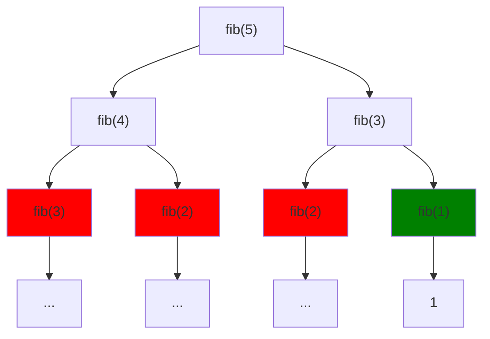

Видим, что $fib(3)$, $fib(2)$ считаются **многократно**! Это приводит к экспоненциальной сложности $O(2^n)$.

#### Анализ сложности наивного подхода {id: "dp-intro-fib-naive-complexity"}

| n | Вызовов функции | Время на ПК (≈) | Проблема |
|---|---|---|---|
| 10 | $2^{10} = 1024$ | < 1 мс | Нормально |
| 20 | $2^{20} \approx 10^6$ | 1 мс | Всё ещё быстро |
| 30 | $2^{30} \approx 10^9$ | 1 сек | Начинает медлить |
| 40 | $2^{40} \approx 10^{12}$ | 1000 сек | **Невозможно!** |
| 50 | $2^{50} \approx 10^{15}$ | Часы вычислений | 🔥 |

**График роста сложности:**

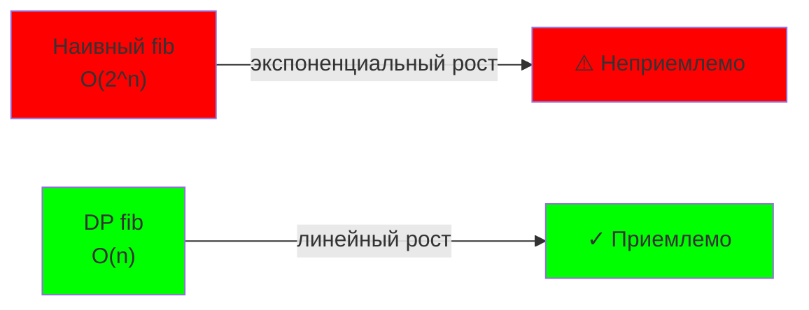

### Решение с DP {id: "dp-intro-fib-dp-solution"}

```just-ncv
func fib_dp(n: int32) -> int64:
    if n <= 1:
        return n
    
    dp = массив размером (n+1) инициализирован нулями
    dp[0] = 0
    dp[1] = 1
    
    for i in 2..n:
        dp[i] = dp[i-1] + dp[i-2]
    
    return dp[n]
```

Каждое значение считается **один раз** → сложность $O(n)$, память $O(n)$.

> 💡 **Главная идея:** Вместо того чтобы пересчитывать одно и то же многократно, вычислим один раз и сохраним в таблицу.

---

## Два подхода к DP {id: "dp-two-approaches"}

### Подход 1: Memoization (сверху вниз) {id: "dp-memoization"}

Пишем рекурсию, но сохраняем результаты в кэш (словарь/массив).

```just-ncv
memo = {}  # Глобальный кэш

func fib_memo(n: int32) -> int64:
    if n in memo:
        return memo[n]
    
    if n <= 1:
        return n
    
    result = fib_memo(n-1) + fib_memo(n-2)
    memo[n] = result
    return result
```

**Процесс выполнения Memoization для fib(5):**

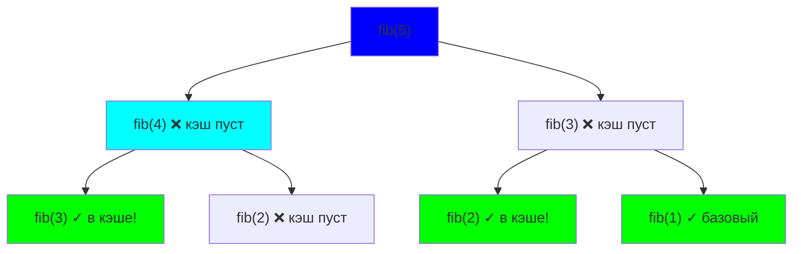

**Плюсы:** 
- ✅ Код выглядит как рекурсия, интуитивен
- ✅ Вычисляем только нужные подзадачи (лениво)

**Минусы:** 
- ❌ Может быть медленнее из-за глубокой рекурсии ($O(n)$ на стек вызовов)
- ❌ Риск переполнения стека при большом $n$

### Подход 2: Tabulation (снизу вверх) {id: "dp-tabulation"}

Явно строим таблицу, заполняя снизу вверх (от малых к большим).

```just-ncv
func fib_tab(n: int32) -> int64:
    dp = массив размером (n+1)
    dp[0] = 0
    dp[1] = 1
    
    for i in 2..n:
        dp[i] = dp[i-1] + dp[i-2]
    
    return dp[n]
```

**Процесс выполнения Tabulation для fib(5):**

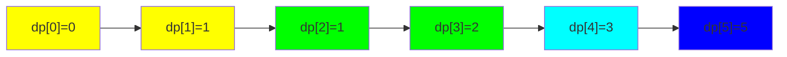

**Плюсы:** 
- ✅ Контролируемый итеративный процесс (без рекурсии)
- ✅ Быстрее на практике (нет overhead вызовов функций)
- ✅ Меньше памяти на стек

**Минусы:** 
- ❌ Нужно продумать порядок заполнения
- ❌ Вычисляем все значения, даже если нужны не все

### Сравнение подходов {id: "dp-comparison"}

| Критерий | Memoization | Tabulation |
|----------|---|---|
| **Тип** | Сверху вниз | Снизу вверх |
| **Рекурсия** | Да | Нет |
| **Когда применяется** | Сразу по требованию | Все сразу |
| **Сложность** | $O(n)$ | $O(n)$ |
| **Доп. память** | $O(n)$ на стек | $O(1)$ на стек |
| **Легче писать** | Да ✅ | Нет |
| **Быстрее** | Нет | Да ✅ |
| **Когда выбрать** | Прототипирование | Production |

---

## Когда использовать DP? {id: "dp-when-to-use"}

**Используйте DP, если:**
- Задача разбивается на **перекрывающиеся подзадачи** (иначе проще разделяй и властвуй).
- Есть **оптимальная подструктура** (решение зависит от решения подзадач).
- Можно выразить состояние несколькими переменными (N, не сотни).

**Не используйте DP, если:**
- Подзадачи не перекрываются (примеры: бинарный поиск, слияние сортировок).
- Состояние не подходит в памяти.
- Нужна реальная оптимальность, а не эвристика.

### Когда DP медленнее чем нужно? {id: "dp-when-dp-too-slow"}

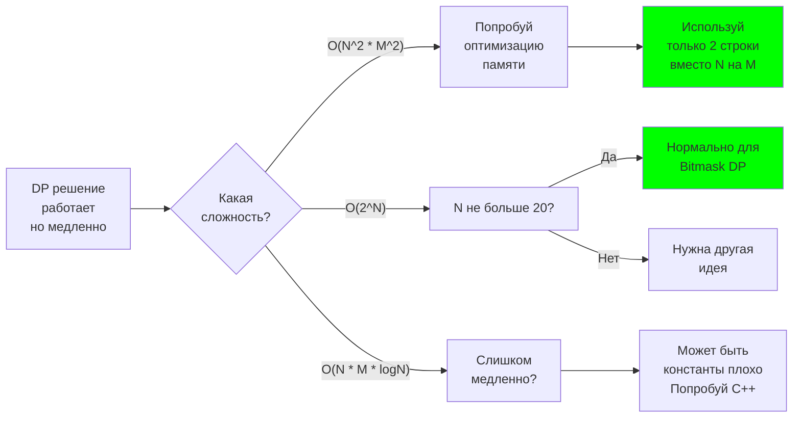

### Таблица: Когда какая сложность нормальна {id: "dp-complexity-table"}

| Сложность | Время | $N = 10$ | $N = 100$ | $N = 1000$ | $N = 10^6$ | Примеры |
|-----------|-------|----------|----------|-----------|-----------|---------|
| $O(N)$ | < 1 мкс | ✅ | ✅ | ✅ | ✅ | Линейный поиск, префиксные суммы |
| $O(N \log N)$ | < 1 мкс | ✅ | ✅ | ✅ | ⚠️ | Сортировка, НВП O(N log N) |
| $O(N^2)$ | < 1 мс | ✅ | ✅ | ⚠️ | ❌ | НОП, НВП O(N²) |
| $O(N^3)$ | 1 мс | ✅ | ⚠️ | ❌ | ❌ | Матричное умножение |
| $O(NM)$ | 1 мс | ✅ | ⚠️ | ❌ | ❌ | НОП, Edit Distance |
| $O(2^N)$ | 1 мс | ✅ | ❌ | ❌ | ❌ | Bitmask DP при $N \leq 20$ |
| $O(N!)$ | 1 мс | ⚠️ | ❌ | ❌ | ❌ | Перебор перестановок |

---

## Классификация DP задач {id: "dp-classification"}

| Тип | Характеристика | Примеры |
|-----|--|--|
| **По последовательности** | Учитываем элементы последовательности линейно | НОП, НВП, редактирование расстояния |
| **По подматрице** | Работаем с 2D таблицей (substring/subarray) | Максимальная подматрица, рюкзак |
| **По дереву** | Обходим дерево, вычисляя для поддеревьев | Максимальный путь без соседей, диаметр |
| **По интервалам** | Разбиваем интервал на части | Перемножение матриц, палиндромные подстроки |
| **Через граф** | DP на состояниях графа | Кратчайший путь, коммивояжер |

---

## Совет: как решать DP задачу? {id: "dp-how-to-solve"}

1. **Определи состояние:** что нужно запомнить? (например, `dp[i][j]` = ответ для первых i элементов строки A и первых j строки B)
2. **Напиши рекуррентное соотношение:** как вычислить `dp[i][j]` через меньшие подзадачи?
3. **Определи базовый случай:** для каких малых значений ответ очевиден?
4. **Выбери порядок вычислений:** табуляция (снизу вверх) или мемоизация (сверху вниз)?
5. **Оптимизируй:** можно ли сократить память или время?

### Схема процесса решения DP {id: "dp-solution-flowchart"}

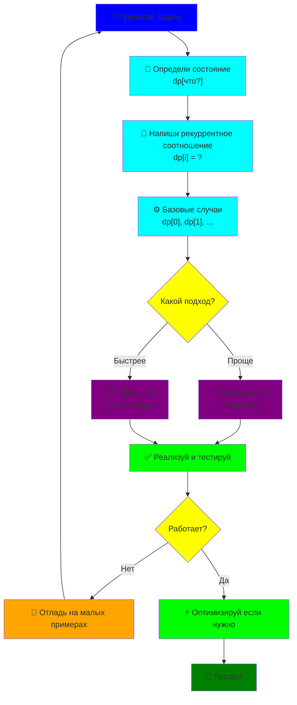

---

# Содержание {id: "contents"}

1. [Введение](#introduction)
   - Что такое динамическое программирование?
   - Два подхода: Memoization и Tabulation
   - Когда использовать DP?
   - Классификация задач DP
   - Как решать DP задачу?

2. [Дерево решений: какую DP выбрать](#decision-tree)
   - Схема классификации всех типов DP

3. [DP по последовательностям](#dp-by-substring)
   - [Наибольшая общая подпоследовательность (НОП)](#lcs)
     - Интуиция и рекуррентное соотношение
     - Пример трассировки
     - Реализация (табуляция и мемоизация)
     - Восстановление решения
     - Оптимизация памяти
   - [Наибольшая возрастающая подпоследовательность (НВП)](#lis)
     - Подход O(n²)
     - Подход O(n log n) с бинарным поиском
     - Восстановление НВП

4. [Рюкзак (Knapsack)](#knapsack)
   - [0-1 Рюкзак](#knapsack-0-1)
     - Постановка и интуиция
     - Пример трассировки
     - Реализация O(nW)
     - Оптимизация памяти
     - Восстановление решения
   - [Неограниченный рюкзак](#knapsack-unbounded)
   - [Рюкзак со счётом способов](#knapsack-counting)
   - Сравнение вариантов

5. [DP по деревьям](#dp-by-subtree)
   - Максимальный вес пути без соседних узлов
   - Диаметр дерева
   - Другие примеры

6. [Оптимизации и трюки](#optimizations)
   - Оптимизация памяти (Swapping)
   - Сокращение диапазона
   - Восстановление решения
   - Циклическая DP
   - Parallelization
   - Convex Hull Trick
   - Матричное возведение в степень

7. [Практические примеры](#practical-examples)
   - Редактирование расстояния (Edit Distance)
   - Задача коммивояжера (TSP + Bitmask)
   - Палиндромная подстрока

8. [Частые ошибки](#mistakes)
   - Проход в неправильном направлении (рюкзак)
   - Неинициализированная DP
   - Неправильный базовый случай
   - Смешивание индексации
   - Таблица типичных ошибок

9. [DP Шпаргалка: быстрые рецепты](#cheatsheet)
   - Шаблоны кода DP
   - Таблица выбора алгоритма
   - Частые ошибки и как их избежать
   - Быстрые советы на конкурсе

10. [Советы и рекомендации](#tips)
   - Начните с наивного решения
   - Используйте таблицы для отладки
   - Тестируйте на малых примерах
   - Модульная арифметика
   - Профилирование алгоритмов

11. [Заключение](#conclusion)

---

# Дерево решений: какую DP выбрать {id: "decision-tree"}

Потеряешься в типах DP? Используй эту схему выбора:

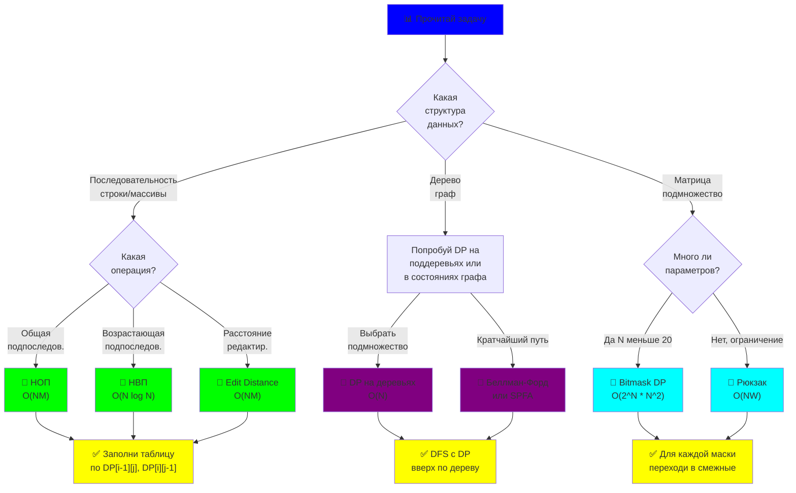

---

# DP по подотрезкам {id: "dp-by-substring"}

Самый частый случай: обработка подпоследовательностей строк/массивов.

## Наибольшая общая подпоследовательность (НОП) {id: "lcs"}

### Постановка задачи {id: "lcs-problem-statement"}

Даны две строки $A$ и $B$. Найти **длину наибольшей общей подпоследовательности** (может быть несмежной).

**Примеры:**
- $A = \text{"ABCD"}$, $B = \text{"ACD"}$ → НОП = $\text{"ACD"}$ (длина 3)
- $A = \text{"AGGTAB"}$, $B = \text{"GXTXAYB"}$ → НОП = $\text{"GTAB"}$ (длина 4)
- $A = \text{"ABC"}$, $B = \text{"DEF"}$ → НОП = "" (длина 0)

### Интуиция и рекуррентное соотношение {id: "lcs-recursion"}

Определим $dp[i][j]$ = **длина НОП первых $i$ символов $A$ и первых $j$ символов $B$**.

**Ключевая идея:** при каждом символе есть два выбора:

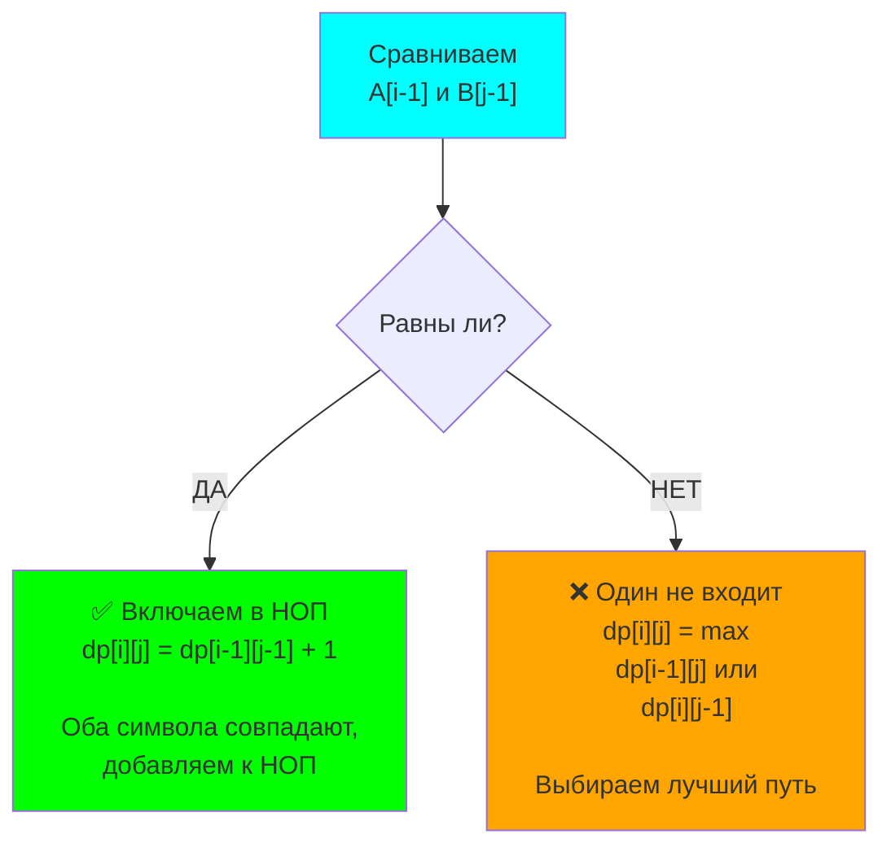

Рассмотрим два случая:

**Случай 1:** $A[i-1] = B[j-1]$ (последние символы совпадают)  
→ эти символы входят в НОП  
→ $dp[i][j] = dp[i-1][j-1] + 1$

**Случай 2:** $A[i-1] \neq B[j-1]$ (последние символы не совпадают)  
→ один из них не входит в НОП  
→ $dp[i][j] = \max(dp[i-1][j], dp[i][j-1])$

**Базовый случай:** если одна из строк пуста, НОП = 0.

$$
dp[i][j] = \begin{cases}
0 & \text{если } i=0 \text{ или } j=0 \\
dp[i-1][j-1] + 1 & \text{если } A[i-1] = B[j-1] \\
\max(dp[i-1][j], dp[i][j-1]) & \text{иначе}
\end{cases}
$$

### Пример трассировки {id: "lcs-trace-example"}

Строки: $A = \text{"ABC"}$, $B = \text{"AC"}$

| i\j | 0 | 1(A) | 2(C) |
|-----|---|------|------|
| 0   | 0 | 0    | 0    |
| 1(A)| 0 | **1**| 1    |
| 2(B)| 0 | 1    | 1    |
| 3(C)| 0 | 1    | **2**|

**Визуализация заполнения:**

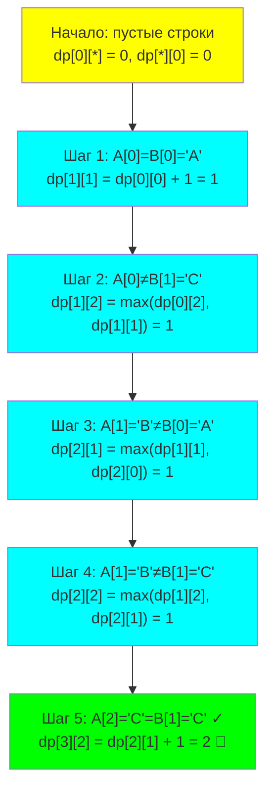

**Пошаговое объяснение:**
- $(0, j)$ и $(i, 0)$ = 0 (базовый случай) — пустая строка
- $(1, 1)$: $A[0]=B[0]='A'$ → **совпадают** → $dp[0][0] + 1 = 1$
- $(1, 2)$: $A[0]='A' \neq B[1]='C'$ → **не совпадают** → $\max(dp[0][2], dp[1][1]) = \max(0, 1) = 1$
- $(2, 1)$: $A[1]='B' \neq B[0]='A'$ → **не совпадают** → $\max(dp[1][1], dp[2][0]) = \max(1, 0) = 1$
- $(2, 2)$: $A[1]='B' \neq B[1]='C'$ → **не совпадают** → $\max(dp[1][2], dp[2][1]) = \max(1, 1) = 1$
- $(3, 2)$: $A[2]='C' = B[1]='C'$ → **совпадают!** → $dp[2][1] + 1 = 1 + 1 = 2$ ✓

**Ответ:** $dp[3][2] = 2$ (НОП = "AC")

### Реализация — Табуляция (снизу вверх) {id: "lcs-tabulation"}

```just-ncv
func lcs(A: str, B: str) -> int32:
    n = len(A)
    m = len(B)
    
    # dp[i][j] = НОП для A[0..i-1] и B[0..j-1]
    dp = массив размером (n+1) × (m+1) инициализирован нулями
    
    # Базовый случай: dp[0][j] = 0, dp[i][0] = 0 (уже есть)
    
    # Заполняем таблицу
    for i in 1..n:
        for j in 1..m:
            if A[i-1] == B[j-1]:
                # Символы совпадают
                dp[i][j] = dp[i-1][j-1] + 1
            else:
                # Символы не совпадают — берём лучший результат
                dp[i][j] = max(dp[i-1][j], dp[i][j-1])
    
    return dp[n][m]

# Использование:
result = lcs("ABCD", "ACD")  # Вернёт 3
```

### Реализация — Мемоизация (сверху вниз) {id: "lcs-memoization"}

```just-ncv
memo = {}  # Глобальный кэш

func lcs_memo(A: str, B: str, i: int32, j: int32) -> int32:
    # Базовые случаи
    if i == 0 or j == 0:
        return 0
    
    # Проверяем кэш
    key = (i, j)
    if key in memo:
        return memo[key]
    
    # Рекурсивный случай
    var result: int32
    if A[i-1] == B[j-1]:
        result = 1 + lcs_memo(A, B, i-1, j-1)
    else:
        result = max(lcs_memo(A, B, i-1, j), 
                     lcs_memo(A, B, i, j-1))
    
    # Сохраняем в кэш
    memo[key] = result
    return result

# Использование:
result = lcs_memo("ABCD", "ACD", 4, 3)  # Вернёт 3
```

### Восстановление самой подпоследовательности {id: "lcs-reconstruction"}

После построения DP таблицы можем восстановить саму НОП, идя от конца к началу:

```just-ncv
func reconstruct_lcs(A: str, B: str, dp: array) -> str:
    n = len(A)
    m = len(B)
    
    result = ""
    i = n
    j = m
    
    # Идём от конца к началу
    while i > 0 and j > 0:
        # Если символы совпадают, это часть НОП
        if A[i-1] == B[j-1]:
            result = A[i-1] + result  # Добавляем в начало
            i -= 1
            j -= 1
        # Если нет, идём в направлении большего значения
        elif dp[i-1][j] > dp[i][j-1]:
            i -= 1
        else:
            j -= 1
    
    return result

# Использование:
lcs_string = reconstruct_lcs("ABCD", "ACD", dp_table)
print(lcs_string)  # Выведет "ACD"
```

### Сложность и оптимизация {id: "lcs-complexity"}

| Метрика | Значение |
|---------|----------|
| **Время** | $O(NM)$ — два вложенных цикла |
| **Память** | $O(NM)$ — таблица DP |
| **Оптимизация памяти** | $O(M)$ — храним только 2 строки вместо N |

**Оптимизация памяти** (если нужна только длина):

```just-ncv
func lcs_space_optimized(A: str, B: str) -> int32:
    n = len(A)
    m = len(B)
    
    prev = массив размером (m+1) инициализирован нулями
    curr = массив размером (m+1) инициализирован нулями
    
    for i in 1..n:
        for j in 1..m:
            if A[i-1] == B[j-1]:
                curr[j] = prev[j-1] + 1
            else:
                curr[j] = max(prev[j], curr[j-1])
        
        prev, curr = curr, prev  # Swap
    
    return prev[m]
```

---

## Наибольшая возрастающая подпоследовательность (НВП) {id: "lis"}

### Постановка задачи {id: "lis-problem-statement"}

Дан массив целых чисел. Найти **длину наибольшей возрастающей подпоследовательности** (элементы расположены в порядке возрастания, но необязательно смежные).

**Примеры:**
- Массив: $[10, 9, 2, 5, 3, 7, 101, 18]$ → НВП: $[2, 3, 7, 101]$ (длина 4)
- Массив: $[3, 10, 2, 1, 20]$ → НВП: $[3, 10, 20]$ (длина 3)
- Массив: $[1, 2, 3]$ → НВП: $[1, 2, 3]$ (длина 3)

---

### Подход 1: Динамическое программирование $O(n^2)$ {id: "lis-n2"}

#### Идея {id: "lis-n2-idea"}

Определим $dp[i]$ = **длина НВП, заканчивающейся в элементе $i$**.

Для каждого $i$, проверяем все $j < i$:
- Если $arr[j] < arr[i]$, то можем расширить НВП заканчивающуюся в $j$, добавив $arr[i]$.
- Берём максимум: $dp[i] = 1 + \max_{j < i, arr[j] < arr[i]} dp[j]$

#### Рекуррентное соотношение {id: "lis-n2-recursion"}

$$
dp[i] = 1 + \max\{dp[j] : j < i \text{ и } arr[j] < arr[i]\}
$$

Если нет подходящих $j$, то $dp[i] = 1$ (сама подпоследовательность одна).

#### Пример трассировки {id: "lis-n2-trace-example"}

Массив: $[10, 9, 2, 5, 3, 7, 101, 18]$

| i | arr[i] | dp[i] | Объяснение |
|---|--------|-------|-----------|
| 0 | 10 | 1 | НВП начинается с 10 |
| 1 | 9 | 1 | 9 < 10, начинаем заново |
| 2 | 2 | 1 | 2 < все, начинаем заново |
| 3 | 5 | 2 | 2 < 5, расширяем [2] → [2, 5] |
| 4 | 3 | 2 | 2 < 3 < 5, расширяем [2] → [2, 3] |
| 5 | 7 | 3 | max(2+1, 3+1) = 3, расширяем [2, 5] → [2, 5, 7] |
| 6 | 101 | 4 | 7 < 101, расширяем [2, 5, 7] → [2, 5, 7, 101] |
| 7 | 18 | 4 | 7 < 18, но не лучше чем 101 |

**Ответ:** $\max(dp) = 4$ (НВП = $[2, 5, 7, 101]$)

#### Реализация {id: "lis-n2-implementation"}

```just-ncv
func lis_n2(arr: array<int32>) -> int32:
    n = len(arr)
    
    # dp[i] = длина НВП заканчивающейся в i-м элементе
    dp = массив размером n инициализирован единицами
    
    for i in 1..n-1:
        for j in 0..i-1:
            # Если элемент arr[j] меньше arr[i], можем расширить
            if arr[j] < arr[i]:
                dp[i] = max(dp[i], dp[j] + 1)
    
    # Ищем максимум
    return max_element(dp)

# Использование:
result = lis_n2([10, 9, 2, 5, 3, 7, 101, 18])  # Вернёт 4
```

**Сложность:**
- **Время:** $O(n^2)$ — два вложенных цикла
- **Память:** $O(n)$ — массив DP

---

### Подход 2: Бинарный поиск $O(n \log n)$ — Оптимальный {id: "lis-nlogn"}

#### Идея {id: "lis-nlogn-idea"}

Этот подход считается **более продвинутым**, но отвечает на более сложный вопрос: "какой минимальный последний элемент может быть в НВП длины $k$?"

Храним массив `tail`, где `tail[k]` = **минимальный последний элемент НВП длины $k+1$**.

**Ключевое свойство:** массив `tail` всегда отсортирован!

#### Механика алгоритма {id: "lis-nlogn-mechanics"}

Для каждого нового элемента `x`:
1. Ищем в `tail` место для `x` с помощью двоичного поиска.
2. Если найдём элемент $\geq x$ на позиции `i`, заменим `tail[i]` на `x`.
   - Почему? Потому что `x` меньше, и с ним можем потенциально продолжить лучше.
3. Если не найдём (т.е. `x` больше всех), добавим `x` в конец `tail`.
   - Это означает, что нашли НВП длины на 1 больше.

#### Пример трассировки {id: "lis-nlogn-trace-example"}

Массив: $[10, 9, 2, 5, 3, 7, 101, 18]$

| Элемент | tail | Шаг | Объяснение |
|---------|------|-----|-----------|
| 10 | [10] | 1️⃣ | Первый элемент, добавляем |
| 9 | [9] | 2️⃣ | 9 < 10, заменяем tail[0] |
| 2 | [2] | 3️⃣ | 2 < 9, заменяем tail[0] |
| 5 | [2, 5] | 4️⃣ | 5 > 2, добавляем (НВП длины 2) |
| 3 | [2, 3] | 5️⃣ | 3 между 2 и 5, заменяем tail[1] (лучше) |
| 7 | [2, 3, 7] | 6️⃣ | 7 > 3, добавляем (НВП длины 3) |
| 101 | [2, 3, 7, 101] | 7️⃣ | 101 > 7, добавляем (НВП длины 4) |
| 18 | [2, 3, 7, 18] | 8️⃣ | 18 между 7 и 101, заменяем tail[3] (лучше) |

**Визуализация процесса с бинарным поиском:**

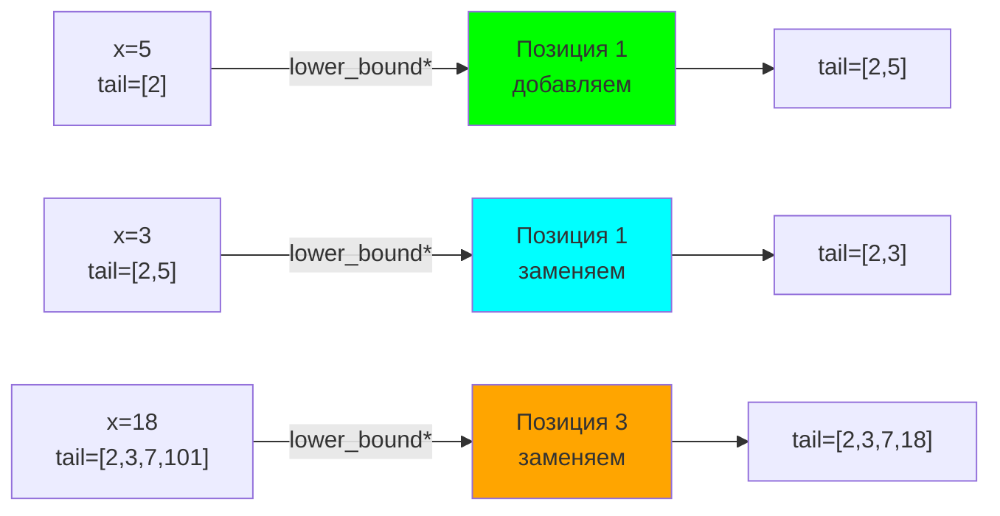

> **Суть:** `lower_bound` — это двоичный поиск, который находит **первый элемент в массиве, который ≥ x**. Если найдём, заменяем его (делаем лучше). Если нет, добавляем в конец.

**Финальный ответ:** $\text{len(tail)} = 4$ (длина НВП)

> **Почему это работает?** Массив `tail` всегда отсортирован. Заменяя элемент на меньший, не портим монотонность. Добавляя в конец, расширяем НВП. Финальный `tail` не обязательно является сама НВП, но его длина = длина оптимальной НВП.

#### Реализация {id: "lis-nlogn-implementation"}

```just-ncv
# Функция бинарного поиска (ищем первый элемент >= x)
func binary_search_gte(arr: array<int32>, x: int32) -> int32:
    left = 0
    right = len(arr)
    
    while left < right:
        mid = (left + right) / 2
        if arr[mid] < x:
            left = mid + 1
        else:
            right = mid
    
    return left

func lis_nlogn(arr: array<int32>) -> int32:
    tail = []  # Пусто в начале
    
    for x in arr:
        # Ищем позицию для вставки x
        pos = binary_search_gte(tail, x)
        
        if pos == len(tail):
            # x больше всех — добавляем в конец
            tail.append(x)
        else:
            # Заменяем элемент на позиции pos
            tail[pos] = x
    
    return len(tail)

# Использование:
result = lis_nlogn([10, 9, 2, 5, 3, 7, 101, 18])  # Вернёт 4
```

**Сложность:**
- **Время:** $O(n \log n)$ — n элементов × $\log n$ на двоичный поиск
- **Память:** $O(n)$ — массив tail

#### Встроенные функции {id: "lis-nlogn-with-builtin"}

```just-ncv
func lis_nlogn_with_builtin(arr: array<int32>) -> int32:
    tail = []
    
    for x in arr:
        # lower_bound — встроенная функция для двоичного поиска
        # Возвращает первый элемент >= x
        it = lower_bound(tail, x)
        
        if it == end(tail):
            tail.append(x)
        else:
            *it = x  # Разыменовываем и заменяем
    
    return len(tail)
```

---

### Восстановление самой НВП {id: "lis-reconstruction"}

После нахождения длины можем восстановить саму подпоследовательность:

```just-ncv
func reconstruct_lis(arr: array<int32>) -> array<int32>:
    n = len(arr)
    dp = массив размером n инициализирован единицами
    parent = массив размером n инициализирован (-1)
    
    # Заполняем DP таблицу
    for i in 1..n-1:
        for j in 0..i-1:
            if arr[j] < arr[i] and dp[j] + 1 > dp[i]:
                dp[i] = dp[j] + 1
                parent[i] = j  # Запоминаем, откуда пришли
    
    # Ищем конец НВП (где dp[i] = max)
    max_length = max_element(dp)
    end_index = index_of(dp, max_length)  # Индекс максимума
    
    # Восстанавливаем путь
    result = []
    current = end_index
    while current != -1:
        result.prepend(arr[current])  # Добавляем в начало
        current = parent[current]
    
    return result

# Использование:
lis_sequence = reconstruct_lis([10, 9, 2, 5, 3, 7, 101, 18])
# Вернёт примерно [2, 3, 7, 101]
```

---

### Сравнение подходов {id: "lis-comparison"}

| Критерий | O(n²) | O(n log n) |
|----------|-------|-----------|
| Время | $O(n^2)$ | $O(n \log n)$ |
| Память | $O(n)$ | $O(n)$ |
| Реализация | Проста | Сложнее |
| Восстановление решения | Легко (массив parent) | Сложнее |
| Когда использовать | n < 5000 | n > 5000 |

---

# DP по поддеревьям {id: "dp-by-subtree"}

Используется для задач на деревьях, где нужно вычислить что-то для каждого поддерева (или путём в дереве).

---

## Пример: максимальный вес пути без соседей {id: "max-weight-no-adjacent-nodes"}

### Постановка задачи {id: "max-weight-no-adjacent-nodes-problem-statement"}

Дано дерево с весами в узлах. Найти **максимальный суммарный вес пути**, где **никакие два соседних узла не могут быть оба выбраны**.

**Примеры:**
- Дерево с весами:

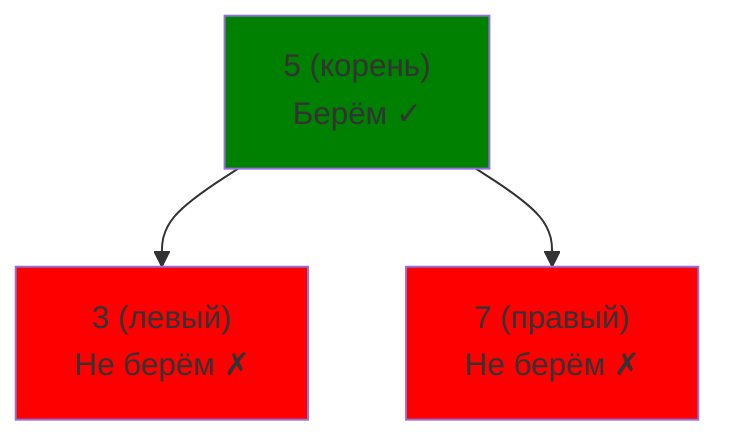

Правило: если берём узел, **не можем брать его соседей** (родителя и детей).

### Рекуррентное соотношение {id: "max-weight-no-adjacent-nodes-recursion"}

Для каждого узла $v$ определим:
- $dp[v][0]$ = максимальный вес в поддереве $v$, **не беря сам узел $v$**
- $dp[v][1]$ = максимальный вес в поддереве $v$, **беря сам узел $v$**

$$
dp[v][0] = \sum_{\text{дети } u} \max(dp[u][0], dp[u][1])
$$

$$
dp[v][1] = weight[v] + \sum_{\text{дети } u} dp[u][0]
$$

**Ответ:** $\max(dp[\text{корень}][0], dp[\text{корень}][1])$

### Пример трассировки {id: "max-weight-no-adjacent-nodes-trace-example"}

Дерево:

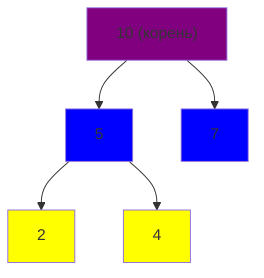

| Узел | Вес | dp[узел][0] | dp[узел][1] | Пояснение |
|-----|-----|-----------|-----------|-----------|
| 2 (лист) | 2 | 0 | 2 | Не берём=0, берём=2 |
| 4 (лист) | 4 | 0 | 4 | Не берём=0, берём=4 |
| 7 (лист) | 7 | 0 | 7 | Не берём=0, берём=7 |
| 5 (2 детей) | 5 | max(0,2)+max(0,4)=6 | 5+0+0=5 | Не берём=6, берём=5 |
| 10 (2 детей) | 10 | max(6,5)+max(0,7)=13 | 10+6+0=16 | Не берём=13, берём=16 |

**Ответ:** $\max(13, 16) = 16$ (выбираем узлы 10, 5, и один из детей узла 5)

### Реализация {id: "max-weight-no-adjacent-nodes-implementation"}

```just-ncv
struct Node:
    value: int32
    left: optional<Node>
    right: optional<Node>
    children: array<Node>  # Для общего случая

func dfs_tree_dp(v: Node, parent: optional<Node>) -> array<int64>:
    # Возвращаем [dp[v][0], dp[v][1]]
    
    result = [0, v.value]  # [не берём, берём]
    
    # Обрабатываем всех детей
    for child in v.children:
        if child == parent:
            continue
        
        child_dp = dfs_tree_dp(child, v)
        
        # Если не берём v, можем брать или не брать детей
        result[0] += max(child_dp[0], child_dp[1])
        
        # Если берём v, не можем брать детей
        result[1] += child_dp[0]
    
    return result

func solve_tree_dp(root: Node) -> int64:
    result = dfs_tree_dp(root, null)
    return max(result[0], result[1])
```

---

## Другие DP на деревьях {id: "other-dp-on-trees"}

### Диаметр дерева {id: "tree-diameter"}

Найти **максимальное расстояние между двумя узлами**.

```just-ncv
func dfs_diameter(v: Node, parent: Node) -> pair<int32, int32>:
    # Возвращаем (диаметр поддерева, макс. глубина)
    
    diameter = 0
    max_depth = 0
    
    depths = []  # Глубины всех детей
    
    for child in v.children:
        if child == parent:
            continue
        
        (child_diam, child_depth) = dfs_diameter(child, v)
        diameter = max(diameter, child_diam)
        depths.append(child_depth + 1)
    
    # Диаметр может проходить через v
    if len(depths) >= 2:
        depths.sort()
        diameter = max(diameter, depths[-1] + depths[-2])
    
    max_depth = if len(depths) > 0 then max(depths) else 0
    
    return (diameter, max_depth)
```

---

# Рюкзак {id: "knapsack"}

Семейство задач **оптимизации:** выбрать подмножество предметов, максимизируя стоимость при ограничении по весу. Это одна из **самых важных** DP задач!

---

## 0-1 Рюкзак {id: "knapsack-0-1"}

### Постановка задачи {id: "knapsack-0-1-problem-statement"}

Каждый предмет можно взять **максимум один раз**.

**Дано:**
- $n$ предметов
- Вес предмета $i$: $w_i$
- Стоимость предмета $i$: $v_i$
- Максимальный вес рюкзака: $W$

**Найти:** максимальную стоимость, выбрав предметы с суммарным весом $\leq W$.

**Примеры:**
- Предметы: вес=[2, 3, 4, 5], стоимость=[3, 4, 5, 6], W=5
- Оптимально: взять предметы 0 и 1 (вес=5, стоимость=7)

### Интуиция и рекуррентное соотношение {id: "knapsack-0-1-recursion"}

Определим $dp[i][w]$ = **максимальная стоимость, используя первые $i$ предметов с весом $\leq w$**.

Для каждого предмета $i$, есть два выбора:
1. **Не берём предмет $i$:** $dp[i-1][w]$
2. **Берём предмет $i$** (если вес позволяет): $dp[i-1][w-w_i] + v_i$

$$
dp[i][w] = \begin{cases}
0 & \text{если } i = 0 \text{ или } w = 0 \\
dp[i-1][w] & \text{если } w_i > w \text{ (не влезает)} \\
\max(dp[i-1][w], dp[i-1][w-w_i] + v_i) & \text{иначе}
\end{cases}
$$

### Пример трассировки {id: "knapsack-0-1-trace-example"}

Предметы: `w=[2,3,4]`, `v=[3,4,5]`, $W=5$

**Таблица DP:**

| i\w | 0 | 1 | 2 | 3 | 4 | 5 |
|-----|---|---|---|---|---|---|
| 0   | 0 | 0 | 0 | 0 | 0 | 0 |
| 1(w=2,v=3) | 0 | 0 | **3** | 3 | 3 | 3 |
| 2(w=3,v=4) | 0 | 0 | 3 | **4** | 4 | **7** |
| 3(w=4,v=5) | 0 | 0 | 3 | 4 | **5** | **7** |

**Визуализация решений в таблице:**

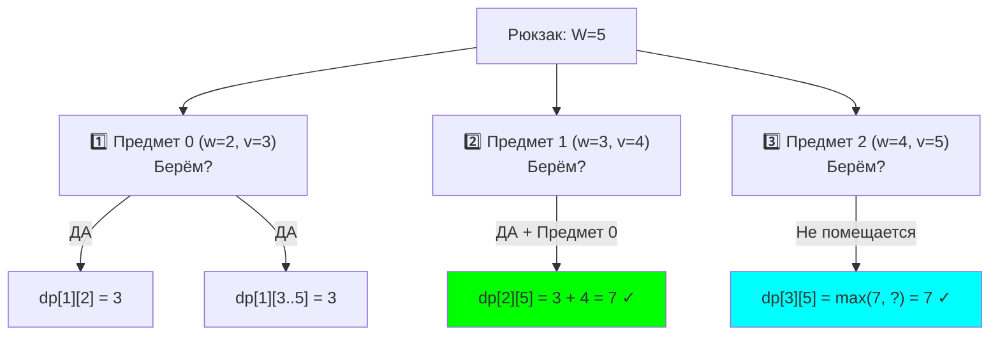

**Пошаговое объяснение:**

- $(1,2)$: Предмет 0 влезает в вес 2 → $dp[0][0] + 3 = 3$ ✅
- $(2,3)$: Предмет 1 влезает в вес 3 → $dp[1][0] + 4 = 4$ ✅
- $(2,5)$: Можем взять оба: предмет 1 + лучший результат для веса 2 → $dp[1][2] + 4 = 3 + 4 = 7$ ✅✅
- $(3,4)$: Предмет 2 влезает в вес 4 → $dp[2][0] + 5 = 5$ (но это меньше 7)
- $(3,5)$: Максимум = 7 (беру предметы 0 и 1)

**Ответ:** $dp[3][5] = 7$ (максимальная стоимость с весом ≤ 5)

### Реализация — табуляция O(nW) {id: "knapsack-0-1-implementation"}

```just-ncv
func knapsack_01(w: array<int32>, v: array<int32>, W: int32) -> int32:
    n = len(w)
    
    # dp[i][cap] = max стоимость с первыми i предметами и capacity <= cap
    dp = массив размером (n+1) × (W+1) инициализирован нулями
    
    for i in 1..n:
        for cap in 0..W:
            # Не берём i-й предмет
            dp[i][cap] = dp[i-1][cap]
            
            # Если можем взять i-й предмет
            if w[i-1] <= cap:
                dp[i][cap] = max(dp[i][cap], 
                                 dp[i-1][cap - w[i-1]] + v[i-1])
    
    return dp[n][W]

# Использование:
result = knapsack_01([2, 3, 4], [3, 4, 5], 5)  # Вернёт 7
```

### Оптимизация памяти — O(W) {id: "knapsack-0-1-memory-optimization"}

Вместо 2D таблицы используем 1D, **проходя справа налево**:

```just-ncv
func knapsack_01_1d(w: array<int32>, v: array<int32>, W: int32) -> int32:
    # dp[cap] = max стоимость с capacity <= cap
    dp = массив размером (W+1) инициализирован нулями
    
    for i in 0..len(w)-1:
        # ⚠️ ВАЖНО: проходим справа налево!
        for cap in W..w[i]-1 step -1:
            dp[cap] = max(dp[cap], dp[cap - w[i]] + v[i])
    
    return dp[W]
```

**Почему справа налево?**
- Слева направо: предмет `i` может быть выбран несколько раз (переходит в неограниченный рюкзак).
- Справа налево: каждый предмет рассматривается **ровно один раз**.

---

### Восстановление решения {id: "knapsack-0-1-reconstruction"}

Какие именно предметы выбрать?

```just-ncv
func reconstruct_01_knapsack(w: array<int32>, v: array<int32>, 
                              dp: array, W: int32) -> array<int32>:
    n = len(w)
    selected = []
    
    cap = W
    for i in n..1 step -1:
        # Если значение пришло из "взяли предмет"
        if cap >= w[i-1] and dp[i][cap] == dp[i-1][cap - w[i-1]] + v[i-1]:
            selected.prepend(i-1)  # Предмет i (0-indexed i-1)
            cap -= w[i-1]
    
    return selected

# Использование:
items = reconstruct_01_knapsack([2,3,4], [3,4,5], dp_table, 5)
# Вернёт [0, 1] — выбрали предметы с индексами 0 и 1
```

---

## Неограниченный рюкзак {id: "knapsack-unbounded"}

### Отличие от 0-1 Рюкзака {id: "knapsack-unbounded-difference"}

Каждый предмет можно взять **неограниченное количество раз**.

**Примеры:**
- Рюкзак с бесконечными копиями монет (задача о разменеанию)
- Набор конфет, можно повторять

### Рекуррентное соотношение {id: "knapsack-unbounded-recursion"}

$$
dp[w] = \max_{i: w_i \leq w} (dp[w - w_i] + v_i)
$$

Главное отличие: **проходим слева направо**, чтобы один предмет мог быть выбран несколько раз.

### Реализация {id: "knapsack-unbounded-implementation"}

```just-ncv
func knapsack_unbounded(w: array<int32>, v: array<int32>, W: int32) -> int32:
    # dp[cap] = max стоимость с capacity <= cap
    dp = массив размером (W+1) инициализирован нулями
    
    for cap in 1..W:
        for i in 0..len(w)-1:
            # Если предмет i влезает
            if w[i] <= cap:
                # Может быть выбран несколько раз
                dp[cap] = max(dp[cap], dp[cap - w[i]] + v[i])
    
    return dp[W]

# Использование:
result = knapsack_unbounded([2, 3], [3, 4], 5)  # Вернёт 6 (берём [3,3])
```

### Пример: размен монет {id: "coin-change-min-coins"}

**Задача:** найти минимальное количество монет номиналом $coins$ для суммы $amount$.

```just-ncv
func min_coins(coins: array<int32>, amount: int32) -> int32:
    # dp[i] = мин. количество монет для суммы i
    dp = массив размером (amount+1) инициализирован infinity
    dp[0] = 0  # 0 монет для суммы 0
    
    for i in 1..amount:
        for coin in coins:
            if coin <= i:
                dp[i] = min(dp[i], dp[i - coin] + 1)
    
    return dp[amount] if dp[amount] != infinity else -1
```

---

## Рюкзак со счётом способов {id: "knapsack-counting"}

### Задача {id: "knapsack-counting-problem-statement"}

Сколько способов выбрать предметы **ровно с весом $w$** (0-1 рюкзак)?

**Примеры:**
- Предметы: вес=[1, 2, 3], W=5
- Способы: [1,1,3], [2,3] → **2 способа**

### Реализация {id: "knapsack-counting-implementation"}

```just-ncv
func knapsack_counting_01(w: array<int32>, W: int32) -> int64:
    # dp[cap] = кол-во способов получить ровно вес cap
    dp = массив размером (W+1) инициализирован нулями
    dp[0] = 1  # Один способ — ничего не брать
    
    for i in 0..len(w)-1:
        # Справа налево для 0-1 рюкзака
        for cap in W..w[i]-1 step -1:
            dp[cap] += dp[cap - w[i]]
    
    return dp[W]

# Использование:
result = knapsack_counting_01([1, 2, 3], 5)  # Вернёт 2
```

---

## Сравнение вариантов рюкзака {id: "knapsack-comparison"}

| Вариант | Проход | Память | Пример | Сложность |
|---------|--------|--------|---------|-----------|
| 0-1 Рюкзак | Справа налево | $O(W)$ | Каждый предмет один раз | $O(nW)$ |
| Неограниченный | Слева направо | $O(W)$ | Монеты, конфеты | $O(nW)$ |
| Счёт способов (0-1) | Справа налево | $O(W)$ | Количество разделений | $O(nW)$ |

---

# Оптимизации и трюки {id: "optimizations"}

## 1. Оптимизация памяти (Swapping) {id: "dp-memory-optimization"}

Вместо хранения всей DP таблицы, храним только две строки (предыдущую и текущую):

```just-ncv
func lcs_space_opt(A: str, B: str) -> int32:
    m = len(B)
    
    prev = массив размером (m+1) инициализирован нулями
    curr = массив размером (m+1) инициализирован нулями
    
    for i in 1..len(A):
        for j in 1..m:
            if A[i-1] == B[j-1]:
                curr[j] = prev[j-1] + 1
            else:
                curr[j] = max(prev[j], curr[j-1])
        
        prev, curr = curr, prev  # Swapping
    
    return prev[m]
```

**Память:** $O(NM) \to O(M)$

---

## 2. Сокращение диапазона {id: "knapsack-sparse"}

Если максимальный вес $W$ огромный, но обновляется редко, можно хранить только активный диапазон:

```just-ncv
func knapsack_sparse(w: array<int32>, v: array<int32>, W: int32) -> int32:
    # Используем словарь вместо массива
    dp = {}
    dp[0] = 0
    
    for i in 0..len(w)-1:
        new_dp = copy(dp)  # Копируем для 0-1 рюкзака
        
        for (cap, value) in dp:
            new_cap = cap + w[i]
            if new_cap <= W:
                if new_cap not in new_dp:
                    new_dp[new_cap] = 0
                new_dp[new_cap] = max(new_dp[new_cap], value + v[i])
        
        dp = new_dp
    
    return dp.get(W, 0)
```

---

## 3. Восстановление решения {id: "dp-reconstruction"}

Всегда сохраняйте информацию о "родителе" при заполнении DP:

```just-ncv
struct DPState:
    value: int64
    parent: optional<tuple<int32, int32>>  # Откуда пришли
    choice: str  # "take" или "skip"

# При заполнении:
if take_better:
    dp[i][j].parent = (i-1, j-w[i])
    dp[i][j].choice = "take"
else:
    dp[i][j].parent = (i-1, j)
    dp[i][j].choice = "skip"
```

---

## 4. Циклическая DP (для оптимизации) {id: "cyclic-dp"}

Вместо выделения новых массивов, используем циклический буфер:

```just-ncv
# Вместо prev/curr
buffers = [массив, массив, массив]  # Циклический буфер

for i in 0..1000000:
    current_buf = buffers[i % 3]
    prev_buf = buffers[(i-1) % 3]
    next_buf = buffers[(i+1) % 3]
```

---

## 5. Паралеллизм в DP {id: "dp-parallelism"}

Некоторые DP задачи можно ускорить с помощью параллелизма:

```just-ncv
# DP по блокам (для DP на матрицах)
func parallel_dp():
    # Разделяем матрицу на блоки
    # Каждый поток вычисляет свой блок
    # Синхронизируемся на границах
```

---

## 6. Оптимизация: Convex Hull Trick {id: "convex-hull-trick"}

Для DP вида $dp[i] = \min_j (a_j \cdot b_i + c_j)$, используем выпуклую оболочку:

```just-ncv
# Быстрая структура данных для линейных функций
struct ConvexHullTrick:
    lines: array<pair<int64, int64>>  # (a, c) для y = ax + c
    
    func add_line(a: int64, c: int64):
        # Добавляем новую линию
        # Удаляем "бесполезные" линии из hull
    
    func query(b: int64) -> int64:
        # Ищем минимум y для данного b (x-координата)
        # Используем двоичный поиск
```

---

## 7. Матричное возведение в степень (для линейного DP) {id: "matrix-exponentiation"}

Если рекуррентное соотношение линейно, можно использовать матричные степени:

$$
\begin{pmatrix} f(n) \\ f(n-1) \end{pmatrix} = \begin{pmatrix} 1 & 1 \\ 1 & 0 \end{pmatrix}^n \begin{pmatrix} 1 \\ 0 \end{pmatrix}
$$

Это позволяет считать $f(10^{18})$ за $O(\log n)$ операций!

```just-ncv
func matrix_power(matrix: array<array>, power: int64) -> array<array>:
    # Быстрое возведение матрицы в степень
    result = identity_matrix()
    base = matrix
    
    while power > 0:
        if power % 2 == 1:
            result = matrix_multiply(result, base)
        base = matrix_multiply(base, base)
        power /= 2
    
    return result
```

---

# Практические примеры {id: "practical-examples"}

## Пример 1: Редактирование расстояния (Edit Distance / Levenshtein) {id: "exmp-1-edit-distance"}

### Задача {id: "edit-distance-problem"}

Минимальное количество операций (вставка, удаление, замена символа) для преобразования строки $A$ в строку $B$.

**Примеры:**
- "KITTEN" → "SITTING" (3 операции)
- "CAT" → "DOG" (3 операции)
- "ABC" → "ABC" (0 операций)

### Решение {id: "edit-distance-solution"}

```just-ncv
func edit_distance(A: str, B: str) -> int32:
    n = len(A)
    m = len(B)
    
    dp = массив размером (n+1) × (m+1)
    
    # Базовые случаи
    for i in 0..n:
        dp[i][0] = i  # Удалить i символов
    for j in 0..m:
        dp[0][j] = j  # Вставить j символов
    
    # Заполняем таблицу
    for i in 1..n:
        for j in 1..m:
            if A[i-1] == B[j-1]:
                dp[i][j] = dp[i-1][j-1]  # Без операций
            else:
                dp[i][j] = 1 + min(
                    dp[i-1][j],      # Удаления
                    dp[i][j-1],      # Вставка
                    dp[i-1][j-1]     # Замена
                )
    
    return dp[n][m]

# Использование:
distance = edit_distance("KITTEN", "SITTING")  # 3
```

### Пример трассировки: "KAT" → "CAT" {id: "exmp-1-edit-distance-trace-example"}

| i\j | 0 | 1(C) | 2(A) | 3(T) |
|-----|---|------|------|------|
| 0   | 0 | 1    | 2    | 3    |
| 1(K)| 1 | **1**| 2    | 3    |
| 2(A)| 2 | 2    | **1**| 2    |
| 3(T)| 3 | 3    | 2    | **1**|

**Визуализация операций:**

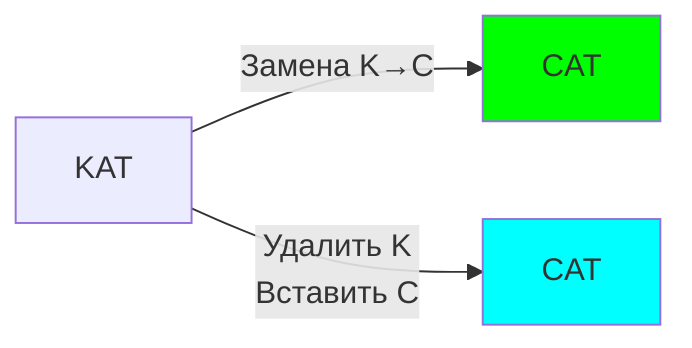

**Интерпретация:**
- $(1,1)$: K ≠ C → $1 + \min(dp[0][1], dp[1][0], dp[0][0]) = 1 + 0 = 1$ (замена)
- $(2,2)$: A = A → $dp[1][1] = 1$ (совпадает, без операций)
- $(3,3)$: T = T → $dp[2][2] = 1$ (совпадает, без операций)

**Ответ:** 1 операция (замена K на C)

---

## Пример 2: Задача коммивояжера (DP + Bitmask) {id: "exmp-2-tsp"}

### Задача {id: "tsp-problem"}

Найти кратчайший путь, посетив все города ровно один раз (ненайденное NP-сложно, но DP для $n \leq 20$).

### Решение {id: "tsp-solution"}

```just-ncv
func traveling_salesman(dist: array<array>, n: int32) -> int32:
    # dist[i][j] = расстояние между городами i и j
    # dp[mask][i] = мин. расстояние, посетив города из mask, закончив в i
    
    INF = positive_infinity
    dp = массив размером (1 << n) × n инициализирован INF
    
    dp[1][0] = 0  # Начинаем в городе 0
    
    for mask in 1..(1 << n):
        for i in 0..n-1:
            if dp[mask][i] == INF:
                continue
            
            # Пробуем идти в город j
            for j in 0..n-1:
                if mask & (1 << j) == 0:  # Город j ещё не посещали
                    new_mask = mask | (1 << j)
                    dp[new_mask][j] = min(dp[new_mask][j], 
                                         dp[mask][i] + dist[i][j])
    
    # Ищем минимум среди всех городов (кроме возврата в 0)
    all_visited = (1 << n) - 1
    result = INF
    for i in 1..n-1:
        result = min(result, dp[all_visited][i] + dist[i][0])
    
    return result
```

---

## Пример 3: Палиндромная подстрока {id: "exmp-3-palindrome-substring"}

### Задача {id: "longest-palindrome-substring"}

Найти длину **наибольшей палиндромной подстроки**.

### Решение $O(n^2)$ {id: "longest-palindrome-substring-solution"}

```just-ncv
func longest_palindrome_substring(s: str) -> int32:
    n = len(s)
    if n == 0:
        return 0
    
    # dp[i][j] = true если s[i..j] палиндром
    dp = массив размером n × n инициализирован false
    
    max_len = 1
    
    # Длина 1
    for i in 0..n-1:
        dp[i][i] = true
    
    # Заполняем по длине подстроки
    for len in 2..n:
        for i in 0..n-len:
            j = i + len - 1
            
            if s[i] == s[j]:
                if len == 2:
                    dp[i][j] = true
                else:
                    dp[i][j] = dp[i+1][j-1]
            
            if dp[i][j]:
                max_len = len
    
    return max_len
```

---

# Частые ошибки {id: "mistakes"}

## Ошибка 1: Проход слева направо в 0-1 рюкзаке {id: "err-1-direction"}

### Проблема {id: "err-1-direction-point"}

```just-ncv
# ❌ НЕПРАВИЛЬНО (слева направо)
func knapsack_wrong(w, v, W):
    dp = массив(W+1) инициализирован нулями
    
    for i in 0..len(w)-1:
        for cap in 0..W:  # ← Слева направо!
            if w[i] <= cap:
                dp[cap] = max(dp[cap], dp[cap - w[i]] + v[i])
    
    # Предмет будет выбран несколько раз!
```

### Почему это ошибка? {id: "err-1-direction-why"}

Слева направо означает, что **один предмет может быть использован несколько раз**. Мы обновляем `dp[j]` на основе `dp[j-w[i]]`, а потом на том же шаге используем обновленное значение!

### Исправление {id: "err-1-direction-fix"}

```just-ncv
# ✓ ПРАВИЛЬНО (справа налево)
func knapsack_right(w, v, W):
    dp = массив(W+1) инициализирован нулями
    
    for i in 0..len(w)-1:
        for cap in W..w[i]-1 step -1:  # ← Справа налево!
            if w[i] <= cap:
                dp[cap] = max(dp[cap], dp[cap - w[i]] + v[i])
```

---

## Ошибка 2: Забыли инициализировать базовый случай {id: "err-2-base-case"}

### Проблема {id: "err-2-base-case-point"}

```just-ncv
# ❌ НЕПРАВИЛЬНО
dp = массив(W+1)  # Не инициализирован!

# Может привести к непредсказуемым значениям
```

### Исправление {id: "err-2-base-case-fix"}

```just-ncv
# ✓ ПРАВИЛЬНО
dp = массив(W+1) инициализирован нулями
dp[0] = 0  # Явно указываем начальное значение
```

---

## Ошибка 3: Неправильный базовый случай для неограниченного рюкзака {id: "err-3-unbounded-base-case"}

### Проблема {id: "err-3-unbounded-base-case-point"}

```just-ncv
# ❌ ОШИБКА: считаем неограниченный как 0-1
for i in 0..len(w)-1:
    for cap in W..w[i]-1 step -1:  # ← Справа налево!
        dp[cap] = max(dp[cap], dp[cap - w[i]] + v[i])
```

### Исправление {id: "err-4-index-mixup-fix"}

```just-ncv
# ✓ ПРАВИЛЬНО
for i in 0..len(w)-1:
    for cap in w[i]..W:  # ← Слева направо!
        dp[cap] = max(dp[cap], dp[cap - w[i]] + v[i])
```

---

## Ошибка 4: Смешивание индексации в восстановлении {id: "err-4-index-mixup"}

### Проблема {id: "err-4-index-mixup-point"}

```just-ncv
# ❌ НЕПРАВИЛЬНО: путаница с индексами
while i > 0 and j > 0:
    if A[i] == B[j]:  # ← i-1 и j-1!
        i--; j--
    elif dp[i][j-1] > dp[i-1][j]:
        i--
    else:
        j--
```

### Исправление {id: "err-4-index-mixup-fix"}

```just-ncv
# ✓ ПРАВИЛЬНО
while i > 0 and j > 0:
    if A[i-1] == B[j-1]:  # ← Используем i-1 и j-1!
        result = A[i-1] + result
        i--; j--
    elif dp[i-1][j] > dp[i][j-1]:
        i--
    else:
        j--
```

---

## Ошибка 5: Выбор неправильного направления обхода {id: "err-5-traversal-direction"}

| Структура | Обход | Направление |
|-----------|-------|------------|
| 0-1 рюкзак | DP один раз | **Справа налево** |
| Неограниченный рюкзак | DP может пересекаться | **Слева направо** |
| НОП | Таблица 2D | По строкам/столбцам |
| НВП | Таблица 1D | Слева направо (по элементам) |

---

## Таблица типичных ошибок {id: "common-errors-table"}

| Ошибка | Где происходит | Как проверить |
|--------|---------|-----------|
| Проход в неправильном направлении | Рюкзак | Проверить, берётся ли предмет несколько раз |
| Неинициализированная DP | Везде | `dp[0] = 0` (или нужное базовое значение) |
| Переполнение при сложении | Подсчёт способов | Использовать `long long` или модульную арифметику |
| Неверный нейтральный элемент | MIN/MAX DP | 0 для суммы, INF для минимума, -INF для максимума |
| Забыли восстановить решение | Везде | Сохраняйте parent при заполнении DP |

---

# DP Шпаргалка: быстрые рецепты {id: "cheatsheet"}

> Этот раздел для тех, кто в спешке и хочет быстро найти нужный паттерн.

## Шаблоны кода DP {id: "dp-templates"}

### Шаблон 1: Стандартное 2D DP (по строкам/столбцам) {id: "templ-2-2d-dp"}

```just-ncv
func template_2d_dp(arr1, arr2):
    n = len(arr1)
    m = len(arr2)
    
    dp = массив (n+1) × (m+1) инициализирован нулями
    
    for i in 1..n:
        for j in 1..m:
            if arr1[i-1] == arr2[j-1]:
                dp[i][j] = dp[i-1][j-1] + 1  # или какая-то операция
            else:
                dp[i][j] = max(dp[i-1][j], dp[i][j-1])  # или min
    
    return dp[n][m]
```

**Когда использовать:** НОП, редактирование расстояния, максимальная общая подстрока

### Шаблон 2: 1D DP для последовательностей {id: "templ-2-1d-dp"}

```just-ncv
func template_1d_dp(arr):
    n = len(arr)
    dp = массив n инициализирован единицами
    
    for i in 1..n-1:
        for j in 0..i-1:
            if condition(arr[j], arr[i]):
                dp[i] = max(dp[i], dp[j] + 1)
    
    return max_element(dp)
```

**Когда использовать:** НВП, максимальная возрастающая подпоследовательность

### Шаблон 3: Рюкзак (0-1) {id: "templ-3-01-knapsack"}

```just-ncv
func template_knapsack(weights, values, capacity):
    dp = массив (capacity + 1) инициализирован нулями
    
    for i in 0..len(weights)-1:
        for cap in capacity..weights[i]-1 step -1:  # ← СПРАВА НАЛЕВО!
            dp[cap] = max(dp[cap], dp[cap - weights[i]] + values[i])
    
    return dp[capacity]
```

**Когда использовать:** Классический 0-1 рюкзак, выбор предметов

### Шаблон 4: Рюкзак (неограниченный) {id: "templ-4-unbounded-knapsack"}

```just-ncv
func template_unbounded_knapsack(weights, values, capacity):
    dp = массив (capacity + 1) инициализирован нулями
    
    for cap in 1..capacity:
        for i in 0..len(weights)-1:
            if weights[i] <= cap:
                dp[cap] = max(dp[cap], dp[cap - weights[i]] + values[i])
    
    return dp[capacity]
```

**Когда использовать:** Монеты, конфеты, неограниченное количество

### Шаблон 5: DP на деревьях (DFS) {id: "templ-5-tree-dp"}

```just-ncv
func template_tree_dp(node, parent):
    # dp[node][0] - не берём узел
    # dp[node][1] - берём узел
    
    dp = [0, node.value]
    
    for child in node.children:
        if child == parent:
            continue
        
        child_dp = template_tree_dp(child, node)
        dp[0] += max(child_dp[0], child_dp[1])
        dp[1] += child_dp[0]
    
    return dp
```

**Когда использовать:** Максимальный путь, задачи на поддеревьях

## Таблица выбора алгоритма {id: "algorithm-choice"}

| Задача | Сложность | Подход | Лучше всего |
|--------|-----------|--------|------------|
| **НОП** | $O(NM)$ | 2D табуляция | Средние $N, M < 1000$ |
| **НВП** | $O(N^2)$ | 1D DP | Если $N < 5000$ |
| **НВП** | $O(N \log N)$ | Бинарный поиск | Если $N > 5000$ |
| **0-1 Рюкзак** | $O(NW)$ | 1D табуляция | Достаточно памяти |
| **Неогр. Рюкзак** | $O(NW)$ | 1D табуляция | Монеты, много копий |
| **Edit Distance** | $O(NM)$ | 2D табуляция | Строки похожи |
| **DP на деревьях** | $O(N)$ | DFS | Бинарные деревья |
| **Bitmask DP** | $O(2^N N^2)$ | Перебор масок | $N \leq 20$ |

## Частые ошибки и как их избежать {id: "common-mistakes"}

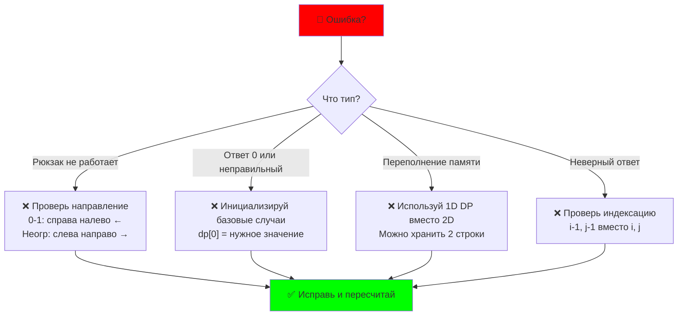

## Быстрые советы на конкурсе {id: "quick-tips"}

1. **Начни с наивного** (даже если медленно) — поймёшь структуру
2. **Выведи 2-3 строки таблицы DP** — часто видна ошибка
3. **Тестируй на примерах из задачи** — лучше чем на своих
4. **Модульная арифметика:** $\text{ans} = (a + b) \% \text{MOD}$
5. **Переполнение:** используй `long long` для больших чисел
6. **Мемоизация проще,** но табуляция быстрее — при времени табуляция
7. **Если время истекает:** сдай O(n²) версию вместо O(n log n)

---

# Советы и рекомендации {id: "tips"}

## Совет 1: Всегда начните с наивного решения {id: "tip-1-start-naive"}

```just-ncv
# Сначала перебор (bruteforce)
func solve_bruteforce():
    return try_all_combinations()

# Потом добавьте мемоизацию
memo = {}
func solve_memo():
    if state in memo:
        return memo[state]
    # ... рекурсия ...
    memo[state] = result
    return result

# Потом оптимизируйте до табуляции
```

---

## Совет 2: Используйте таблицу для отладки {id: "tip-2-debug-table"}

При отладке DP, выведите всю таблицу:

```just-ncv
# Для НОП
func print_dp_table(A, B, dp):
    # Выведите головы
    print("   ", end="")
    for j in 0..len(B):
        print(f"{B[j]:3}", end="")
    print()
    
    # Выведите строки
    for i in 0..len(A):
        print(f"{A[i]:3}", end="")
        for j in 0..len(B):
            print(f"{dp[i][j]:3}", end="")
        print()
```

---

## Совет 3: Тестируйте на малых примерах {id: "tip-3-test-small"}

```just-ncv
# Прежде чем сдавать, проверьте на маленьких данных
test_cases = [
    (input1, expected_output1),
    (input2, expected_output2),
]

for input_data, expected in test_cases:
    result = solve(input_data)
    assert result == expected, f"Ошибка: {result} != {expected}"
```

---

## Совет 4: Помните о модульной арифметике {id: "tip-4-mod-arithmetic"}

```just-ncv
MOD = 10^9 + 7

func solve_with_mod():
    # При сложении
    dp[i] = (dp[i-1] + dp[i-2]) % MOD
    
    # При умножении
    dp[i] = (dp[i] * k) % MOD
```

---

## Совет 5: Профилируйте! $O(n^2)$ может быть быстрее $O(n \log n)$ {id: "tip-5-profile"}

На практике,  $O(n^2)$ для НВП часто быстрее $O(n \log n)$ на маленьких $n$:
- $n = 100$: $10^4$ vs $664$ операций (примерно)
- $n = 1000$: $10^6$ vs $9965$ операций

Используйте $O(n^2)$ при $n < 5000$, $O(n \log n)$ при $n > 5000$.

---

# Заключение {id: "conclusion"}

## Что мы узнали? {id: "what-we-learned"}

**Динамическое программирование** — это мощный подход к решению оптимизационных задач, основанный на двух ключевых идеях:

1. **Оптимальная подструктура:** большую проблему решаем через малые.
2. **Мемоизация:** запоминаем результаты, чтобы не пересчитывать.

### Основные типы DP {id: "main-dp-types"}

| Тип | Сложность | Примеры |
|-----|-----------|---------|
| По последовательностям | $O(n^2)$ — $O(n \log n)$ | НОП, НВП, расстояние редактирования |
| По подматрицам | $O(n^2 m^2)$ | Рюкзак, максимальная подматрица |
| По деревьям | $O(n)$ | Максимальный путь, диаметр |
| С битовыми масками | $O(2^n \cdot n^2)$ | Коммивояжер для $n \leq 20$ |

### Практические советы {id: "practical-tips"}

1. **Начните с наивного решения** — разберитесь в рекуррентном соотношении.
2. **Добавьте мемоизацию** — проверьте, что оно работает.
3. **Оптимизируйте до табуляции** — это часто быстрее.
4. **Сохраняйте родителей** — чтобы восстановить решение.
5. **Проверяйте на малых данных** — лучший способ найти ошибку.

### Когда выбирать {id: "when-to-choose"}

- **НОП/НВП:** стандартные задачи, часто встречаются
- **Рюкзак:** оптимизация при ограничениях
- **DP на деревьях:** задачи на древовидных структурах
- **С масками:** экспоненциальные, но точные решения для малых $n$

---

## Если вам хочется пойти дальше {id: "further-learning"}

### Продвинутые техники {id: "advanced-techniques"}

1. **Convex Hull Trick** — для DP на линейных функциях
2. **Матричное возведение в степень** — для экспоненциального масштабирования
3. **Персистентные структуры** — для истории DP
4. **Параллельные вычисления** — для больших данных
5. **Оптимизация с помощью Flajolet-Martin** — для приблизительных ответов

### Классические задачи для практики {id: "classic-problems"}

- Longest Common Subsequence (НОП)
- Longest Increasing Subsequence (НВП)
- Edit Distance (расстояние редактирования)
- 0-1 Knapsack (классический рюкзак)
- Coin Change (размен монет)
- Maximum Subarray Sum (максимальная подarray)
- House Robber (грабитель и дома)
- Climbing Stairs (подъём по лестнице)
- Fibonacci (классика)
- Traveling Salesman (коммивояжер)

### Где тренироваться {id: "where-to-practice"}

- LeetCode (раздел Dynamic Programming)
- Codeforces (тэг dp)
- AtCoder (раздел DP)
- HackerRank
- GeeksforGeeks

---

## Заключительные мысли {id: "final-thoughts"}

Динамическое программирование — это не сложная математика, а просто **систематический способ запомнить, что мы уже вычислили**.

Помните:
- DP = оптимизированная рекурсия с запоминанием
- DP работает, когда есть **перекрывающиеся подзадачи** и **оптимальная подструктура**
- **Memoization (сверху вниз)** интуитивнее, **Tabulation (снизу вверх)** часто быстрее
- Всегда **проверяйте на малых примерах** перед сдачей!

Спасибо за внимание! Надеюсь, этот конспект помог вам разобраться в DP. Начните с простых задач (НОП, рюкзак), потом переходите к сложным (DP на деревьях, с масками). Практика — лучший учитель!

---

$\text{От ученика для учеников.}\\ \text{\textcolor{red}{С любовью} к \textcolor{yellow}{Т-Образованию}.}\\ \textcolor{cyan}{Вадим\ Христенко.}$
