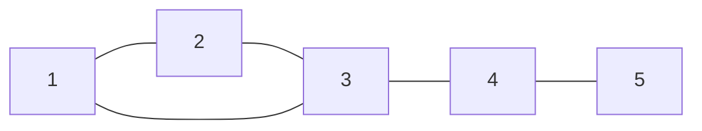

> Автор: Вадим Христенкко
> Простое пояснение задач с Параллели B от 27.09.2025.

# Задача А
## Текст задачи
Дан неориентированный граф. Требуется найти все точки сочленения (артикуляционные вершины) — вершины, удаление которых увеличивает число компонент связности графа.

Вход: n (число вершин), m (число рёбер), затем m пар вершин — рёбра графа.  
Ограничения: 1 ≤ n ≤ 20000, 1 ≤ m ≤ 200000.

Выход: количество точек сочленения и их номера в возрастающем порядке.

## Задумка
- Построить DFS-лес графа; для каждой вершины поддерживать:
  - tin[u] — время входа (порядковый номер посещения в DFS);
  - low[u] — минимальное tin, до которого можно добраться из поддерева u, используя 1 или более обратных рёбер.
- Правила:
  - Для не-корня: если существует дочерняя вершина v в DFS-дереве такая, что low[v] ≥ tin[u], то u — точка сочленения.
  - Для корня DFS: если у корня более одного дочернего поддерева — корень артикуляционная точка.
- Важный нюанс: при мультиграфе/параллельных рёбрах удобнее сравнивать не просто parent-вершину, а id ребра родителя.

Короткая формула:
$$
\mathrm{low}[u]=\min\Big(\mathrm{tin}[u],\ \min_{(u\to w)\ \text{back-edge}}\mathrm{tin}[w],\ \min_{v\in children(u)}\mathrm{low}[v]\Big).
$$

Потенциальные подводные камни:
- Не забыть запуск DFS для всех компонент (граф может быть несвязным).
- Корень DFS — отдельный случай (children > 1).
- При параллельных рёбрах проверка по parent-вершине может ошибаться → лучше хранить id ребра и сравнивать его.
- В некоторых языках (Python) надо учитывать глубину рекурсии.

## Наглядный пример (маленький граф и объяснение)

Mermaid-схема: пример графа и один back-edge (3→1). (Пример иллюстрирует DFS-дерево 1→2→3→4→5 и обратное ребро 3→1.)

Короткий ручной обход (пример значений tin/low при DFS из 1):
- tin[1]=1, tin[2]=2, tin[3]=3, tin[4]=4, tin[5]=5.
- При возврате: low[5]=5, low[4]=min(4, low[5]=5)=4, low[3]=min(3, tin[1]=1, low[4]=4)=1, low[2]=min(2, low[3]=1)=1, low[1]=min(1, low[2]=1)=1.
- Условия: например, для v=4: low[4]=4 ≥ tin[3]=3 → для вершины 3 это условие выполняется только если low[4] ≥ tin[3] (4 ≥ 3) — но т.к. low[3] после учёта обратного ребра стал 1, это не делает 3 артикуляцией в данном примере (важно смотреть low[v], а не low[u]).
