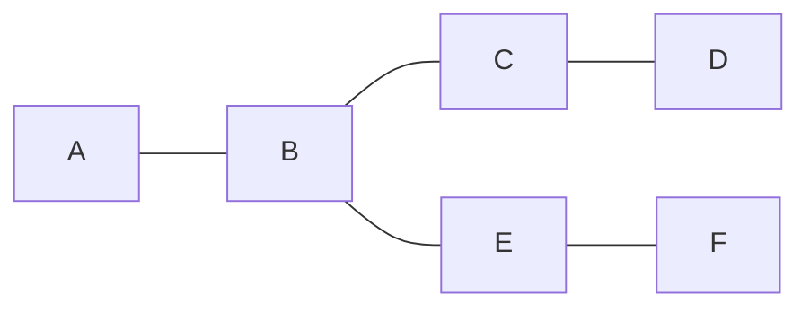
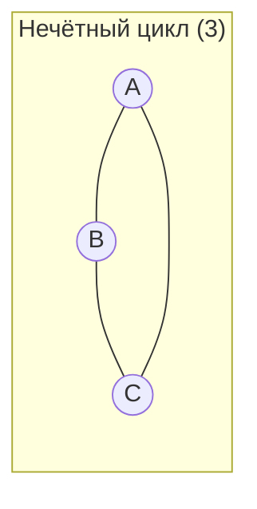
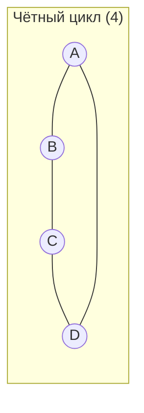
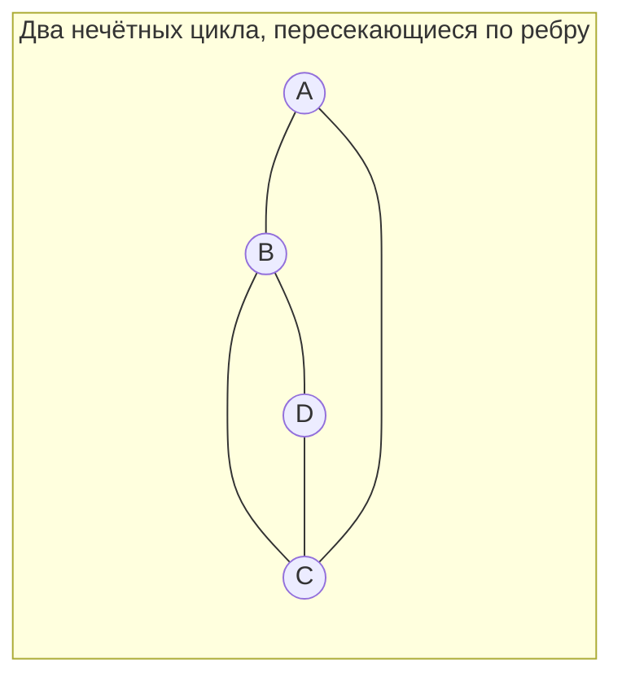
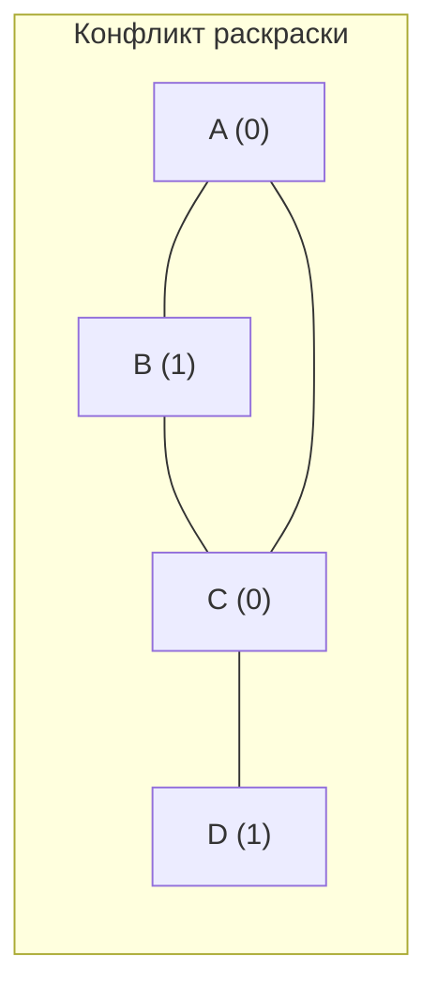
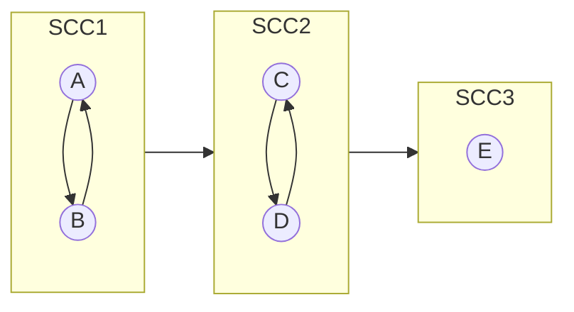
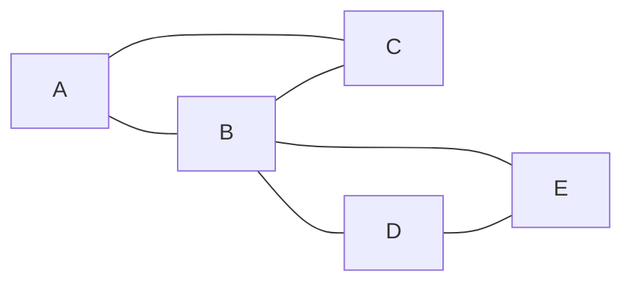
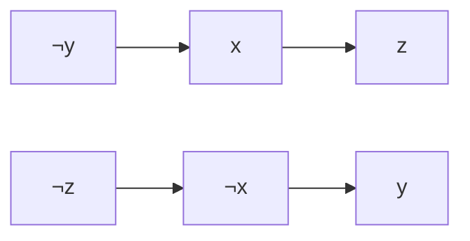
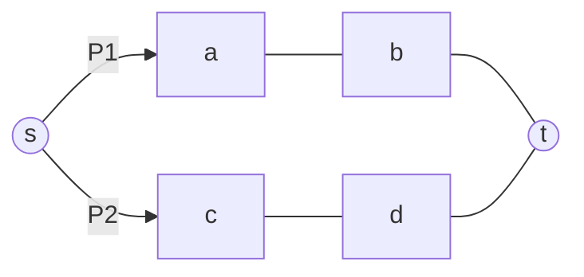

<h2>Тема конспекта: Структура графов: мосты, точки сочленения, SCC, эйлеровы пути и 2-SAT</h2>

> **Главный автор:** Вадим Христенко  
> **Другие авторы:** —  
> **Последнее обновление:** 2025-10-07  
> **Ссылка на обсуждение:** https://github.com/Vadim-Khristenko/Tedu_Notes/discussions/2  
> _Комментарий:_ Конспект с дружелюбными пояснениями и углублёнными разделами: от базовых определений до практических шаблонов.  
> _Теги:_ графы, dfs, bridges, articulation, bcc, scc, euler, 2-sat, connectivity

---

## Краткое содержание {id:"summary"}

Классические структуры и свойства графов через призму одного DFS: как извлекать мосты, точки сочленения, компоненты двусвязности (по рёбрам и вершинам), компоненты сильной связности в ориентированных графах, проверять двудольность и строить эйлеров путь/цикл. Отдельно: логические задачи в виде 2-SAT через импликационный граф и отличие от 3-SAT. В конце — вершинная связанность и идеи Менгера. Далее будут добавлены углублённые блоки: формальные критерии, частые ошибки, edge cases, оптимизации и шаблоны кода.

---

## Обозначения и словарь {id:"terminology"}

Немного выровним терминологию и обозначения, чтобы дальше не спотыкаться:

| Обозначение | Смысл | Комментарий и детали |
|---|---|---|
| tin[u], h[u] | время входа (discovery time) вершины u при DFS | При первом заходе в вершину мы записываем tin[u] = timer++ (timer — глобальный счётчик). Иногда используют h[u] как синоним tin[u]. Важно: tin фиксируется один раз. |
| tout[u] | время выхода из вершины u при DFS | Записывается после обхода всех соседей (возможен вариант, где tout не используется). В ориентированных алгоритмах для Kosaraju важен порядок выхода (post-order). |
| low[u], ret[u] | минимальный tin(v) для всех v, достижимых из поддерева u (включая u) через 0+ обратных рёбер | Формально: low[u] = min( tin[u], min_{(u,w) обратное или поперечное} tin[w], min_{child v of u} low[v] ). В неориентированном графе в расчётах важно не учитывать назад-ребро к родителю как back-edge (или специальным образом: если сосед == parent — пропустить). |
| parent[u] | родитель в DFS-дереве | Для восстановления пути, LCA, или получения детей корня. Для многокомпонентного графа parent[root] = -1. |
| depth[u] | глубина вершины в DFS/BFS-дереве | Удобна для восстановления циклов и вычисления паритета циклов (для двудольности). |
| usedEdge[id] / used[v][i] | пометка использованного ребра | Удобно при построении эйлеровых путей (Hierholzer) и при работе со стеком рёбер для блоков. В мультиграфах рёбра имеют уникальные id и parent/used по id. |
| Типы рёбер (DFS) | дерево (tree), обратное (back), прямое (forward), поперечное (cross) | В неориентированном графе обычно встречаются дерево- и обратные рёбра; forward/cross появляются в ориентированных. Для определения мостов/точек сочленения достаточно отличать tree- и back-ребра и корректно обрабатывать parent. |
| Мост (bridge) | ребро, удаление которого увеличивает количество компонент связности | Для дерева-ребра (v→to) мост, если low[to] > tin[v]. Для мультиграфов, если существуют параллельные ребра, условие меняется: параллельное ребро уменьшает low и может убрать мост. |
| Точка сочленения (articulation) | вершина, удаление которой увеличивает число компонент связности | Для root: если у него ≥2 детей в DFS-дереве — articulation. Для v ≠ root: если существует child to с low[to] ≥ tin[v] — articulation. |
| 2-рёберная двусвязность | компонентa без мостов (edge-biconnected) | Получается удалением мостов; каждая такая компонента связна по рёбрам и между любыми вершинами есть 2 рёберно-непересекающихся пути (локально). |
| Вершинная двусвязность (блок) | максимальный подграф без внутренних точек сочленения (vertex-biconnected) | Выделяется DFS со стеком рёбер: когда low[to] ≥ tin[v] при tree-ребре (v,to), вытаскиваем из стека ребра до (v,to) — это один блок. В отличие от edge-biconnected, блоки пересекаются по вершинам (точки сочленения принадлежат ≥2 блокам). |
| SCC | сильная связность в ориентированном графе | Компоненты, где каждая пара вершин связана путями в обе стороны; сжимаются в DAG (конденсация). |

Несколько предупреждений и практических советов:

- В реализациях для неориентированного графа важно при обходе учитывать parent: ребро (v,to) где to == parent[v] не рассматривать как back-edge (или рассматривать аккуратно с id рёбер), иначе low будет вычислен неправильно.
- В мультиграфе (параллельные рёбра) простая логика low[to] > tin[v] для моста не работает напрямую — нужны id рёбер и проверка, что обратное ребро не является родительским по id.
- Для восстановления циклов и путей удобно хранить parent[] и depth[]; чтобы восстановить неориентированный цикл при конфликте в двухцветной раскраске, нужно подняться по parent до LCA.
- tin/tout — полезны и для нахождения порядка топологической сортировки в ориентированных графах (Kosaraju) и для ответа на отношения предок-потомок в дереве: u предок v ⇔ tin[u] ≤ tin[v] и tout[u] ≥ tout[v].

Типы рёбер в DFS (для интуиции): дерево-ребро, обратное, прямое, поперечное — в неориентированном графе практически встречаются только дерево и обратные.

## Мосты (Edge Bridges) — просто и по-существу {id:"bridges"}

Представьте себе, что у нас есть граф, как сеть дорог. Мост — это такая дорога (ребро), убрав которую, структура сети раскалывается на несколько частей. Другими словами, если вы удалите мост, то вы потеряете возможность попасть из одной части сети в другую.

При поиске мостов мы используем обход в глубину (DFS). Здесь очень важно понимать два ключевых понятия:

- $tin[u]$ (или $h[u]$) — момент, когда DFS впервые заходит в вершину $u$.
- $ret[u]$ (часто называют $low[u]$) — минимальное значение $tin$ среди вершин, до которых можно добраться из поддерева $u$, если разрешены обратные рёбра.

Основное правило: для ребра, ведущего от родителя $v$ к потомку $u$ в DFS, если выполняется условие $ret[u] > h[v]$, то ребро $(v,u)$ является мостом. Это означает, что из поддерева $u$ нет альтернативного пути назад к $v$ или к вершинам выше.

Запомните:
- Если $ret[u] < h[u]$, это значит, что существует хотя бы один альтернативный путь из поддерева $u$ назад к началу обхода (ребро не является мостом).
- Если $ret[u] >= h[u]$, то альтернативного пути нет, и ребро к родителю может оказаться критическим (мостом) при строгом сравнении с $h[parent]$.

На практике мы запускаем DFS, вычисляем `tin` и `ret`, а затем помечаем мосты. На схемах такие рёбра удобно выделять красным.

Мини-таблица для быстрых ответов:

| Что это | Критерий | Как искать | Сложность |
|---|---|---|---|
| Мост $(v,u)$ | $ret[u] > h[v]$ | Один DFS с подсчётом $tin$ / $ret$ | $O(n + m)$ |

Небольшая зарисовка:



---

## Точки сочленения (Articulation Points) — важные узлы сети {id:"articulation"}

Точка сочленения — это вершина, удаление которой приводит к увеличению числа компонент связности графа. Это как критическая развязка в сети дорог: её удаление разделит граф на независимые части.

Ключевые моменты для их определения:

- Для корневой вершины DFS: если у корня два и более детей, то она является точкой сочленения.
- Для любой другой вершины: если существует ребёнок $to$ такой, что $ret[to] >= h[v]$ для вершины $v$, то $v$ — точка сочленения.

Таким образом, вместо проверки ребер, как в случае с мостами, мы смотрим на вклад самой вершины в поддержание связности графа.

Короткая выжимка:

| Случай | Критерий точки сочленения |
|---|---|
| Корень DFS | имеет ≥ 2 детей в DFS-дереве |
| Некорневая вершина $v$ | существует ребёнок $to$ с $ret[to] >= h[v]$ |

---

## Быстрая интуиция о циклах и двудольности {id:"bipartite-cycles"}

Для понимания структуры графа часто полезно наблюдать за циклами — они часто «разрушают» простые инварианты и показывают, где возникают альтернативные пути. Ниже — быстрые и практичные утверждения, а затем — более развёрнутое объяснение про чётность циклов и связь с двудольностью.

Ключевые тезисы:

+ Если граф содержит цикл нечётной длины, он не двудолен.
+ Если граф двудолен, все его циклы чётные.
+ Проверка двудольности обычно делается BFS/DFS с двухцветной раскраской: если при раскраске появляется ребро между вершинами одного цвета — найден нечётный цикл.

Почему это так (интуиция и формула):

1) Связь цвета и длины цикла. В двудольном графе вершины можно разделить на два множества A и B так, что все рёбра идут между A и B. При обходе по циклу мы каждый раз переключаемся между множествами. Значит, после чётного числа шагов мы вернёмся в то же множество, а после нечётного — в противоположное. Чтобы замкнуться в исходной вершине, циклу должно потребоваться чётное число переключений → длина цикла чётна.

2) Почему нечётный цикл ломает раскраску. При BFS/DFS начинаем с некоторой начальной вершины и красим её цветом 0. Всех соседей красим цветом 1, их соседей — 0 и т.д. Если найдено ребро между вершинами одного цвета, то по пути между ними лежит путь чётной длины, а ребро создаёт цикл нечётной длины (путь + это ребро). Это противоречит двухцветности.

3) Объединение циклов — как меняется чётность. Пусть есть два цикла $C1$ и $C2$, длины $|C1|$ и $|C2|$. Их симметрическая разность (взятые по модулю ребра, то есть объединение без двойного счёта пересечений) даёт набор циклов и путей. Формула по длине объединённого контура, проходящего по частям обоих циклов:

$$|C_{union}| = |C1| + |C2| - 2\cdot|I|$$

где |I| — длина (в рёбрах) их общего пересечения по контуру. Из формулы видно, что если $|C1|$ и $|C2|$ нечётны, то сумма $|C1| + |C2|$ чётна, и вычитание чётного числа $2\cdot|I|$ даёт чётное число. Поэтому объединение двух нечётных циклов может породить чётный цикл (или несколько чётных циклов) в результате «склейки» по общему пути.

Практическое следствие: обнаружение нескольких нечётных циклов не обязательно даёт «ещё более нечётный» результат — их сочетание часто упрощается и даёт чётные структуры.

Ниже — несколько наглядных схем (Mermaid) для быстрого понимания:









Как это связано с DFS/BFS и $ret$/$tin$ (практика):

- В DFS обратные (back) рёбра указывают на существование пути вверх по дереву — они формируют циклы вместе с деревом обхода. Если вы отслеживаете глубину $h[u]$ ($tin$) и минимальную достижимую вершину $ret[u]$ ($low$), то обратные рёбра уменьшают $ret$ и показывают альтернативные пути назад.

- Для поиска нечётных циклов в неориентированном графе DFS сам по себе не даёт прямой метрики «чёт/нечёт», но можно отслеживать паритет глубины: если найдено обратное ребро (v,u) и глубина паритета отличается так, что $(h[v] - h[u] + 1)\ mod\ 2 = 1$ — цикл нечётный. Проще: если у концов ребра одинаковый цвет при двухцветной раскраске DFS/BFS, то цикл нечётный.

Практические советы по реализации и отладки:

+ При проверке двудольности используйте BFS (или DFS) с явной двухцветной раскраской: при обнаружении конфликта — найдите и сохраните цикл, сразу выйдите, если нужен только факт существования.
+ Если вам нужен сам нечётный цикл, при столкновении двух вершин одного цвета — можно восстановить путь через родительские указатели до LCA и добавить проблемное ребро; длину цикла получите как длину пути + 1.
+ Для детерминированности результатов сортируйте списки соседей (это упрощает воспроизводимость примеров и тестов).
+ Фиксируйте $tin$/$h$ сразу при первом заходе и не перезаписывайте их — это важно для корректного $ret$/$low$.

Короткий пример восстановления нечётного цикла (алгоритм):

1. Запускаем BFS/DFS и ведём массив parent[]. Также храним цвет (0/1) и глубину depth[].
2. Если встречаем ребро (u,v), где $color[u] == color[v]$, то цикл нечётный. Восстанавливаем путь $u→LCA(u,v)$ и $v→LCA(u,v)$ через parent, склеиваем и добавляем ребро (u,v).
3. Длина получившегося цикла = $depth[u] + depth[v] - 2*depth[LCA] + 1$.

Ещё одна полезная мысль: при анализе сложных графов удобно сначала быстро проверить двудольность $(O(n + m))$, а только потом, при положительном результате, переходить к более тонким структурам (мосты, блоки, SCC). Это даёт раннюю фильтрацию и уменьшает объём дальнейшей аналитики.

---

## Компоненты двусвязности — два понятия {id:"biconnected-components"}

В теории графов различают два типа двусвязности:

1) Компоненты 2-рёберной двусвязности (Edge-2-connected Components):
   - Эти компоненты получаются путём удаления всех мостов из графа, после чего каждая оставшаяся связная часть является отдельной компонентой.
   - Внутри такой компоненты между любой парой вершин всегда найдется как минимум два независимых пути (реберно-непересекающихся), что обеспечивает надёжную связность.

2) Компоненты двусвязности по вершинам (Vertex-biconnected Components или Блоки):
   - Это максимальные подграфы, внутри которых удаление любой вершины не приводит к разбиению графа на отдельные части.
   - Для их нахождения во время DFS используется стек рёбер. Когда для дерева-ребра $(v, to)$ обнаруживается условие $ret[to] >= h[v]$, все рёбра из стека до этого ребра формируют один блок.

Давайте подробно разберём оба понятия, дадим формальные определения, алгоритмы и примеры, а также рассмотрим связные структуры ($block-cut\ tree$) и важные случаи для реализации.

Определения (формально):

- $Edge-biconnected\ component\ (EBCC)$: максимальное связное подмножество вершин такое, что между любыми двумя вершинами подграфа существуют два рёберно-непересекающихся пути. Альтернативная конструкция: компоненты получаются после удаления всех мостов — каждая оставшаяся связная компонента является EBCC.
- $Vertex-biconnected\ component\ (VBCC)$ или блок: максимальный подграф, не содержащий точек сочленения внутри себя. Точки сочленения могут принадлежать нескольким блокам, поэтому блоки перекрываются по вершинам.

Алгоритм нахождения $EBCC$ (подсказка и реализация):

1. Найдите все мосты (один $DFS$, считая $tin$ и $low$). Ребро $(v,\ to)$ — мост если $low[to] > tin[v]$ (для tree-ребра). Учтите $id$ рёбер при мультиграфах.
2. Постройте граф без мостов (удалите мосты) или просто сделайте $DFS$, игнорируя мосты, — каждая оставшаяся связная компонента и будет $EBCC$.

Псевдокод (по шагам):

1) $DFS$ для $tin$ / $low$ + обнаружение мостов

```
timer = 0
for v in 1..n:
  if not visited[v]:
    dfs_bridge(v, parent = -1)

function dfs_bridge(v, parent):
  visited[v] = true
  tin[v] = low[v] = ++timer
  for (to, id) in adj[v]:
    if id == parent_id: continue  // в мультиграфе используем id
    if visited[to]:
      low[v] = min(low[v], tin[to])
    else:
      dfs_bridge(to, id)
      low[v] = min(low[v], low[to])
      if low[to] > tin[v]:
        mark edge id as bridge
```

2) Построение компонентов: обычный $DFS$ / $DSU$ по графу без мостов

```
comp_id = 0
for v in 1..n:
  if comp[v] == 0:
    comp_id++
    stack = [v]
    while stack:
      u = stack.pop()
      comp[u] = comp_id
      for (w, id) in adj[u]:
        if is_bridge[id] or comp[w] != 0: continue
        stack.push(w)
```

Алгоритм нахождения $VBCC$ (блоков) — $DFS$ со стеком рёбер ($Tarjan-like$):

Идея: при $DFS$ кладём каждое tree- и back-ребро в стек рёбер. Когда при обработке дерева-ребра $(v,\ to)$ обнаруживаем $low[to] \geq tin[v]$, мы вынимаем из стека ребра до $(v,\ to)$ — это формирует один блок. Точки сочленения — это вершины, которые участвуют в $\geq 2$ блоках (или корень с $\geq 2$ $children$).

Псевдокод (упрощённый):

```
timer = 0
stack = empty
for v in 1..n:
  if not visited[v]:
    dfs_bcc(v, parent=-1)

function dfs_bcc(v, parent):
  visited[v] = true
  tin[v] = low[v] = ++timer
  children = 0
  for (to, id) in adj[v]:
    if id == parent_id: continue
    if visited[to]:
      if tin[to] < tin[v]:
        stack.push((v,to,id))   // back-edge to ancestor
      low[v] = min(low[v], tin[to])
    else:
      stack.push((v,to,id))     // tree-edge
      children++
      dfs_bcc(to, id)
      low[v] = min(low[v], low[to])
      if low[to] >= tin[v]:
        // v — точка сочленения (если не root) — и формируется блок
        block = []
        while stack.top() != (v,to,id):
          block.push(stack.pop())
        block.push(stack.pop())
        output block as one VBCC
  // root special case: if parent == -1 and children < 2 -> not articulation
```

Примеры и пояснения:

- Рассмотрим мост: ребро само по себе образует $EBCC$ из двух вершин (в простом определении после удаления всех мостов эти вершины окажутся в разных компонентах). В терминах $VBCC$ мост — это ребро, которое принадлежит отдельному блоку, состоящему ровно из этого ребра (и его концов) или иногда два блока по концам — зависит от формализма; чаще говорят, что ребро-bridge не входит в какой-либо больший блок, кроме как блочного сегмента.
- Точка сочленения принадлежит $\geq 2$ блокам. Например, вершина-центр звезды: каждая пара рёбер образует блок с центром и соответствующим листом? На деле блоки звезды — это простые ребра (каждое ребро само по себе блок), центр — точка сочленения, принадлежащая множеству блоков.

$Block-cut\ tree$ (дерево блоков-точек, BC-tree):

Построение: создадим двудольный граф, где с одной стороны вершины — оригинальные вершины графа, а с другой — блоки. Соединяем оригинальную вершину $v$ с блоком $B$, если $v \in B$. Получившийся граф всегда будет деревом (если исходный граф связен) — это $block-cut$ tree.

Свойства $BC-tree$:

- $BC-tree$ помогает анализировать глобальную структуру двусвязности: точки сочленения — это 'связующие' вершины между блоками.
- Макс. расстояние в $BC-tree$ отражает «многоблочность» графа — количество переходов через точки сочленения.
- Для решения некоторых задач (например, минимальная добавка рёбер, чтобы сделать граф $biconnected$) удобно работать в $BC-tree$.

$Edge-cases$  (граничные случаи): и практические оговорки:

- Пустой граф или граф с одной вершиной: $EBCC$ / $VBCC$ тривиальны (ничего не выделяем или считаем одну компоненту).
- Изолированные вершины: в смысле $EBCC$ они отдельны; в $VBCC$ изолированная вершина сама по себе может рассматриваться как блок (в зависимости от определения) — практики обычно игнорируют такие тривиальные блоки при выводе.
- Мультиграфы: параллельные рёбра могут устранить мост: два параллельных ребра между $u$ и $v$ означают, что ни одно из них не мост (удаление одного не разъединяет граф). Учтите $id$ рёбер и корректную логику при подсчётах.

Рекомендации по тестированию и отладке:

- Для $EBCC$: тесты с простыми мостами, цепочками, треугольниками и параллельными рёбрами.
- Для $VBCC$: тесты со смешанными блоками: кольцо + приставленные деревья, звезда + цикл и т.д. Проверьте, что точки сочленения принадлежат ожидаемым блокам и что суммы вершин блоков корректно покрывают граф с учётом пересечений.

Практическая заметка: часто в соревнованиях и контестах достаточно реализовать одно из понятий (обычно $EBCC$ или блоки) в зависимости от задачи. Если нужно «сжать» граф по блокам, используют $BC-tree$ или суммарную нумерацию компонент и точек сочленения.

На схемах можно увидеть, что мосты (выделенные красным) разделяют 2-рёберные компоненты, а внутри каждой такой части можно отметить альтернативные пути (например, жёлтым цветом), что подчёркивает наличие двух независимых соединений между вершинами.

Краткая сводка:

| Вид | Определение | Как найти |
|---|---|---|
| 2-рёберная | нет мостов | удалить мосты → связные компоненты |
| Вершинная (блок) | нет внутренних точек сочленения | DFS со стеком рёбер; выделять при $ret[to] >= h[v]$ |

---

## Компоненты сильной связности (SCC) — понимание направленных графов {id:"scc"}

В ориентированном графе две вершины `a` и `b` находятся в одной сильносвязной компоненте (SCC), если между ними существуют пути в обоих направлениях: и путь от `a` к `b`, и путь от `b` к `a`. Это отношение эквивалентности, которое позволяет разбить граф на независимые группы, внутри которых можно свободно перемещаться.

Зачем это нужно? После определения SCC можно сжать каждую компоненту в одну вершину, получив направленный ациклический граф (DAG). Такой граф значительно облегчает решение различных задач, например, поиск источников, стоков или оптимальных путей в сети.

Популярные алгоритмы для поиска SCC:

- Kosaraju (2 прохода):
  1. Выполните DFS и запишите порядок выхода вершин (post-order).
  2. Транспонируйте граф (смените направление всех рёбер).
  3. Обходите вершины в обратном порядке завершения DFS – каждая такая группа достижимых вершин образует отдельную SCC.

- Tarjan (1 проход):
  Этот метод объединяет DFS с использованием стека и вычислением значений $tin$\И / $low$. Когда для вершины $v$ оказывается, что $low[v] == tin[v]$, извлекаем вершины из стека – полученная группа и есть SCC.

Оба подхода работают за $O(n + m)$, и выбор между ними часто определяется спецификой задачи: Kosaraju проще для понимания, тогда как Tarjan требует лишь одного прохода DFS.

Практическое применение: после того, как SCC найдены, они часто преобразуются в DAG, что позволяет решать задачи, связанные с оптимизацией маршрутов, анализом источников и стоков, а также многими другими практическими задачами.

Мини-схема конденсации:



Таблица свойств SCC:

| Свойство | Факт |
|---|---|
| Отношение | эквивалентность на вершинах (рефлексивность, симметрия, транзитивность) |
| Конденсация | DAG |
| Алгоритмы | Kosaraju (2 DFS), Tarjan (1 DFS) |

---

## Небольшая шпаргалка по алгоритмам {id:"algorithms-spoiler"}

- Мосты / точки сочленения: 
  Выполняем DFS, вычисляем $tin$ и $ret$. Условие $ret[u] > h[parent]$ позволяет определить мост, а $\ret[child] >= h[v]$ – точку сочленения.

- 2-рёберные компоненты: 
  Удаляем мосты и находим оставшиеся связные компоненты.

- Блоки (вершинная двусвязность): 
  Используем DFS с дополнительным стеком рёбер и разделяем блоки при выполнении условия `ret[to] >= h[v]`.

- SCC: 
  Выбираем алгоритм Kosaraju или Tarjan в зависимости от предпочтений и особенностей задачи.

---

## Разбор интуитивных примеров DFS {id:"dfs-intuition"}

Давайте рассмотрим интуитивный пример. Представьте, что вы приступаете к обходу графа и попадаете сначала в компоненту B, а затем в компоненту A. Это значит, что между B и A есть ребро, позволяющее перейти из одной компоненты в другую. Однако, чтобы вернуться или продолжить обход, возможно, потребуется полностью выйти из компоненты B.

Таким образом, порядок входа и выхода из вершин в DFS очень важен. Если первая вершина, которую вы посетили, находится в компоненте A, а затем вы заходите в B, то вершина A окажется на более высоком уровне в дереве обхода, и её время выхода (`tout`; выше встречается как `taut`) будет больше, чем у вершин из B. Это объясняет, почему `tout(A)` может быть максимальным.

Можно представить последовательность времён: 

`t1, t2, t3, ... tn`

Например, если вершина T1 не имеет входящих рёбер, и из неё начинается DFS, она получит большое время выхода — это удобно для объяснения порядка обработки вершин.

---

### Пример задачи {id:"example-task"}

Рассмотрим задачу на ориентированном графе, который можно сравнить с планировкой офисного здания: из одной комнаты можно войти в другую с помощью карточки, но обратно вернуться не всегда возможно. Цель задачи — выбрать такое подмножество комнат, из которых можно добраться до любой другой комнаты.

Подход к решению:
1. Сначала находим SCC, чтобы сократить граф в более простой DAG, где каждая вершина представляет целую SCC.
2. Затем выбираем истоки полученного DAG – то есть такие вершины, из которых начинается обход всего графа.

Это наглядный пример того, как теоретические концепции помогают решать практические задачи.

---

## Эйлеров цикл и путь {id:"eulerian-path"}

Сформулируем аккуратно условия существования. Разделим на неориентированные и ориентированные графы.

Неориентированный граф:

- Эйлеров цикл существует тогда и только тогда, когда граф связен по рёбрам (если смотреть только на вершины с ненулевой степенью) и степень каждой вершины чётна.
- Эйлеров путь (но не цикл) существует тогда и только тогда, когда граф связен (по вершинам с ненулевой степенью) и ровно у двух вершин нечётная степень (старт и финиш пути). Если нечётных вершин 0 — есть цикл; если 2 — есть путь; иначе — нет ни того, ни другого.

Ориентированный граф:

- Эйлеров цикл существует, если подграф по вершинам с ненулевой степенью связен в неориентированном смысле (т.е. в подлежащем неориентированном графе это одна компонента) и для каждой вершины $inDeg(v) == outDeg(v)$.
- Эйлеров путь (но не цикл) существует, если граф «почти» удовлетворяет: у одной вершины $outDeg = inDeg + 1$ (старт), у одной — $inDeg = outDeg + 1$ (финиш), у остальных $inDeg == outDeg$, и подграф по вершинам с ненулевой степенью связен в неориентированном смысле.

Как строить? Алгоритм Херхольцера — коротко и по делу:

1) Выбираем стартовую вершину (для цикла — любую с ненулевой степенью; для пути — вершину со смещённой степенью).  
2) Идём по неиспользованным рёбрам, «съедая» их (удаляем/помечаем), пока не упремся.  
3) Возвращаемся назад, вшивая найденные подциклы в итоговый маршрут.  

Псевдокод (оба случая обрабатывает одинаково, важна только выборка стартовой вершины):

```cpp
vector<int> hierholzer(int start, vector<vector<pair<int,int>>> &g, vector<bool> &used) {
  // g[v] = список (u, id) для рёбер; used[id] помечает ребро как использованное
  vector<int> path, st = {start};
  vector<int> it(g.size());
  while (!st.empty()) {
    int v = st.back();
    while (it[v] < (int)g[v].size() && used[g[v][it[v]].second]) it[v]++;
    if (it[v] == (int)g[v].size()) { // рёбер больше нет
      path.push_back(v);
      st.pop_back();
    } else {
      auto [u, id] = g[v][it[v]++];
      if (!used[id]) { used[id] = true; st.push_back(u); }
    }
  }
  reverse(path.begin(), path.end());
  return path; // вершины по порядку обхода
}
```

Интуиция простая: в эйлеровом цикле каждое посещение вершины «компенсируется» выходом по другому ребру — отсюда требование чётности степеней (и баланс входов-выходов в ориентированном случае).

Небольшой набросок:



Для крайних вершин в неориентированном графе (степень 1) эйлеров цикл невозможен, но возможен эйлеров путь (начинается в одной крайней и заканчивается в другой).

**На этом моменте препод КОСТЯ был призван на лекцию! Продолжаем)**

## 2-SAT {id:"2sat"}

2-SAT — это SAT-задача, в которой каждое условие (клаузула) — дизъюнкция из двух литералов. Примеры: $(x ∨ y),\ (¬x ∨ z)$ и т.п.

Ключевая идея — импликационный граф (2 вершины на переменную: $x$ и $¬x$). Каждая клаузула $(a ∨ b)$ эквивалентна двум импликациям: $(¬a → b)$ и $(¬b → a)$.

Алгоритм решения:

1) Построить импликационный граф из $2n$ вершин и $2m$ рёбер.  
2) Найти $SCC$. Если $x$ и $¬x$ попали в одну $SCC$ — противоречие, решения нет.  
3) Иначе отсортировать компоненты в порядке убывания пост-номеров (как в Kosaraju), и назначить значение переменной: $x = true$, если $comp(x) > comp(¬x)$ (иначе $false$).

Это работает за $O(n + m)$ по времени и памяти.

Маленький пример (для `(x ∨ y) ∧ (¬x ∨ z)`):



Полезные свойства импликационного графа:

- Если есть путь $V → U$, то существует путь $¬U → ¬V$ (легко проверить на 4 вершинах для пары $x\ /\ ¬x$).
- Решение существует тогда и только тогда, когда для всех переменных $x$ компоненты $comp(x) ≠ comp(¬x)$.

### Как кодировать условия в 2-SAT {id:"2sat-clauses"}

Частые паттерны кодирования ограничений через клаузы 2-SAT:

| Ограничение | Клаузы 2-SAT |
|---|---|
| `x = true` | `(x ∨ x)` |
| `x = false` | `(¬x ∨ ¬x)` |
| `x → y` | `(¬x ∨ y)` |
| `x = y` | `(¬x ∨ y) ∧ (¬y ∨ x)` |
| `x ≠ y` (XOR) | `(x ∨ y) ∧ (¬x ∨ ¬y)` |
| Не более одного из `{x, y}` | `(¬x ∨ ¬y)` |
| Ровно одно из `{x, y}` | `(x ∨ y)` и `(¬x ∨ ¬y)` |
| По крайней мере одно из `{x, y}` | `(x ∨ y)` |

Для набора `{x1 ... xk}` «не более одного истинного» кодируют парами: для всех $i < j$ добавить $(¬x_i ∨ ¬x_j)$.

### Скелет решения (Kosaraju/Tarjan) {id:"2sat-skeleton"}

Построение графа: вершина — это литерал. Для переменной $i$ используем индексы $id(i, true)$ и $id(i, false)$.

```cpp
// Добавим импликации (A ∨ B) через (¬A → B) и (¬B → A)
struct Lit { int var; bool val; }; // val: true = x, false = ¬x
int id(Lit L) { return L.var*2 + (L.val ? 0 : 1); }
int neg(int v) { return v ^ 1; }

void addImp(vector<vector<int>>& g, int u, int v) { g[u].push_back(v); }

void add_or(vector<vector<int>>& g, Lit A, Lit B) {
  int a = id(A), b = id(B);
  addImp(g, neg(a), b);
  addImp(g, neg(b), a);
}
// Далее запускаем SCC (Kosaraju/Tarjan) и проверяем comp[x] != comp[¬x].
```

Восстановление значения переменных: сортируем компоненты по топ-порядку (по убыванию времени выхода в Kosaraju).
Для каждой переменной $i$:  
$ans[i] = (comp[id(i,true)] > comp[id(i,false)])$.

## Задача {id:"2sat-segments"}

Пересекающиеся отрезки на прямой. Хотим ограничить конфликты 2-SAT-ом.

Заведём булевы переменные: $x_i = 1$, если отрезок $i$ удалён; $x_i = 0$, если оставлен.  
Для каждой пересекающейся пары $(i, j)$ запрещаем «оставить оба» ($¬x_i ∧ ¬x_j$):

+ «не оба оставлены» ⇔ $(x_i ∨ x_j)$ — хотя бы один удаляем.

Если нужно «ровно один удалён в паре», добавляем и запрет «не оба удалены»:  
$(¬x_i ∨ ¬x_j)$.  
Итого: $(x_i ∨ x_j) ∧ (¬x_i ∨ ¬x_j)$.

Важно: в чистом 2-SAT мы проверяем выполнимость ограничений. Если требуется «минимизировать число удалений», это уже оптимизация поверх выполнимости — решают отдельными приёмами (бинпоиск по ответу, жадные свойства задачи, SAT-солвер с целевой функцией и т.п.).

---

## 3-SAT (кратко) {id:"3sat"}

3-SAT — SAT, где каждая клаузула содержит три литерала (например, $(x ∨ ¬y ∨ z)$). Важно: в отличие от 2-SAT, 3-SAT — NP-полная задача. Полиномиального алгоритма, работающего во всех случаях, неизвестно (если только $P ≠ NP$ не рухнет).

Чем 3-SAT отличается от 2-SAT:

+ 2-SAT решается за линейное время (импликационный граф + $SCC$).  
+ 3-SAT в общем случае решают SAT-солверы ($DPLL$ / $CDCL$), эвристики, редукции, перебор с отсечениями, приближённые/рандомизированные методы.

Почему 3-SAT важен: к нему сводятся множество задач комбинаторики и ИИ (раскраска графа, планирование, верификация). Это удобный «язык ограничений» для сложных систем.

---

## Вершинная связанность {id:"vertex-connectivity"}

Аккуратно разложим по полочкам понятия связности «по вершинам» и их алгоритмическое значение.

### Определения {id:"vertex-connectivity-definitions"}

+ Вершинная связность графа $\kappa(G)$ — минимальное число вершин, удаление которых делает граф несвязным или тривиальным (из одной вершины).  
  + Граф называется $k$-вершинно-связным ($k ≥ 1$), если он остаётся связным после удаления любых ($k−1$) вершин. Эквивалентно: $\kappa(G) ≥ k$.
  + Вершинный разрез (vertex cut) — множество вершин $S$, удаление которых разделяет граф на ≥2 компонент. Минимальный размер такого $S$ — $\kappa(G)$.

Для $k = 2$ получаем класс «двусвязных по вершинам» графов (блоков на уровне всего графа): в таких графах нет точек сочленения.

### Теорема Менгера (интуиция) {id:"menger-theorem"}

Между двумя различными вершинами $s$ и $t$ максимальное число вершинно-непересекающихся путей равно минимальному размеру вершинного разреза, разделяющего $s$ и $t$.  
Отсюда следуют удобные эквивалентности:

| Условие | Эквивалентность |
|---|---|
| Граф двусвязен по вершинам | Между любыми двумя вершинами есть $≥2$ вершинно-непересекающихся пути |
| Вершина $v$ — точка сочленения | Существует пара вершин $s$, $t$, для которых все $s–t$ пути проходят через $v$ |

### Вершинно- и рёберно-простые пути/циклы {id:"simple-paths-cycles"}

+ Путь называется вершинно простым, если все его вершины различны (кроме, возможно, начальной и конечной в цикле). Рёберно простой — если все рёбра различны.
  + Цикл вершинно простой — замкнутый путь, в котором вершины (кроме совпадения начала/конца) не повторяются. В рёберно простом цикле рёбра не повторяются, но вершины могли бы повторяться (обычно в неориентированных графах под «простым циклом» подразумевают именно вершинно простой).

Свойство блока (вершинно двусвязной компоненты): любые две вершины блока лежат на общем вершинно простом цикле. Конструктивно цикл получается склейкой двух вершинно-непересекающихся $s–t$ путей (они образуют «ромб/прямоугольник» при склейке начало–конец).

Небольшая зарисовка двух вершинно-непересекающихся путей (идея ромба):



### Как проверять на практике {id:"vertex-connectivity-practice"}

1. $k = 2$ (двусвязность по вершинам): ищите точки сочленения (articulation points) стандартным $DFS$ с $tin$ / $low$.

Примечание: нет точек сочленения ⇒ граф двусвязен по вершинам на своём компонентном уровне (или разбивается на блоки без внутренних точек сочленения).

2. Два вершинно-непересекающихся пути между $s$ и $t$:

Модель потока: «расщепите» каждую вершину $v$ в ребро $v_{in}→v_{out}$ с пропускной способностью 1 (кроме $s$ и $t$, которым ставят большую емкость), а каждое исходное ребро $(u,v)$ замените на $u_{out}→v_{in}$ с большой емкостью. Максимальный поток $s_{out}→t_{in}$ равен числу вершинно-непересекающихся путей (Менгер).

Для $k > 2$ аналогично: максимальный поток даст число путей; минимальный по размеру $s–t$ вершинный разрез — размер «бутылочного горлышка».

Короткая сводка:

| Объект | Что проверяем | Инструмент |
|---|---|---|
| Двусвязность по вершинам | Нет точек сочленения | $DFS$ + $tin$ / $low$ |
| ≥2 пути s–t без общих внутренних вершин | Существуют? сколько? | $\text{Vertex-splitting} + \text{max-flow}$ |

Замечание: для неориентированных графов двусвязность по рёбрам и по вершинам различаются (мосты/точки сочленения). Вершинно двусвязная компонента может содержать мосты? Нет — наличие моста разрушает ≥2 независимых по рёбрам пути; однако вершинная двусвязность — более строгая: она требует устойчивости к удалению вершины (а не ребра). Поэтому компоненты по рёбрам и по вершинам обычно строят разными алгоритмами и не смешивают.

---

$\text{От ученика для учеников.}\\ \text{\textcolor{red}{С любовью} к \textcolor{yellow}{Т-Образованию}.}\\ \textcolor{#86cecb}{Вадим\ Христенко.}$
