<h2>Тема конспекта: Персистная очередь, Скип листики и Сливаемые структурки</h2>

> **Главный автор:** Вадим Христенко  
> **Другие авторы:** —  
> **Последнее обновление:** 2025-10-15  
> **Ссылка на обсуждение:** *Для хардов ссылки на обсуждение пока что нет.*  
> _Комментарий:_ Этот конспект — часть того что даёт T-Образование самой сильной параллели в X.  
> _Теги:_ PersistentQueue, SkipLists, MergingStructures, Скип листы, Персистентная очередь, Сливаемые структуры

# Введение {id: "introduction"}

В этом конспекте мы разберём три важные темы из области продвинутых структур данных:

1. **Персистентные структуры данных** — как сохранять историю изменений эффективно
2. **Скип-листы** — вероятностная альтернатива сбалансированным деревьям
3. **Сливаемые структуры** — как эффективно объединять структуры данных

Эти темы связаны общей идеей: **эффективное управление данными** при различных требованиях к производительности и функциональности.

---

# Содержание {id: "contents"}

1. [Персистентные структуры данных](#persistent-structures)
   - [Что такое персистентность](#what-is-persistence)
   - [Типы персистентности](#types-of-persistence)
   - [Персистентная очередь](#persistent-queue)
   - [Персистентный массив](#persistent-array)
   
2. [Скип-листы (Skip Lists)](#skip-lists)
   - [Мотивация и идея](#skip-lists-motivation)
   - [Структура скип-листа](#skip-list-structure)
   - [Операции со скип-листами](#skip-list-operations)
   - [Анализ сложности](#skip-list-complexity)
   
3. [Сливаемые структуры данных](#mergeable-structures)
   - [Что такое сливаемые структуры](#what-is-mergeable)
   - [Биномиальные кучи](#binomial-heaps)
   - [Фибоначчиевы кучи](#fibonacci-heaps)
   - [Leftist heaps](#leftist-heaps)
   
4. [Практическое применение](#practical-applications)
5. [Задачи для практики](#practice-problems)
6. [Дополнительные материалы](#additional-resources)

---

# Персистентные структуры данных {id: "persistent-structures"}

## Что такое персистентность {id: "what-is-persistence"}

**Персистентная структура данных** — это структура, которая сохраняет все свои предыдущие версии при модификации. В отличие от обычных (эфемерных) структур, где старая версия теряется после изменения.

### Основные концепции

**Эфемерная структура:**
```
[1, 2, 3] --push(4)--> [1, 2, 3, 4]
     ❌                      ✅
  (потеряна)            (доступна)
```

**Персистентная структура:**
```
[1, 2, 3] --push(4)--> [1, 2, 3, 4]
     ✅                      ✅
  (доступна)            (доступна)
```

### Зачем нужна персистентность?

1. **Откат изменений (Undo/Redo)** — текстовые редакторы, графические редакторы
2. **Версионирование** — Git, системы контроля версий
3. **Функциональное программирование** — иммутабельность данных
4. **Конкурентность** — безопасный доступ из разных потоков
5. **Отладка** — возможность исследовать историю состояний

---

## Типы персистентности {id: "types-of-persistence"}

### Частичная персистентность (Partially Persistent)

- Можно читать из любой версии
- Можно модифицировать только последнюю версию

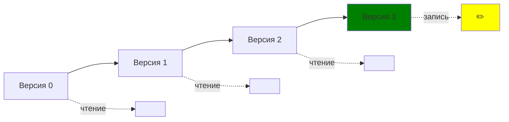

### Полная персистентность (Fully Persistent)

- Можно читать из любой версии
- Можно модифицировать любую версию (создавая новую ветку)

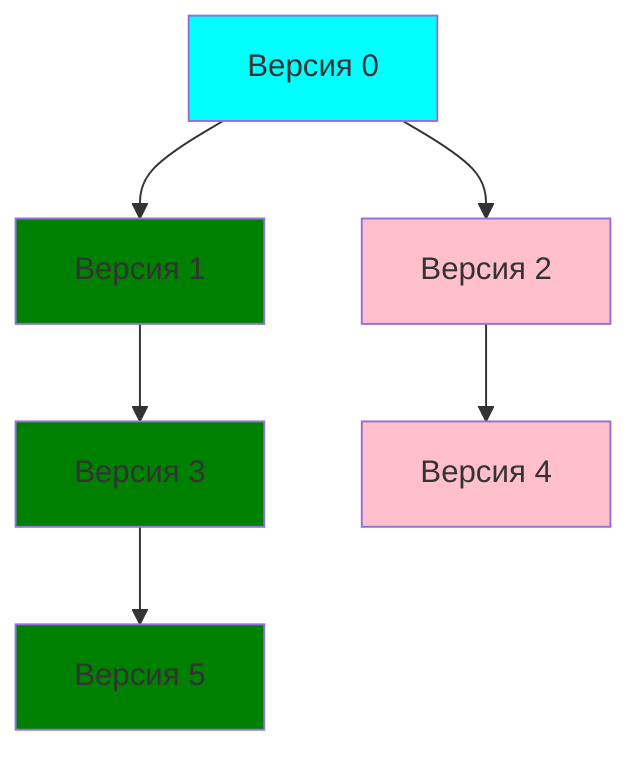

### Конфлюэнтная персистентность (Confluently Persistent)

- Полная персистентность + возможность слияния версий

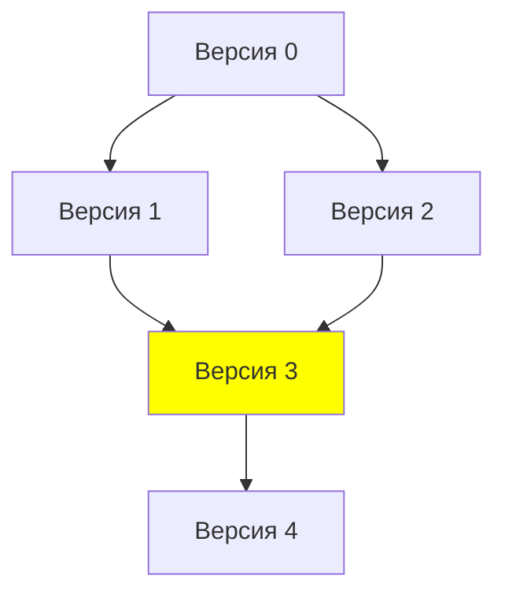

---

## Персистентная очередь {id: "persistent-queue"}

### Наивная реализация

**Проблема:** Если просто копировать весь массив при каждой операции:

```pseudocode
class NaivePersistentQueue<T>:
    data: vector<T>
    
    func __init__(data: vector<T> | null):
        self.data = data if data != null else vector<T>()
    
    func push(value: T) -> NaivePersistentQueue<T>:
        # O(n) - копирование всего массива ❌
        return new NaivePersistentQueue<T>(self.data + [value])
    
    func pop() -> (NaivePersistentQueue<T>, T | null):
        # O(n) - копирование всего массива ❌
        if self.data.is_empty():
            return (self, null)
        return (new NaivePersistentQueue<T>(self.data[1:]), self.data[0])
```

**Сложность:** $O(n)$ для каждой операции — неэффективно! 😞

### Эффективная реализация через два стека

**Идея:** Представим очередь как два списка (стека):
- **front** — элементы для извлечения (в обратном порядке)
- **rear** — элементы для добавления (в прямом порядке)

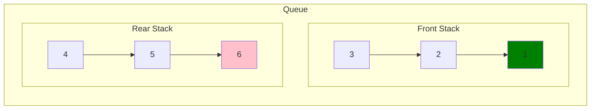

**Инвариант:** Элементы извлекаются из `front`, если `front` пуст — переворачиваем `rear` в `front`.

### Структура персистентного списка

Для эффективной работы используем **структурное разделение (structural sharing)**:

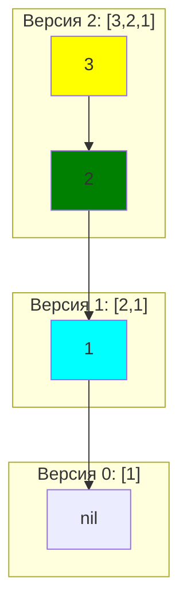

**Код:**

```pseudocode
class PersistentList<T>:
    head: T | null
    tail: PersistentList<T> | null
    
    func __init__(head: T | null, tail: PersistentList<T> | null):
        self.head = head
        self.tail = tail
    
    func is_empty() -> bool:
        return self.head == null
    
    func cons(value: T) -> PersistentList<T>:
        # Добавить элемент в начало - O(1)
        return new PersistentList<T>(value, self)
    
    func car() -> T:
        # Получить первый элемент - O(1)
        if self.is_empty():
            raise IndexError("Empty list")
        return self.head
    
    func cdr() -> PersistentList<T>:
        # Получить хвост списка - O(1)
        if self.is_empty():
            raise IndexError("Empty list")
        return self.tail if self.tail != null else new PersistentList<T>(null, null)
    
    static func reverse(lst: PersistentList<T>) -> PersistentList<T>:
        # Развернуть список - O(n)
        var result: PersistentList<T> = new PersistentList<T>(null, null)
        var current = lst
        while !current.is_empty():
            result = result.cons(current.car())
            current = current.cdr()
        return result
```

### Персистентная очередь на двух стеках

```pseudocode
class PersistentQueue<T>:
    # Персистентная очередь через два персистентных списка
    # Амортизированная сложность операций: O(1)
    
    front: PersistentList<T>
    rear: PersistentList<T>
    
    func __init__(front: PersistentList<T> | null, rear: PersistentList<T> | null):
        self.front = front if front != null else new PersistentList<T>(null, null)
        self.rear = rear if rear != null else new PersistentList<T>(null, null)
        self._normalize()
    
    func _normalize() -> void:
        # Поддерживаем инвариант: front не пуст, если есть элементы
        if self.front.is_empty() && !self.rear.is_empty():
            self.front = PersistentList.reverse(self.rear)
            self.rear = new PersistentList<T>(null, null)
    
    func is_empty() -> bool:
        return self.front.is_empty()
    
    func enqueue(value: T) -> PersistentQueue<T>:
        # Добавить элемент в конец - O(1)
        var new_rear = self.rear.cons(value)
        var result = new PersistentQueue<T>(self.front, new_rear)
        return result
    
    func dequeue() -> tuple(PersistentQueue<T>, T):
        # Извлечь элемент из начала - O(1) амортизированно
        if self.is_empty():
            raise IndexError("Queue is empty")
        
        var value = self.front.car()
        var new_front = self.front.cdr()
        var result = new PersistentQueue<T>(new_front, self.rear)
        return (result, value)
    
    func peek() -> T:
        # Посмотреть первый элемент без извлечения - O(1)
        if self.is_empty():
            raise IndexError("Queue is empty")
        return self.front.car()
```

### Пример использования

```pseudocode
# Создаём пустую очередь
var q0 = PersistentQueue<int>()

# Версия 1: добавляем элементы
var q1 = q0.enqueue(1)
var q2 = q1.enqueue(2)
var q3 = q2.enqueue(3)

# Версия 2: извлекаем элемент
var (value, q4) = q3.dequeue()  # value = 1

# Версия 3: продолжаем работать с q3 (ветвление!)
var q5 = q3.enqueue(4)

# Все версии доступны:
output q3.peek()  # 1
output q4.peek()  # 2
output q5.peek()  # 1

# Можем продолжать работать с любой версией
var q6 = q4.enqueue(5)
```

### Анализ сложности

**Амортизационный анализ:**

Рассмотрим последовательность из $n$ операций:
- Каждый элемент добавляется в `rear` за $O(1)$
- При переносе в `front` (reverse) каждый элемент обрабатывается один раз
- Суммарно: $O(n)$ операций для $n$ элементов

**Амортизированная сложность:**

$$T_{amortized} = \frac{O(n)}{n} = O(1)$$

**Таблица сложности:**

| Операция | Худший случай | Амортизированно | Память на операцию |
|----------|--------------|-----------------|-------------------|
| `enqueue` | $O(1)$ | $O(1)$ | $O(1)$ |
| `dequeue` | $O(n)$ | $O(1)$ | $O(1)$ |
| `peek` | $O(1)$ | $O(1)$ | $O(1)$ |
| `is_empty` | $O(1)$ | $O(1)$ | $O(1)$ |

---

## Персистентный массив {id: "persistent-array"}

### Проблема

Обычный массив не подходит для персистентности:
- Изменение элемента требует копирования всего массива: $O(n)$

### Решение: Fat Node

**Идея:** Храним историю изменений каждой ячейки

```pseudocode
class FatNodeArray<T>:
    # Персистентный массив через Fat Node метод
    
    data: vector< vector< pair(int, T) > >
    version: int
    
    func __init__(size: int):
        self.data = vector(size)  # Каждая ячейка хранит (версия, значение)
        self.version = 0
        for i in 0..size:
            self.data[i] = vector()
            self.data[i].push_back(pair(-1, null))
    
    func get(index: int, version: int | null) -> T:
        # Получить значение на определённой версии - O(log V)
        if version == null:
            version = self.version
        
        var history = self.data[index]
        var left = 0
        var right = len(history) - 1
        var result: T = null
        
        # Бинарный поиск по версиям
        while left <= right:
            var mid = (left + right) / 2
            if history[mid].first <= version:
                result = history[mid].second
                left = mid + 1
            else:
                right = mid - 1
        
        return result
    
    func set(index: int, value: T) -> int:
        # Установить значение (создаёт новую версию) - O(1)
        self.version += 1
        self.data[index].push_back(pair(self.version, value))
        return self.version
```

### Path Copying (более эффективное решение)

Используем **дерево** вместо массива для уменьшения объёма копирования:

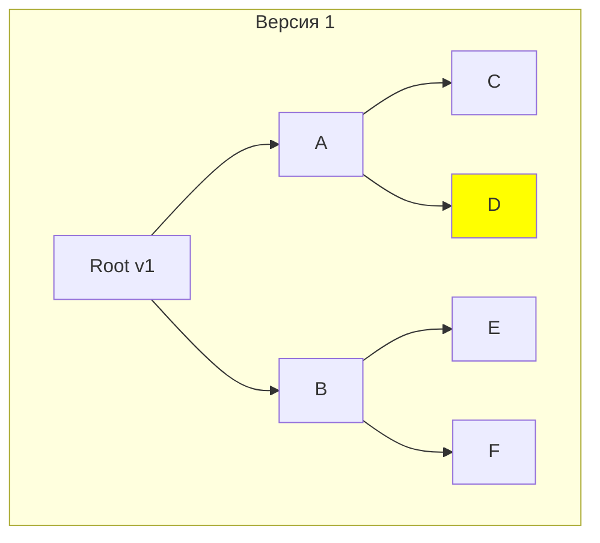

При изменении элемента `D`:

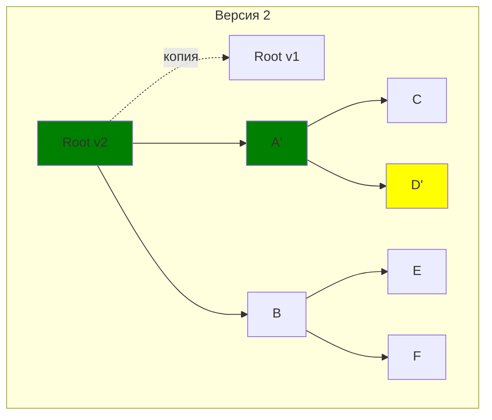

Копируем только **путь от корня до изменённого узла**: $O(\log n)$

---

# Скип-листы (Skip Lists) {id: "skip-lists"}

## Мотивация и идея {id: "skip-lists-motivation"}

### Проблема поиска в связном списке

**Обычный односвязный список:**

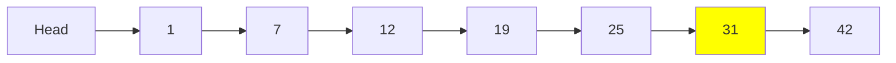

**Поиск элемента 31:** нужно пройти все элементы — $O(n)$

### Идея: добавим "экспресс-полосы"

**Скип-лист с несколькими уровнями:**

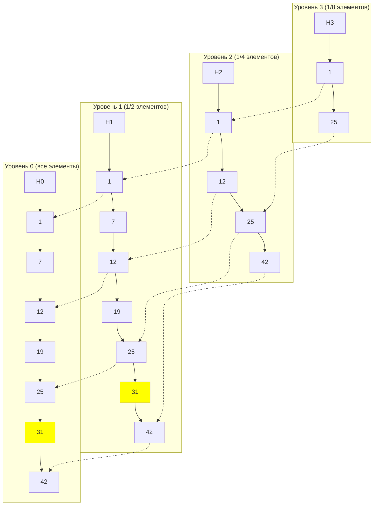

**Поиск элемента 31:** движемся по верхним уровням, спускаясь вниз — $O(\log n)$

---

## Структура скип-листа {id: "skip-list-structure"}

### Узел скип-листа

```pseudocode
class SkipNode<K, V>:
    # Узел скип-листа
    
    key: K
    value: V
    forward: vector< SkipNode<K, V> | null >  # Указатели на каждый уровень
    
    func __init__(key: K, value: V, level: int):
        self.key = key
        self.value = value
        self.forward = vector(level + 1)  # Массив указателей
        for i in 0..level + 1:
            self.forward[i] = null

class SkipList<K, V>:
    # Скип-лист для поиска по упорядоченным ключам
    
    max_level: int
    p: float
    level: int
    header: SkipNode<K, V>
    
    func __init__(max_level: int = 16, p: float = 0.5):
        self.max_level = max_level      # Максимальная высота
        self.p = p                      # Вероятность повышения уровня
        self.level = 0                  # Текущая высота структуры
        self.header = new SkipNode<K, V>(-inf, null, max_level)  # Sentinel узел
    
    func random_level() -> int:
        # Генерируем случайный уровень для нового узла
        # Использует геометрическое распределение с параметром p
        var lvl = 0
        while random() < self.p && lvl < self.max_level:
            lvl += 1
        return lvl
```

### Визуализация структуры

Для скип-листа со значениями `[1, 7, 12, 19, 25, 31, 42]`:

```
Уровень 3:  HEAD --------------------------> 25 ----------------------> NULL
                 |                           |
Уровень 2:  HEAD -------> 12 -------------> 25 -------> 42 ----------> NULL
                 |         |                 |           |
Уровень 1:  HEAD -> 1 --> 12 -> 19 ------> 25 -> 31 --> 42 ----------> NULL
                 |  |      |     |          |     |      |
Уровень 0:  HEAD -> 1 -> 7 -> 12 -> 19 --> 25 -> 31 --> 42 ----------> NULL
```

---

## Операции со скип-листами {id: "skip-list-operations"}

### Поиск (Search)

**Алгоритм:**
1. Начинаем с максимального уровня головного узла
2. Двигаемся вправо, пока следующий ключ меньше искомого
3. Спускаемся на уровень ниже
4. Повторяем пока не найдём или не дойдём до уровня 0

```pseudocode
func search(key: K) -> V | null:
    # Поиск значения по ключу - O(log n) ожидаемо
    var current = self.header
    
    # Идём сверху вниз
    for i in range(self.level, -1, -1):
        # Двигаемся вправо, пока ключ меньше нужного
        while current.forward[i] != null && current.forward[i].key < key:
            current = current.forward[i]
    
    # Переходим на уровень 0
    current = current.forward[0]
    
    # Проверяем, нашли ли элемент
    if current != null && current.key == key:
        return current.value
    return null
```

**Визуализация поиска ключа 31:**

```
Уровень 3:  HEAD -----[1]--------------------> 25 --[2]--> NULL
                                                |
Уровень 2:  HEAD --------------------------> 25 -------> 42 --> NULL
                                                |
Уровень 1:  HEAD --------------------------> 25 --[3]--> 31 --[4]--> 42
                                                          |
Уровень 0:  HEAD --------------------------> 25 -------> 31 -------> 42
                                                          ✓
```

Шаги:
1. Уровень 3: `HEAD → 25` (25 < 31, идём дальше)
2. Уровень 3: `25 → NULL` (не можем идти, спускаемся)
3. Уровень 1: `25 → 31` (нашли)

### Вставка (Insert)

**Алгоритм:**
1. Найти позицию для вставки (как при поиске)
2. Сгенерировать случайный уровень для нового узла
3. Вставить узел на всех уровнях от 0 до сгенерированного

```pseudocode
func insert(key: K, value: V) -> void:
    # Вставка элемента - O(log n) ожидаемо
    var update: vector< SkipNode<K, V> > = vector(self.max_level + 1)
    var current = self.header
    
    # Находим позицию для вставки и запоминаем предшественников
    for i in range(self.level, -1, -1):
        while current.forward[i] != null && current.forward[i].key < key:
            current = current.forward[i]
        update[i] = current
    
    # Переходим на уровень 0
    current = current.forward[0]
    
    # Если ключ уже существует, обновляем значение
    if current != null && current.key == key:
        current.value = value
        return
    
    # Генерируем случайный уровень
    var new_level = self.random_level()
    
    # Если новый уровень больше текущего, обновляем header
    if new_level > self.level:
        for i in range(self.level + 1, new_level + 1):
            update[i] = self.header
        self.level = new_level
    
    # Создаём новый узел
    var new_node = new SkipNode<K, V>(key, value, new_level)
    
    # Вставляем узел на всех уровнях
    for i in range(0, new_level + 1):
        new_node.forward[i] = update[i].forward[i]
        update[i].forward[i] = new_node
```

**Визуализация вставки ключа 17 (уровень = 2):**

До вставки:
```
Уровень 2:  HEAD -> 12 -> 25 -> NULL
Уровень 1:  HEAD -> 12 -> 19 -> 25 -> NULL
Уровень 0:  HEAD -> 12 -> 19 -> 25 -> NULL
```

После вставки:
```
Уровень 2:  HEAD -> 12 -> [17] -> 25 -> NULL
                          ↓
Уровень 1:  HEAD -> 12 -> [17] -> 19 -> 25 -> NULL
                          ↓
Уровень 0:  HEAD -> 12 -> [17] -> 19 -> 25 -> NULL
```

### Удаление (Delete)

```pseudocode
func delete(key: K) -> bool:
    # Удаление элемента - O(log n) ожидаемо
    var update: vector< SkipNode<K, V> > = vector(self.max_level + 1)
    var current = self.header
    
    # Находим узел для удаления
    for i in range(self.level, -1, -1):
        while current.forward[i] != null && current.forward[i].key < key:
            current = current.forward[i]
        update[i] = current
    
    current = current.forward[0]
    
    # Если нашли узел, удаляем его со всех уровней
    if current != null && current.key == key:
        for i in range(0, self.level + 1):
            if update[i].forward[i] != current:
                break
            update[i].forward[i] = current.forward[i]
        
        # Уменьшаем уровень, если необходимо
        while self.level > 0 && self.header.forward[self.level] == null:
            self.level -= 1
        
        delete current
        return true
    return false
```

---

## Анализ сложности {id: "skip-list-complexity"}

### Вероятностный анализ

**Высота скип-листа:**

Вероятность того, что узел имеет уровень $k$:

$$P(\text{level} = k) = p^k \cdot (1-p)$$

Ожидаемая высота для $n$ элементов при $p = \frac{1}{2}$:

$$E[H] = O(\log n)$$

**Длина пути поиска:**

На каждом уровне ожидаемое число шагов:

$$E[\text{steps at level } i] = \frac{1}{p} = 2$$

Общее ожидаемое число шагов:

$$E[\text{total steps}] = O(\log n) \cdot 2 = O(\log n)$$

### Таблица сложности

| Операция | Ожидаемое время | Худший случай | Память |
|----------|----------------|---------------|--------|
| Search | $O(\log n)$ | $O(n)$ | — |
| Insert | $O(\log n)$ | $O(n)$ | $O(1)$ |
| Delete | $O(\log n)$ | $O(n)$ | — |
| Space | — | — | $O(n \log n)$ ожидаемо |

### Сравнение с другими структурами

| Структура | Search | Insert | Delete | Worst Case | Балансировка |
|-----------|--------|--------|--------|------------|--------------|
| Скип-лист | $O(\log n)$ | $O(\log n)$ | $O(\log n)$ | $O(n)$ | Автоматическая (вероятностная) |
| AVL дерево | $O(\log n)$ | $O(\log n)$ | $O(\log n)$ | $O(\log n)$ | Требует ротаций |
| Красно-чёрное дерево | $O(\log n)$ | $O(\log n)$ | $O(\log n)$ | $O(\log n)$ | Требует ротаций |
| B-дерево | $O(\log n)$ | $O(\log n)$ | $O(\log n)$ | $O(\log n)$ | Требует слияний/разбиений |

**Преимущества скип-листов:**
- ✅ Простая реализация (проще AVL/RB-деревьев)
- ✅ Хорошая cache-locality
- ✅ Легко делать конкурентными (lock-free)
- ✅ Простая персистентность

**Недостатки:**
- ❌ Вероятностные гарантии (не детерминированные)
- ❌ Больше памяти, чем у сбалансированных деревьев

---

# Сливаемые структуры данных {id: "mergeable-structures"}

## Что такое сливаемые структуры {id: "what-is-mergeable"}

**Сливаемая структура данных (Mergeable Data Structure)** — структура, поддерживающая эффективную операцию слияния двух экземпляров.

### Операции

Помимо стандартных операций (insert, delete, find-min), сливаемые кучи поддерживают:

**Merge (Union):**
```pseudocode
func merge(h1: Heap, h2: Heap) -> Heap:
    # Объединить две кучи
    return h1.union(h2)
```

**Применение:**
1. **Алгоритм Дейкстры** с изменяемыми приоритетами
2. **Алгоритм Прима** для минимального остовного дерева
3. **Система непересекающихся множеств** (Disjoint Set Union)
4. **Параллельные алгоритмы** — слияние результатов из разных потоков

---

## Биномиальные кучи {id: "binomial-heaps"}

### Биномиальное дерево

**Определение:** Биномиальное дерево $B_k$ порядка $k$ определяется рекурсивно:
- $B_0$ — один узел
- $B_k$ — два дерева $B_{k-1}$, одно как поддерево другого

**Свойства биномиального дерева** $B_k$:
- Высота: $k$
- Количество узлов: $2^k$
- Количество узлов на глубине $d$: $\binom{k}{d}$ (биномиальные коэффициенты)

**Визуализация:**

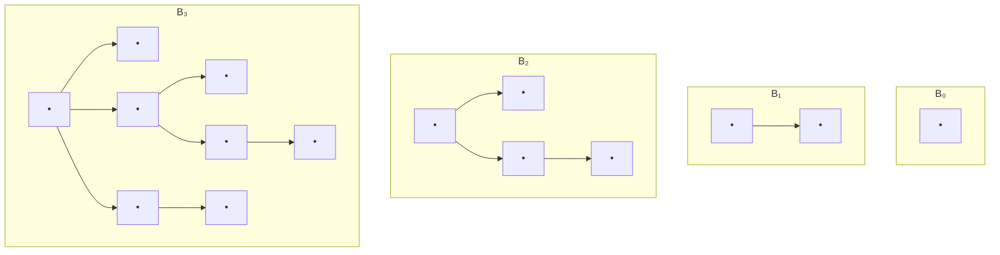

### Биномиальная куча

**Определение:** Биномиальная куча — это **набор биномиальных деревьев**, где:
1. Каждое дерево удовлетворяет свойству кучи (min-heap)
2. Не более одного дерева каждого порядка

**Связь с двоичным представлением:**

Куча из $n = 13 = 1101_2$ элементов содержит деревья:
- $B_3$ (8 узлов)
- $B_2$ (4 узла)
- $B_0$ (1 узел)

```
n = 13 = 1101₂
         ||||
         |||└─ B₀ (1 узел)
         ||└── 0  (нет B₁)
         |└─── B₂ (4 узла)
         └──── B₃ (8 узлов)
```

### Операции

#### Merge (Слияние)

**Алгоритм:** Аналогично сложению двоичных чисел с переносом

```pseudocode
struct BinomialNode<K>:
    key: K
    degree: int              # Порядок дерева
    parent: BinomialNode<K>* = null
    child: BinomialNode<K>* = null      # Старший ребёнок
    sibling: BinomialNode<K>* = null    # Следующий брат

class BinomialHeap<K>:
    head: BinomialNode<K>* = null  # Указатель на список корней
    
    func merge_trees(h1: BinomialNode<K>*, h2: BinomialNode<K>*) -> BinomialNode<K>*:
        # Объединить два дерева одного порядка - O(1)
        if h1.key > h2.key:
            swap(h1, h2)
        
        # h2 становится ребёнком h1
        h2.parent = h1
        h2.sibling = h1.child
        h1.child = h2
        h1.degree += 1
        
        return h1
    
    func union(other: BinomialHeap<K>) -> BinomialHeap<K>:
        # Слияние двух куч - O(log n)
        var merged_head = self._merge_root_lists(self.head, other.head)
        
        if merged_head == null:
            return BinomialHeap<K>()
        
        # Упорядочиваем деревья по порядкам
        var result = BinomialHeap<K>()
        var prev: BinomialNode<K>* = null
        var curr = merged_head
        var next_node = curr.sibling
        
        while next_node != null:
            # Если текущее и следующее деревья разного порядка
            # или есть три дерева подряд одного порядка
            if (curr.degree != next_node.degree ||
                (next_node.sibling != null &&
                 next_node.sibling.degree == curr.degree)):
                prev = curr
                curr = next_node
            else:
                # Объединяем curr и next
                if curr.key <= next_node.key:
                    curr.sibling = next_node.sibling
                    curr = self.merge_trees(curr, next_node)
                else:
                    if prev == null:
                        merged_head = next_node
                    else:
                        prev.sibling = next_node
                    curr = self.merge_trees(next_node, curr)
            
            next_node = curr.sibling
        
        result.head = merged_head
        return result
```

**Пример слияния:**

```
Куча 1: B₀(3) → B₂(1)
Куча 2: B₁(7) → B₂(5)

Шаг 1: Объединяем списки
  B₀(3) → B₁(7) → B₂(1) → B₂(5)

Шаг 2: Объединяем два B₂
  B₀(3) → B₁(7) → B₃(1)
                  ├─ B₂(5)
                  └─ ...

Результат: B₀(3) → B₁(7) → B₃(1)
```

**Сложность:** $O(\log n)$ где $n$ — общее число элементов

#### Insert

```pseudocode
func insert(key: K) -> void:
    # Вставка элемента - O(log n)
    var new_heap = BinomialHeap<K>()
    new_heap.head = new BinomialNode<K>(key)
    self = self.union(new_heap)
```

#### Extract-Min

```pseudocode
func extract_min() -> K:
    # Извлечение минимума - O(log n)
    if self.head == null:
        return null  # Ошибка: куча пуста
    
    # Находим минимальный корень
    var min_node = self.head
    var min_prev: BinomialNode<K>* = null
    var prev: BinomialNode<K>* = null
    var curr = self.head
    
    while curr.sibling != null:
        if curr.sibling.key < min_node.key:
            min_node = curr.sibling
            min_prev = curr
        prev = curr
        curr = curr.sibling
    
    # Удаляем минимальный корень
    if min_prev == null:
        self.head = min_node.sibling
    else:
        min_prev.sibling = min_node.sibling
    
    # Создаём новую кучу из детей минимального узла
    var new_heap = BinomialHeap<K>()
    var child = min_node.child
    while child != null:
        var next_child = child.sibling
        child.sibling = new_heap.head
        child.parent = null
        new_heap.head = child
        child = next_child
    
    # Объединяем с текущей кучей
    self = self.union(new_heap)
    
    return min_node.key
```

### Таблица сложности

| Операция | Сложность | Комментарий |
|----------|-----------|-------------|
| Find-Min | $O(\log n)$ | Нужно просмотреть все корни |
| Insert | $O(\log n)$ | Слияние с одноэлементной кучей |
| Extract-Min | $O(\log n)$ | Удаление корня + слияние детей |
| Merge | $O(\log n)$ | Основная операция |
| Decrease-Key | $O(\log n)$ | Просеивание вверх |

---

## Фибоначчиевы кучи {id: "fibonacci-heaps"}

### Мотивация

Биномиальные кучи хороши, но можем ли мы сделать некоторые операции быстрее?

**Идея:** Используем **ленивые вычисления** — откладываем работу до момента, когда она действительно нужна.

### Структура

Фибоначчиева куча — это **коллекция деревьев с heap-order**, но **без ограничений на форму** деревьев.

**Отличия от биномиальной кучи:**
- ❌ Нет требования о единственности порядка
- ❌ Деревья не обязаны быть биномиальными
- ✅ Более гибкая структура
- ✅ Лучшая амортизированная сложность

**Дополнительная информация:**
- Каждый узел помечен, был ли он "marked" (потерял ли он ребёнка)
- Указатель на минимальный элемент

### Операции

#### Insert

```pseudocode
func insert(key: K) -> void:
    # Вставка элемента - O(1) амортизированно
    var new_node = new FibNode<K>(key)
    
    if self.min == null:
        self.min = new_node
        new_node.left = new_node
        new_node.right = new_node
    else:
        # Добавляем в корневой список
        self._add_to_root_list(new_node)
        if new_node.key < self.min.key:
            self.min = new_node
    
    self.n += 1
```

**Сложность:** $O(1)$ — просто добавляем в корневой список!

#### Merge

```pseudocode
func union(other: FibonacciHeap<K>) -> FibonacciHeap<K>:
    # Слияние куч - O(1)
    if other.min == null:
        return self
    if self.min == null:
        return other
    
    # Объединяем корневые списки
    self._concatenate_lists(self.min, other.min)
    
    # Обновляем минимум
    if other.min.key < self.min.key:
        self.min = other.min
    
    self.n += other.n
    return self
```

**Сложность:** $O(1)$ — просто объединяем списки!

#### Extract-Min

```pseudocode
func extract_min() -> K:
    # Извлечение минимума - O(log n) амортизированно
    var z = self.min
    
    if z != null:
        # Добавляем всех детей в корневой список
        if z.child != null:
            var child = z.child
            loop:
                var next_child = child.right
                self._add_to_root_list(child)
                child.parent = null
                child = next_child
                if child == z.child:
                    break loop
        
        # Удаляем минимум из корневого списка
        self._remove_from_root_list(z)
        
        if z == z.right:
            self.min = null
        else:
            self.min = z.right
            self._consolidate()  # ← Ключевая операция!
        
        self.n -= 1
    
    return z.key if z != null else null
```

#### Consolidate (консолидация)

**Цель:** Привести кучу к состоянию, где **нет двух деревьев одинакового ранга**.

```pseudocode
func _consolidate() -> void:
    # Консолидация - объединение деревьев одинакового ранга - O(log n)
    var max_degree: int = floor(log₂(self.n)) + 2
    var degree_table: vector< FibNode<K>* > = vector(max_degree, null)
    
    # Собираем все корни
    var roots: vector< FibNode<K>* > = vector()
    var curr = self.min
    loop:
        roots.push_back(curr)
        curr = curr.right
        if curr == self.min:
            break
    
    # Объединяем деревья одинакового ранга
    for root in roots:
        var degree: int = root.degree
        while degree_table[degree] != null:
            var other = degree_table[degree]
            if root.key > other.key:
                swap(root, other)
            
            # Делаем other ребёнком root
            self._link(other, root)
            degree_table[degree] = null
            degree += 1
        
        degree_table[degree] = root
    
    # Находим новый минимум
    self.min = null
    for root in degree_table:
        if root != null:
            if self.min == null || root.key < self.min.key:
                self.min = root

        if root is not None:
            if self.min is None or root.key < self.min.key:
                self.min = root
```

**Амортизационный анализ:** 
- После extract-min может быть до $O(n)$ корней
- Consolidate уменьшает их количество до $O(\log n)$
- Суммарная работа: $O(\log n)$ амортизированно

#### Decrease-Key

**Ключевая операция для алгоритма Дейкстры!**

```pseudocode
func decrease_key(node: FibNode<K>, new_key: K) -> void:
    # Уменьшение ключа - O(1) амортизированно
    if new_key > node.key:
        return  # Ошибка: новый ключ больше старого
    
    node.key = new_key
    var parent = node.parent
    
    if parent != null && node.key < parent.key:
        self._cut(node, parent)
        self._cascading_cut(parent)
    
    if node.key < self.min.key:
        self.min = node

func _cut(node: FibNode<K>, parent: FibNode<K>) -> void:
    # Вырезать узел из родителя
    # Удаляем node из списка детей parent
    self._remove_from_child_list(parent, node)
    parent.degree -= 1
    
    # Добавляем node в корневой список
    self._add_to_root_list(node)
    node.parent = null
    node.marked = false

func _cascading_cut(node: FibNode<K>) -> void:
    # Каскадное вырезание - важно для поддержания O(1) среднего времени!
    var parent = node.parent
    if parent != null:
        if !node.marked:
            node.marked = true
        else:
            self._cut(node, parent)
            self._cascading_cut(parent)
```

**Идея cascading cut:** Если узел теряет второго ребёнка, вырезаем его тоже (для поддержания малой высоты деревьев).

### Потенциальный метод анализа

**Потенциал кучи:**

$$\Phi(H) = t(H) + 2 \cdot m(H)$$

где:
- $t(H)$ — число деревьев в корневом списке
- $m(H)$ — число помеченных узлов

**Амортизированная стоимость:**

$$\hat{c_i} = c_i + \Phi(H_i) - \Phi(H_{i-1})$$

**Для decrease-key:**
- Реальная работа: $O(c)$ где $c$ — число каскадных вырезаний
- Изменение потенциала: $-c + 2$ (убрали $c$ меток, добавили $\leq 1$ дерево)
- Амортизированная стоимость: $O(c) + (-c + 2) = O(1)$

### Таблица сложности

| Операция | Амортизированная | Худший случай |
|----------|-----------------|---------------|
| Find-Min | $O(1)$ | $O(1)$ |
| Insert | $O(1)$ | $O(1)$ |
| Merge | $O(1)$ | $O(1)$ |
| Extract-Min | $O(\log n)$ | $O(n)$ |
| Decrease-Key | $O(1)$ | $O(n)$ |
| Delete | $O(\log n)$ | $O(n)$ |

---

## Leftist heaps {id: "leftist-heaps"}

### Мотивация

**Проблема:** Обычная двоичная куча не поддерживает эффективное слияние.

**Решение:** Leftist heap — куча с особым свойством, позволяющим быстро сливать.

### Определение

**Расстояние до правого края (null path length, npl):**

$$
\text{npl}(x) = \begin{cases}
0 & \text{если } x \text{ — лист} \\
1 + \min(\text{npl}(\text{left}(x)), \text{npl}(\text{right}(x))) & \text{иначе}
\end{cases}
$$

**Leftist свойство:** Для каждого узла:

$$\text{npl}(\text{left}(x)) \geq \text{npl}(\text{right}(x))$$

Это означает, что **правый путь всегда короче или равен левому**.

### Визуализация

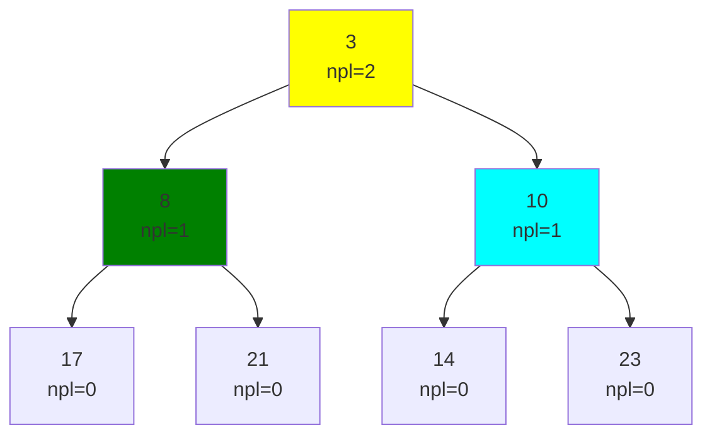

### Слияние

**Алгоритм:**
1. Сравниваем корни, меньший становится новым корнем
2. Рекурсивно сливаем правое поддерево с другой кучей
3. Если leftist свойство нарушено, меняем местами детей

```pseudocode
struct LeftistNode<K>:
    key: K
    left: LeftistNode<K>* = null
    right: LeftistNode<K>* = null
    npl: int = 0                # null path length

class LeftistHeap<K>:
    root: LeftistNode<K>* = null
    
    func merge(other: LeftistHeap<K>) -> LeftistHeap<K>:
        # Слияние двух куч - O(log n)
        self.root = self._merge_nodes(self.root, other.root)
        return self
    
    func _merge_nodes(h1: LeftistNode<K>*, h2: LeftistNode<K>*) -> LeftistNode<K>*:
        # Рекурсивное слияние узлов
        if h1 == null:
            return h2
        if h2 == null:
            return h1
        
        # Гарантируем, что h1.key <= h2.key
        if h1.key > h2.key:
            swap(h1, h2)
        
        # Сливаем h2 с правым поддеревом h1
        h1.right = self._merge_nodes(h1.right, h2)
        
        # Восстанавливаем leftist свойство
        if h1.left == null:
            h1.left = h1.right
            h1.right = null
        else:
            var left_npl: int = (h1.left != null) ? h1.left.npl : -1
            var right_npl: int = (h1.right != null) ? h1.right.npl : -1
            
            if left_npl < right_npl:
                swap(h1.left, h1.right)
        
        # Обновляем npl
        h1.npl = ((h1.right != null) ? h1.right.npl : -1) + 1
        
        return h1
    
    func insert(key: K) -> void:
        # Вставка элемента - O(log n)
        var new_node = new LeftistNode<K>(key)
        self.root = self._merge_nodes(self.root, new_node)
    
    func extract_min() -> K:
        # Извлечение минимума - O(log n)
        if self.root == null:
            return null  # Ошибка: куча пуста
        
        var min_key = self.root.key
        self.root = self._merge_nodes(self.root.left, self.root.right)
        return min_key
```

### Почему это работает?

**Лемма:** Leftist heap из $n$ узлов имеет длину правого пути $O(\log n)$.

**Доказательство:** 
- Пусть длина правого пути = $r$
- Каждый узел на правом пути имеет $\text{npl} \geq 0, 1, 2, \ldots, r-1$
- По определению npl, под каждым таким узлом минимум $2^i$ узлов
- Итого: $n \geq 1 + 2 + 4 + \ldots + 2^{r-1} = 2^r - 1$
- Следовательно: $r \leq \log(n+1)$

### Сложность операций

| Операция | Сложность |
|----------|-----------|
| Find-Min | $O(1)$ |
| Insert | $O(\log n)$ |
| Extract-Min | $O(\log n)$ |
| Merge | $O(\log n)$ |

---

# Практическое применение {id: "practical-applications"}

## Где используются персистентные структуры

### 1. Функциональное программирование

**Haskell, Clojure, Scala:**
```haskell
-- Haskell: все структуры персистентны по умолчанию
let list1 = [1, 2, 3]
    list2 = 4 : list1  -- [4, 1, 2, 3]
    list3 = 0 : list1  -- [0, 1, 2, 3]
-- list1 не изменился!
```

### 2. Системы контроля версий

**Git внутренности:**
- Commits — версии файловой системы
- Trees — персистентные деревья каталогов
- Structural sharing — файлы не копируются, если не изменились

### 3. Базы данных

**MVCC (Multi-Version Concurrency Control):**
```sql
-- PostgreSQL
BEGIN;
SELECT * FROM users WHERE id = 1;  -- Видим версию на момент начала транзакции
-- Другая транзакция изменяет ту же строку
-- Мы всё равно видим старую версию!
COMMIT;
```

### 4. Редакторы кода

**Undo/Redo стек:**
```pseudocode
class Editor:
    versions: vector< PersistentText > = vector()
    current: int = 0
    
    func init() -> void:
        versions.push_back(PersistentText(""))
        current = 0
    
    func insert(pos: int, char: char) -> void:
        var new_text = versions[current].insert(pos, char)
        versions = versions[0..current] + [new_text]
        current += 1
    
    func undo() -> void:
        if current > 0:
            current -= 1
    
    func redo() -> void:
        if current < versions.size() - 1:
            current += 1
```

## Где используются скип-листы

### 1. Redis

**Sorted Sets:**
```bash
ZADD leaderboard 100 "player1"
ZADD leaderboard 200 "player2"
ZRANGE leaderboard 0 -1 WITHSCORES
```

Внутри: скип-лист + хеш-таблица

### 2. LevelDB / RocksDB

**MemTable:** Скип-лист для хранения недавних записей в памяти

### 3. Lucene / Elasticsearch

**Term Dictionary:** Скип-листы для быстрого поиска терминов

### 4. Concurrent Skip Lists

**Java ConcurrentSkipListMap:**
```pseudocode
class ConcurrentSkipListMap<K, V>:
    func put(key: K, value: V) -> V:
        # Вставить элемент потокобезопасно
        return self._insert_lock_free(key, value)
    
    func get(key: K) -> V | null:
        # Получить элемент потокобезопасно
        return self._search(key)

# Использование:
var map = ConcurrentSkipListMap<int, string>()
map.put(1, "one")
map.put(2, "two")
# Потокобезопасно без явных lock-ов!
```

## Где используются сливаемые кучи

### 1. Алгоритм Дейкстры

**С Фибоначчиевой кучей:**
```pseudocode
func dijkstra_fibonacci(graph: Graph, start: Vertex) -> map<Vertex, int>:
    var heap = FibonacciHeap<int>()
    var dist: map<Vertex, int> = map()  # Инициализировать все как ∞
    dist[start] = 0
    var nodes: map<Vertex, FibNode> = map()
    
    for v in graph.vertices():
        if v == start:
            nodes[v] = heap.insert(0)
        else:
            nodes[v] = heap.insert(∞)
    
    while !heap.is_empty():
        var (d, u) = heap.extract_min()
        for (v, weight) in graph.adj[u]:
            if dist[u] + weight < dist[v]:
                dist[v] = dist[u] + weight
                heap.decrease_key(nodes[v], dist[v])  # ← O(1) амортизированно!
    
    return dist
```

**Сложность:** $O(E + V \log V)$ — лучше чем с обычной кучей!

### 2. Алгоритм Прима

**Минимальное остовное дерево:**
```pseudocode
func prim_fibonacci(graph: Graph) -> set< tuple<Vertex, Vertex, int> >:
    var heap = FibonacciHeap< tuple<int, pair<Vertex, Vertex> > >()
    var mst: set< tuple<Vertex, Vertex, int> > = set()
    var visited: set<Vertex> = set()
    
    # Начинаем с произвольной вершины
    var start = graph.vertices()[0]
    heap.insert((0, pair(null, start)))
    
    while !heap.is_empty():
        var (weight, (u, v)) = heap.extract_min()
        
        if v in visited:
            continue
        
        visited.insert(v)
        if u != null:
            mst.insert((u, v, weight))
        
        for (neighbor, edge_weight) in graph.adj[v]:
            if neighbor not in visited:
                heap.insert((edge_weight, pair(v, neighbor)))
    
    return mst
```

### 3. Disjoint Set Union (DSU)

**Слияние множеств:**
```pseudocode
class DSU:
    heaps: map<any, LeftistHeap>
    
    func __init__():
        self.heaps = map()
    
    func make_set(x: any) -> void:
        self.heaps[x] = new LeftistHeap()
        self.heaps[x].insert(pair(0, x))
    
    func union(x: any, y: any) -> void:
        var heap_x = self.heaps[x]
        var heap_y = self.heaps[y]
        var merged = heap_x.merge(heap_y)
        
        # Обновляем все вершины
        for v in merged:
            self.heaps[v] = merged
    
    func find(x: any) -> any:
        return self.heaps[x].find_min()
```

---

# Практические советы и типичные ошибки {id: "practical-tips"}

## Персистентные структуры

### Советы по реализации

1. **Structural Sharing:** Максимально переиспользуйте старые узлы. Копируйте только путь от корня до изменённого элемента.
   - Good: Path copying в массиве – $O(\log n)$ на операцию
   - Bad: Полное копирование – $O(n)$ на операцию

2. **Версионирование:** Храните указатель на корень каждой версии, а не сам граф.
   ```pseudocode
   versions: vector<RootNode> = []
   func snapshot() -> void:
       versions.push_back(current_root)
   func restore(version: int) -> void:
       current_root = versions[version]
   ```

3. **Ленивые вычисления:** Отложите дорогие операции (вроде балансировки) до необходимости.

### Типичные ошибки

❌ **Ошибка 1:** Мутирование старых версий при изменении.
```pseudocode
# НЕПРАВИЛЬНО:
func update_v1(node: Node, value: T) -> void:
    node.value = value  # Мутируем оригинальный узел!
```

✅ **Правильно:**
```pseudocode
# ПРАВИЛЬНО:
func update_v1(node: Node, value: T) -> Node:
    return new Node(value, node.left, node.right)  # Новый узел
```

❌ **Ошибка 2:** Забывать про структурное разделение при удалении.
```pseudocode
# Если удаляем узел — его родитель всё равно указывает на старых детей
# Нужно скопировать всю цепочку до корня
```

✅ **Правильно:** Используйте Path Copying для любого изменения.

---

## Скип-листы

### Советы по реализации

1. **Выбор p (вероятность):** 
   - $p = 0.5$ – оптимально по теории
   - На практике $p \in [0.25, 0.75]$ работает хорошо
   - Для поиска по ключам строк: $p = 1/e \approx 0.368$ даёт меньше памяти

2. **Max Level:**
   ```pseudocode
   max_level = ceil(log(n) / log(1/p))
   # Для p=0.5 и n=10^6: max_level ≈ 20 (не 16!)
   ```

3. **Seed для воспроизводимости:**
   ```pseudocode
   func set_seed(seed: int64) -> void:
       random.seed(seed)
       # Теперь случайные числа будут одинаковыми при каждом запуске
   ```

### Типичные ошибки

❌ **Ошибка 1:** Неправильная генерация уровня.
```pseudocode
# НЕПРАВИЛЬНО:
func random_level() -> int:
    return random.randint(1, max_level)  # Равномерное распределение!
```

✅ **Правильно:**
```pseudocode
# ПРАВИЛЬНО:
func random_level() -> int:
    level = 1
    while random.random() < p && level < max_level:
        level += 1
    return level
```

❌ **Ошибка 2:** Забыть обновить `level` структуры при вставке узла с большой высотой.
```pseudocode
# НЕПРАВИЛЬНО:
func insert(key: K, value: V) -> void:
    new_level = random_level()
    # Забыли: if new_level > self.level: self.level = new_level
```

✅ **Правильно:** Обновляйте `self.level` и ссылки `header` при каждой вставке с новым max-уровнем.

---

## Сливаемые кучи

### Советы по реализации

1. **Выбор между типами:**
   - **Биномиальная куча:** Predictable, хорошо для реализации на низкоуровневых языках
   - **Фибоначчиева куча:** Лучше для Dijkstra, но overhead на операции выше
   - **Leftist heap:** Простая в коде, близка к binary heap по скорости

2. **Merge вместо insert:**
   ```pseudocode
   # Для больших данных: создать две кучи, потом merge
   # Это часто быстрее, чем N раз вызвать insert
   ```

3. **Потенциальный метод анализа:**
   Используйте функцию потенциала для доказательства амортизационной сложности:
   $$\Phi(H) = t(H) + 2m(H)$$
   где $t$ – число деревьев, $m$ – число помеченных узлов.

### Типичные ошибки

❌ **Ошибка 1:** Забыть обновить указатель на минимум после слияния.
```pseudocode
# НЕПРАВИЛЬНО:
func merge(h1: FibHeap, h2: FibHeap) -> FibHeap:
    h1.root_list.concat(h2.root_list)
    # Забыли: if h2.min.key < h1.min.key: h1.min = h2.min
```

❌ **Ошибка 2:** Неправильно реализовать cascading cut в Фибоначчиевой куче.
```pseudocode
# НЕПРАВИЛЬНО – бесконечный цикл:
func cascading_cut(node: Node) -> void:
    parent = node.parent
    if parent != null:
        cut(node, parent)
        cascading_cut(parent)  # Проверить marked перед рекурсией!
```

✅ **Правильно:**
```pseudocode
func cascading_cut(node: Node) -> void:
    parent = node.parent
    if parent != null:
        if !node.marked:
            node.marked = true
        else:
            cut(node, parent)
            cascading_cut(parent)
```

---

# Когда использовать какую структуру {id: "choosing-structures"}

## Сравнение персистентных подходов

| Сценарий | Лучший выбор | Почему |
|----------|-------------|-------|
| Undo/Redo в редакторе | Персистентная очередь на двух стеках | O(1) операции, простая реализация |
| Git-like система версий | Path Copying на деревьях | Экономит память через structural sharing |
| Функциональный язык (Haskell) | Иммутабельные структуры по умолчанию | Безопасность + простота |
| Big Data processing (MapReduce) | Снимки состояния (snapshots) | Дешёвое слияние версий |

## Сравнение поиска в упорядоченных структурах

| Структура | Insert | Search | Delete | Space | Реализация | Cache Friendly |
|-----------|--------|--------|--------|-------|-----------|-----------------|
| Skip List | $O(\log n)$ exp. | $O(\log n)$ exp. | $O(\log n)$ exp. | $O(n)$ | ⭐⭐⭐ | ✅ |
| AVL Tree | $O(\log n)$ | $O(\log n)$ | $O(\log n)$ | $O(n)$ | ⭐⭐ | ❌ Плохо |
| Red-Black Tree | $O(\log n)$ | $O(\log n)$ | $O(\log n)$ | $O(n)$ | ⭐⭐ | ❌ Плохо |
| B-Tree | $O(\log n)$ | $O(\log n)$ | $O(\log n)$ | $O(n)$ | ⭐ | ✅ Отлично |

**Вывод:** Для in-memory структур — Skip List. Для диска — B-Tree. Для простоты — Skip List.

## Сравнение priority queues

| Структура | Extract-Min | Insert | Merge | Decrease-Key | Лучше всего |
|-----------|------------|--------|-------|--------------|-----------|
| Binary Heap | $O(\log n)$ | $O(\log n)$ | $O(n)$ | $O(\log n)$ | Простота |
| Binomial Heap | $O(\log n)$ | $O(\log n)$ | $O(\log n)$ | $O(\log n)$ | Merge операции |
| Fibonacci Heap | $O(\log n)$ amort. | $O(1)$ amort. | $O(1)$ | $O(1)$ amort. | Dijkstra |
| Leftist Heap | $O(\log n)$ | $O(\log n)$ | $O(\log n)$ | $O(\log n)$ | Простота + merge |

**Правило большого пальца:**
- Нужен merge часто? → Binomial или Leftist heap
- Нужен decrease-key часто? → Fibonacci heap
- Нужна простота? → Binary heap или Leftist heap

---

# Задачи для практики {id: "practice-problems"}

## Легко

### 1. Реализуйте персистентный стек
**Задача:** Реализуйте стек с операциями push, pop, peek, где каждая операция возвращает новую версию стека.

**Решение (намек):**
```pseudocode
class PersistentStack<T>:
    head: Node<T> | null
    
    func push(value: T) -> PersistentStack<T>:
        return new PersistentStack<T>(new Node(value, self.head))
    
    # O(1) на каждую операцию благодаря linked list
```

**Сложность:** $O(1)$ push/pop, $O(n)$ память на всех версиях.

### 2. Найдите k-й элемент в скип-листе
**Задача:** Модифицируйте скип-лист так, чтобы можно было найти k-й наименьший элемент за $O(\log n)$.

**Подсказка:** Добавьте в каждый узел поле `count` – число элементов, на которые он "прыгает".

### 3. Слияние двух отсортированных массивов с персистентностью
**Задача:** Слейте два отсортированных массива в один, сохраняя обе исходные версии и результат.

**Ограничение:** $O(1)$ амортизированная память на элемент результата.

---

## Средне

### 4. Реализуйте скип-лист с диапазонными запросами
**Задача:** Добавьте операцию `range_query(l, r)`, которая возвращает все элементы в диапазоне $[l, r]$ за $O(\log n + k)$ где $k$ – число элементов.

**Подсказка:** Используйте поиск на уровне 0 после нахождения левой границы.

### 5. Персистентная куча
**Задача:** Реализуйте персистентную двоичную кучу (или Leftist heap) с операциями:
- `insert(x)` – $O(\log n)$
- `extract_min()` – $O(\log n)$
- `merge(h1, h2)` – $O(\log n)$ для Leftist, $O(\log m + \log n)$ для binary

**Сложность:** Каждая операция создаёт $O(\log n)$ новых узлов.

---

## Сложно

### 6. Полностью персистентное дерево поиска
**Задача:** Реализуйте сбалансированное BST (AVL или Red-Black), где каждая версия остаётся доступной.

**Требование:** Все операции $O(\log n)$, память на операцию $O(\log n)$.

**Подсказка:** Используйте Path Copying. При каждом изменении копируйте только путь от корня до узла.

### 7. Параллельное слияние структур
**Задача:** Реализуйте функцию, которая берёт N скип-листов (или heap-ов) и эффективно их сливает в один.

**Требование:** Сложность $O(N \log N + T)$ где $T$ – общее число элементов.

**Идея:** Используйте divide-and-conquer с бинарным деревом слияний.

### 8. Git-like система версий с персистентностью
**Задача:** Реализуйте систему, похожую на Git, где:
- Каждый commit – персистентный снимок файловой системы
- Можно откатиться к любому commit'у
- Ветвления и слияние версий

**Требование:** Слияние версий за время, пропорциональное количеству изменений (не всему дереву).

---

# Советы по оптимизации и расширениям {id: "optimization-tips"}

## Memory Layout и Cache Efficiency

1. **Skip Lists:** Хорошо локализованы – часто обращаетесь к узлам на одном уровне
   ```
   # CPU cache любит это:
   Level 0: [node_0] -> [node_1] -> [node_2] -> ...  # Линейный доступ
   ```

2. **AVL/RB Trees:** Плохо локализованы – может быть кэш-промах на каждом узле
   ```
   # CPU cache не любит это:
   Tree:     [root] (somewhere in memory)
              /  \
         [left]  [right]  (completely different cache line)
   ```

3. **Оптимизация:** Используйте **B-Trees** или **Skip Lists** вместо BST для больших объёмов данных.

## Параллелизм

1. **Skip Lists:** Легко сделать lock-free (используются в Java ConcurrentSkipListMap)
   ```pseudocode
   # Операция поиска не требует lock-ов вообще!
   func search_concurrent(key: K) -> V:
       # Просто читаем узлы, без changes
       # Другие потоки могут вставлять/удалять одновременно
   ```

2. **Фибоначчиевы кучи:** Сложно распараллелить (много small updates)

3. **Leftist Heaps:** Возможен параллельный merge через divide-and-conquer

## Компресия памяти

Для персистентных структур часто используют:
1. **Hash Consing** – кэшировать идентичные подструктуры по хешу
2. **Структурное сжатие** – если два узла имеют одинаковое содержимое и поддерево, они могут указывать на один и тот же объект в памяти

---

# Дополнительные материалы {id: "additional-resources"}

## Книги и статьи

- **"Purely Functional Data Structures" — Chris Okasaki** – классика по персистентным структурам
- **"Algorithm Design Manual" — Steven Skiena** – хороший обзор структур данных
- **"Advanced Data Structures" — Peter Brass** – углубленное изучение

## Online Resources

- **Visualization:** https:#www.cs.usfca.edu/~galles/visualization/Algorithms.html
- **Skip List Paper:** William Pugh's original paper (1990)
- **Persistent Data Structures:** MIT CSAIL lectures

## Исторические факты

1. **Skip Lists** (1990) – Уильям Паф предложил как более простую альтернативу деревьям.
2. **Фибоначчиевы кучи** (1984) – придумали Фредман и Тарджан; нашли применение в Dijkstra.
3. **Персистентные структуры** – восходят к функциональному программированию (Lisp, 1960s).

---

$\text{От ученика для учеников.}\\ \text{\textcolor{red}{С любовью} к \textcolor{yellow}{Т-Образованию}.}\\ \textcolor{#86cecb}{Вадим\ Христенко.}$
